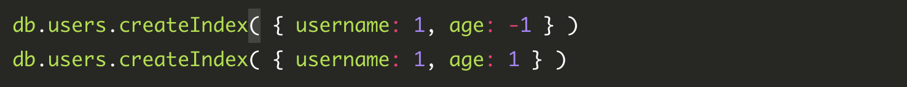
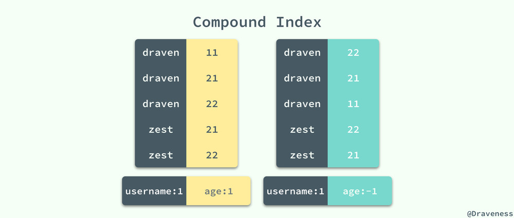
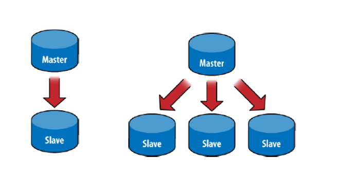
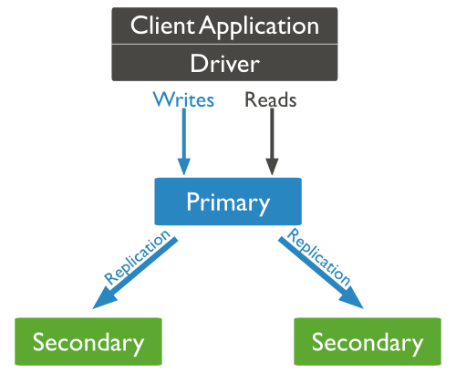
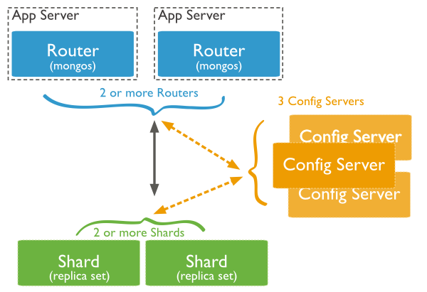
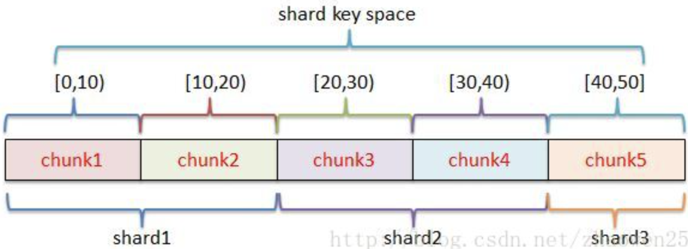
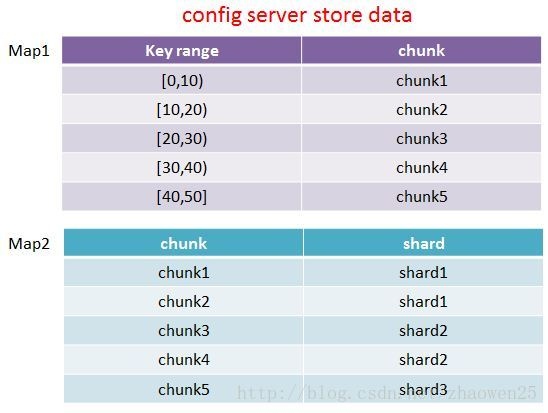
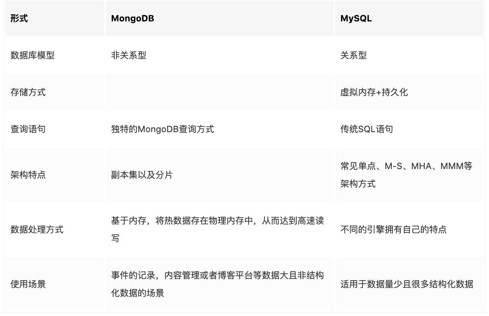
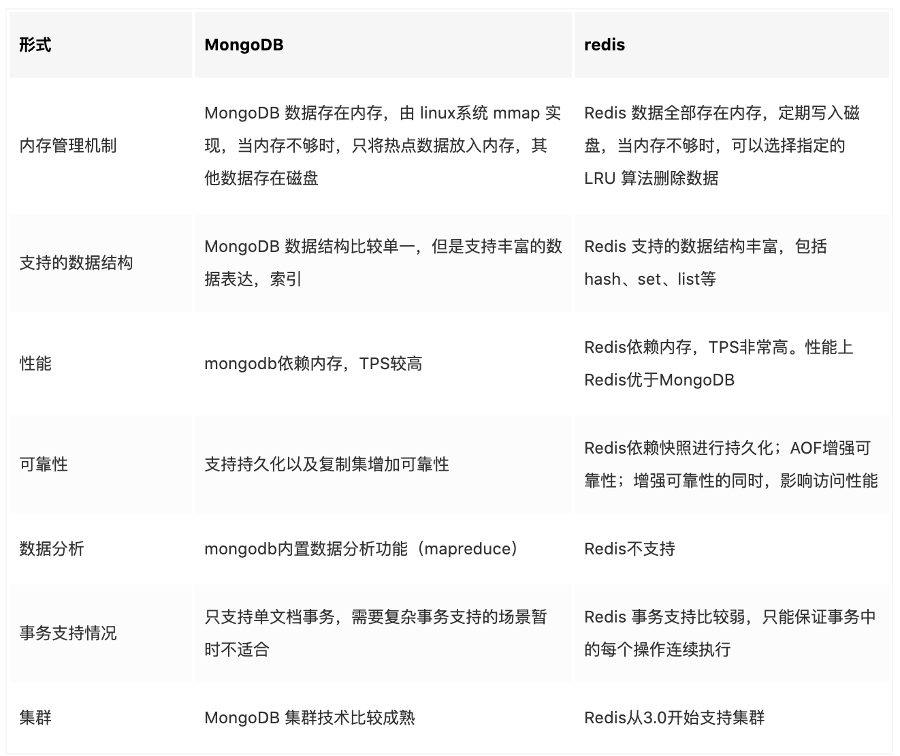

### Mongo 简介

MongoDB是一个基于分布式文件存储 的数据库。 由C++语言编写。 为WEB应用提供可扩展的高性能数据存储解决方案。 MongoDB是一个非关系数据库产品，是非关系数据库当中功能最丰富，但是最像关系数据库的。


#### 为什么使用 mongo？

* MongoDB能在生产环境中提供高读写的能力，吞吐量较于mysql等SQL数据库大大增强。
* 易伸缩，自动故障转移。易伸缩指的是提供了分片能力，能对数据集进行分片，数据的存储压力分摊给多台服务器。自动故障转移是副本集的概念，MongoDB能检测主节点是否存活，当失活时能自动提升从节点为主节点，达到故障转移。
* 数据模型因为是面向对象的，动态的字段映射，所以可以表示丰富的、有层级的数据结构，比如博客系统中能把“评论”直接怼到“文章“的文档中，而不必像myqsl一样创建三张表来描述这样的关系。


#### 概念

| SQL术语/概念 | MongoDB术语/概念 | 解释/说明                           |
| :----------- | :--------------- | :---------------------------------- |
| database     | database         | 数据库                              |
| table        | collection       | 数据库表/集合                       |
| row          | document         | 数据记录行/文档                     |
| column       | field            | 数据字段/域                         |
| index        | index            | 索引                                |
| table joins  |                  | 表连接,MongoDB不支持                |
| primary key  | primary key      | 主键,MongoDB自动将_id字段设置为主键 |


#### Mongo 的数据类型

| 数据类型           | 描述                                                         |
| :----------------- | :----------------------------------------------------------- |
| String             | 字符串。存储数据常用的数据类型。在 MongoDB 中，UTF-8 编码的字符串才是合法的。 |
| Integer            | 整型数值。用于存储数值。根据你所采用的服务器，可分为 32 位或 64 位。 |
| Boolean            | 布尔值。用于存储布尔值（真/假）。                            |
| Double             | 双精度浮点值。用于存储浮点值。                               |
| Min/Max keys       | 将一个值与 BSON（二进制的 JSON）元素的最低值和最高值相对比。 |
| Array              | 用于将数组或列表或多个值存储为一个键。                       |
| Timestamp          | 时间戳。记录文档修改或添加的具体时间。                       |
| Object             | 用于内嵌文档。                                               |
| Null               | 用于创建空值。                                               |
| Symbol             | 符号。该数据类型基本上等同于字符串类型，但不同的是，它一般用于采用特殊符号类型的语言。 |
| Date               | 日期时间。用 UNIX 时间格式来存储当前日期或时间。你可以指定自己的日期时间：创建 Date 对象，传入年月日信息。 |
| Object ID          | 对象 ID。用于创建文档的 ID。                                 |
| Binary Data        | 二进制数据。用于存储二进制数据。                             |
| Code               | 代码类型。用于在文档中存储 JavaScript 代码。                 |
| Regular expression | 正则表达式类型。用于存储正则表达式。                         |


#### Mongo 常用命令

```
//查询所有数据库
show dbs

//选择数据库
use 数据库名

//显示所有表
show collections

//显示数据库状态信息
db.stats()

//显示集合表状态信息
db.numbers.stats()

//停止数据库
db,shutdownServer()

//获取数据库操作命令
db.help()

//获取表操作命令
db.foo.help()

//自动帮我们补全命令
tab 键 
```


### Mongo 索引

#### 1、默认索引

MongoDB 中所有的文档也都有一个唯一的 `_id` 字段，在默认情况下所有的文档都使用一个长 12 字节的 `ObjectId` 作为默认索引：

<div align=middle></div>

前四位代表当前 `_id` 生成时的 Unix 时间戳。

在这之后是三位的机器标识符和两位的处理器标识符。

最后是一个三位的计数器，初始值就是一个随机数；通过这种方式代替递增的 `id` 能够解决分布式的 MongoDB 生成唯一标识符的问题，同时可以在一定程度上保证 `id` 的增长是递增的。


#### 2、单字段索引

除了 MongoDB 提供的默认 `_id` 字段之外，我们还可以建立其它的单键索引，而且其中不止支持顺序的索引，还支持对索引倒排。

MySQL8.0 之前的索引都只能是正序排列的，在 8.0 之后才引入了逆序的索引。

<div align=middle></div>


#### 3、复合索引

除了单一字段索引这种非常简单的索引类型之外，MongoDB 还支持多个不同字段组成的复合索引（Compound Index），由于 MongoDB 中支持对同一字段的正逆序排列，所以相比于 MySQL 中的辅助索引就会出现更多的情况：



上面的两个索引是完全不同的，在磁盘上的 B+ 树其实也按照了完全不同的顺序进行存储，虽然 `username` 字段都是升序排列的，但是对于 `age` 来说，两个索引的处理是完全相反的：



这也就造成了在使用查询语句对集合中数据进行查找时，如果约定了正逆序，那么其实是会使用不同的索引的。


#### 4、多键索引

由于 MongoDB 支持了类似数组的数据结构，所以也提供了名为多键索引的功能，可以将数组中的每一个元素进行索引，索引的创建其实与单字段索引没有太多的区别：

```sql
db.collection.createIndex( { address: 1 } )
```

如果一个字段是值是数组，那么在使用上述代码时会自动为这个字段创建一个多键索引，能够加速对数组中元素的查找。


### 三种搭建 mongo 的方式

#### 1、Master - Slave



主从架构一般用于备份或者做读写分离。一般有一主一从设计和一主多从设计。

由两种角色构成：

**（1）主(Master)**

可读可写，当数据有修改的时候，会将oplog同步到所有连接的salve上去。

**（2）从(Slave)**

只读不可写，自动从Master同步数据。

特别的，对于Mongodb来说，并不推荐使用Master-Slave架构，因为Master-Slave其中Master宕机后不能自动恢复，推荐使用Replica Set。


#### 2、Replica Set副本集方式



Replica Set是mongod的实例集合，它们有着同样的数据内容。包含三类角色：

**（1）主节点（Primary）**

接收所有的写请求，然后把修改同步到所有Secondary。一个Replica Set只能有一个Primary节点，当Primary挂掉后，其他Secondary或者Arbiter节点会重新选举出来一个主节点。默认读请求也是发到Primary节点处理的，需要转发到Secondary需要客户端修改一下连接配置。

**（2）副本节点（Secondary）**

与主节点保持同样的数据集。当主节点挂掉的时候，参与选主。

**（3）仲裁者（Arbiter）**

不保有数据，不参与选主，只进行选主投票。使用Arbiter可以减轻数据存储的硬件需求，Arbiter跑起来几乎没什么大的硬件资源需求，但重要的一点是，在生产环境下它和其他数据节点不要部署在同一台机器上。


#### 3、Sharding分片

当数据量比较大的时候，我们需要把数据分片运行在不同的机器中，以降低CPU、内存和IO的压力，Sharding就是数据库分片技术。

MongoDB分片技术类似MySQL的水平切分和垂直切分，数据库主要由两种方式做Sharding：垂直扩展和横向切分。


垂直扩展的方式就是进行集群扩展，添加更多的CPU，内存，磁盘空间等。

横向切分则是通过数据分片的方式，通过集群统一提供服务：




**（1）数据分片（Shards）**

用来保存数据，保证数据的高可用性和一致性。可以是一个单独的`mongod`实例，也可以是一个副本集。

在生产环境下Shard一般是一个Replica Set，以防止该数据片的单点故障。

对于MongoDB的分片，假设我们以某一索引键（ID）为片键，ID的区间[0,50]，划分成5个chunk（64Mb），分别存储到3个片服务器中，如图所示：

<div align=middle></div>


**（2）查询路由（Query Routers）**

路由就是mongos的实例，客户端直接连接mongos，由mongos把读写请求路由到指定的Shard上去。

一个Sharding集群，可以有一个mongos，也可以有多mongos以减轻客户端请求的压力。

**（3）配置服务器（Config servers）**

保存集群的元数据（metadata），包含各个Shard的路由规则，存储的是 key 与chunk以及chunk与 shard 的映射关系。




### Mongo 应用场景

* 游戏场景，使用 MongoDB 存储游戏用户信息，用户的装备、积分等直接以内嵌文档的形式存储，方便查询、更新

* 物流场景，使用 MongoDB 存储订单信息，订单状态在运送过程中会不断更新，以 MongoDB 内嵌数组的形式来存储，一次查询就能将订单所有的变更读取出来。

* 社交场景，使用 MongoDB 存储存储用户信息，以及用户发表的朋友圈信息，通过地理位置索引实现附近的人、地点等功能

* 物联网场景，使用 MongoDB 存储所有接入的智能设备信息，以及设备汇报的日志信息，并对这些信息进行多维度的分析

* 视频直播，使用 MongoDB 存储用户信息、礼物信息等。


应用不需要事务及复杂 join 支持；新应用，需求会变，数据模型无法确定，想快速迭代开发。

应用需要2000-3000以上的读写QPS（更高也可以）。

应用需要TB甚至 PB 级别数据存储?应用发展迅速，需要能快速水平扩展?应用要求存储的数据不丢失。

应用需要99.999%高可用。

应用需要大量的地理位置查询、文本查询。


### Mongo 和 其它数据库的对比

#### 1、Mongo 与 Mysql

<div align=middle></div>


#### 2、Mongo 与 Redis

<div align=middle></div>


### Mongo 常见问题

#### 1、**数据在什么时候才会扩展到多个分片(`Shard`)里?**

`MongoDB` 分片是基于区域(`range`)的。所以一个集合(`collection`)中的所有的对象都被存放到一个块(`chunk`)中,默认块的大小是 64Mb。当数据容量超过64 Mb，才有可能实施一个迁移。


#### 2、mongo索引的数据结构？

B+

#### 3、mongo单条数据的大小一般是？

16M