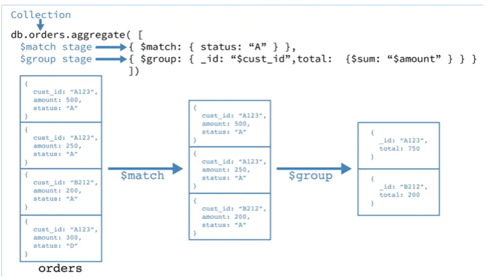
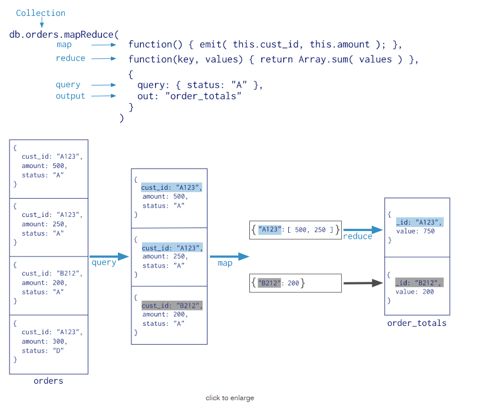
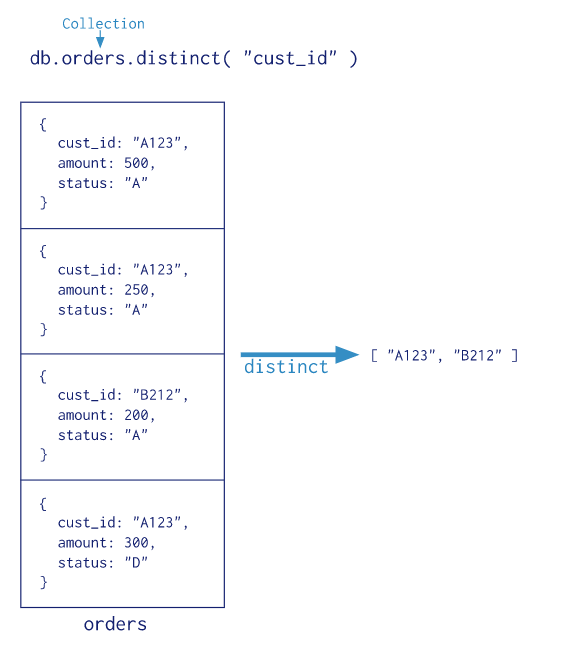

### 什么是管道

**MongoDB中聚合(aggregate)** 操作将来自多个document的value组合在一起，并通过对分组数据进行各种操作处理，并返回计算后的数据结果，主要用于处理数据(诸如统计平均值,求和等)。MongoDB提供三种方式去执行聚合操作：**聚合管道（aggregation pipeline）**、**Map-Reduce函数**以及**单一的聚合命令(count、distinct、group)**。


### 聚合管道

#### 1、聚合管道

聚合管道是由aggregation framework将文档进入一个由多个阶段（stage）组成的管道，可以对每个阶段的管道进行分组、过滤等功能，然后经过一系列的处理，输出相应的聚合结果。如图所示：

```java
db.orders.aggregate([
      { $match: { status: "A" } },
      { $group: { _id: "$cust_id", total: { $sum: "$amount" } } }
])

```

<div align=middle></div>

#### 2、聚合管道优化

- 聚合管道可以确定它是否仅需要文档中的字段的子集来获得结果。 如果是这样，管道将只使用那些必需的字段，减少通过管道的数据量
- 管道序列优化化


**原管道：**

```java
  { $sort: { age : -1 } },
  { $match: { score: 'A' } }
  { $project: { status: 1, name: 1 } },
  { $skip: 5 }
```

**优化后：**

```
  { $match: { score: 'A' } },
  { $sort: { age : -1 } }
  { $skip: 5 },
  { $project: { status: 1, name: 1 } }
```


### Map-Reduce 函数

MongoDB还提供map-reduce操作来执行聚合。Map-reduce使用自定义JavaScript函数来执行映射和减少操作，以及可选的finalize操作。 虽然自定义JavaScript与聚合管道相比提供了极大的灵活性，但通常，map-reduce比聚合管道效率更低，更复杂。模式如下：



### 单一聚合命令

MongoDB还提供了，db.collection.estimatedDocumentCount（），db.collection.count（）和db.collection.distinct（） 所有这些单一的聚合命令。 虽然这些操作提供了对常见聚合过程的简单访问操作，但它们缺乏聚合管道和map-reduce的灵活性和功能。模型如下：



