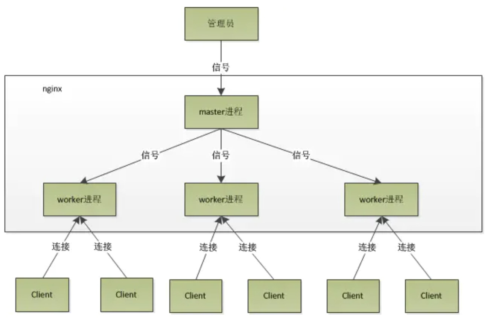
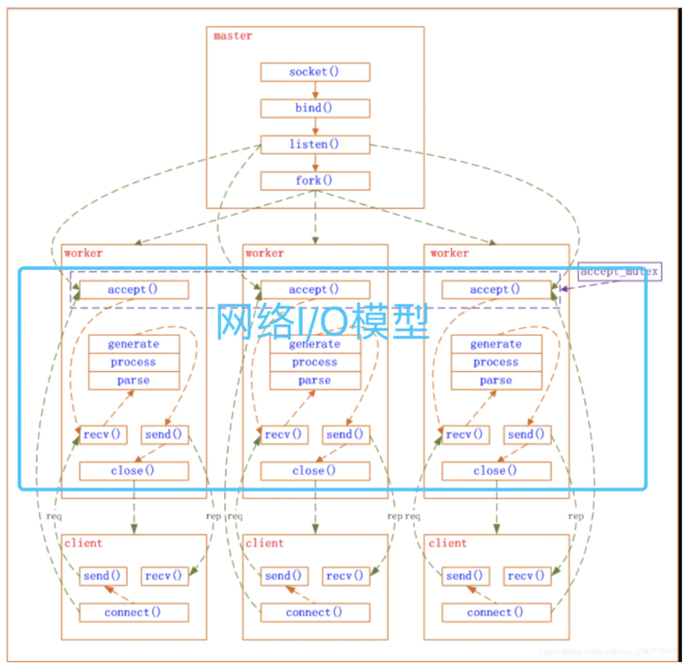

### Nginx 进程模型

#### 多进程模型

与Memcached的经典多线程模型相比，Nginx是经典的多进程模型，每个进程里只有一个主线程。Nginx启动后以daemon的方式在后台运行，后台进程包含一个master进程和多个worker进程。



使用多进程模型的好处：

* 对于每个worker进程来说，独立的进程，不需要加锁，所以省掉了锁带来的开销
* 在编程以及问题查找时，也会方便很多
* 采用独立的进程，可以让进程间互相不会影响，一个进程退出后，其它进程还在工作，服务不会中断，master进程则很快启动新的worker进程

#### master 功能

四个：

- 接收来自外界的信号。
- 向各worker进程发送信号。
- 监控woker进程的运行状态。
- 当woker进程退出后（异常情况下），会自动重新启动新的woker进程


#### work 功能

* 多个worker进程之间是对等且相互独立的，他们同等竞争来自客户端的请求。
* 一个请求，只可能在一个worker进程中处理，一个worker进程，不可能处理其它进程的请求。
* worker进程的个数是可以设置的，一般我们会设置与机器  **物理cpu核数** （注：cpu 核数和 物理 cpu 数不一样）一致。为了更好的利用多核特性，具有cpu绑定选项，我们可以将某一个进程绑定在某一个核上，这样就不会因为进程的切换带来cache的失效。


### 网络事件

#### 理解 socket

服务端相当于是 nginx master 进程，客户端是连接到 nginx 的请求

```java
// server 
public class Server {
    public static void main(String[] args) {
       //创建一个服务器socket，即serversocket,指定绑定的端口，并监听此端口
       ServerSocket serverSocket = new ServerSocket(8888);
       //调用accept()方法开始监听，等待客户端的连接
       System.out.println("***服务器即将启动，等待客户端的连接***");
       Socket socket = serverSocket.accept();
       //获取输入流，并读入客户端的信息
       InputStream in = socket.getInputStream(); //字节输入流
}

// client
public static void main(String[] args) {
       //创建客户端socket建立连接，指定服务器地址和端口
       Socket socket = new Socket("127.0.0.1",8888);
       //获取输出流，向服务器端发送信息
       OutputStream outputStream = socket.getOutputStream();//字节输出流
       PrintWriter pw = new PrintWriter(outputStream); //将输出流包装为打印流
       pw.write("用户名：admin;密码：123");
       pw.flush();
       socket.shutdownOutput();
    }

```


Nginx（多进程）采用异步非阻塞的方式来处理网络事件



master进程先建好需要listen的socket（listenfd）后，然后再fork出多个woker进程，这样每个work进程都可以去accept这个socket。当一个client连接到来时，所有accept的work进程都会受到通知，但只有一个进程可以accept成功，其它的则会accept失败。Nginx提供了一把共享锁accept_mutex来保证同一时刻只有一个work进程在accept连接，从而解决惊群问题。

<font color = red>ll /proc/2228/fd  查看进程打开的 fd</font>


### 惊群问题

#### nginx的惊群现象

每个worker进程都是从master进程fork过来。在master进程里面，先建立好需要listen的socket之 后，然后再fork出多个worker进程，这样每个worker进程都可以去accept这个socket(当然不是同一个socket，只是每个进程 的这个socket会监控在同一个ip地址与端口，这个在网络协议里面是允许的)。一般来说，当一个连接进来后，所有在accept在这个socket上 面的进程，都会收到通知，而只有一个进程可以accept这个连接，其它的则accept失败。


#### 如何处理惊群

**不让多个进程在同一时间监听接受连接的socket，而是让每个进程轮流监听**，这样当有连接过来的时候，就只有一个进程在监听那肯定就没有惊群的问题。具体做法是：利用一把进程锁 accept_mutex，这是一个加在 accept 方法上的一把共享锁。每个进程中都尝试获得这把锁，如果获取成功将监听socket加入wait集合中，并设置超时等待连接到来，没有获得锁的进程则将监听socket从wait集合去除。


ngx_trylock_accept_mutex() 

```c
ngx_int_t ngx_trylock_accept_mutex(ngx_cycle_t *cycle) {
  // 尝试使用CAS算法获取共享锁
  if (ngx_shmtx_trylock(&ngx_accept_mutex)) {

    // ngx_accept_mutex_held为1表示当前进程已经获取到了锁
    if (ngx_accept_mutex_held && ngx_accept_events == 0) {
      return NGX_OK;
    }

    // 这里主要是将当前连接的文件描述符注册到对应事件的队列中，比如kqueue模型的change_list数组
    // nginx在启用各个worker进程的时候，默认情况下，worker进程是会继承master进程所监听的socket句柄的，
    // 这就导致一个问题，就是当某个端口有客户端事件时，就会把监听该端口的进程都给唤醒，
    // 但是只有一个worker进程能够成功处理该事件，而其他的进程被唤醒之后发现事件已经过期，
    // 因而会继续进入等待状态，这种现象称为"惊群"现象。
    // nginx解决惊群现象的方式一方面是通过这里的共享锁的方式，即只有获取到锁的worker进程才能处理
    // 客户端事件，但实际上，worker进程是通过在获取锁的过程中，为当前worker进程重新添加各个端口的监听事件，
    // 而其他worker进程则不会监听。也就是说同一时间只有一个worker进程会监听各个端口，
    // 这样就避免了"惊群"问题。
    // 这里的ngx_enable_accept_events()方法就是为当前进程重新添加各个端口的监听事件的。
    if (ngx_enable_accept_events(cycle) == NGX_ERROR) {
      ngx_shmtx_unlock(&ngx_accept_mutex);
      return NGX_ERROR;
    }

    // 标志当前已经成功获取到了锁
    ngx_accept_events = 0;
    ngx_accept_mutex_held = 1;

    return NGX_OK;
  }

  // 前面获取锁失败了，因而这里需要重置ngx_accept_mutex_held的状态，并且将当前连接的事件给清除掉
  if (ngx_accept_mutex_held) {
    // 如果当前进程的ngx_accept_mutex_held为1，则将其重置为0，并且将当前进程在各个端口上的监听
    // 事件给删除掉
    if (ngx_disable_accept_events(cycle, 0) == NGX_ERROR) {
      return NGX_ERROR;
    }

    ngx_accept_mutex_held = 0;
  }

  return NGX_OK;
}
```

上面的代码主要做了三件事：

- 通过`ngx_shmtx_trylock()`方法尝试使用CAS方法获取共享锁；
- 获取锁之后则调用`ngx_enable_accept_events()`方法监听目标端口对应的文件描述符；
- 如果没有获取到锁，则调用`ngx_disable_accept_events()`方法释放所监听的文件描述符；


### nginx 是如何实现高并发的

多进程 + epoll

#### nginx 的 IO 多路复用模型 epoll

eventpoll 结构体

```c
struct eventpoll {
    spinlock_t lock;
    struct mutex mtx;

    wait_queue_head_t wq; //sys_epoll_wait（）使用的等待队列
    wait_queue_head_t poll_wait; //file->poll()使用的等待队列

    struct list_head rdllist; //所有准备就绪的文件描述符列表
    struct rb_root rbr; //用于储存已监控fd的红黑树根节点

    // 当正在向用户空间传递事件，则就绪事件会临时放到该队列，否则直接放到rdllist
    struct epitem *ovflist;
    struct wakeup_source *ws; // 当ep_scan_ready_list运行时使用wakeup_source
    struct user_struct *user; //创建eventpoll描述符的用户

    struct file *file;
    int visited;           //用于优化循环检测检查
    struct list_head visited_list_link;
};
```


`epoll`通过在Linux内核中申请一个简易的文件系统，其工作流程如下：

1. <font color = green>epoll_create</font> 

   调用 `epoll_create(int size)` 建立一个`epoll`对象，内核会创建一个`eventpoll`结构体，用于存放通过`epoll_ctl()`向 `epoll` 对象中添加进来的事件，这些事件都会挂载在红黑树中。

2. <font color = green>epoll_ctl</font> 

   调用 `epoll_ctl(int epfd, int op, int fd, struct epoll_event *event)` 在 epoll 对象中为 `fd` 注册事件，所有添加到epoll中的事件都会与设备驱动程序（网卡）建立回调关系，也就是说，当相应的事件发生时会调用这个sockfd的回调方法（epoll_callback），将`sockfd`添加到 `eventpoll` 中的双链表（rdlist 中）。

3. <font color = green>epoll_callback</font> 

   ep_poll_callback()：目标fd的就绪事件到来时，将 fd 加入ep->rdllist的队列，导致rdlist不空，从而 epoll_wait 阻塞的进程被唤醒，epoll_wait 得以继续执行。

4. <font color = green>epoll_wait</font> 

   调用 `epoll_wait(int epfd, struct epoll_event * events, int maxevents, int timeout)` 来等待事件的发生，`timeout` 为 `-1` 时，该调用会阻塞直到有事件发生，再将传输就绪事件到用户空间。

这样，注册好事件之后，只要有 `fd` 上事件发生，`epoll_wait()` 就能检测到并返回给用户，用户就能”非阻塞“地进行 I/O 了。

`epoll()` 中内核则维护一个链表， `epoll_wait` 直接检查链表是不是空就知道是否有文件描述符准备好了。（`epoll` 与 `select` 相比最大的优点是不会随着 `sockfd` 数目增长而降低效率，使用 `select()` 时，内核采用轮训的方法来查看是否有 `fd` 准备好，其中的保存 `sockfd` 的是类似数组的数据结构 `fd_set`，key 为 `fd` ，value 为 `0` 或者 `1`。）

能达到这种效果，是因为在内核实现中 `epoll` 是根据每个 `sockfd` 上面的与设备驱动程序建立起来的回调函数实现的。那么，某个 `sockfd` 上的事件发生时，与它对应的回调函数就会被调用，来把这个 `sockfd` 加入链表，其他处于“空闲的”状态的则不会。在这点上， `epoll` 实现了一个”伪”AIO。但是如果绝大部分的 I/O 都是“活跃的”，每个 socket 使用率很高的话，epoll效率不一定比 select 高（可能是要维护队列复杂）。


**epoll 对文件描述符的操作有两种模式**

LT（level trigger）和 ET（edge trigger）。LT 模式是默认模式，LT 模式与 ET 模式的区别如下：

- LT 模式：

  当 epoll_wait 检测到描述符事件发生并将此事件通知应用程序，应用程序可以不立即处理该事件。下次调用 epoll_wait 时，会再次通知应用程序，直到被处理。

  在这种做法中，内核告诉你一个文件描述符就绪了，然后你可以对这个就绪的fd进行IO操作。如果你不作任何操作，内核还是会继续通知你的，所以，这种模式编程出错误可能性要小一点。

- ET 模式：

   当 epoll_wait 检测到描述符事件发生并将此事件通知应用程序，应用程序必须立即处理该事件。如果不处理，下次调用 epoll_wait 时，不会再次响应应用程序并通知此事件。
   
   ET 模式在很大程度上减少了 epoll 事件被重复触发的次数，因此效率要比 LT 模式高。

