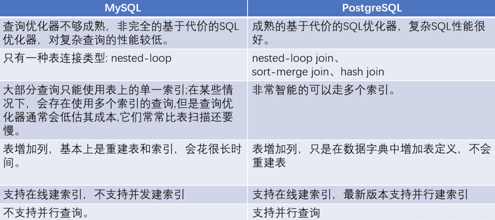
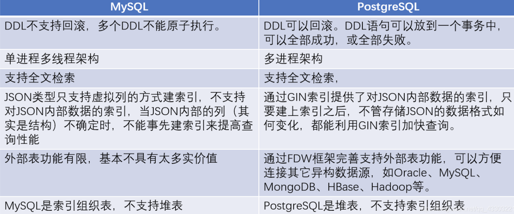
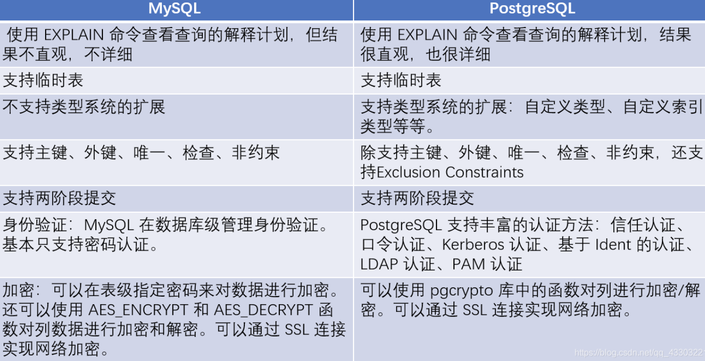

## PostgreSQL 特点

- PostgreSQL 遵循 BSD 协议，这意味着使用 PostgreSQL 无任何限制。
- 可支持 C、C++、Java、PHP、Python 及 Perl 等，使您的业务开发更简单更易用。
- PostgreSQL 是架构、语法、数据类型等与 Oracle 最接近的开源数据库。
- 除了支持传统 SQL 的 LIKE 操作符、还支持 SQL99 新增的 SIMILAR TO 操作符和 POSIX 风格的正则表达式。
- 支持复合类型（自定义数据类型）。
- 支持复杂的多表 JOIN 查询 SQL：JOIN 算法支持 hash join、merge join 等。
- 支持窗口函数，可以改成复杂分析函数，因为分析函数包括了窗口函数。
- 支持函数索引、部分(行)索引、自定义索引、全文索引。
- 多进程的架构，更加稳定，单机可以支持更高访问量的数据库。
- 有功能强大,性能优秀的插件，如 PostGIS 是一个空间数据库扩展程序插件，它增加了对地理对象的支持，允许您以 SQL 运行位置查询。


## 控制台命令

```bash
\q：退出。

\h：查看SQL命令的解释，比如\h select。

\?：查看psql命令列表。

\l：列出所有数据库。

\c [database_name]：连接其他数据库。

\d：列出当前数据库的所有表格。

\d [table_name]：列出某一张表格的结构。

\du：列出所有用户。

\e：打开文本编辑器。

\conninfo：列出当前数据库和连接的信息。
```


## MySQL 和 PostgreSQL 对比

### 一、复制功能

MySQL：逻辑复制，复制延迟影响较大，主备容易出现数据不一致

PostgreSQL：物理复制，复制延迟小，主备数据完全一样


### 二、查询功能

<div align=middle></div>


### 三、架构功能

<div align=middle></div>


### 四、加密功能

<div align=middle></div>


## 应用场景

### 企业数据库

如 ERP、交易系统、财务系统涉及资金、客户等信息，数据不能丢失且业务逻辑复杂，选择 PostgreSQL 作为数据底层存储，一是可以帮助您在数据一致性前提下提供高可用性，二是可以用简单的编程实现复杂的业务逻辑。


### 含 LBS 的应用

大型游戏、O2O 等应用需要支持世界地图、附近的商家，两个点的距离等能力，PostGIS 增加了对地理对象的支持，允许您以 SQL 运行位置查询，而不需要复杂的编码，帮助您更轻松理顺逻辑，更便捷的实现 LBS，提高用户粘性。


### 数据仓库和大数据

PostgreSQL 更多数据类型和强大的计算能力，能够帮助您更简单搭建数据库仓库或大数据分析平台，为企业运营加分。