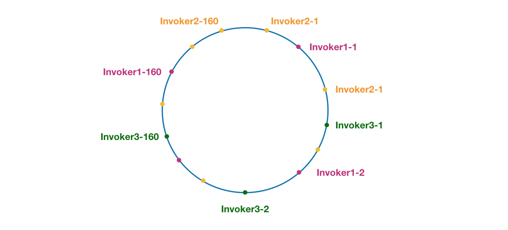

### dubbo支持的协议

Dubbo支持dubbo、rmi、hessian、http、webservice、thrift、redis等多种协议，但是Dubbo官网是推荐我们使用Dubbo协议的。

I/O 框架使用的是 netty

### dubbo协议

连接个数：单连接
连接方式：长连接
传输协议：TCP
传输方式：NIO异步传输
序列化方式：Hessian二进制序列化

1、dubbo默认采用dubbo协议，dubbo协议采用单一长连接和NIO异步通讯，适合于小数据量大并发的服务调用，以及服务消费者机器数远大于服务提供者机器数的情况
2、他不适合传送大数据量的服务，比如传文件，传视频等，除非请求量很低。

### rmi协议

连接个数：多连接
连接方式：短连接
传输协议：TCP
传输方式：同步传输
序列化方式：Java标准二进制序列化
适用范围：传入传出参数数据包大小混合，消费者与提供者个数差不多，可传文件。
适用场景：常规远程服务方法调用，与原生RMI服务互操作

### hessian协议

基于Hessian的远程调用协议。
连接个数：多连接
连接方式：短连接
传输协议：HTTP
传输方式：同步传输
序列化方式：json
适用范围：传入传出参数数据包大小混合，提供者比消费者个数多，可用浏览器查看，可用表单或URL传入参数，暂不支持传文件。
适用场景：需同时给应用程序和浏览器JS使用的服务。

1、Hessian协议用于集成Hessian的服务，Hessian底层采用Http通讯，采用Servlet暴露服务，Dubbo缺省内嵌Jetty作为服务器实现。
2、Hessian是Caucho开源的一个RPC框架：[http://hessian.caucho.com](http://hessian.caucho.com/)，其通讯效率高于WebService和Java自带的序列化。

### http协议

连接个数：多连接
连接方式：短连接
传输协议：HTTP
传输方式：同步传输
序列化：表单序列化
适用范围：传入传出参数数据包大小混合，提供者比消费者个数多，可用浏览器查看，可用表单或URL传入参数，暂不支持传文件。
适用场景：需同时给应用程序和浏览器JS使用的服务。

### thrift协议

当前 dubbo 支持的 thrift 协议是对 thrift 原生协议的扩展，在原生协议的基础上添加了一些额外的头信息，比如service name，magic number等。使用dubbo thrift协议同样需要使用thrift的idl compiler编译生成相应的java代码，后续版本中会在这方面做一些增强。

## dubbo 负载均衡

Dubbo 提供了4种负载均衡实现，分别是基于权重随机算法的 RandomLoadBalance、基于最少活跃调用数算法的 LeastActiveLoadBalance、基于 hash 一致性的 ConsistentHashLoadBalance，以及基于加权轮询算法的 RoundRobinLoadBalance。

在 Dubbo 中，所有负载均衡实现类均继承自 AbstractLoadBalance，该类实现了 LoadBalance 接口，并封装了一些公共的逻辑。

#### RandomLoadBalance

RandomLoadBalance 是加权随机算法的具体实现，它的算法思想很简单。

假设我们有一组服务器 servers = [A, B, C]，他们对应的权重为 weights = [5, 3, 2]，权重总和为10。现在把这些权重值平铺在一维坐标值上，[0, 5) 区间属于服务器 A，[5, 8) 区间属于服务器 B，[8, 10) 区间属于服务器 C。

接下来通过随机数生成器生成一个范围在 [0, 10) 之间的随机数，然后计算这个随机数会落到哪个区间上。比如数字3会落到服务器 A 对应的区间上，此时返回服务器 A 即可。

#### LeastActiveLoadBalance

LeastActiveLoadBalance 翻译过来是最小活跃数负载均衡。活跃调用数越小，表明该服务提供者效率越高，单位时间内可处理更多的请求。此时应优先将请求分配给该服务提供者。

在具体实现中，每个服务提供者对应一个活跃数 active。初始情况下，所有服务提供者活跃数均为0。每收到一个请求，活跃数加1，完成请求后则将活跃数减1。在服务运行一段时间后，性能好的服务提供者处理请求的速度更快，因此活跃数下降的也越快，此时这样的服务提供者能够优先获取到新的服务请求、这就是最小活跃数负载均衡算法的基本思想。

除了最小活跃数，LeastActiveLoadBalance 在实现上还引入了权重值。所以准确的来说，LeastActiveLoadBalance 是基于加权最小活跃数算法实现的。

某一时刻它们的活跃数相同，此时 Dubbo 会根据它们的权重去分配请求，权重越大，获取到新请求的概率就越大。

#### ConsistentHashLoadBalance

算法提出之初是用于大规模缓存系统的负载均衡。它的工作过程是这样的，首先根据 ip 或者其他的信息为缓存节点生成一个 hash，并将这个 hash 投射到 [0, 232 - 1] 的圆环上。

当有查询或写入请求时，则为缓存项的 key 生成一个 hash 值。然后查找第一个大于或等于该 hash 值的缓存节点，并到这个节点中查询或写入缓存项。如果当前节点挂了，则在下一次查询或写入缓存时，为缓存项查找另一个大于其 hash 值的缓存节点即可。

一致性 hash 在 Dubbo 中的应用。我们把上图的缓存节点替换成 Dubbo 的服务提供者，于是得到了下图：

相同颜色的节点均属于同一个服务提供者，比如 Invoker1-1，Invoker1-2，……, Invoker1-160。这样做的目的是通过引入虚拟节点，让 Invoker 在圆环上分散开来，避免数据倾斜问题。

#### RoundRobinLoadBalance

加权轮询负载均衡的实现 RoundRobinLoadBalance。

对轮询过程进行加权，以调控每台服务器的负载。经过加权后，每台服务器能够得到的请求数比例，接近或等于他们的权重比。比如服务器 A、B、C 权重比为 5:2:1。那么在8次请求中，服务器 A 将收到其中的5次请求，服务器 B 会收到其中的2次请求，服务器 C 则收到其中的1次请求。

问题：

在某些情况下选出的服务器序列不够均匀。比如，服务器 [A, B, C] 对应权重 [5, 1, 1]。进行7次负载均衡后，选择出来的序列为 [A, A, A, A, A, B, C]。

但这将会使服务器 A 短时间内接收大量的请求，压力陡增。而 B 和 C 此时无请求，处于空闲状态。而我们期望的结果是这样的 [A, A, B, A, C, A, A]。

解决：
参考自 Nginx 的平滑加权轮询负载均衡。每个服务器对应两个权重，分别为 weight 和 currentWeight。其中 weight 是固定的，currentWeight 会动态调整，初始值为0。当有新的请求进来时，遍历服务器列表，让它的 currentWeight 加上自身权重。遍历完成后，找到最大的 currentWeight，并将其减去权重总和，然后返回相应的服务器即可。

说明：currentWeight 先是 5 1 1，选择 5，减去 7  为 -2，变为 -2 1 1。

下一步currentWeight 用不变的 weight + 减去权重后的 currentWeight ，为 3，2，2

以此类推。

