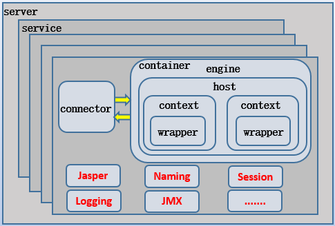
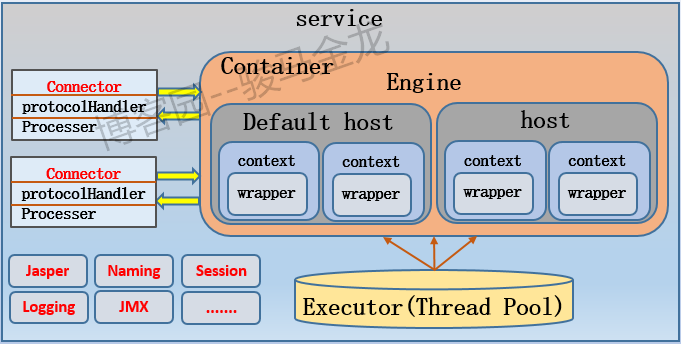
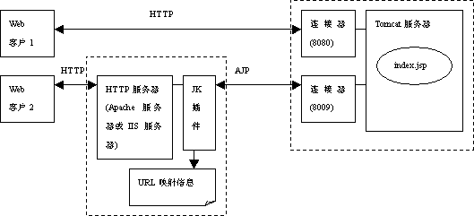
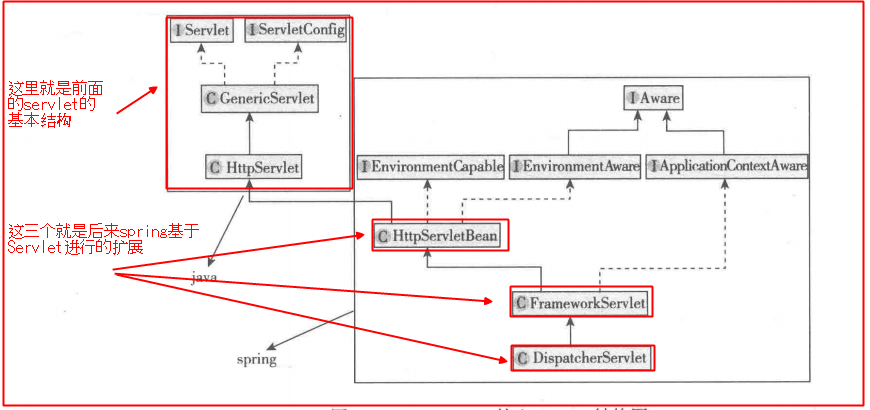

#### 1、结构图 

https://www.cnblogs.com/f-ck-need-u/p/8408670.html


#### 2、详细说明

https://www.cnblogs.com/kismetv/p/7228274.html


### tomcat 结构

**tomcat组件体系简图：**




**Service组件细化后的图：**




#### connector组件参数：

`acceptorThreadCount`：用于**接收连接请求的线程数**。默认值为1。多核CPU系统应该增大该值，另外由于长连接的存在，也应该考虑增大该值。
`maxThreads`：线程池中最多允许存在多少线程用于**处理请求**。默认值为200。它是最大并发处理的数量，但不影响接收线程接收更多的连接。
`maxConnections`：服务端允许接收和处理的最大连接数。当达到该值后，操作系统还能继续接收额外acceptCount个的连接请求，但这些连接暂时不会被处理。当Connector类型为BIO模型时的默认值等于maxThread的值，当为NIO/NIO2模型时的默认值为10000，当APR时默认长度为8192。
`acceptCount`：当所有请求处理线程都处于忙碌状态时，连接请求将进入等待队列，该值设置等待队列的长度。当达到队列最大值后，如果还有新连接请求进入，则会被拒绝。默认队列长度为100。


#### executor  组件参数：

`executor `组件为每个Service组件提供线程池，使得Engine可以从线程池中获取线程处理请求，从而实现tomcat的并发处理能力。Executor的线程池大小是为Engine组件设置，而不是为Connector设置的，Connector的线程数量由Connector组件的acceptorThreadCount属性来设置 。如果要在配置文件中设置该组件，则必须设置在Connector组件的前面，以便在Connector组件中使用`executor`属性来引用配置好的Executor组件。如果不显式设置，则采用Connector组件上的默认配置，默认配置如下：

- (1).maxThreads：最大线程数，默认值200。
- (2).minSpareThreads：最小空闲线程数，默认值25。
- (3).maxIdleTime：空闲线程的线程空闲多长时间才会销毁，默认值60000即1分钟。
- (4).prestartminSpareThreads：是否启动executor时就直接创建等于最小空闲线程数的线程，默认值为false，即只在有连接请求进入时才会创建。


### 核心组件

#### 1、Server

Server 元素在最顶层，代表整个Tomcat容器，因此它必须是server.xml中唯一一个最外层的元素。一个 Server 元素中可以有一个或多个 Service 元素。

在第一部分的例子中，在最外层有一个<Server>元素，shutdown属性表示关闭Server的指令；port属性表示Server接收shutdown指令的端口号，设为-1可以禁掉该端口。

Server的主要任务，就是提供一个接口让客户端能够访问到这个Service集合，同时维护它所包含的所有的Service的声明周期，包括如何初始化、如何结束服务、如何找到客户端要访问的Service。


#### 2、Service

Service的作用，是在Connector和Engine外面包了一层，把它们组装在一起，对外提供服务。一个 Service 可以包含多个Connector，但是只能包含一个Engine；其中Connector的作用是从客户端接收请求，Engine的作用是处理接收进来的请求。

在第一部分的例子中，Server中包含一个名称为“Catalina”的Service。实际上，Tomcat可以提供多个Service，不同的Service监听不同的端口，后文会有介绍。


#### 3、connector

Connector的主要功能，是接收连接请求，创建Request和Response对象用于和请求端交换数据；然后分配线程让Engine来处理这个请求，并把产生的Request和Response对象传给Engine。

通过配置Connector，可以控制请求Service的协议及端口号。在第一部分的例子中，Service包含两个Connector：

```xml
<Connector port="8080" protocol="HTTP/1.1" connectionTimeout="20000" redirectPort="8443" />
<Connector port="8009" protocol="AJP/1.3" redirectPort="8443" />
```


（1）通过配置第1个Connector，客户端可以通过8080端口号使用http协议访问Tomcat。其中，protocol属性规定了请求的协议，port规定了请求的端口号，redirectPort表示当强制要求https而请求是http时，重定向至端口号为8443的Connector，connectionTimeout表示连接的超时时间。

在这个例子中，Tomcat监听HTTP请求，使用的是8080端口，而不是正式的80端口；实际上，在正式的生产环境中，Tomcat也常常监听8080端口，而不是80端口。这是因为在生产环境中，很少将Tomcat直接对外开放接收请求，而是在Tomcat和客户端之间加一层代理服务器(如nginx)，用于请求的转发、负载均衡、处理静态文件等；通过代理服务器访问Tomcat时，是在局域网中，因此一般仍使用8080端口。

（2）通过配置第2个Connector，客户端可以通过8009端口号使用AJP协议访问Tomcat。AJP协议负责和其他的HTTP服务器(如Apache)建立连接；在把Tomcat与其他HTTP服务器集成时，就需要用到这个连接器。之所以使用Tomcat和其他服务器集成，是因为Tomcat可以用作Servlet/JSP容器，但是对静态资源的处理速度较慢，不如Apache和IIS等HTTP服务器；因此常常将Tomcat与Apache等集成，前者作Servlet容器，后者处理静态资源，而AJP协议便负责Tomcat和Apache的连接。



#### 4、Engine

Engine 组件在 Service 组件中有且只有一个；Engine 是Service 组件中的请求处理组件。Engine组件从一个或多个Connector中接收请求并处理，并将完成的响应返回给Connector，最终传递给客户端。

前面已经提到过，Engine、Host和Context都是容器，但它们不是平行的关系，而是父子关系：Engine包含Host，Host包含Context。

在第一部分的例子中，Engine的配置语句如下：

```xml
<Engine name="Catalina" defaultHost="localhost">
```

其中，name属性用于日志和错误信息，在整个Server中应该唯一。defaultHost属性指定了默认的host名称，当发往本机的请求指定的host名称不存在时，一律使用defaultHost指定的host进行处理；因此，defaultHost的值，必须与Engine中的一个Host组件的name属性值匹配。


#### 5、Host

（1）Engine与Host

Host是Engine的子容器。Engine组件中可以内嵌1个或多个Host组件，每个 Host 组件代表 Engine 中的一个虚拟主机。Host组件至少有一个，且其中一个的name必须与Engine组件的defaultHost属性相匹配。

（2）Host的作用

Host虚拟主机的作用，是运行多个Web应用（一个Context代表一个Web应用），并负责安装、展开、启动和结束每个Web应用。

Host组件代表的虚拟主机，对应了服务器中一个网络名实体(如”www.test.com”，或IP地址”116.25.25.25”)；为了使用户可以通过网络名连接Tomcat服务器，这个名字应该在DNS服务器上注册。

（3）Host的配置

在第一部分的例子中，Host的配置如下：

```xml
1 <Host name="localhost" appBase="webapps" unpackWARs="true" autoDeploy="true">
```

下面对其中配置的属性进行说明：

name属性指定虚拟主机的主机名，一个Engine中有且仅有一个Host组件的name属性与Engine组件的defaultHost属性相匹配；一般情况下，主机名需要是在DNS服务器中注册的网络名，但是Engine指定的defaultHost不需要，原因在前面已经说明。

unpackWARs指定了是否将代表Web应用的WAR文件解压；如果为true，通过解压后的文件结构运行该Web应用，如果为false，直接使用WAR文件运行Web应用。

Host的autoDeploy和appBase属性，与Host内Web应用的自动部署有关；此外，本例中没有出现的xmlBase和deployOnStartup属性，也与Web应用的自动部署有关


#### 6、Context

**Context的作用**

Context 元素代表在特定虚拟主机上运行的一个Web 应用。在后文中，提到Context、应用或Web应用，它们指代的都是Web应用。每个Web应用基于WAR文件，或WAR文件解压后对应的目录（这里称为应用目录）。

Context是Host的子容器，每个Host中可以定义任意多的Context元素。


**Context 元素配置**

Context元素最重要的属性是docBase和path，此外reloadable属性也比较常用。

docBase指定了该Web应用使用的WAR包路径，或应用目录。需要注意的是，在自动部署场景下 ，docBase 不在appBase 目录中，才需要指定；如果docBase 指定的WAR 包或应用目录就在appBase 中，则不需要指定 ，因为Tomcat会自动扫描appBase中的WAR包和应用目录，指定了反而会造成问题。

需要注意的是，在自动部署场景下，不能指定path 属性，path 属性由配置文件的文件名、WAR 文件的文件名或应用目录的名称自动推导出来。

reloadable属性指示tomcat是否在运行时监控在WEB-INF/classes和WEB-INF/lib目录下class文件的改动。如果值为true，那么当class文件改动时，会触发Web应用的重新加载。在开发环境下，reloadable设置为true便于调试；


### tomcat 初始化

tomcat首先会加载进ContextLoaderListener，然后将applicationContext.xml里写的参数注入进去，来完成一系列的Spring初始化。

DispatcherServlet：spring mvc 组件。

**初始化代码：**

```java
public abstract class HttpServletBean extends HttpServlet implements EnvironmentCapable, EnvironmentAware {
 
    //其他方法
 
    @Override
    public final void init() throws ServletException {
         
        //其他代码
 
        // Let subclasses do whatever initialization they like.
        initServletBean();
    }
 
    protected void initServletBean() throws ServletException {
    }
 
    //其他方法
}
 
public abstract class FrameworkServlet extends HttpServletBean implements ApplicationContextAware {
 
    //其他方法
 
    @Override
    protected final void initServletBean() throws ServletException {
        //其他代码
 
        try {
            this.webApplicationContext = initWebApplicationContext();
            initFrameworkServlet();
        }
        catch (ServletException | RuntimeException ex) {
            logger.error("Context initialization failed", ex);
            throw ex;
        }
 
        //其他代码
    }
 
    protected WebApplicationContext initWebApplicationContext() {
 
        //获得了Spring创造的webApplicationContext，关键
        WebApplicationContext rootContext =
                WebApplicationContextUtils.getWebApplicationContext(getServletContext());
        WebApplicationContext wac = null;
 
        if (this.webApplicationContext != null) {
            // A context instance was injected at construction time -> use it
            wac = this.webApplicationContext;
            if (wac instanceof ConfigurableWebApplicationContext) {
                ConfigurableWebApplicationContext cwac = (ConfigurableWebApplicationContext) wac;
                if (!cwac.isActive()) {
                    // The context has not yet been refreshed -> provide services such as
                    // setting the parent context, setting the application context id, etc
                    if (cwac.getParent() == null) {
                        // The context instance was injected without an explicit parent -> set
                        // the root application context (if any; may be null) as the parent
                        cwac.setParent(rootContext);      //设置父上下文
                    }
                    configureAndRefreshWebApplicationContext(cwac);
                }
            }
        }
         
        //其他代码
    }
 
    //其他方法
}
```

HttpServlet将init()实现了，留下了initServletBean()抽象方法

而FrameworkServlet实现了initServletBean()方法并定义成final（不允许重写），在此方法中调用了initWebApplicationContext()

而initWebApplicationContext()中说明了如果tomcat里存在webapplication就获取它，然后将其设置为SpringMVC的父上下文。

到此：DispatcherServlet 初始化完成




WebApplicationContext：spring 组件，这是IOC容器的核心。


总结：spring mvc 容器是 spring 容器的子关系，子可以引用父，但父不能引用子。

所以 Spring配置进行扫包的时候，如果将Controller也扫进来了，那么，Controller将进入Spring的上下文，SpringMVC里就没Controller了，到时候有请求给DispatcherServlet时，就会找不到Controller而404。


### Tomcat 源码分析

NioEndpoint 的 Acceptor 类的 run 方法里有 socket = serverSock.accept()，表示来接收一个连接的 socket。

NioEndpoint 的 Poller 类的 run 方法，调用 processKey，在这个方法里会 processSocket 方法，表示用来处理socket。

processSocket 方法中有 SocketProcessorBase\<S\> sc = processorCache.pop()，调用 executor.execute(sc)

提交到线程池执行 SocketProcessorBase，接着执行 SocketProcessorBase 的 run 和 doRun 方法。在这个方法里做了 Tcp 握手的工作。

接着会来到 NioEndpoint 类的 SocketProcessor 类中的 doRun 方法执行  state = getHandler().process(socketWrapper, event)

<font color=red>// 从这一步开始处理 socket </font>

在 AbstractProtocol 类的 process 方法中会执行 state = processor.process(wrapper, status)。

接着会执行到 state = service(socketWrapper) ，再往下会执行到 Http11Processor 类的 service 方法中，

getAdapter().service(request, response);

在这个方法中做的工作是将连接进来的请求处理并包装为request请求，以及后续将响应的请求转为response对象

构建好请求对象，就开始处理了，这时候会执行到这里 

connector.getService().getContainer().getPipeline().getFirst().invoke(request, response) 

从这里开始，后面的逻辑就要到容器组件层了，一步步执行即可。

最后在 wrapper 里，filterChain.doFilter(request.getRequest(),response.getResponse())  。

在这里调用 internalDoFilter(request,response) 处理拦截过滤请求。

最后来到 servlet.service(request, response)，开始真正的处理请求。


**请求如何从 HttpServlet 到 spring 的 Controller 方法的：**

```java
HttpServlet -> FrameworkServlet -> DispatcherServlet -> HandlerMapping -> Controller 的某个方法

DispatcherServlet 是由 Servlet 容器管理，和 Spring 的 IOC 容器没有关系，也是 Spring MVC 中唯一的 servlet
```