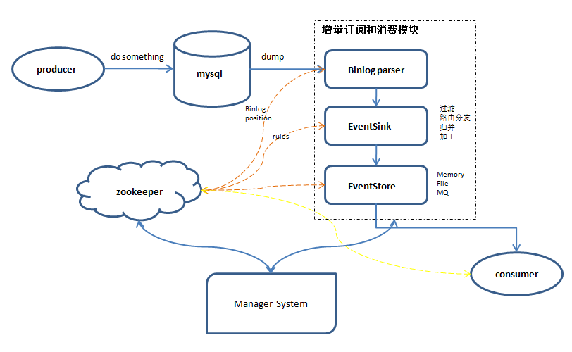

### 简介

canal是阿里巴巴旗下的一款开源项目，纯Java开发。基于数据库增量日志解析，提供增量数据订阅&消费，目前主要支持了mysql（也支持mariaDB）。

原理相对比较简单：

1. canal模拟mysql slave的交互协议，伪装自己为mysql slave，向mysql master发送dump协议
2. mysql master收到dump请求，开始推送binary log给slave(也就是canal)
3. canal 解析binary log对象(原始为byte流)

### 架构设计

- 增量订阅和消费模块应当包括binlog日志抓取，binlog日志解析，事件分发过滤（EventSink），存储（EventStore）等主要模块。
- 如果需要确保HA可以采用Zookeeper保存各个子模块的状态，让整个增量订阅和消费模块实现无状态化，当然作为consumer(客户端)的状态也可以保存在zk之中。
- 整体上通过一个Manager System进行集中管理，分配资源。
  可以参考下图：

- server代表一个canal运行实例，对应于一个jvm
- instance对应于一个数据队列 （1个server对应1..n个instance)

instance模块：

- eventParser (数据源接入，模拟slave协议和master进行交互，协议解析)
- eventSink (Parser和Store链接器，进行数据过滤，加工，分发的工作)
- eventStore (数据存储)
- metaManager (增量订阅&消费信息管理器)

#### EventParser

整个parser过程大致可分为几部：

1. Connection获取上一次解析成功的位置（如果第一次启动，则获取初始制定的位置或者是当前数据库的binlog位点）
2. Connection建立连接，发生BINLOG_DUMP命令
3. Mysql开始推送Binary Log
4. 接收到的Binary Log通过Binlog parser进行协议解析，补充一些特定信息
5. 传递给EventSink模块进行数据存储，是一个阻塞操作，直到存储成功
6. 存储成功后，定时记录Binary Log位置

#### EventSink设计

- 数据过滤：支持通配符的过滤模式，表名，字段内容等
- 数据路由/分发：解决1:n (1个parser对应多个store的模式)
- 数据归并：解决n:1 (多个parser对应1个store)
- 数据加工：在进入store之前进行额外的处理，比如join

#### EventStore

定义了3个cursor

- Put : Sink模块进行数据存储的最后一次写入位置
- Get : 数据订阅获取的最后一次提取位置
- Ack : 数据消费成功的最后一次消费位置