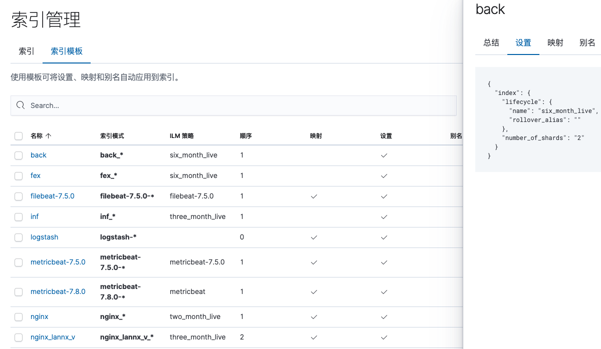

### 一、es 的集群架构，索引数据大小，分片有多少，以及一些调优手段 

**业务日志集群：**4台。

**基础项目指标集群：**3台。机器指标，redis，mysql，PHP—FPM 指标。

**索引数据大小：**几百M ～ 50 gb 不等，400多个索引。

**分片：**根据索引的大小，以及产生的周期（日，月）来分配每个索引的分片，2个或4个，副本分片统一设置为1个。

避免占用过大的磁盘空间。

一个flume实例收集一台机器上的所有业务日志，每一个单独的业务日志数据分配一个 kafka  的 topic，logstash 负责来接收

kafka 各种 topic 里的数据。

并使用 json 解析，正则 grok 解析 ，ruby 脚本解析等解析方法，实现日志数据等格式规范化。

将解析好的数据存储到 es 的索引里，按照日期创建，每天一个或者是每月一个，根据实际的业务每天产生的数据量大小。

一个索引可能只存储了一个业务的日志数据，也可能存储了多个业务数据。这个根据业务日志量的大小，业务类型，业务日志字段是否是差别不大，来决定是否将多个业务日志合并到一个索引里。

#### 调优

索引：

* 根据业务增量需求，采取基于索引模板创建索引，设置索引删除策略来定期删除不需要的索引，释放磁盘空间。
* 通过设置索引模版，在 Mapping 阶段做好字段的类型映射。（nginx 请求，响应时间，映射为 double 类型）。
* 索引分类，相同类型的索引合并到一个索引里。

机器：

* 调整合理的 es java 虚拟机内存
* 内存指针压缩
* 禁用内存交换

### 二、es 如何进行 master 选举

#### Elasticsearch 是如何选举出 master 的

Elasticsearch 的任意一个节点都可以设置 node.master 和 node.data 属性，该属性的意义如下表所示

| master \ data | true                                 | false                                                        |
| ------------- | :----------------------------------- | ------------------------------------------------------------ |
| true          | 既是 Master Eligible，又是 data 节点 | 单纯的 Master Eligible 节点                                  |
| false         | 单纯的 data 节点                     | **纯粹的** Coordinating Node，协调节点负责查询时的数据收集、合并以及聚合等操作，ES 中所有节点都是协调节点 |

在[来自于流行病的 Gossip 协议](https://www.nosuchfield.com/2019/03/12/Gossip-protocol-from-epidemics/)一文中我们已经知道了 Elasticsearch 中所有的节点是如何组成为一个集群的，接下来我们了解 ES 集群中是如何选出 master 的。

#### 选举的基本原则

ES 针对当前集群中所有的 Master Eligible Node 进行选举得到 master 节点，为了避免出现 [Split-brain](https://en.wikipedia.org/wiki/Split-brain) 现象，ES 选择了分布式系统常见的 quorum（多数派）思想，也就是只有获得了超过半数选票的节点才能成为 master。在 ES 中使用 `discovery.zen.minimum_master_nodes` 属性设置 quorum，这个属性一般设置为 `eligibleNodesNum / 2 + 1`。

#### 如何触发一次选举

当满足如下条件是，集群内就会发生一次 master 选举

1. 当前 master eligible 节点不是 master
2. 当前 master eligible 节点与其它的节点通信无法发现 master
3. 集群中无法连接到 master 的 master eligible 节点数量已达到 `discovery.zen.minimum_master_nodes` 所设定的值

#### 如何选举

当某个节点决定要进行一次选举是，它会实现如下操作

1. 寻找 clusterStateVersion 比自己高的 master eligible 的节点，向其发送选票
2. 如果 clusterStatrVersion 一样，则计算自己能找到的 master eligible 节点（包括自己）中节点 id 最小的一个节点，向该节点发送选举投票
3. 如果一个节点收到足够多的投票（即 `minimum_master_nodes` 的设置），并且它也向自己投票了，那么该节点成为 master 开始发布集群状态

下面我们用一个实际的例子来解释选举流程，假设有 node_a 和 node_b，node_a 向 node_b 发送选票。

- 如果 node_b 已经是 master，则 node_b 就把 node_a 加入集群，之后 node_b 发布最新的集群状态，此时 node_a 会被包含在最新的集群状态里面。
- 如果 node_b 正在进行选举，则 node_b 会把这次投票记录下来，之后 node_b 可能成为 master 或者继续等待选票。node_a 等待 node_b 发送最新的集群状态或者超时触发下一次投票。
- 如果 node_b 认为自己不会成为 master，则拒绝这次投票，node_a 将触发下一次投票。

#### 其它的选举办法

##### Zookeeper

事实上 ES 可以使用 Zookeeper 来进行 master 选举，方法如下

- 所有 master eligible 尝试在 zk 上创建指定路径
- 只有第一个节点能创建成功，该节点成为 master，其余节点 watch 此路径
- 一旦 zk 失去 master 的连接，该路径被删除，其余 master eligible 继续尝试创建路径，同样只能有一个节点成功创建并成为 master
- 重复以上步骤

Zookeeper 来实现选主可以使得 ES 内部的选举算法变得非常的简单，至于为什么 ES 要自己发明一套轮子就不是很清楚了。

##### Raft

ES 本身的选举算法在早期还是比较粗糙的，这些年来也在不断改进中。Raft 算法本身经过严格的论证，是一种非常优秀的一致性算法，至于 ES 没有选择使用 Raft 而是自己发明了一套选举算法的原因则很简单，因为 ES 早期版本的时候 Raft 算法还没有被提出来，不过我认为随着 ES 的发展应该会更多的参考这些已经经过严格论证的选举算法。

Raft 作为一种分布式一致性协议，其本身不止描述了**选举过程**，还提供了**日志同步**与**安全性**的相关行为的描述。