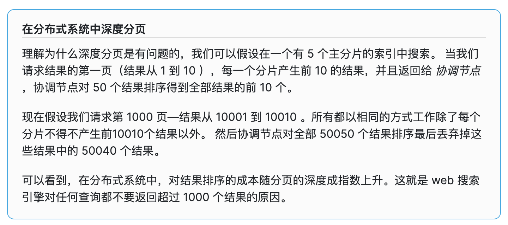

### 多shard 下是如何进行查询？

 

```
一个 CRUD 操作只对单个文档进行处理，文档的唯一性由 _index, _type, 和 routing values （通常默认是该文档的 _id ）的组合来确定。 这表示我们确切的知道集群中哪个分片含有此文档。
搜索需要一种更加复杂的执行模型因为我们不知道查询会命中哪些文档: 这些文档有可能在集群的任何分片上。 一个搜索请求必须询问我们关注的索引（index or indices）的所有分片的某个副本来确定它们是否含有任何匹配的文档。
但是找到所有的匹配文档仅仅完成事情的一半。 在 search 接口返回一个 page 结果之前，多分片中的结果必须组合成单个排序列表。 为此，搜索被执行成一个两阶段过程，我们称之为 query then fetch
```

 

 

### 1、查询阶段


```
客户端发送一个 search 请求到 Node 3， Node 3 会创建一个大小为 from + size 的空优先队列。

Node 3 将查询请求转发到索引的每个主分片或副本分片中。每个分片在本地执行查询并添加结果到大小为 from + size 的本地有序优先队列中。 每个分片返回各自优先队列中所有文档的 ID 和排序值给协调节点，也就是 Node 3 ，它合并这些值到自己的优先队列中来产生一个全局排序后的结果列表。 当一个搜索请求被发送到某个节点时，这个节点就变成了协调节点。 

这个节点的任务是广播查询请求到所有相关分片并将它们的响应整合成全局排序后的结果集合。 第一步是广播请求到索引中每一个节点的分片， 查询请求可以被某个主分片或某个副本分片处理， 这就是为什么更多的副本（当结合更多的硬件）能够增加搜索吞吐率。 

协调节点将在之后的请求中轮询所有的分片拷贝来分摊负载。 每个分片在本地执行查询请求并且创建一个长度为 from + size 的优先队列—也就是说，每个分片创建的结果集足够大，均可以满足全局的搜索请求。 分片返回一个轻量级的结果列表到协调节点，它仅包含文档 ID 集合以及任何排序需要用到的值，例如 _score 。协调节点将这些分片级的结果合并到自己的有序优先队列里，它代表了全局排序结果集合。至此查询过程结束。
```

 

### 2、获取文档阶段

 

```
分布式阶段由以下步骤构成： 协调节点根据优先队列中的文档id，向相关的分片提交多个 GET 请求``每个分片加载并 丰富 文档，如果有需要的话，接着返回文档给协调节点。 一旦所有的文档都被取回了，协调节点返回结果给客户端。协调节点首先决定哪些文档 确实 需要被取回。例如，如果我们的查询指定了 { "from" : 90, "size": 10 } ，最初的 90 个结果会被丢弃，只有从第 91 个开始的 10 个结果需要被取回。这些文档可能来自和最初搜索请求有关的一个、多个甚至全部 分片。协调节点给持有相关文档的每个分片创建一个 multi-get request ，并发送请求给同样处理查询阶段的分片副本。 分片加载文档体-- _source 字段--如果有需要，用元数据和 search snippet highlighting 丰富结果文档。 一旦协调节点接收到所有的结果文档，它就组装这些结果为单个响应返回给客户端。
```

 

### ES 深分页问题



#### 解决方案

**scroll游标**

> scroll 具体分爲初始化和遍历两步

> 初始化时将所有符合搜索条件的搜索结果缓存起来，可以想象成快照

> 在遍历时，从这个快照里取数据

> 也就是说，在初始化后对索引插入、删除、更新数据都不会影响遍历结果


在URL中的search后加上scroll=1m，不能写在request body中，其中1m表示这个游标要保持开启1分钟。

request body和一般搜索一样，因此可以说在初始化的过程中，除了加上scroll设置游标开启时间之外，其他的都跟一般的搜寻没有两样 (要设置查询条件，也会回传前size笔的数据)。

```
POST 127.0.0.1:9200/my_index/_search?scroll=1m `注意这里的地址`
{
    "query":{
        "range":{
            "createTime": {
                "gte": 1522229999999
            }
        }
    },
    "size": 1000
}
```

使用初始化返回的 \_scroll_id 来进行请求，每一次请求都会继续返回初始化中未读完数据，并且会返回一个 \_scroll_id，这个_scroll_id可能会改变，因此每一次请求应该带上上一次请求返回的 _scroll_id


**search_after**

from + size的分页方式虽然是最灵活的分页方式，但是当分页深度达到一定程度将会产生深度分页的问题。scroll能够解决深度分页的问题，但是其无法实现实时查询，即当scroll_id生成后无法查询到之后数据的变更，因为其底层原理是生成数据的快照。这时 search_after应运而生。其是在es-5.X之后才提供的。

search_after 是一种假分页方式，根据上一页的最后一条数据来确定下一页的位置，同时在分页请求的过程中，如果有索引数据的增删改查，这些变更也会实时的反映到游标上。为了找到每一页最后一条数据，每个文档必须有一个全局唯一值，官方推荐使用 _uid 作为全局唯一值，但是只要能表示其唯一性就可以。

下一次分页，需要将上述分页结果集的最后一条数据的值带上。

```
 1 GET /student/student/_search
 2 {
 3   "query":{
 4     "match_all": {}
 5   },
 6   "size":2,
 7   "search_after":[1005],
 8   "sort":[
 9     {
10       "uid": "desc"
11     }  
12   ]
13 }
```