## 图解ElasticSearch

**云上的集群**

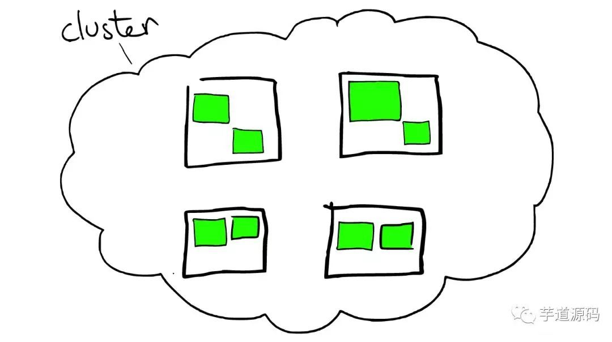

**集群里的盒子**

云里面的每个白色正方形的盒子代表一个节点——Node。

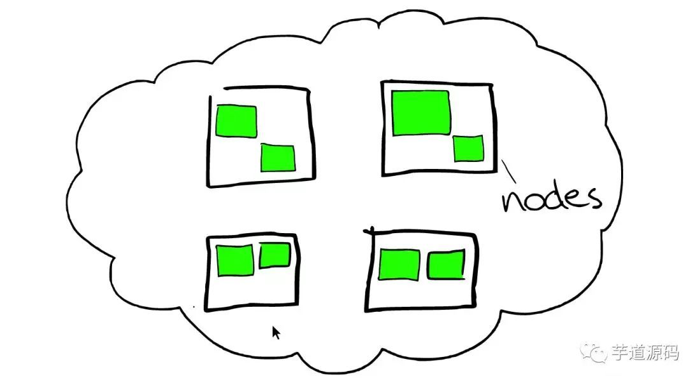

**节点之间**

在一个或者多个节点直接，多个绿色小方块组合在一起形成一个ElasticSearch的索引。

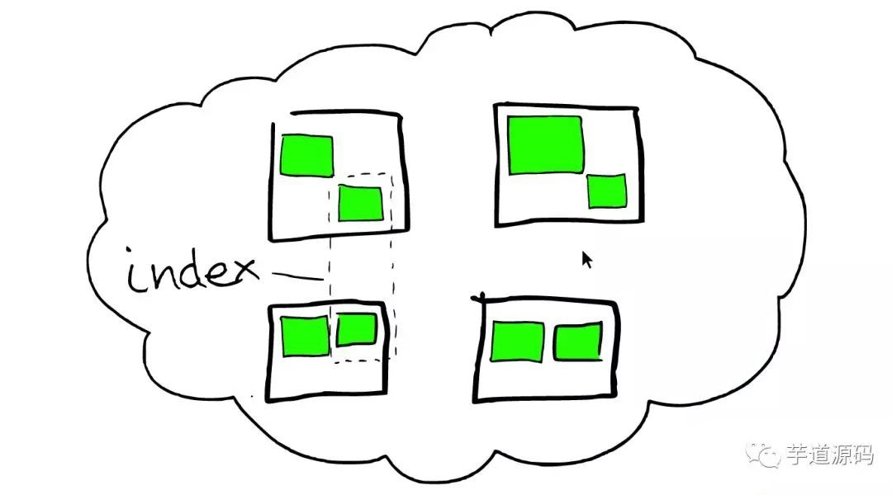

**索引里的小方块**

在一个索引下，分布在多个节点里的绿色小方块称为分片——Shard。

**Shard＝Lucene Index**

一个ElasticSearch的Shard本质上是一个Lucene Index。

Lucene是一个Full Text搜索库（也有很多其他形式的搜索库），ElasticSearch是建立在Lucene之上的。接下来的故事要说的大部分内容实际上是ElasticSearch如何基于Lucene工作的。

## 图解Lucene

**Mini索引——segment**

在Lucene里面有很多小的segment，我们可以把它们看成Lucene内部的mini-index。

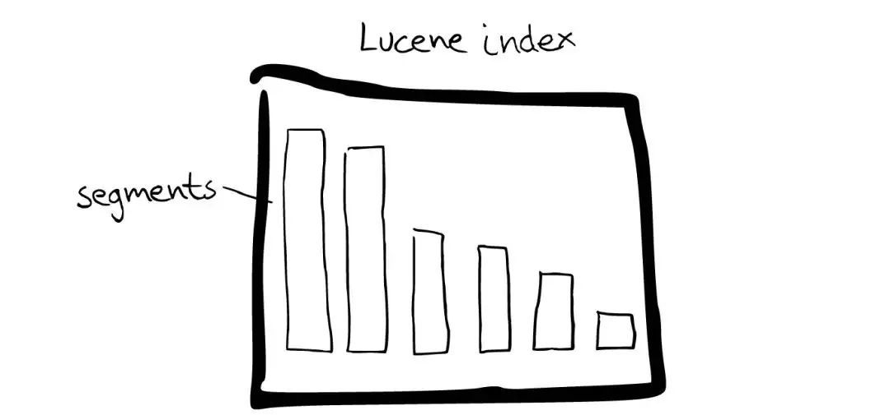

**Segment内部**

有着许多数据结构

- Inverted Index
- Stored Fields
- Document Values
- Cache

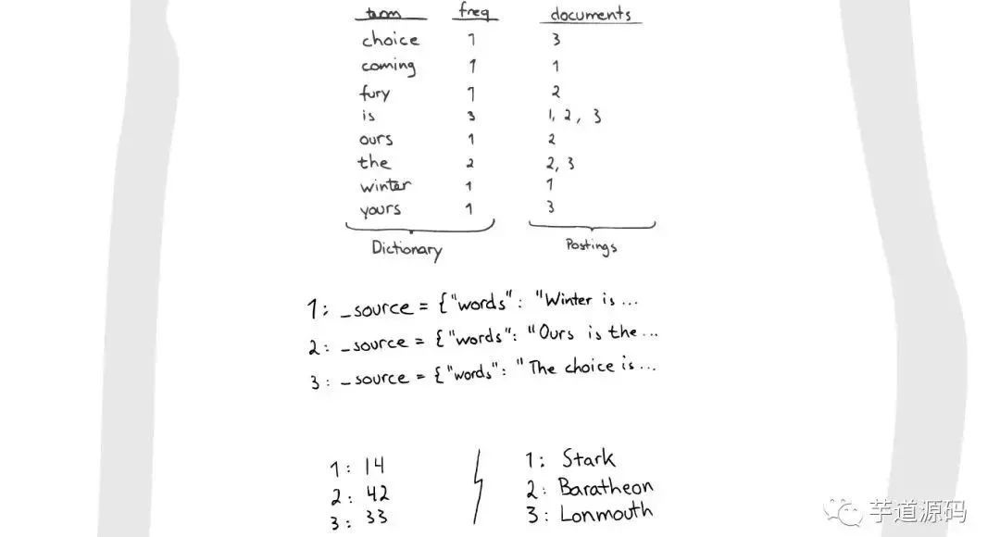

**最最重要的Inverted Index**

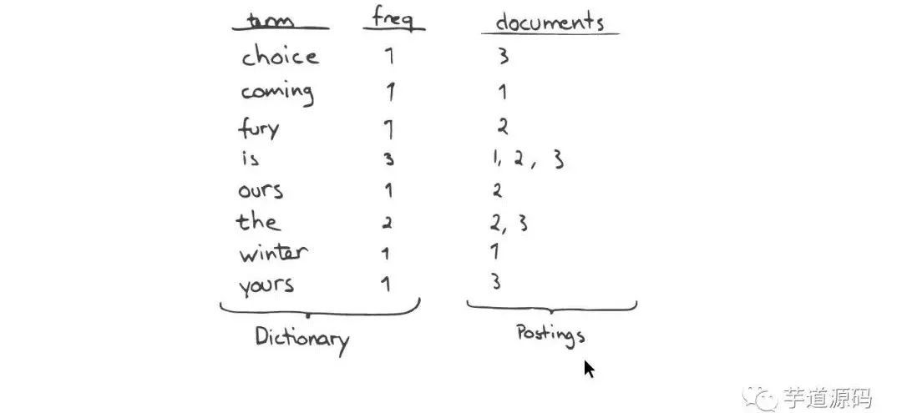

Inverted Index主要包括两部分：

- 一个有序的数据字典Dictionary（包括单词Term和它出现的频率）。
- 与单词Term对应的Postings（即存在这个单词的文件 id）。

当我们搜索的时候，首先将搜索的内容分解，然后在字典里找到对应Term，从而查找到与搜索相关的文件内容。

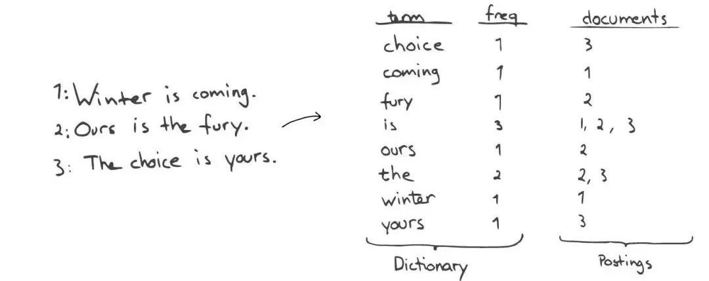

**查询“the fury”**

**自动补全（AutoCompletion-Prefix）**

如果想要查找以字母“c”开头的字母，可以简单的通过二分查找（Binary Search）在Inverted Index表中找到例如“choice”、“coming”这样的词（Term）。

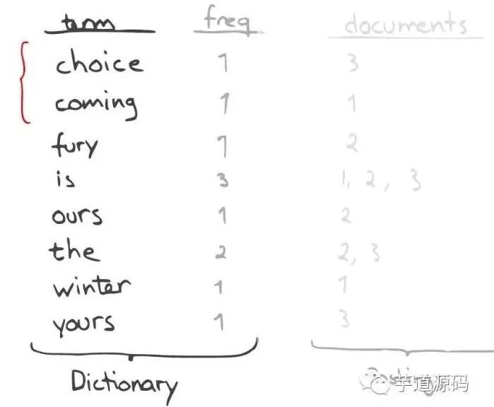

**昂贵的查找**

如果想要查找所有包含“our”字母的单词，那么系统会扫描整个Inverted Index，这是非常昂贵的。

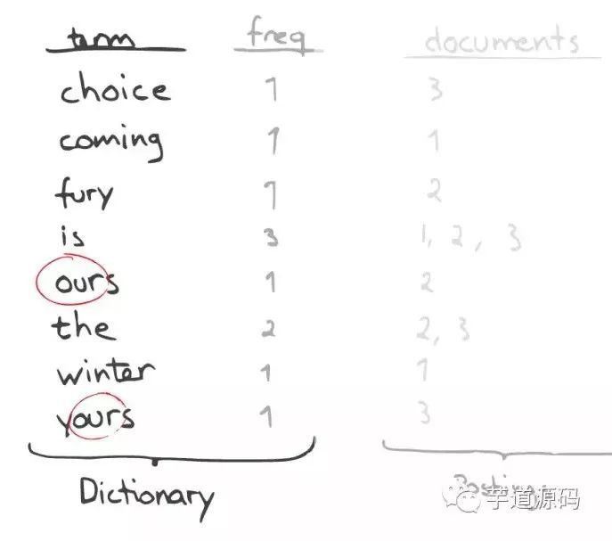

在此种情况下，如果想要做优化，那么我们面对的问题是如何生成合适的Term。

**解决拼写错误**

一个Python库：为单词生成了一个包含错误拼写信息的树形状态机，解决拼写错误的问题。

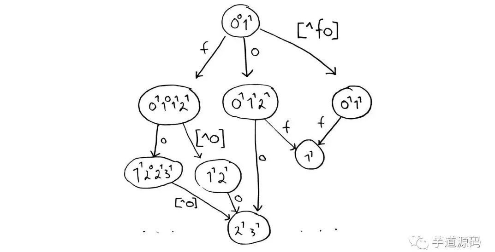

**Stored Field字段查找**

当我们想要查找包含某个特定标题内容的文件时，Inverted Index就不能很好的解决这个问题，所以Lucene提供了另外一种数据结构Stored Fields来解决这个问题。本质上，Stored Fields是一个简单的键值对key-value。默认情况下，ElasticSearch会存储整个文件的JSON source。

**Document Values为了排序，聚合**

即使这样，我们发现以上结构仍然无法解决诸如：排序、聚合、facet，因为我们可能会要读取大量不需要的信息。

所以，另一种数据结构解决了此种问题：Document Values。这种结构本质上就是一个列式的存储，它高度优化了具有相同类型的数据的存储结构。

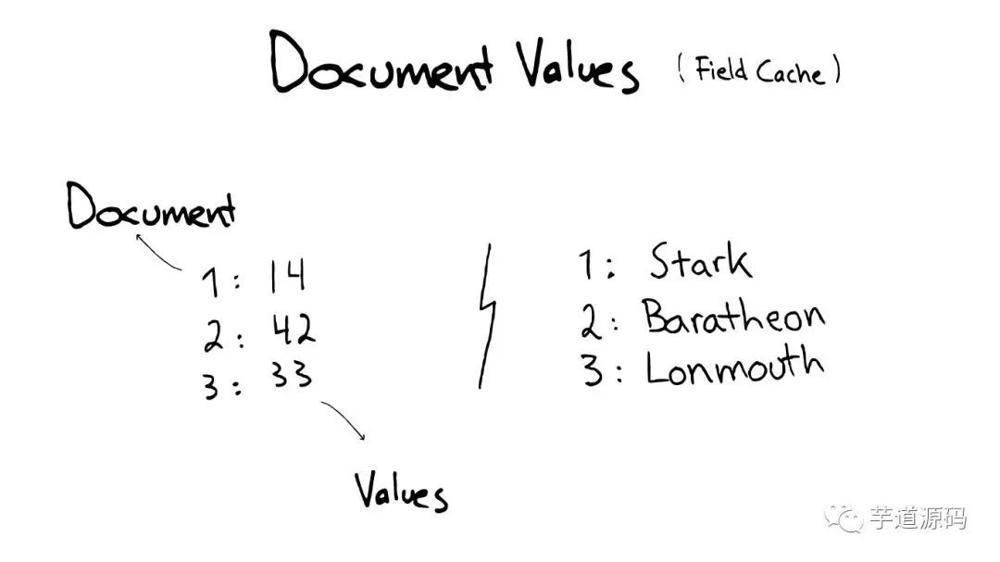

为了提高效率，ElasticSearch可以将索引下某一个Document Value全部读取到内存中进行操作，这大大提升访问速度，但是也同时会消耗掉大量的内存空间。

总之，这些数据结构Inverted Index、Stored Fields、Document Values及其缓存，都在segment内部。

**3、搜索发生时**

搜索时，Lucene会搜索所有的segment然后将每个segment的搜索结果返回，最后合并呈现给客户。

Lucene的一些特性使得这个过程非常重要：

- Segments是不可变的（immutable）。
- Delete？当删除发生时，Lucene做的只是将其标志位置删除，但是文件还是会在它原来的地方，不会发生改变。
- Update? 所以对于更新来说，本质上它做的工作是：先删除，然后重新索引（Re-index）。
- 随处可见的压缩：Lucene非常擅长压缩数据，基本上所有教科书上的压缩方式，都能在Lucene中找到。
- 缓存所有的所有：Lucene也会将所有的信息做缓存，这大大提高了它的查询效率。

**4、缓存的故事**

当ElasticSearch索引一个文件的时候，会为文件建立相应的缓存，并且会定期（每秒）刷新这些数据，然后这些文件就可以被搜索到。

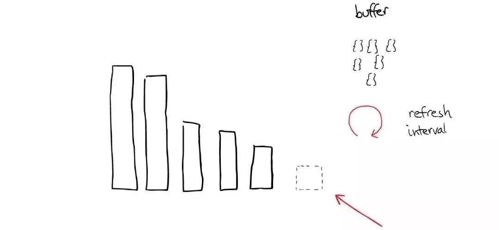

随着时间的增加，我们会有很多segments：

所以ElasticSearch会将这些segment合并，在这个过程中，segment会最终被删除掉：

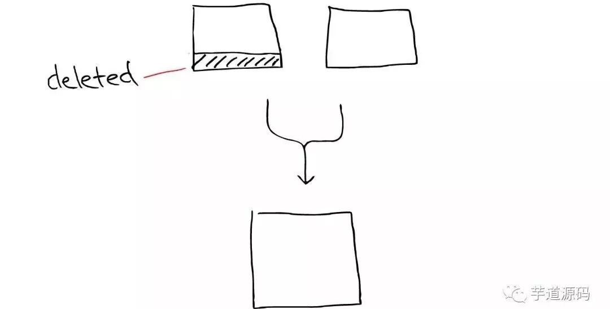

这就是为什么增加文件可能会使索引所占空间变小，它会引起merge，从而可能会有更多的压缩。

**举个例子**

有两个segment将会merge：

这两个segment最终会被删除，然后合并成一个新的segment：

这时这个新的segment在缓存中处于cold状态，但是大多数segment仍然保持不变，处于warm状态。

以上场景经常在Lucene Index内部发生的。

**5、在Shard中搜索**

ElasticSearch从Shard中搜索的过程与Lucene Segment中搜索的过程类似。

与在Lucene Segment中搜索不同的是，Shard可能是分布在不同Node上的，所以在搜索与返回结果时，所有的信息都会通过网络传输。

需要注意的是：1次搜索查找2个Shard=2次分别搜索Shard。

**对于日志文件的处理**

当我们想搜索特定日期产生的日志时，通过根据时间戳对日志文件进行分块与索引，会极大提高搜索效率。

当我们想要删除旧的数据时也非常方便，只需删除老的索引即可。

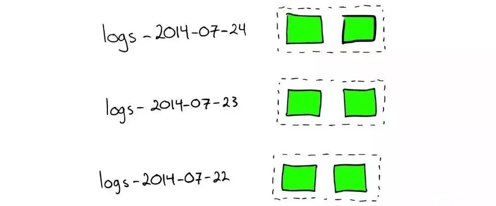

在上种情况下，每个Index有两个shards。

**6、如何Scale**

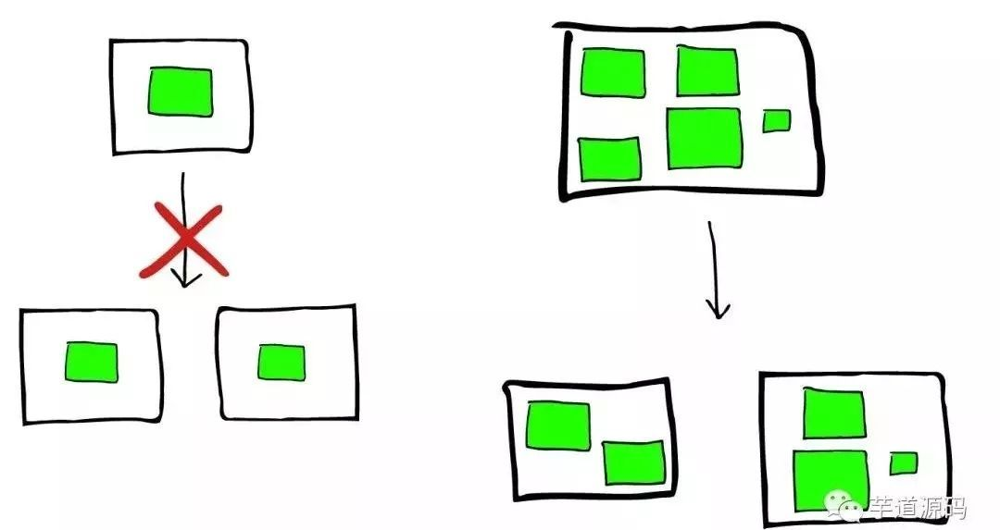

Shard不会进行更进一步的拆分，但是Shard可能会被转移到不同节点上：

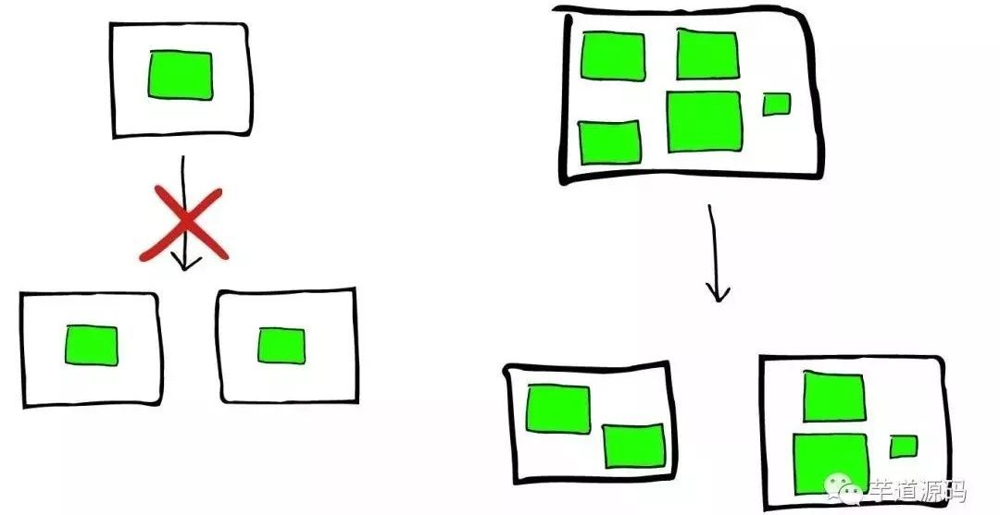

所以，如果当集群节点压力增长到一定的程度，我们可能会考虑增加新的节点，这就会要求我们对所有数据进行重新索引，这是我们不太希望看到的，所以我们需要在规划的时候就考虑清楚，如何去平衡足够多的节点与不足节点之间的关系。

**节点分配与Shard优化**

- 为更重要的数据索引节点，分配性能更好的机器。
- 确保每个Shard都有副本信息replica。

**路由Routing**

每个节点，每个都存留一份路由表，所以当请求到任何一个节点时，ElasticSearch都有能力将请求转发到期望节点的Shard进一步处理。

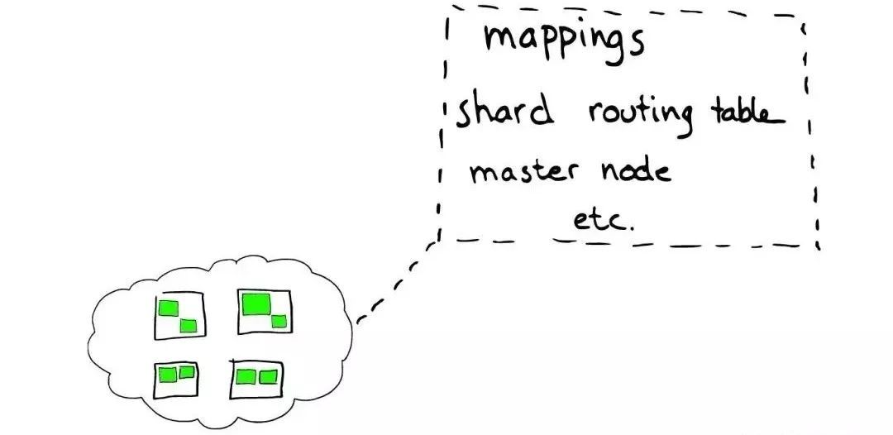

**7、一个真实的请求**

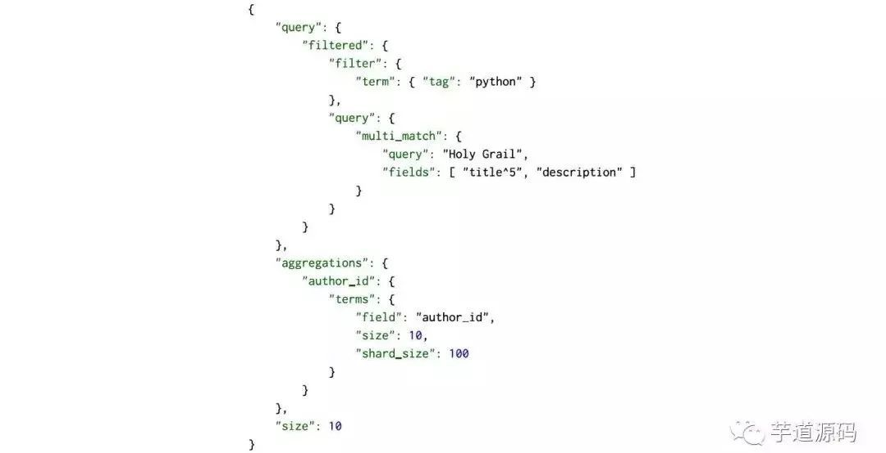

**Query**

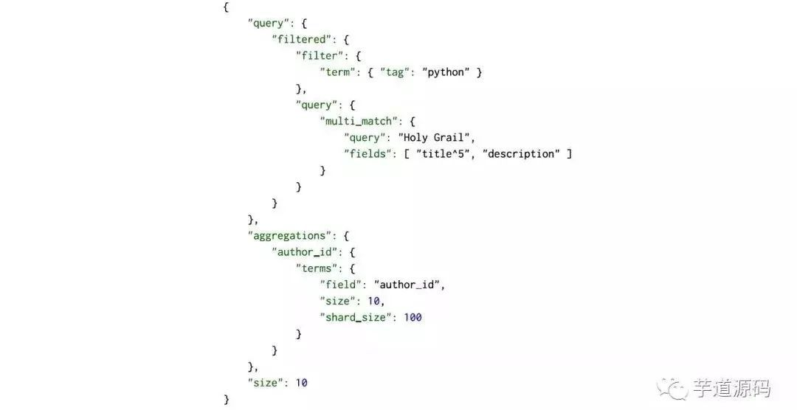

Query有一个类型filtered，以及一个multi_match的查询。

**Aggregation**

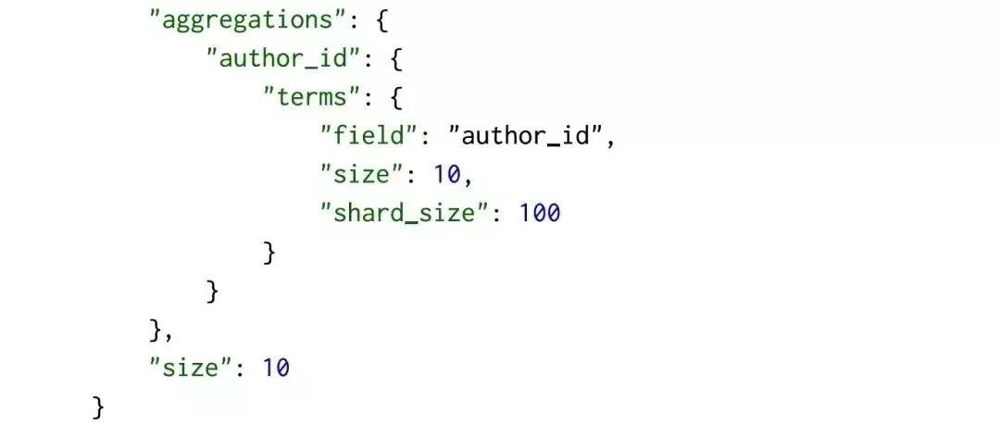

根据作者进行聚合，得到top10的hits的top10作者的信息。

**请求分发**

这个请求可能被分发到集群里的任意一个节点。

**上帝节点**

这时这个节点就成为当前请求的协调者（Coordinator），它决定：

- 根据索引信息，判断请求会被路由到哪个核心节点。
- 以及哪个副本是可用的。
- 等等。

**路由**

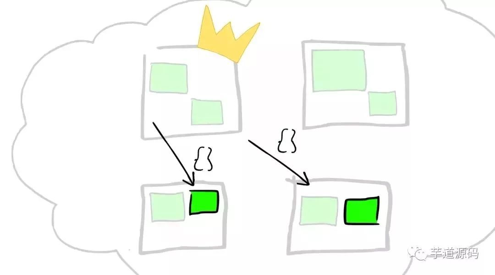

**在真实搜索之前**

ElasticSearch会将Query转换成Lucene Query：

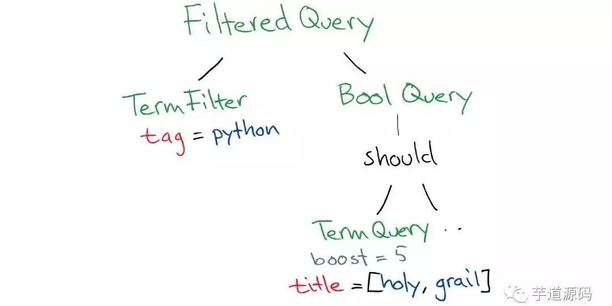

然后在所有的segment中执行计算：

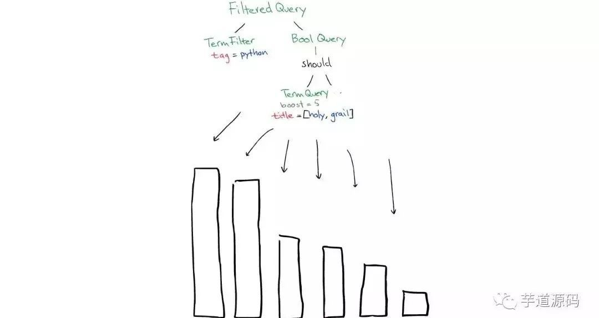

对于Filter条件本身也会有缓存：

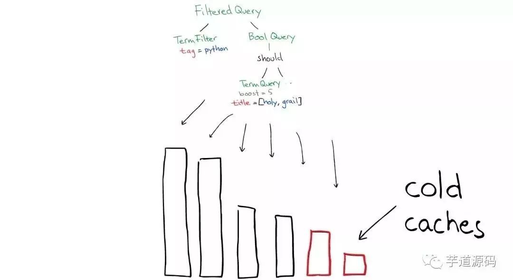

但Queries不会被缓存，所以如果相同的Query重复执行，应用程序自己需要做缓存：

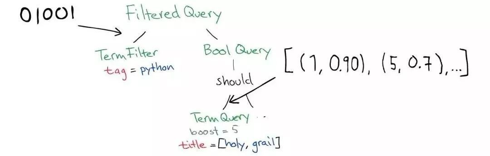

所以，

- Filters可以在任何时候使用；
- Query只有在需要score的时候才使用。

**返回**

搜索结束之后，结果会沿着下行的路径向上逐层返回。

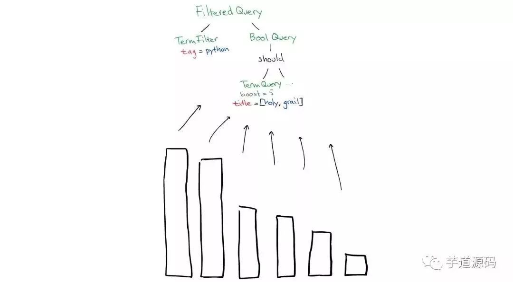

