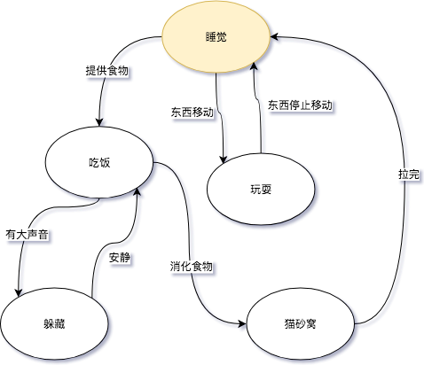
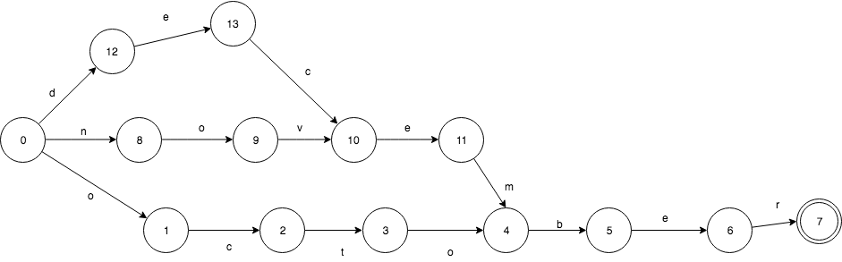
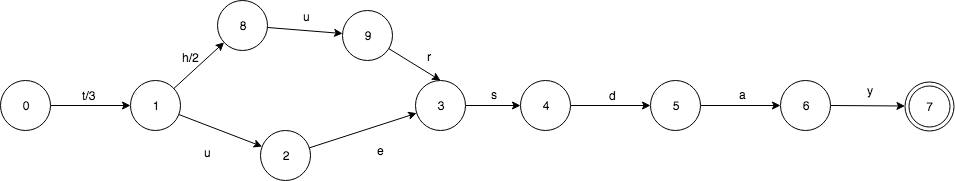
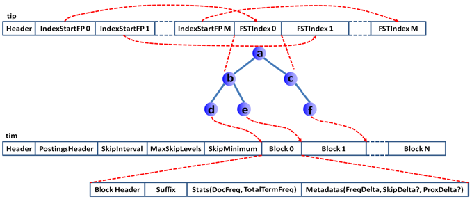

## Lucene 实现倒排索引的数据结构

#### 搜索引擎为什么能查询速度那么快？

核心是在于如何快速的依据**查询词**快速的查找到所有的相关文档，这也是**倒排索引（Inverted Index）**的核心思想。

开源的搜索引擎包Lucene 采用了一种称为FST（Finite State Transducer）的结构来构建词典，这个结构保证了时间和空间复杂度的均衡，是Lucene的核心功能之一。


#### FSM (Finite State Machines)

**FSM(Finite State Machines)有限状态机**:  表示有限个状态（State）集合以及这些状态之间**转移**和动作的数学模型。

一个FSM同一时间只处于1个状态。FSM很通用，可以用来表示多种处理过程，下面的FSM描述了《小猫咪的一天》。



其中“睡觉”或者“吃饭”代表的是**状态**,而“提供食物”或者“东西移动”则代表了**转移**。


#### FSA（Finite state acceptor）

FSA（Finite state acceptor）有限状态接收机。**可以用来实现有序集合 Ordered Sets。**

FSA是一个FSM(有限状态机)的一种，特性如下:

- 确定：意味着指定任何一个状态，只可能最多有一个转移可以访问到。
- 无环： 不可能重复遍历同一个状态
- 接收机：有限状态机只“接受”特定的输入序列，并终止于final状态。

下面来看，我们如何来表示只有一个key：”**jul**“ 的集合。FSA是这样的：


下面来看一下由“october”，“november”,”december”构成的FSA：




它们有共同的后缀“ber”，所以在FSA只出现了1次。 其中2个有共同的后缀”ember”，也只出现了1次。


#### FST （Finite state transducer）

FST 有限状态转换机。可以来实现一个 Ordered maps，它就像一个普通的map，只不过它的key是有序的。

FST是也一个有限状态机（FSM）,具有这样的特性：

- 确定：意味着指定任何一个状态，只可能最多有一个转移可以遍历到。
- 无环： 不可能重复遍历同一个状态
- transducer：接收特定的序列，终止于final状态，同时会**输出一个值**。


FST和FSA很像，给定一个key除了能回答是否存在，还能输出一个**关联的值**。

下面来看这样的一个输入：“jul:7”, 7是jul关联的值，就像是一个map的entry：


在 FST 中：每一个key,都在FST中对应一个唯一的路径。因此，对于任何一个特定的key，总会有一些value的转移组合使得路径是唯一的。我们需要做的就是如何来在转移中**分配**这些组合。

key输出的共享机制同样适用于共同前缀和共同后缀。比如我们有 tuesday:3 和 thursday:5 这样的FST:




2个key有共同的前缀 **t**，共同后缀 **sday**。关联的2个value同样有共同的前缀。3可以写做**3+0**，而5可以写作：**3+2**。 这样很好的让实现了关联value的共享。


### 总结

FST，不但能**共享前缀**还能**共享后缀**。不但能判断查找的key是否存在，还能给出响应的输入output。 它在时间复杂度和空间复杂度上都做了最大程度的优化，使得Lucene能够将Term Dictionary完全加载到内存，快速的定位Term找到响应的output（posting倒排列表）。


## Lucene 倒排索引实现原理


#### 1、传统 HashMap 实现

数据结构：Map<String, List<Integer>>

Map的Key的即是**Term**，那它的Value即是**Postings**。所以它的Key的集合即是**Dictionary**。


问题：

全文搜索引擎通常是需要存储大量的文本，Postings可能会占据大量的存储空间，同样Dictionary也可能是非常大的，因此上面说的基于HashMap的实现方式几乎是不可行的。


#### 2、Lucene的实现

##### 1、Lucene索引文件构成

Lucene将索引文件拆分为了多个文件，下面仅讨论倒排索引部分。

Lucene把用于存储Term的索引文件叫Terms Index，它的后缀是`.tip`；

Terms Dictionary的文件后缀称为`.tim`，它记录了Term与Postings的关系，比如说 DocId 信息和 Term 的词频。

通过Terms Index(.tip)能够快速地在Terms Dictionary(.tim)中找到你的想要的Term，以及它对应的Postings文件指针。


##### 2、什么是Terms Index




Terms Index即为上图中.tip部分，它实际上是由一个或多个`FST`组成的，Segment上每个字段都有自己的一个FST（FSTIndex）记录在`.tip`上，所以图中FSTIndex的个数即是Segment拥有字段的个数。另外图中为了方便我们理解把FST画成Trie结构，然后其叶子节点又指向了tim的Block的，这实际上是用了一种叫Burst-Trie的数据结构。


**Trie：**TRIE可以看做是一个FSA,唯一的一个不同是TRIE只共享前缀，而FSA不仅共享前缀还共享后缀。


**Burst-Trie：**Burst-Trie可以认为是Trie的一种变种，它主要是将后缀进行了压缩，降低了Trie的高度，从而获取更好查询性能。

Trie的叶子节点是Container（即是Lucene中的Block）。

**Burst-Trie 包含 两个结构：**AccessTree 和 Container

​	AccessTree 的实现是FST，存在.tip文件中；

​	Container 的实现是Block，存在 .tim 文件中；


Lucene的block是数组。

Lucene中的Block：里面存储的是  term ，包括 Postings 文件指针等信息。


##### 3、FST 查找的过程

FST不能知道某个Term在Dictionary(.tim)文件上具体的位置，也不能仅通过FST就能确切的知道Term是否真实存在。它只能告诉你，查询的Term可能在这些Blocks（.tip ）上，到底存不存在FST并不能给出确切的答案，**因为FST是通过Dictionary的每个Block的前缀构成查找某个 Block 的，所以通过FST只可以直接找到这个Block在.tim文件上具体的File Pointer**，并无法直接找到Terms。

然后再在 Blocks（.tip ）上找到具体的 Term，以及 Postings 文件指针等信息。


#### 3、Postings 文件格式

整个Postings被拆成三个文件存储，实际上它们之间也是相对独立的。基本所有的查询都会用.doc，且一般的Query仅需要用到.doc文件就足够了；近似查询则需要用.pox；.pay则是用于Payloads搜索。

**.doc到底存储的关键信息：**


TermFreqs：存储了Postings最核心的内容，DocID和TermFreq，分别表示文档号和对应的词频。

SkipData：是为TermFreqs构建的跳表结构。


**TermFreqs采用的是混合存储**，由Packed Blocks和VInt Blocks两种结构组成。

PackedBlock：

PackedBlock 是定长的，当前Lucene默认是128个`Integers`。所以在不满128个值的时候，Lucene采用VIntBlocks结构存储。需要注意的是当用Packed Blocks结构时，DocID和TermFreq是分开存储的，各自将128个值写入到一个Block。

```
例如，在同一个Segment里，某一个Term A在259个文档同一个字段出现，那么Term A就需要把这259个文档的文档编号和Term A在每个文档出现的频率一同记下来存储在.doc。
此时，Lucene需要用到2个PackedBlocks和3个VIntBlocks来存储它们。（2 * 128 + 3）
```


VInt Blocks ：

结构相对复杂一些，它以一种巧妙的方式存储复杂的多元组结构。在.doc文件中，用VIntBlock存储DocID和TermFreqs二元组。


