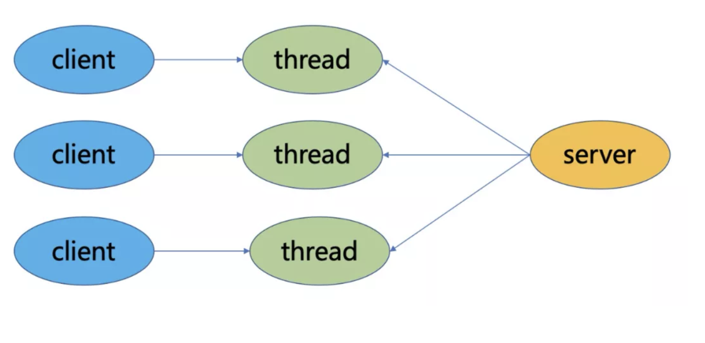
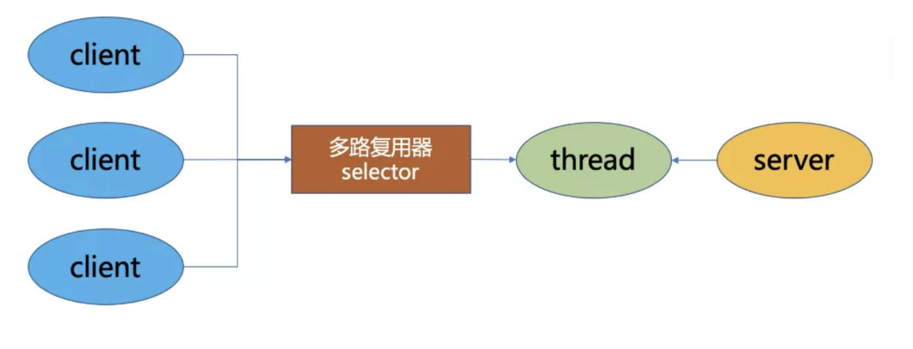
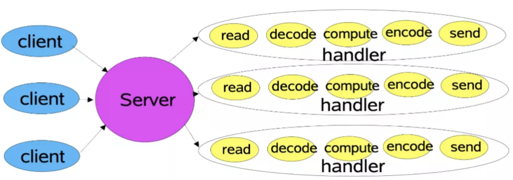
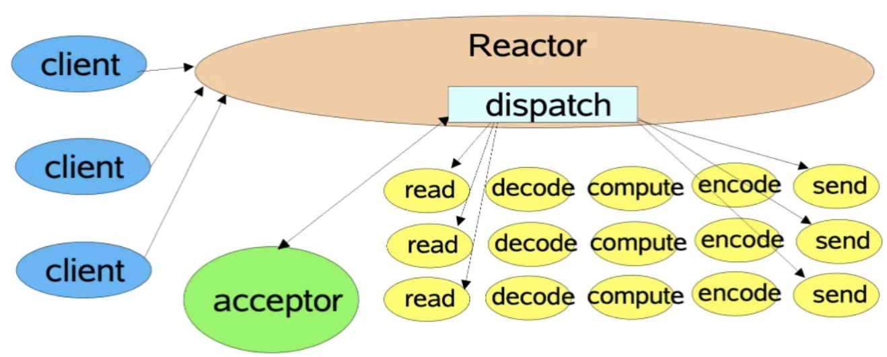
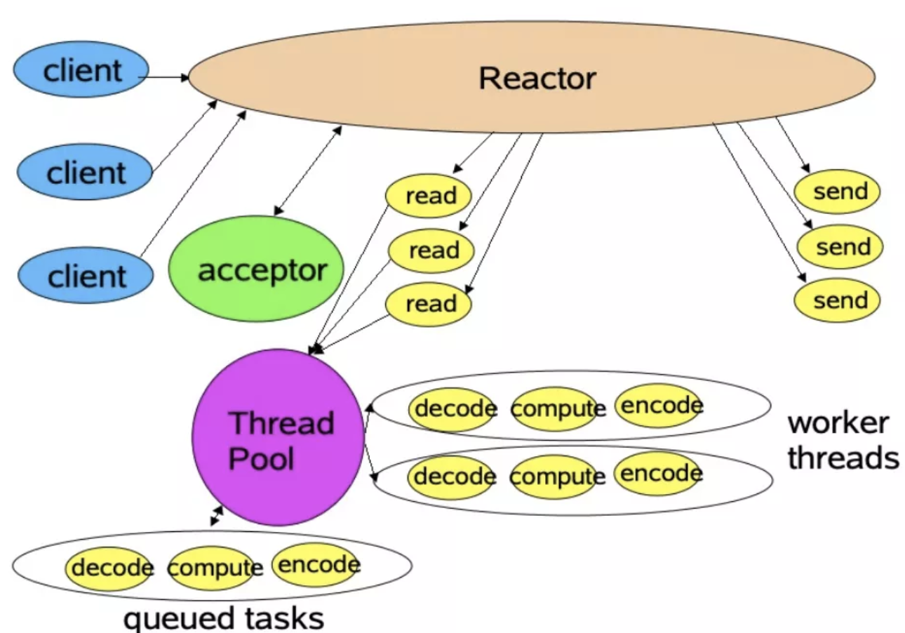
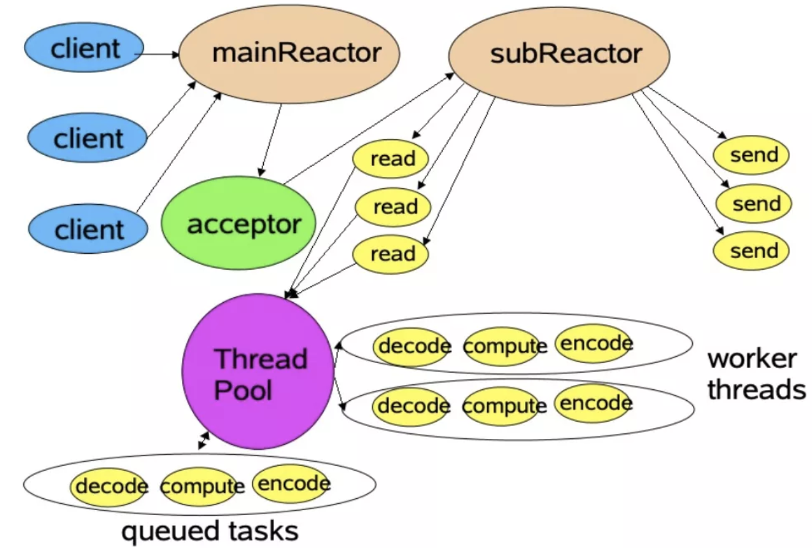
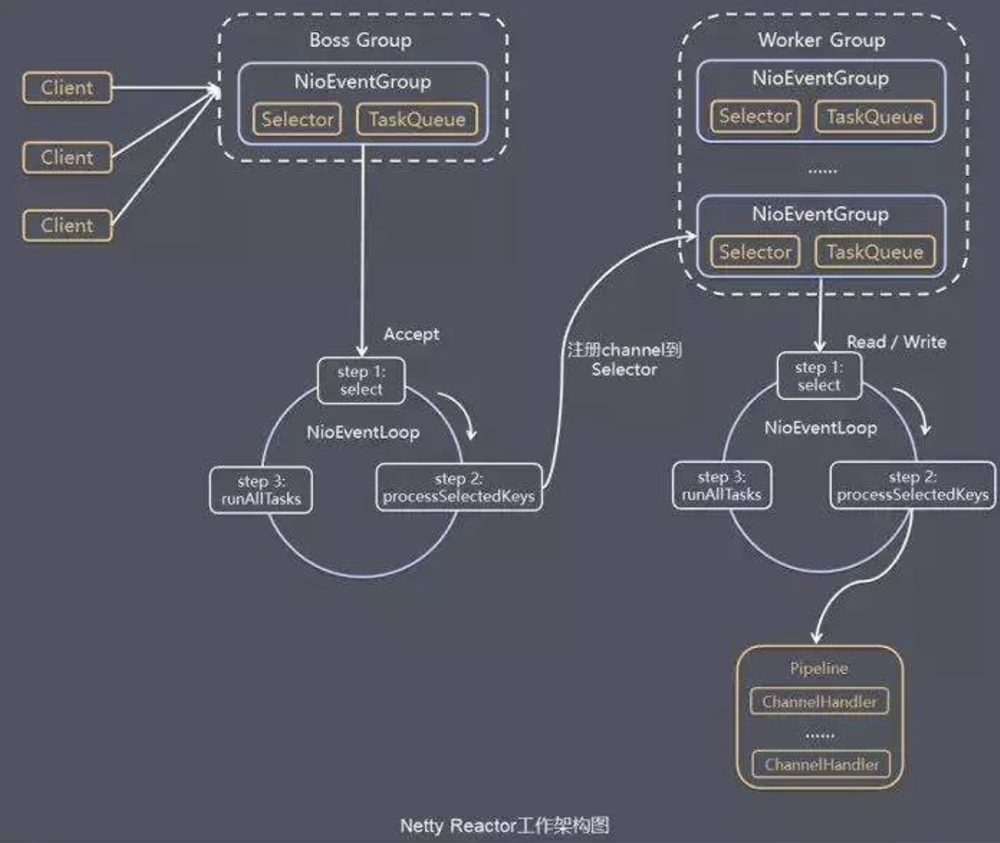
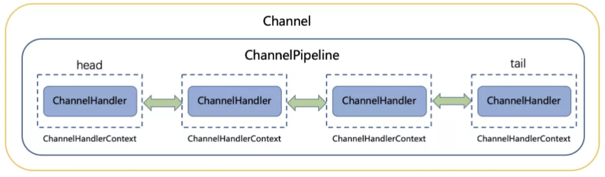

### JAVA IO 模型

#### BIO（Blocking IO）

BIO是同步阻塞模型，一个客户端连接对应一个处理线程。在BIO中，accept和read方法都是阻塞操作，如果没有连接请求，accept方法阻塞；如果无数据可读取，read方法阻塞。

#### NIO（Non Blocking IO）

NIO是同步非阻塞模型，服务端的一个线程可以处理多个请求，客户端发送的连接请求注册在多路复用器Selector上，服务端线程通过轮询多路复用器查看是否有IO请求，有则进行处理。

NIO的三大核心组件：

Buffer：用于存储数据，底层基于数组实现，针对8种基本类型提供了对应的缓冲区类。

Channel：用于进行数据传输，面向缓冲区进行操作，支持双向传输，数据可以从Channel读取到Buffer中，也可以从Buffer写到Channel中。

Selector：选择器，当向一个Selector中注册Channel后，Selector 内部的机制就可以自动不断地查询（Select）这些注册的Channel是否有已就绪的 I/O 事件（例如可读，可写，网络连接完成等），这样程序就可以很简单地使用一个线程高效地管理多个Channel，也可以说管理多个网络连接，因此，Selector也被称为多路复用器。当某个Channel上面发生了读或者写事件，这个Channel就处于就绪状态，会被Selector监听到，然后通过SelectionKeys可以获取就绪Channel的集合，进行后续的I/O操作。

Epoll是Linux下多路复用IO接口select/poll的增强版本，它能显著提高程序在大量并发连接中只有少量活跃的情况下的系统CPU利用率，获取事件的时候，它无须遍历整个被侦听的描述符集，只要遍历那些被内核IO事件异步唤醒而加入Ready队列的描述符集合就行了。

#### AIO（NIO 2.0）

AIO是异步非阻塞模型，一般用于连接数较多且连接时间较长的应用，在缓冲区就绪后由回调服务来进行处理。与NIO不同，当进行读写操作时，只需直接调用read或write方法即可。这两种方法均为异步的。异步非阻塞IO让内核系统完成，用户线程只需要告诉内核，当缓冲区就绪后，通知我或者执行我交给你的回调函数。在 linux 系统上底层使用 epoll 实现。

### I/O模型演化

#### 传统I/O模型

对于传统的I/O通信方式来说，客户端连接到服务端，服务端接收客户端请求并响应的流程为：读取 -> 解码 -> 应用处理 -> 编码 -> 发送结果。服务端为每一个客户端连接新建一个线程，建立通道，从而处理后续的请求，也就是BIO的方式。

这种方式在客户端数量不断增加的情况下，对于连接和请求的响应会急剧下降，并且占用太多线程浪费资源，线程数量也不是没有上限的，会遇到各种瓶颈。虽然可以使用线程池进行优化，但是依然有诸多问题，比如在线程池中所有线程都在处理请求时，无法响应其他的客户端连接，每个客户端依旧需要专门的服务端线程来服务，即使此时客户端无请求，也处于阻塞状态无法释放。基于此，提出了基于事件驱动的Reactor模型。

#### Reactor模型

Reactor模式是基于事件驱动开发的，服务端程序处理传入多路请求，并将它们同步分派给请求对应的处理线程，Reactor模式也叫Dispatcher模式，即I/O多路复用统一监听事件，收到事件后分发（Dispatch给某线程），这是编写高性能网络服务器的必备技术之一。

Reactor模式以NIO为底层支持，核心组成部分包括Reactor和Handler：

- Reactor：Reactor在一个单独的线程中运行，负责监听和分发事件，分发给适当的处理程序来对I/O事件做出反应。它就像公司的电话接线员，它接听来自客户的电话并将线路转移到适当的联系人。

- Handlers：处理程序执行I/O事件要完成的实际事件，Reactor通过调度适当的处理程序来响应 I/O 事件，处理程序执行非阻塞操作。类似于客户想要与之交谈的公司中的实际员工。

 

根据Reactor的数量和Handler线程数量，可以将Reactor分为三种模型:

- 单线程模型 (单Reactor单线程)
- 多线程模型 (单Reactor多线程)
- 主从多线程模型 (多Reactor多线程) 

##### 单线程模型

Reactor内部通过Selector监控连接事件，收到事件后通过dispatch进行分发，如果是连接建立的事件，则由Acceptor处理，Acceptor通过accept接受连接，并创建一个Handler来处理连接后续的各种事件，如果是读写事件，直接调用连接对应的Handler来处理。

##### 多线程模型

主线程中，Reactor对象通过Selector监控连接事件,收到事件后通过dispatch进行分发，如果是连接建立事件，则由Acceptor处理，Acceptor通过accept接收连接，并创建一个Handler来处理后续事件，而Handler只负责响应事件，不进行业务操作，也就是只进行read读取数据和write写出数据，业务处理交给一个线程池进行处理。

线程池分配一个线程完成真正的业务处理，然后将响应结果交给主进程的Handler处理，Handler将结果send给client。

单Reactor承担所有事件的监听和响应，而当我们的服务端遇到大量的客户端同时进行连接，或者在请求连接时执行一些耗时操作，比如身份认证，权限检查等，这种瞬时的高并发就容易成为性能瓶颈。

##### 主从多线程模型

存在多个Reactor，每个Reactor都有自己的Selector选择器，线程和dispatch。

主线程中的mainReactor通过自己的Selector监控连接建立事件，收到事件后通过Accpetor接收，将新的连接分配给某个子线程。

子线程中的subReactor将mainReactor分配的连接加入连接队列中通过自己的Selector进行监听，并创建一个Handler用于处理后续事件。

Handler完成read -> 业务处理 -> send的完整业务流程。 

#### Netty线程模型

Netty线程模型就是Reactor模式的一个实现。类似于 Reactor 的主从线程模型

**1  线程组**

Netty抽象了两组线程池BossGroup和WorkerGroup，其类型都是NioEventLoopGroup，BossGroup用来接受客户端发来的连接，WorkerGroup则负责对完成TCP三次握手的连接进行处理。

NioEventLoopGroup里面包含了多个NioEventLoop，管理NioEventLoop的生命周期。每个NioEventLoop中包含了一个NIO Selector、一个队列、一个线程；其中线程用来做轮询注册到Selector上的Channel的读写事件和对投递到队列里面的事件进行处理。

Boss NioEventLoop线程的执行步骤：

- 处理accept事件, 与client建立连接, 生成NioSocketChannel。

- 将NioSocketChannel注册到某个worker NIOEventLoop上的selector。

- 处理任务队列的任务， 即runAllTasks。

Worker NioEventLoop线程的执行步骤：

- 轮询注册到自己Selector上的所有NioSocketChannel的read和write事件。

- 处理read和write事件，在对应NioSocketChannel处理业务。

- runAllTasks处理任务队列TaskQueue的任务，一些耗时的业务处理可以放入TaskQueue中慢慢处理，这样不影响数据在pipeline中的流动处理。

Worker NIOEventLoop处理NioSocketChannel业务时，使用了pipeline (管道)，管道中维护了handler处理器链表，用来处理channel中的数据。

**2 ChannelPipeline**

Netty将Channel的数据管道抽象为ChannelPipeline，消息在ChannelPipline中流动和传递。ChannelPipeline持有I/O事件拦截器ChannelHandler的双向链表，由ChannelHandler对I/O事件进行拦截和处理，可以方便的新增和删除ChannelHandler来实现不同的业务逻辑定制，不需要对已有的ChannelHandler进行修改，能够实现对修改封闭和对扩展的支持。

ChannelPipeline是一系列的ChannelHandler实例，流经一个Channel的入站和出站事件可以被ChannelPipeline 拦截。每当一个新的Channel被创建了，都会建立一个新的ChannelPipeline并绑定到该Channel上，这个关联是永久性的；Channel既不能附上另一个ChannelPipeline也不能分离当前这个。这些都由Netty负责完成，而无需开发人员的特别处理。

根据起源,一个事件将由ChannelInboundHandler或ChannelOutboundHandler处理，ChannelHandlerContext实现转发或传播到下一个ChannelHandler。一个ChannelHandler处理程序可以通知ChannelPipeline中的下一个ChannelHandler执行。Read事件（入站事件）和write事件（出站事件）使用相同的pipeline，入站事件会从链表head 往后传递到最后一个入站的handler，出站事件会从链表tail往前传递到最前一个出站的 handler，两种类型的 handler 互不干扰。

