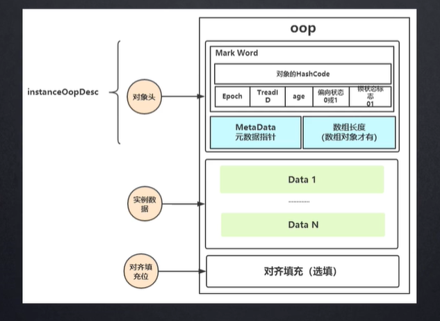
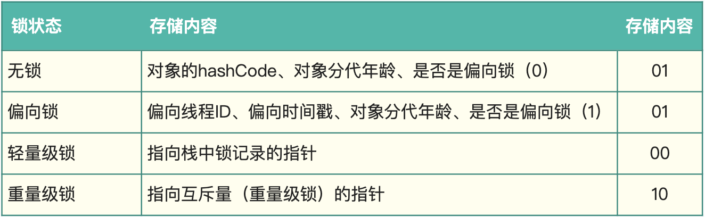

## java 锁


### 公平锁和非公平锁

公平锁即尽量以请求锁的顺序来获取锁。比如同是有多个线程在等待一个锁，当这个锁被释放时，等待时间最久的线程（最先请求的线程）会获得该所，这种就是公平锁。

非公平锁即无法保证锁的获取是按照请求锁的顺序进行的。这样就可能导致某个或者一些线程永远获取不到锁。

在Java中，synchronized 就是非公平锁，它无法保证等待的线程获取锁的顺序。

而对于 ReentrantLock 和 ReentrantReadWriteLock，它默认情况下是非公平锁，但是可以设置为公平锁。


### 可重入锁

如果锁具备可重入性，则称作为可重入锁。像synchronized和ReentrantLock都是可重入锁。可重入性是如果该线程已经获取到锁，并且一直保持没有释放的情况下。则在下一次需要该锁的时候，能够直接获取到不必重新去申请锁。


### 可中断锁

在Java中，synchronized就不是可中断锁，而Lock是可设置成中断锁的。

如果某一线程A正在执行锁中的代码，另一线程B正在等待获取该锁，可能由于等待时间过长，线程B不想等待了，想先处理其他事情，我们可以让它中断自己或者在别的线程中中断它，这种就是可中断锁。

Lock 里的 lockInterruptibly() 的用法体现了Lock 的可中断性。

Object.wait, Thread.join，Thread.sleep，ReentrantLock.lockInterruptibly 这些会抛出受检异常 InterruptedException 的都会被中断。synchronized，ReentrantLock.lock 的锁竞争阻塞是不会被中断的，interrupt 并不会强制终止线程，而是会将线程设置成 interrupted 状态。


### 乐观锁和悲观锁

#### 悲观锁 

synchronized关键字和Lock的实现类都是悲观锁。

#### 乐观锁

乐观锁在Java中是通过使用无锁编程来实现，最常采用的是CAS算法，Java原子类中的递增操作就通过CAS自旋实现的。

在 AtomicInteger 的源码中，incrementAndGet 方法，会用到 compareAndSwapInt 方法。

整个“比较+更新”操作封装在compareAndSwapInt()中，在JNI里是借助于一个CPU指令完成的，属于原子操作，可以保证多个线程都能够看到同一个变量的修改值。

后续JDK通过CPU的cmpxchg指令，去比较寄存器中的 A 和 内存中的值 V。如果相等，就把要写入的新值 B 存入内存中。如果不相等，就将内存值 V 赋值给寄存器中的值 A。然后通过Java代码中的while循环再次调用cmpxchg指令进行重试，直到设置成功为止。


**CAS的问题**

存在三大问题，这里也简单说一下：

1. ABA问题

   * CAS需要在操作值的时候检查内存值是否发生变化，没有发生变化才会更新内存值。但是如果内存值原来是A，后来变成了B，然后又变成了A，那么CAS进行检查时会发现值没有发生变化，但是实际上是有变化的。ABA问题的解决思路就是在变量前面添加版本号，每次变量更新的时候都把版本号加一，这样变化过程就从“A－B－A”变成了“1A－2B－3A”。

   - JDK从1.5开始提供了AtomicStampedReference类来解决ABA问题，具体操作封装在compareAndSet()中。compareAndSet()首先检查当前引用和当前标志与预期引用和预期标志是否相等，如果都相等，则以原子方式将引用值和标志的值设置为给定的更新值。

2. 循环时间长开销大。CAS操作如果长时间不成功，会导致其一直自旋，给CPU带来非常大的开销。

3. 只能保证一个共享变量的原子操作

   * 对一个共享变量执行操作时，CAS能够保证原子操作，但是对多个共享变量操作时，CAS是无法保证操作的原子性的。

   - Java从1.5开始JDK提供了AtomicReference类来保证引用对象之间的原子性，可以把多个变量放在一个对象里来进行CAS操作。


### JVM 的锁优化技术 

#### 自旋锁


自旋锁就是在请求获取锁，又不能马上获取到时，让当前线程在不放弃处理器执行时间的情况下执行忙循环，尝试等待锁被释放，再获取锁。引入自旋锁是为了节省线程挂起和恢复的开销。

自旋锁节省了线程挂起和恢复的开销，但循环也是需要占用处理器时间的，那这个自旋的次数如何控制？默认是10次，也可以通过JVM参数-XX:PreBlockSpin配置，当然这些自旋都是固定的，所以引入了「自适应自旋锁」，自旋的次数由前一次在同一个锁上的自旋次数和锁的拥有者的状态来决定。如果前面线程成功获取锁并且正常运行，那么本次获取锁的可能性很大，所以自旋的次数相对多一些；如果前面线程很少成功获取锁，那么本次获取锁的概率也很小，就可能不执行自旋了。


### 锁状态

#### Java 对象头

**Mark Word**：默认存储对象的HashCode，分代年龄和锁标志位信息。这些信息都是与对象自身定义无关的数据，所以Mark Word被设计成一个非固定的数据结构以便在极小的空间内存存储尽量多的数据。它会根据对象的状态复用自己的存储空间，也就是说在运行期间Mark Word里存储的数据会随着锁标志位的变化而变化。

**Klass Point**：对象指向它的类元数据的指针，虚拟机通过这个指针来确定这个对象是哪个类的实例。




#### Monitor

Monitor可以理解为一个同步工具或一种同步机制，通常被描述为一个对象。每一个Java对象就有一把看不见的锁，称为内部锁或者Monitor锁。

Monitor是线程私有的数据结构，每一个线程都有一个可用monitor record列表，同时还有一个全局的可用列表。每一个被锁住的对象都会和一个monitor关联，同时monitor中有一个Owner字段存放拥有该锁的线程的唯一标识，表示该锁被这个线程占用。

回到synchronized，synchronized通过Monitor来实现线程同步，Monitor是依赖于底层的操作系统的Mutex Lock（互斥锁）来实现的线程同步。


####  1、无锁

#### 2、偏向锁（锁标志 01）

偏向锁就是如果线程持有了锁，在后续的过程中，只要该锁没有被其它线程持有，那么持有偏向锁的线程将不再需要进行同步操作。

这个偏向锁的相关信息是保存在Java对象的对象头中的。在HotSpot虚拟机中，Java对象在内存中存储的布局分为3块区域：对象头、实例数据和对齐填充。对象头包含两部分，第一部分包含对象的HashCode、分代年龄、锁标志位、线程持有的锁、偏向线程ID等数据，这部分数据的长度在32位和64位虚拟机中分别为32bit和64bit，官方称为Mark World

一个普通Java对象刚开始是处于无锁状态的。当虚拟机启动了偏向锁，（jdk 1.6 默认开启偏向锁）锁对象第一次被线程获取的时候，锁标识位置为01，同时使用CAS将获取到这个锁的偏向线程ID设置到Mark World中，如果CAS操作成功，那么这个线程将可以继续执行相关的同步代码。

如果此时有其它线程尝试获取锁，有两种情况，一种是锁对象未被锁定，则偏向锁被撤销，恢复到无锁状态；另一种是对象被锁定，那么偏向锁失效，同时升级为轻量级锁，会在当前线程的栈帧中创建一个锁记录的空间，这个空间存储对象头中Mark World的拷贝，就是复制一份到这个锁记录空间，同时虚拟机使用CAS尝试将这个锁记录空间的指针更新到Mark World，如果CAS操作成功，那么当前线程获取到锁，此时锁状态处于轻量级锁，锁标志位置为00。


#### 3、轻量级（锁标志 00）

 轻量级锁加锁：线程在执行同步块之前， JVM会先在当前线程的栈桢中创建用于存储锁记录的空间，并将对象头中的Mark Word复制到锁记录中，

官方称为Displaced Mark Word。然后线程尝试使用 CAS 将对象头中的Mark Word替换为指向锁记录的指针。如果成功，当前线程获得锁，如果失败，

表示其他线程竞争锁，当前线程便尝试使用自旋来获取锁。


#### 4、重量级（锁标志 10）

重量级锁使除了拥有锁的线程以外的线程都阻塞，防止CPU空转。


#### 四种锁状态对应 mark word 内容




####  几种锁的理解

**偏向所锁，轻量级锁都是乐观锁，重量级锁是悲观锁。**

一个对象刚开始实例化的时候，没有任何线程来访问它的时候。它是可偏向的，意味着，它现在认为只可能有一个线程来访问它，所以当第一个线程来访问它的时候，它会偏向这个线程，此时，对象持有偏向锁。

偏向第一个线程，这个线程在修改对象头成为偏向锁的时候使用CAS操作，并将对象头中的偏向ThreadID改成自己的ID，之后再次访问这个对象时，只需要对比ID，不需要再使用CAS在进行操作。

一旦有第二个线程访问这个对象，因为偏向锁不会主动释放，所以第二个线程可以看到对象时偏向状态，这时表明在这个对象上已经存在竞争了，检查原来持有该对象锁的线程是否依然存活，如果挂了，则可以将对象变为无锁状态，然后重新偏向新的线程，如果原来的线程依然存活，则马上执行那个线程的操作栈，检查该对象的使用情况，如果仍然需要持有偏向锁，则偏向锁升级为轻量级锁，（**偏向锁就是这个时候升级为轻量级锁的**）。如果不存在使用了，则可以将对象回复成无锁状态，然后重新偏向。

轻量级锁认为竞争存在，但是竞争的程度很轻，一般两个线程对于同一个锁的操作都会错开，或者说稍微等待一下（自旋），另一个线程就会释放锁。 但是当自旋超过一定的次数，或者一个线程在持有锁，一个在自旋，又有第三个来访时，轻量级锁膨胀为重量级锁，重量级锁使除了拥有锁的线程以外的线程都阻塞，防止CPU空转。


#### 线程阻塞原理

```c
public:
  ParkEvent * _ParkEvent ;    // for synchronized()
  ParkEvent * _SleepEvent ;   // for Thread.sleep
// JSR166 per-thread parker
private:
  Parker*    _parker;
```

从注释上可以看出分别是用于 synchronized 的阻塞，Thread.sleep 的阻塞还有用于 UnSafe 的线程阻塞。

synchronized 是通过 monitorenter 和 monitorexit ，acc_synchronizor 实现。

lock 是通过 LockSupport 的 park 方法实现，底层调用的是 UnSafe 的park 方法。

LockSupport 的 park 方法是不可重入的，连续调用两次会阻塞当前线程。


#### ReentrantLock 的 condition 用法

conditionA.await(); 类似于 Object 的wait() 方法，会释放锁。

```
// 实例化一个ReentrantLock对象
private ReentrantLock lock = new ReentrantLock();

// 为线程A注册一个Condition
public Condition conditionA = lock.newCondition();

// 为线程B注册一个Condition
public Condition conditionB = lock.newCondition();

public void awaitA() {
        try {
            lock.lock();
            System.out.println(Thread.currentThread().getName() + "进入了awaitA方法");
            long timeBefore = System.currentTimeMillis();
            
            // 执行conditionA等待
            conditionA.await();
            long timeAfter = System.currentTimeMillis();
            System.out.println(Thread.currentThread().getName()+"被唤醒");
            System.out.println(Thread.currentThread().getName() + "等待了: " + (timeAfter - timeBefore)/1000+"s");
        } catch (InterruptedException e) {
            e.printStackTrace();
        } finally {
            lock.unlock();
        }
    }

    public void awaitB() {
        try {
            lock.lock();
            System.out.println(Thread.currentThread().getName() + "进入了awaitB方法");
            long timeBefore = System.currentTimeMillis();
            
            // 执行conditionB等待
            conditionB.await();
            long timeAfter = System.currentTimeMillis();
            System.out.println(Thread.currentThread().getName()+"被唤醒");
            System.out.println(Thread.currentThread().getName() + "等待了: " + (timeAfter - timeBefore)/1000+"s");
        } catch (InterruptedException e) {
            e.printStackTrace();
        } finally {
            lock.unlock();
        }
    }

    public void signallA() {
        try {
            lock.lock();
            System.out.println("启动唤醒程序");
            // 唤醒所有注册conditionA的线程
            conditionA.signalAll();
        } finally {
            lock.unlock();
        }
    }
    
    public void signallB() {
        try {
            lock.lock();
            System.out.println("启动唤醒程序");
            // 唤醒所有注册conditionB的线程
            conditionB.signalAll();
        } finally {
            lock.unlock();
        }
    }
```

