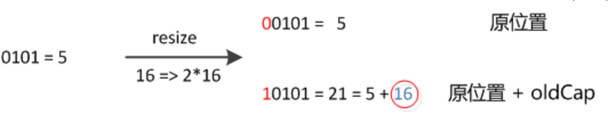
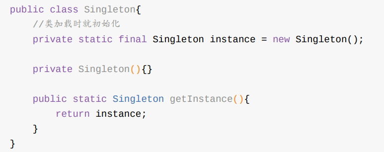
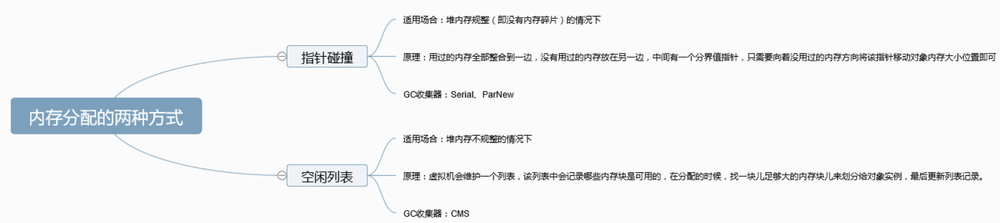

## Java 基础

#### 1、接⼝和抽象类的区别是什么？

1. 接⼝的⽅法默认是 public，所有⽅法在接⼝中不能有实现(Java 8 开始接⼝⽅法可以有默认实现），⽽抽象类可以有⾮抽象的⽅法。

2. 接⼝中除了public、static、final 变量，不能有其他变量，⽽抽象类中则不⼀定。

3. ⼀个类可以实现多个接⼝，但只能实现⼀个抽象类。接⼝⾃⼰本身可以通过 extends 关键字继承多个接⼝。 

4. 接⼝⽅法默认修饰符是 public，抽象⽅法可以有 public、protected 和 default 这些修饰符 （抽象⽅法就是为了被重写所以不能使⽤ private 关键字修饰！）。 

5. 从设计层⾯来说，抽象类是对类的抽象，是⼀种模板设计，⽽接⼝是对⾏为的抽象，是⼀种⾏为的规范。 

   备注： 

   总结⼀下 jdk7~jdk9 Java 中接⼝概念的变化： 

   1. 在 jdk 7 或更早版本中，接⼝⾥⾯只能有常量变量和抽象⽅法。这些接⼝⽅法必须由选择实现 接⼝的类实现。 
   2. jdk8 的时候接⼝可以有默认⽅法和 public 静态⽅法功能。 
   3. Jdk 9 在接⼝中引⼊了私有⽅法和私有静态⽅法。


#### 2、== 与 equals

判断是否相等，前提是看 equals 是否被重写过。如果没有被重写，则是等同于 == 判断，判断地址是否相等。

如果被重写，则是根据重写的方法逻辑判断。


#### 3、为什么重写 equals 时必须重写 hashCode ⽅法

hashCode：将对象的地址值映射为integer类型的哈希值。

hashCode（）与 equals（）的相关规定 ：

1. 如果两个对象通过 equals 判断相等，则 hashcode ⼀定也是相同的

   因为 equals 默认对基本数据类型判断的是值是否相等，对引用类型（对象）判断的是地址是否相等。

   所以根据上述规定，equals 重写之后，也要重写 hashCode，来保证 equals 相等时，hashCode 也相等。

   String 类的  equals（）相等，即使不是指向同一个对象， hashCode（）也相等。

2. 两个对象有相同的 hashCode 值，它们也不⼀定是相等的

3. hashCode() 默认是把对象地址映射为 integer 类型的 哈希值。如果没有重写 hashCode()，则该 class 的两个对象的 hashCode 不相等。


#### 4、为什么 Java 中只有值传递

```java
public static void main(String[] args) {
    int num1 = 10;
    int num2 = 20;

    swap(num1, num2);

    System.out.println("num1 = " + num1);
    System.out.println("num2 = " + num2);
}

public static void swap(int a, int b) {
    int temp = a;
    a = b;
    b = temp;

    System.out.println("a = " + a);
    System.out.println("b = " + b);
}
```


```java
public class Test {

    public static void main(String[] args) {
        // TODO Auto-generated method stub
        Student s1 = new Student("小张");
        Student s2 = new Student("小李");
        Test.swap(s1, s2);
        System.out.println("s1:" + s1.getName());
        System.out.println("s2:" + s2.getName());
    }

    public static void swap(Student x, Student y) {
        Student temp = x;
        x = y;
        y = temp;
        System.out.println("x:" + x.getName());
        System.out.println("y:" + y.getName());
    }
}
```


方法并没有改变存储在变量 s1 和 s2 中的对象引用。swap 方法的参数 x 和 y 被初始化为两个对象引用的拷贝，这个方法交换的是这两个拷贝

Java 程序设计语言对对象采用的不是引用调用，实际上，对象引用是按值传递的。


#### 5、线程的基本状态

Java 线程在运⾏的⽣命周期中的指定时刻只可能处于下⾯ 6 种不同状态的其中⼀个状态


线程在⽣命周期中并不是固定处于某⼀个状态⽽是随着代码的执⾏在不同状态之间切换。


#### 6、try 和 finally return 问题

try语句在返回前，将其他所有的操作执行完，保留好要返回的值，而后转入执行finally中的语句，而后分为以下三种情况：

  情况一：如果finally中有return语句，则会将try中的return语句”覆盖“掉，直接执行finally中的return语句，得到返回值，这样便无法得到try之前保留好的返回值。

  情况二：如果finally中没有return语句，也没有改变要返回值，则执行完finally中的语句后，会接着执行try中的return语句，返回之前保留的值。

  情况三：如果finally中没有return语句，但是改变了要返回的值，这里有点类似与引用传递和值传递的区别，分以下两种情况，：

​    1）如果return的数据是基本数据类型或文本字符串，则在finally中对该基本数据的改变不起作用，try中的return语句依然会返回进入finally块之前保留的值。

​    2）如果return的数据是引用数据类型，而在finally中对该引用数据类型的属性值的改变起作用，try中的return语句返回的就是在finally中改变后的该属性的值。

本质是值压栈造成的：

当通过压栈传递参数时，参数的类型不同，压栈的内容也不同。如果是值类型，压栈就是经过复制的参数值，如果是引用类型，那么进栈的只是一个引用。


#### 7、transient 关键字的作用

transient 关键字的作⽤是：阻⽌实例中那些⽤此关键字修饰的的变量序列化；当对象被反序列化时， 被 transient 修饰的变量值不会被持久化和恢复。transient 只能修饰变量，不能修饰类和⽅法。


#### 8、Java IO 流

Java 中 IO流分类：

* 按照流的流向分，可以分为输⼊流和输出流； 
* 按照操作单元划分，可以划分为字节流和字符流； 
* 按照流的⻆⾊划分为节点流和处理流。

 Java I0 流的 40 多个类都是从如下 4 个抽象类基类中派⽣出来的。 

* InputStream/Reader: 所有的输⼊流的基类，前者是字节输⼊流，后者是字符输⼊流。
*  OutputStream/Writer: 所有输出流的基类，前者是字节输出流，后者是字符输出流。


**有了字节流,为什么还要有字符流?**

字符流是由 Java 虚拟机将字节转换得到的，问题就出在这个过程还算是⾮常耗时，并且，如果 我们不知道编码类型就很容易出现乱码问题。所以， I/O 流就⼲脆提供了⼀个直接操作字符的接⼝， ⽅便我们平时对字符进⾏流操作。


#### 9、BIO，NIO 和 AIO

BIO：同步阻塞

client在调用read（）方法时，stream 里没有数据可读，线程停止向下执行，直至stream有数据。

- 阻塞：体现在这个线程不能干别的了，只能在这里等着。

- 同步：是体现在消息通知机制上的，即stream有没有数据是需要我自己来判断的。


NIO：同步非阻塞

调用read方法后，如果stream没有数据，方法就返回，然后这个线程就就干别的去了。

- 非阻塞：体现在，这个线程可以去干别的，不需要一直在这等着
- 同步：体现在消息通知机制，这个线程仍然要定时的读取stream，判断数据有没有准备好，client采用循环的方式去读取，可以看出CPU大部分被浪费了


AIO：异步非阻塞
调用read()方法，若stream中无数据则返回，程序继续向下执行。当stream中有数据时，操作系统会负责把数据拷贝到用户空间，然后通知这个线程，这里的消息通知机制就是异步，而不是像NIO那样，自己起一个线程去监控stream里面有没有数据。


#### 10、arraylist 扩容机制

底层其实是调用了`Arrays.copyOf(elementData, newCapacity(minCapacity))`方法来进行扩充数组容量的。主要看一下方法newCapacity(int minCapacity)的实现。

newCapacity(int minCapacity)

```java
// 由最小容量minCapacity来计算实际需要扩容的容量
private int newCapacity(int minCapacity) {
    // overflow-conscious code
    int oldCapacity = elementData.length; // 得到旧容量
    int newCapacity = oldCapacity + (oldCapacity >> 1); // 设置新容量为旧容量的1.5倍
    if (newCapacity - minCapacity <= 0) { // 如果新容量仍然小于最小容量
        if (elementData == DEFAULTCAPACITY_EMPTY_ELEMENTDATA) // 如果是使用的默认容量
            return Math.max(DEFAULT_CAPACITY, minCapacity); // 取默认容量和最小容量较大值返回
        if (minCapacity < 0) // overflow // 检查最小容量是否越界（int 的范围）
            throw new OutOfMemoryError();
        return minCapacity; // 返回最小容量
    }
    // 如果新容量大于期望容量，判断一下新容量是否越界
    return (newCapacity - MAX_ARRAY_SIZE <= 0)
        ? newCapacity
        : hugeCapacity(minCapacity);
}
```

逻辑是将容量扩大到原先的1.5倍，采用位运算（向右移一位），如果扩容后的容量不小于最小容量并且没有越界，则返回最此容量

如果小于最小容量，则返回最小容量。

**ArrayList有缩容吗？**

`ArrayList`没有缩容。无论是`remove`方法还是`clear`方法，它们都不会改变现有数组`elementData`的长度。但是它们都会把相应位置的元素设置为`null`，以便垃圾收集器回收掉不使用的元素，节省内存。


#### 11、java HashMap 多线程导致死循环（实现的是 Map 接口）

链表长度大于 8 时转换为红黑树。

**jdk 1.8 对 rehash 时重新计算hash 的优化**



因此，我们在扩充HashMap的时候，不需要像JDK1.7的实现那样重新计算hash，只需要看看原来的hash值新增的那个bit是1还是0就好了，是0的话索引下标没变，是1的话索引下标变成 “原索引下标 + oldCap”

比如上图：原 length 是16，计算hash 对应的数组位置时，& 15（1111）所以 5 和 21都是在一个链表里。扩容 2 倍（相当于是多了一 位），16 -> 32。

这样计算hash对应的数组位置就变成 5 & 31 = 0 0101 ，21 & 31 = 1 0101。就应证了上面的话。*只需要看看原来的hash值新增的那个bit是1还是0就好了，是0的话索引没变，是1的话索引变成“原索引+oldCa*


假设有两个线程正在执行 rehash 的过程：

在 rehash transfer() 方法中，有这段代码

```java
do {
    Entry<K,V> next = e.next; // <--假设线程一执行到这里就被调度挂起了
    int i = indexFor(e.hash, newCapacity);
    e.next = newTable[i];
    newTable[i] = e;
    e = next;
} while (e != null);
```

当线程一被挂起，线程二执行完成的时候。


然后这个时候，线程一继续执行，完成接下来的操作。就会导致环形链表出现。


环形链表在 jdk 1.7 之前因为链表的头插法会出现，在 jdk 1.8 之后已经修复了这个问题。


#### 12、sleep() ⽅法和 wait() ⽅法区别和共同点? 

两者最主要的区别在于：

sleep ⽅法没有释放锁，⽽ wait ⽅法释放了锁 。 

两者都可以暂停线程的执⾏。

 wait 通常被⽤于线程间交互/通信，sleep 通常被⽤于暂停执⾏。 

wait() ⽅法被调⽤后，线程不会⾃动苏醒，需要别的线程调⽤同⼀个对象上的 notify() 或者 notifyAll() ⽅法。sleep() ⽅法执⾏完成后，线程会⾃动苏醒。或者可以使⽤ wait(long timeout)超时后线程会⾃动苏醒。


#### 13、如何写一个单例模式

**懒汉式**

1、静态内部类的方式


2、双重校验锁


**饿汉式**




#### 14、synchronized 关键字的底层原理

① synchronized 同步语句块的情况

```java
public class SynchronizedDemo {
 public void method() {
 synchronized (this) {
 System.out.println("synchronized 代码块");
 }
 }
}
```

通过 JDK ⾃带的 javap 命令查看 SynchronizedDemo 类的相关字节码信息：⾸先切换到类的对应⽬录 执⾏ javac SynchronizedDemo.java 命令⽣成编译后的 .class ⽂件，然后执⾏ javap -c -s -v -l SynchronizedDemo.class 。


synchronized 同步语句块的实现使⽤的是 monitorenter 和 monitorexit 指令。

其中 monitorenter 指令指向同步代码块的开始位置，monitorexit 指令则指明同步代码块的结束位置。 当执⾏ monitorenter 指令时，线程试图获取锁也就是获取 monitor 

(monitor对象存在于每个Java对象的对象 头中，synchronized 锁便是通过这种⽅式获取锁的，也是为什么Java中任意对象可以作为锁的原因) 

的持有权。当计数器为0则可以成功获取，获取后将锁计数器设为1也就是加1。相应的在执⾏ monitorexit 指令后，将锁计数器设为0，表明锁被释放。


② synchronized 修饰⽅法的的情况

通过上述方法查看字节码信息。

monitorenter 取而代之的是 ACC_SYNCHRONIZED 标识，该标识指明了该⽅法是⼀个同步⽅法，JVM 通过该 ACC_SYNCHRONIZED 访问标志来辨别⼀个⽅法是否声明为同步⽅法，从⽽执⾏相应的同步调⽤。


#### 15、threadlocal 

threadLocals （可能会有多个）由当前线程维护。

```java
public class Thread implements Runnable {
 ......
//与此线程有关的ThreadLocal值。由ThreadLocal类维护
ThreadLocal.ThreadLocalMap threadLocals = null;

//与此线程有关的InheritableThreadLocal值。由InheritableThreadLocal类维护
ThreadLocal.ThreadLocalMap inheritableThreadLocals = null;
 ......
}
```

ThreadLocal 类的 set() ⽅法

```java
public void set(T value) {
 Thread t = Thread.currentThread();
 ThreadLocalMap map = getMap(t);
 if (map êX null)
 map.set(this, value);
 else
 createMap(t, value);
 }
 ThreadLocalMap getMap(Thread t) {
 return t.threadLocals;
 }
```

可以看出每次get或者是set都是先 getMap，获取当前线程维护的 threadLocals。threadLocals是一个 Map，key 是 threadLocal，value是设置的值。

**ThreadLocal 内存泄露问题**

ThreadLocalMap 中使⽤的 key 为 ThreadLocal 的弱引⽤,⽽ value 是强引⽤。所以，如果 ThreadLocal 没有被外部强引⽤的情况下，在垃圾回收的时候，key 会被清理掉，⽽ value 不会被清 理掉。这样⼀来， ThreadLocalMap 中就会出现key为null的Entry。假如我们不做任何措施的话， value 永远⽆法被GC 回收，这个时候就可能会产⽣内存泄露。ThreadLocalMap实现中已经考虑了这种 情况，在调⽤ set() 、 get() 、 remove() ⽅法的时候，会清理掉 key 为 null 的记录。使⽤完 ThreadLocal ⽅法后 最好⼿动调⽤ remove() ⽅法。

```java
static class Entry extends WeakReference<ThreadLocal<?>> {
 /** The value associated with this ThreadLocal. */
 Object value;
 Entry(ThreadLocal<?> k, Object v) {
 super(k);
 value = v;
 }
 }
```


#### 16、线程池

**ThreadPoolExecutor 参数 handler：**

handler :饱和策略。

ThreadPoolExecutor 饱和策略 ThreadPoolExecutor 饱和策略定义: 如果当前同时运⾏的线程数量达到最⼤线程数量并且队列也已经被放满了。此时， ThreadPoolTaskExecutor 定义⼀些策略: 

ThreadPoolExecutor.AbortPolicy ：抛出 RejectedExecutionException 来拒绝新任务的处理。 

ThreadPoolExecutor.CallerRunsPolicy ：调⽤执⾏⾃⼰的线程运⾏任务。但是这种策略会降低对于新任务提交速度，影响程序的整体性能。另外，这个策略喜欢增加队列容 量。如果您的应⽤程序可以承受此延迟并且你不能任务丢弃任何⼀个任务请求的话，你可以选择 这个策略。 

ThreadPoolExecutor.DiscardPolicy ： 不处理新任务，直接丢弃掉。 

ThreadPoolExecutor.DiscardOldestPolicy ： 此策略将丢弃最早的未处理的任务

默认是 AbortPolicy ，此时会拒绝处理新来的任务，也就意味着新来的任务会被丢失处理。

如果不想丢失的话，可以选择 ThreadPoolExecutor.CallerRunsPolicy ，当最大池被填满会提供一个可伸缩队列。


#### 17、AQS

AQS是⼀个⽤来构建锁和同步器的框架，使⽤AQS能简单且⾼效地构造出应⽤⼴泛的⼤量的同步器，⽐如 我们提到的ReentrantLock，Semaphore，FutureTask等等皆是基于AQS的。当然，我们⾃⼰也能利⽤AQS⾮常轻松容易地构造出符合我们⾃⼰需求的同步器。

**AQS 原理概览 AQS核⼼思想：**

如果被请求的共享资源空闲，则将当前请求资源的线程设置为有效的⼯作线程，并且 将共享资源设置为锁定状态。

如果被请求的共享资源被占⽤，那么就需要⼀套线程阻塞等待以及被唤醒 时锁分配的机制，这个机制AQS是⽤CLH队列锁实现的，即将暂时获取不到锁的线程加⼊到队列中。 

CLH(Craig,Landin,and Hagersten)队列是⼀个虚拟的双向队列（虚拟的双向队列即不存在队列实 例，仅存在结点之间的关联关系）。AQS是将每条请求共享资源的线程封装成⼀个CLH锁队列的⼀个 结点（Node）来实现锁的分配。


**AQS 组件总结**

Semaphore(信号量)-允许多个线程同时访问： synchronized 和 ReentrantLock 都是⼀次只允 许⼀个线程访问某个资源，Semaphore(信号量)可以指定多个线程同时访问某个资源。

 CountDownLatch （倒计时器）： CountDownLatch是⼀个同步⼯具类，⽤来协调多个线程之间的 同步。这个⼯具通常⽤来控制线程等待，它可以让某⼀个线程 A 等待调用 await() 方法阻塞。其它线程调用 countdown() 方法直到为 0，A 再开始执⾏。 

CyclicBarrier(循环栅栏)： CyclicBarrier 和 CountDownLatch ⾮常类似，它也可以实现线程 间的技术等待，但是它的功能⽐ CountDownLatch 更加复杂和强⼤。主要应⽤场景和 CountDownLatch 类似。CyclicBarrier 的字⾯意思是可循环使⽤（Cyclic）的屏障

（Barrier）。它要做的事情是，让⼀组线程到达⼀个屏障（也可以叫同步点）时被阻塞，直到 最后⼀个线程到达屏障时，屏障才会开⻔，所有被屏障拦截的线程才会继续⼲活。 CyclicBarrier默认的构造⽅法是 CyclicBarrier(int parties)，其参数表示屏障拦截的线程数 量，每个线程调⽤await()⽅法告诉 CyclicBarrier 我已经到达了屏障，然后当前线程被阻塞。


### JVM

#### 18、java 方法区

1.8 之后使用直接内存来替代之前用永久代实现的方法区

直接内存：

直接内存并不是虚拟机运⾏时数据区的⼀部分，也不是虚拟机规范中定义的内存区域，但是这部分内存 也被频繁地使⽤。⽽且也可能导致 OutOfMemoryError 异常出现。 

JDK1.4 中新加⼊的 NIO(New Input/Output) 类，引⼊了⼀种基于通道（Channel） 与缓存区 （Buffer） 的 I/O ⽅式，它可以直接使⽤ Native 函数库直接分配堆外内存，然后通过⼀个存储在 Java 堆中的 DirectByteBuffer 对象作为这块内存的引⽤进⾏操作。

这样就能在⼀些场景中显著提⾼ 性能，因为避免了在 Java 堆和 Native 堆之间来回复制数据。 本机直接内存的分配不会收到 Java 堆的限制，但是，既然是内存就会受到本机总内存⼤⼩以及处理器 寻址空间的限制。


#### 19、java 对象创建过程


①类加载检查： 虚拟机遇到⼀条 new 指令时，⾸先将去检查这个指令的参数是否能在常量池中定位到 这个类的符号引⽤，并且检查这个符号引⽤代表的类是否已被加载过、解析和初始化过。如果没有，那 必须先执⾏相应的类加载过程。 

②分配内存： 在类加载检查通过后，接下来虚拟机将为新⽣对象分配内存。对象所需的内存⼤⼩在类 加载完成后便可确定，为对象分配空间的任务等同于把⼀块确定⼤⼩的内存从 Java 堆中划分出来。分 配⽅式有 “指针碰撞” 和 “空闲列表” 两种，选择那种分配⽅式由 Java 堆是否规整决定，⽽Java堆是 否规整⼜由所采⽤的垃圾收集器是否带有压缩整理功能决定。

内存分配的两种⽅式：



内存分配并发问题：

在创建对象的时候有⼀个很重要的问题，就是线程安全，因为在实际开发过程中，创建对象是很频繁的 事情，作为虚拟机来说，必须要保证线程是安全的，通常来讲，虚拟机采⽤两种⽅式来保证线程安全： 

CAS+失败重试： CAS 是乐观锁的⼀种实现⽅式。所谓乐观锁就是，每次不加锁⽽是假设没有冲 突⽽去完成某项操作，如果因为冲突失败就重试，直到成功为⽌。虚拟机采⽤ CAS 配上失败重 试的⽅式保证更新操作的原⼦性。 

TLAB： 为每⼀个线程预先在Eden区分配⼀块⼉内存，JVM在给线程中的对象分配内存时，⾸先在 TLAB分配，当对象⼤于TLAB中的剩余内存或TLAB的内存已⽤尽时，再采⽤上述的CAS进⾏内存分 配


⑤执⾏ init ⽅法： 在上⾯⼯作都完成之后，从 Java 程序的视⻆来看，对象创建才刚开始，  init ⽅法还没有执⾏，所有的字段都还为零。所以⼀ 般来说，执⾏ new 指令之后会接着执⾏ init ⽅法，把对象按照程序员的意愿进⾏初始化，这样⼀ 个真正可⽤的对象才算完全产⽣出来。


#### 20、如何判断⼀个类是⽆⽤的类? 

⽅法区主要回收的是⽆⽤的类，那么如何判断⼀个类是⽆⽤的类的呢？

判定⼀个常量是否是“废弃常量”⽐简单，⽽要判定⼀个类是否是“⽆⽤的类”的条件则相对苛刻许多。 类需要同时满⾜下⾯3个条件才能算是 “⽆⽤的类” ： 

* 该类所有的实例都已经被回收，也就是 Java 堆中不存在该类的任何实例。 

* 加载该类的 ClassLoader 已经被回收。 

* 该类对应的 java.lang.Class 对象没有在任何地⽅被引⽤，⽆法在任何地⽅通过反射访问该类 的⽅法。

虚拟机可以对满⾜上述3个条件的⽆⽤类进⾏回收，这⾥说的仅仅是“可以”，⽽并不是和对象⼀样不使 ⽤了就会必然被回收。


#### 21、既然有内存碎片的问题，为什么 cms 还是使用 标记-清除算法

1、能够进行内存压缩。虚拟机提供了参数可以设置 cms 在进行一定次数的不压缩gc后，来一次压缩的gc。

2、compact 可能要先计算一次对象的目标地址，然后修正指针，然后再移动对象；这是相对于 标记-清除 算法来说是比较耗时的一个操作。


#### 22、类加载过程

类加载过程：加载 -> 连接 -> 初始化。连接过程⼜可分为三步: 验证 -> 准备 -> 解析。

类加载过程的第⼀步，主要完成下⾯3件事情： 

1. 通过全类名获取定义此类的⼆进制字节流 
2. 将字节流所代表的静态存储结构转换为⽅法区的运⾏时数据结构 
3. 在内存中⽣成⼀个代表该类的 Class 对象。

**类加载器**

JVM 中内置了三个重要的 ClassLoader，除了 BootstrapClassLoader 其他类加载器均由 Java 实现且 全部继承⾃ java.lang.ClassLoader ： 

1. BootstrapClassLoader(启动类加载器) ：最顶层的加载类，由C++实现，负责加载 %JAVA_HOME%/lib ⽬录下的jar包和类或者或被 -Xbootclasspath 参数指定的路径中的所有类。
2. ExtensionClassLoader(扩展类加载器) ：主要负责加载⽬录 %JRE_HOME%/lib/ext ⽬录下的jar 包和类，或被 java.ext.dirs 系统变量所指定的路径下的jar包。
3. AppClassLoader(应⽤程序类加载器) :⾯向我们⽤户的加载器，负责加载当前应⽤classpath下的所有jar包和类。

最后还有用户自定义的类加载器。


#### 23、双亲委派模型

双亲委派模型保证了Java程序的稳定运⾏，可以避免类的重复加载（JVM 区分不同类的⽅式不仅仅根据 类名，相同的类⽂件被不同的类加载器加载产⽣的是两个不同的类），也保证了 Java 的核⼼ API 不 被篡改。

**如果我们不想⽤双亲委派模型怎么办？ **

为了避免双亲委托机制，我们可以⾃⼰定义⼀个类加载器，然后重载 loadClass() 即可。


### 网络

#### 24、网络中每一层的作用

**应⽤层**(application-layer）的任务是通过应⽤进程间的交互来完成特定⽹络应⽤。应⽤层协议定义的是应⽤进程（进程：主机中正在运⾏的程序）间的通信和交互的规则。我们把应⽤层交互的数据单元称为报⽂。


**传输层**(transport layer)的主要任务就是负责向两台主机进程之间的通信提供通⽤的数据传输服务。


**⽹络层**的任务就是选择合适的⽹间路由和交换结点， 确保数据及时传送。 在发送数据时，⽹络层 把传输层产⽣的报⽂段或⽤户数据报封装成分组和包进⾏传送。在 TCP/IP 体系结构中，由于⽹络层使 ⽤ IP 协议，因此分组也叫 IP 数据报 ，简称 数据报。


**数据链路层**将⽹络 层交下来的 IP 数据报组装成帧，在两个相邻节点间的链路上传送帧。每⼀帧包括数据和必要的控制信 息（如同步信息，地址信息，差错控制等）。

 在接收数据时，控制信息使接收端能够知道⼀个帧从哪个⽐特开始和到哪个⽐特结束。这样，数据链路 层在收到⼀个帧后，就可从中提出数据部分，上交给⽹络层。 

控制信息还使接收端能够检测到所收到 的帧中有误差错。如果发现差错，数据链路层就简单地丢弃这个出了差错的帧，以避免继续在⽹络中传 送下去⽩⽩浪费⽹络资源。

如果需要改正数据在链路层传输时出现差错（这就是说，数据链路层不仅要 检错，⽽且还要纠错），那么就要采⽤可靠性传输协议来纠正出现的差错。这种⽅法会使链路层的协议 复杂些。


**物理层**(physical layer)的作⽤是实现相邻计算机节点之间⽐ 特流的透明传送，尽可能屏蔽掉具体传输介质和物理设备的差异。


配合上面的图可以理解，客户端与服务器是怎样进行请求和响应，中间涉及到哪些协议，数据报是怎么封装的，还有最好说一些数据链路层的知识（封装成帧，透明传输，差错检测）


#### 25、滑动窗⼝和流量控制

TCP 利⽤滑动窗⼝实现流量控制。流量控制是为了控制发送⽅发送速率，保证接收⽅来得及接收。 接 收⽅发送的确认报⽂中的窗⼝字段可以⽤来控制发送⽅窗⼝⼤⼩，从⽽影响发送⽅的发送速率。将窗⼝ 字段设置为 0，则发送⽅不能发送数据。

是一个点对点通信流量的控制，是一个端到端的问题。


#### 26、拥塞控制

拥塞控制就是为了防⽌过多的数据注⼊到⽹络中，这样就可以使⽹络中的路由器或链 路不致过载。

拥塞控制是⼀个全局性的过程，涉及到所有的主机，所有的路由器，以及与降低⽹络传输性能有关的所有因素。

为了进⾏拥塞控制，TCP 发送⽅要维持⼀个 拥塞窗⼝(cwnd) 的状态变量。拥塞控制窗⼝的⼤⼩取决于 ⽹络的拥塞程度，并且动态变化。发送⽅让⾃⼰的发送窗⼝取为拥塞窗⼝和接收⽅的接受窗⼝中较⼩的 ⼀个。

 TCP的拥塞控制采⽤了四种算法，即 慢开始 、 拥塞避免 、快重传 和 快恢复。在⽹络层也可以使路 由器采⽤适当的分组丢弃策略（如主动队列管理 AQM），以减少⽹络拥塞的发⽣。

* 慢开始： 慢开始算法的思路是当主机开始发送数据时，如果⽴即把⼤量数据字节注⼊到⽹络， 那么可能会引起⽹络阻塞，因为现在还不知道⽹络的符合情况。最好的⽅法是先探测 ⼀下，即由⼩到⼤逐渐增⼤发送窗⼝。cwnd初始值为 1，每经过⼀个传播轮次，cwnd加倍。 

* 拥塞避免： 拥塞避免算法的思路是让拥塞窗⼝cwnd缓慢增⼤，即每经过⼀个往返时间RTT就把发送方的cwnd加1.

* 快重传与快恢复（FRR）：是 ⼀种拥塞控制算法，它能快速恢复丢失的数据包。没有 FRR，如果数据包丢失了，TCP 将会使⽤ 定时器来要求传输暂停。在暂停的这段时间内，没有新的或复制的数据包被发送。有了 FRR，如 果接收机接收到⼀个不按顺序的数据段，它会⽴即给发送机发送⼀个重复确认。如果发送机接收 到三个重复确认，它会假定确认件指出的数据段丢失了，并⽴即重传这些丢失的数据段。


#### 27、在浏览器中输⼊url地址 ->> 显示主⻚的过程


#### 28、 HTTP 1.0和HTTP 1.1的主要区别

1. ⻓连接 : 在HTTP/1.0中，默认使⽤的是短连接，也就是说每次请求都要重新建⽴⼀次连接。HTTP/1.1的持续连接 有⾮流⽔线⽅式和流⽔线⽅式 。流⽔线⽅式是客户在收到HTTP的响应报⽂之前就能接着发送新 的请求报⽂。与之相对应的⾮流⽔线⽅式是客户在收到前⼀个响应后才能发送下⼀个请求。 
2. 错误状态响应码 :在HTTP1.1中新增了24个错误状态响应码，如409（Conflict）表示请求的资源 与资源的当前状态发⽣冲突；410（Gone）表示服务器上的某个资源被永久性的删除。 
3. 缓存处理 : HTTP1.1则引⼊了更多的缓存控制策略例如Entity tag，If-Unmodified-Since, If-Match, If-None-Match等更多可供选择的缓存头来控制缓存策略。 
4. 带宽优化及⽹络连接的使⽤ :HTTP1.0中，存在⼀些浪费带宽的现象，例如客户端只是需要某个 对象的⼀部分，⽽服务器却将整个对象送过来了，并且不⽀持断点续传功能，HTTP1.1则在请求 头引⼊了range头域，它允许只请求资源的某个部分，即返回码是206（Partial Content）。


### 操作系统

#### 29、进程间通信的7种方式

1、管道/匿名管道(pipe)

- 管道是半双工的，数据只能向一个方向流动；需要双方通信时，需要建立起两个管道。
- 只能用于父子进程或者兄弟进程之间(具有亲缘关系的进程);
- 是一个内核缓冲区，只存在于内存中，是有限的。
- 读写操作：先进先出，并且必须保证两端都是有进程存在的。


2、有名管道

有名管道是以磁盘文件形式存在于文件系统中，与有名管道的创建进程不存在亲缘关系的进程，也能够相互通信。有名管道的名字存在于文件系统中，内容存放在内存中。


3、信号(Signal)

- 信号是Linux系统中用于进程间互相通信或者操作的一种机制，信号可以在任何时候发给某一进程，而无需知道该进程的状态。
- 如果该进程当前并未处于执行状态，则该信号就由内核保存起来，直到该进程回复执行并传递给它为止。
- 如果一个信号被进程设置为阻塞，则该信号的传递被延迟，直到其阻塞被取消是才被传递给进程。

```shell
# Linux系统中常用信号：

SIGINT：程序终止信号。程序运行过程中，按Ctrl+C键将产生该信号。
SIGKILL：用户终止进程执行信号。shell下执行kill -9发送该信号。
SIGTERM：结束进程信号。shell下执行kill 进程pid发送该信号。
```

**信号来源**
信号是软件层次上对中断机制的一种模拟，是一种异步通信方式。信号可以在用户空间进程和内核之间直接交互，内核可以利用信号来通知用户空间的进程发生了哪些系统事件，信号事件主要有两个来源：

- 硬件来源：用户按键输入`Ctrl+C`退出、硬件异常如无效的存储访问等。
- 软件终止：终止进程信号、其他进程调用kill函数、软件异常产生信号。


4. 消息(Message)队列

- 消息队列是存放在内核中的消息链表，每个消息队列由消息队列标识符表示。
- 与管道（无名管道：只存在于内存中的文件；命名管道：存在于实际的磁盘介质或者文件系统）不同的是消息队列存放在内核中，只有在内核重启(即，操作系统重启)或者显示地删除一个消息队列时，该消息队列才会被真正的删除。
- 另外与管道不同的是，消息队列在某个进程往一个队列写入消息之前，并不需要另外某个进程在该队列上等待消息的到达。


5、共享内存(share memory)

- 使得多个进程可以可以直接读写同一块内存空间，是最快的可用IPC形式。是针对其他通信机制运行效率较低而设计的。
- 为了在多个进程间交换信息，内核专门留出了一块内存区，可以由需要访问的进程将其映射到自己的私有地址空间。进程就可以直接读写这一块内存而不需要进行数据的拷贝，从而大大提高效率。
- 由于多个进程共享一段内存，因此需要依靠某种同步机制（如信号量）来达到进程间的同步及互斥。


6、信号量(semaphore)
信号量是一个计数器，用于多进程对共享数据的访问，信号量的意图在于进程间同步。这种通信⽅式主要⽤于解决与同步相关的问题。


7、套接字(socket)
套接字是一种通信机制，凭借这种机制，客户/服务器（即要进行通信的进程）系统的开发工作既可以在本地单机上进行，也可以跨网络进行。也就是说它可以让不在同一台计算机但通过网络连接计算机上的进程进行通信。

套接字的特性由3个属性确定，它们分别是：域（ip）、端口号、协议类型。


#### 30、线程间同步方式

线程同步是两个或多个共享关键资源的线程的并发执⾏。应该同步线程以避免关键的资源使 ⽤冲突。操作系统⼀般有三种：

1. 互斥量(Mutex)：采⽤互斥对象机制，只有拥有互斥对象的线程才有访问公共资源的权限。因为 互斥对象只有⼀个，所以可以保证公共资源不会被多个线程同时访问。⽐如 Java 中的 synchronized 关键词和各种 Lock 都是这种机制。 
2. 信号量(Semphares) ：它允许同⼀时刻多个线程访问同⼀资源，但是需要控制同⼀时刻访问此资 源的最⼤线程数量 
3. 事件(Event) :Wait/Notify：通过通知操作的⽅式来保持多线程同步，还可以⽅便的实现多线程优先级的⽐较。


#### 31、进程的调度算法

* **先到先服务(FCFS)调度算法 **: 从就绪队列中选择⼀个最先进⼊该队列的进程为之分配资源，使 它⽴即执⾏并⼀直执⾏到完成或发⽣某事件⽽被阻塞放弃占⽤ CPU 时再重新调度。 

* **短作业优先(SJF)的调度算法** : 从就绪队列中选出⼀个估计运⾏时间最短的进程为之分配资源， 使它⽴即执⾏并⼀直执⾏到完成或发⽣某事件⽽被阻塞放弃占⽤ CPU 时再重新调度。 

* **时间⽚轮转调度算法 **: 时间⽚轮转调度是⼀种最古⽼，最简单，最公平且使⽤最⼴的算法，⼜ 称 RR(Round robin)调度。每个进程被分配⼀个时间段，称作它的时间⽚，即该进程允许运⾏的 时间。 

* **多级反馈队列调度算法 **：前⾯介绍的⼏种进程调度的算法都有⼀定的局限性。多级反馈队列调度算法既能使⾼优先级的作业得 到响应⼜能使短作业（进程）迅速完成。，因⽽它是⽬前被公认的⼀种较好的进程调度算法， UNIX 操作系统采取的便是这种调度算法。 

  在采用 多级反馈队列 的系统中，设置了多个不同优先级的就绪队列，并赋予各个队列大小不同的时间片，使优先级越高的时间片越小。

  新就绪的进程总是进入最高优先级队列的队尾，并按 FCFS 原则等待调度；当轮到该进程执行时，若它能在规定的时间片内完成，便可准备撤离系统，否则将他转入第二级队列末尾，再同样按 FCFS 原则等待调度；如果它在第二级队列上运行一个时间片后仍未完成，再依次将它转入第三级队列，……，如此下去，当一个长作业从第一级队列降到最后一级队列时，便在该队列中采取 RR 算法运行。

  系统总是调度第一级队列中的进程执行，仅当第一级队列空时，才调度第二级上队列上的进程执行。以此类推，仅当第 1~（i - 1）级队列空时，才调度第 i 级队列上的程序执行。

* **优先级调度** ： 为每个流程分配优先级，⾸先执⾏具有最⾼优先级的进程，依此类推。具有相同 优先级的进程以 FCFS ⽅式执⾏。可以根据内存要求，时间要求或任何其他资源要求来确定优先 级。


#### 32、内存管理机制

* 块式：将内存分为⼏个固定⼤⼩的块，每个块 中只包含⼀个进程。如果程序运⾏需要内存的话，操作系统就分配给它⼀块。容易产生碎片。
* ⻚式：把主存分为⼤⼩相等且固定的⼀⻚⼀⻚的形式，⻚大⼩是固定的（取决于操作系统），相对相⽐于块式管理的划 分⼒度更⼤，提⾼了内存利⽤率，减少了碎⽚。⻚式管理通过⻚表记录逻辑地址和物理地址的对应关系。（页并无实际意义）
* 段式：段式管理把主存分为⼀段段的，每⼀段的空间⼜要⽐⼀⻚的空间⼩很多，大小不固定 。但是，最重要的是段是有实际意义的，是逻辑信息的单位。在程序中可以体现为代码段，数据段， 及栈段 S 等。 段式管理通过段表对应逻辑地址和物理地址。
* 段⻚式管理机制 。段⻚式管理机制结合了段 式管理和⻚式管理的优点。简单来说段⻚式管理机制就是把主存先分成若⼲段，每段⼜分成若⼲⻚。


#### 33、快表和多级⻚表

在分⻚内存管理中，很重要的两点是： 

1. 虚拟地址到物理地址的转换要快。 
2. 解决虚拟地址空间⼤，⻚表也会很⼤的问题。


**快表 ：**

为了解决虚拟地址到物理地址的转换速度，操作系统在 ⻚表⽅案 基础之上引⼊了 快表 来加速虚拟地 址到物理地址的转换。我们可以把块表理解为⼀种特殊的⾼速缓冲存储器（Cache），其中的内容是⻚ 表的⼀部分或者全部内容。

只需访问一次快表和主存。

**使⽤快表之后的地址转换流程： **

1. 根据虚拟地址中的⻚号查快表； 
2. 如果该⻚在快表中，直接从快表中读取相应的物理地址； 
3. 如果该⻚不在快表中，就访问内存中的⻚表，再从⻚表中得到物理地址，同时将⻚表中的该映射 表项添加到快表中； 
4. 当快表填满后，⼜要登记新⻚时，就按照⼀定的淘汰策略淘汰掉快表中的⼀个⻚。


**多级⻚表**：

引⼊多级⻚表的主要⽬的是为了避免把全部⻚表⼀直放在内存中占⽤过多空间，特别是那些根本就不需 要的⻚表就不需要保留在内存中。（时间换空间）


#### 34、逻辑(虚拟)地址和物理地址

我们编程⼀般只有可能和逻辑地址打交道，⽐如在 C 语⾔中，指针⾥⾯存储 的数值就可以理解成为内存⾥的⼀个地址，这个地址也就是我们说的逻辑地址，逻辑地址由操作系统决定。

物理地址指的是真实物理内存中地址，更具体⼀点来说就是内存地址是寄存器中的地址。物理地址是 内存单元真正的地址。


#### 35、 CPU 寻址了解吗?为什么需要虚拟地址空间?

使⽤虚拟寻址，CPU 需要 将虚拟地址翻译成物理地址，这样才能访问到真实的物理内存。 实际上完成虚拟地址转换为物理地址 转换的硬件是 CPU 中含有⼀个被称为 内存管理单元（Memory Management Unit, MMU） 的硬件。

如果直接把物理地址暴露出来的话会带来严重问题，⽐如可能对操作系统造成伤害以及给同时运⾏多个程序造成困难。

通过虚拟地址访问内存有以下优势： 

* 程序可以使⽤⼀系列相邻的虚拟地址来访问物理内存中不相邻的⼤内存缓冲区。 
* 程序可以使⽤⼀系列虚拟地址来访问⼤于可⽤物理内存的内存缓冲区。当物理内存的供应量变⼩ 时，内存管理器会将物理内存⻚（通常⼤⼩为 4 KB）保存到磁盘⽂件。数据或代码⻚会根据需 要在物理内存与磁盘之间移动。 
* 不同进程使⽤的虚拟地址彼此隔离。⼀个进程中的代码⽆法更改正在由另⼀进程或操作系统使⽤ 的物理内存。


#### 36、虚拟内存

通过 虚拟内存 可以让程序可以拥有超过系统物理内存⼤⼩的 可⽤内存空间。另外，虚拟内存为每个进程提供了⼀个⼀致的、私有的地址空间，它让每个进程产⽣了 ⼀种⾃⼰在独享主存的错觉

虚拟内存的重要意义是它定义了⼀个连续的虚拟地址空 间，并且 把内存扩展到硬盘空间。


#### 37、虚拟内存的技术实现

1. 请求分⻚存储管理 ：建⽴在分⻚管理之上。请求分⻚存储管理系统 中，在作业开始运⾏之前，仅装⼊当前要执⾏的部分段即可运⾏。假如在作业运⾏的过程中发现 要访问的⻚⾯不在内存，则由处理器通知操作系统按照对应的⻚⾯置换算法将相应的⻚⾯调⼊到 主存，同时操作系统也可以将暂时不⽤的⻚⾯置换到外存中。 
2. 请求分段存储管理 ：建⽴在分段存储管理之上。和 请求分⻚存储管理 调度方式一样
3. 请求段⻚式存储管理


#### 38、页面置换算法

页⾯置换算法看成是淘汰⻚⾯的规则。 

FIFO（First In First Out） ⻚⾯置换算法（先进先出⻚⾯置换算法） : 总是淘汰最先进⼊内 存的⻚⾯，即选择在内存中驻留时间最久的⻚⾯进⾏淘汰。 

LRU （Least Currently Used）⻚⾯置换算法（最近最久未使⽤⻚⾯置换算法） ：LRU算法赋予 每个⻚⾯⼀个访问字段，⽤来记录⼀个⻚⾯⾃上次被访问以来所经历的时间 T，当须淘汰⼀个⻚ ⾯时，选择现有⻚⾯中其 T 值最⼤的，即最近最久未使⽤的⻚⾯予以淘汰。 

LFU （Least Frequently Used）⻚⾯置换算法（最少使⽤⻚⾯置换算法） : 该置换算法选择在 之前时期使⽤最少的⻚⾯作为淘汰⻚。


### Mysql

**优化：**

建表优化，索引优化，sql 语句优化。分库分表，Sharding JDBC 数据分表策略，或者是 mycat 做中间代理。

主从复制，主写从读。

#### 39、InnoDB 锁

InnoDB存储引擎的锁的算法有三种： 

* Record lock：单个⾏记录上的锁 
* Gap lock：间隙锁，锁定⼀个范围，不包括记录本身 
* Next-key lock：record+gap 锁定⼀个范围。

包含记录本身相关知识点： 

1. innodb对于⾏的查询使⽤next-key lock 
2. Next-locking keying为了解决Phantom Problem幻读问题 
3. 当查询的索引含有唯⼀属性时，将next-key lock降级为record key 
4. Gap锁设计的⽬的是为了阻⽌多个事务将记录插⼊到同⼀范围内，⽽这会导致幻读问题的产⽣。


#### 40、水平拆分

⽔平拆分是指数据表⾏的拆分。

表的⾏数超过500万⾏时，就会变慢，这时可以把⼀张的表的数据拆成 多张表来存放。举个例⼦：我们可以将⽤户信息表拆分成多个⽤户信息表，这样就可以避免单⼀表数据 量过⼤对性能造成影响。

但是如果优化得当的情况下⽀撑千万以下的数据量是没有什么太⼤问题的。

**数据库分⽚的两种常⻅⽅案：**

* 客户端代理： 分⽚逻辑在应⽤端，封装在jar包中，通过修改或者封装JDBC层来实现。 当当⽹的 Sharding-JDBC 、阿⾥的TDDL是两种⽐᫾常⽤的实现。 
* 中间件代理： 在应⽤和数据中间加了⼀个代理层。分⽚逻辑统⼀维护在中间件服务中。 我们现 在谈的 Mycat 、360的Atlas、⽹易的DDB等等都是这种架构的实现。


#### 41、分库分表后的id 主健怎么处理

分成多个表之后，每个表都是从 1 开始累加，这样是不对的，我们需要⼀个全局唯⼀的 id 来⽀持。 

⽣成全局 id 有下⾯这⼏种⽅式：

* UUID：不适合作为主键，因为太⻓了，并且⽆序不可读，查询效率低。适合⽤于⽣成唯⼀的 名字的标示⽐如⽂件的名字。 

  UUID 有不同的版本，有些版本可以保证在分布式环境下全局唯一，有些版本不能保证。

  

* 利⽤ redis ⽣成 id : 性能⽐较好，灵活⽅便，不依赖于数据库。但是，引⼊了新的组件造成 系统更加复杂，可⽤性降低，编码更加复杂，增加了系统成本。 

* Twitter的snowflake算法。

  原始雪花算法会有时间回拨问题。在同一台机器上，如果时间回拨的话，可能会导致生成的id 重复。

  * 解决思路：
  * 当前的机器的可能会跟一台基准时间服务器进行时间校准。

  * 在内存里把过去1个小时之内生成的每一毫秒的每台机器生成的id都在内存里保存最大的那个id。判断当前 id是不是比这个 id大。

* 美团的Leaf分布式ID⽣成系统 ：Leaf 是美团开源的分布式ID⽣成器，能保证全局唯⼀性、趋势 递增、单调递增、信息安全，但也需要依赖关系数据库、 Zookeeper等中间件。


#### 42、一条语句在 mysql 中如何执行

1. 连接器：

   主要负责用户登录数据库，进行用户的身份认证，包括校验账户密码，权限等操作。之后在这个连接里的权限逻辑判断都是会依赖此时读取到的权限数据，也就是说，后续只要这个连接不断开，即时管理员修改了该用户的权限，该用户也是不受影响的。

   

2. 查询缓存

   MySQL 8.0 版本后删除了缓存的功能，官方也是认为该功能在实际的应用场景比较少。

   

3. 分析器

   **第一步，词法分析**，一条 SQL 语句有多个字符串组成，首先要提取关键字，比如 select，提出查询的表，提出字段名，提出查询条件等等。做完这些操作后，就会进入第二步。

   **第二步，语法分析**，主要就是判断你输入的 sql 是否正确，是否符合 MySQL 的语法。

   

4. 优化器

   优化器的作用就是它认为的最优的执行方案去执行（有时候可能也不是最优。

   

5. 执行器

   首先执行前会校验该用户有没有权限，如果没有权限，就会返回错误信息，如果有权限，就会去调用引擎的接口，返回接口执行的结果。


#### 43、数据库设计规范

1、控制单表的数据在 500 万以内

2、将字符串转换成数字类型存储，如将 IP 地址转换成整形数据

MySQL 提供了两个方法来处理 ip 地址

* inet_aton 把 ip 转为无符号整型 (4-8 位)
* inet_ntoa 把整型的 ip 转为地址

插入数据前，先用 inet_aton 把 ip 地址转为整型，可以节省空间，显示数据时，使用 inet_ntoa 把整型的 ip 地址转为地址显示即可。

3、对于非负型的数据 (如自增 ID,整型 IP) 来说,要优先使用无符号整型来存储

无符号相对于有符号可以多出一倍的存储空间

```
SIGNED INT -2147483648~2147483647
UNSIGNED INT 0~4294967295
```

VARCHAR(N) 中的 N 代表的是字符数，而不是字节数。


4、避免使用 TEXT,BLOB 数据类型，最常见的 TEXT 类型可以存储 64k 的数据

**a. 建议把 BLOB 或是 TEXT 列分离到单独的扩展表中**

MySQL 内存临时表不支持 TEXT、BLOB 这样的大数据类型，如果查询中包含这样的数据，在排序等操作时，就不能使用内存临时表，必须使用磁盘临时表进行。而且对于这种数据，MySQL 还是要进行二次查询，会使 sql 性能变得很差。


5、同财务相关的金额类数据必须使用 decimal 类型

* 非精准浮点：float,double
* 精准浮点：decimal

Decimal 类型为精准浮点数，在计算时不会丢失精度

占用空间由定义的宽度决定，每 4 个字节可以存储 9 位数字，并且小数点要占用一个字节

可用于存储比 bigint 更大的整型数据。


6、**覆盖索引：**就是包含了所有查询字段 (where,select,ordery by,group by 包含的字段) 的索引


#### 44、mysql 语句

1、避免在索引列上使用mysql的内置函数

2、应尽量避免在 where 子句中对字段进行表达式操作，这将导致系统放弃使用索引而进行全表扫。

3、Inner join 、left join、right join，优先使用Inner join，如果是left join，左边表结果尽量小

都满足SQL需求的前提下，推荐优先使用Inner join（内连接），如果要使用left join，左边表数据结果尽量小，如果有条件的尽量放到左边处理。

4、避免在 where 子句中使用!=或<>操作符，否则将引擎放弃使用索引而进行全表扫描。

5、在适当的时候，使用覆盖索引。

6、不要有超过5个以上的表连接

7、字段类型是字符串，where时一定用单引号括起来，否则索引失效


#### 45、数据库一条语句执行很慢的原因？

一个 SQL 执行的很慢，我们要分两种情况讨论：

1、大多数情况下很正常，偶尔很慢，则有如下原因

(1)、数据库在刷新脏页，在内存中的索引数据需要同步到磁盘。

  * redolog写满了

  * 内存不够

    

(2)、执行的时候，遇到锁，如表锁、行锁。


2、这条 SQL 语句一直执行的很慢，则有如下原因。

(1)、没有用上索引：例如该字段没有索引；由于对字段进行运算、函数操作导致无法用索引，不满足最左匹配。

(2)、数据库选错了索引。

* 在优化的时候，会根据基数的值来判断是否是走索引有优势。基数越大表示索引区分度越大，意味着走索引查询更有优势。

  如果在采样的时候，计算的基数小，就会导致不会选择走索引。

```sql
# 强制走索引
select * from t force index(a) where c < 100 and c < 100000;

# 查看 t 表的索引信息，如基数等
show index from t;

# 重新统计分析基数
analyze table t;
```


### Spring

#### Spring 中的 bean 的作⽤域有哪些?

* singleton : 唯⼀ bean 实例，Spring 中的 bean 默认都是单例的。 
* prototype : 每次请求都会创建⼀个新的 bean 实例。 
* request : 每⼀次HTTP请求都会产⽣⼀个新的bean，该bean仅在当前HTTP request内有效。 
* session : 每⼀次HTTP请求都会产⽣⼀个新的 bean，该bean仅在当前 HTTP session 内有效。


#### Spring 中的单例 bean 的线程安全问题

单例 bean 存在线程问 题，主要是因为当多个线程操作同⼀个对象的时候，对这个对象的⾮静态成员变量的写操作会存在线程 安全问题。

解决办法：

* 在类中定义⼀个ThreadLocal成员变量，将需要的可变成员变量保存在 ThreadLocal 中


#### Spring 框架中⽤到了哪些设计模式

* ⼯⼚设计模式 : Spring使⽤⼯⼚模式通过 BeanFactory 、 ApplicationContext 创建 bean 对 象。 
* 代理设计模式 : Spring AOP 功能的实现。 
* 单例设计模式 : Spring 中的 Bean 默认都是单例的。 
* 包装器设计模式 : 我们的项⽬需要连接多个数据库，⽽且不同的客户在每次访问中根据需要会 去访问不同的数据库。这种模式让我们可以根据客户的需求能够动态切换不同的数据源。 
* 观察者模式: Spring 事件驱动模型就是观察者模式很经典的⼀个应⽤。