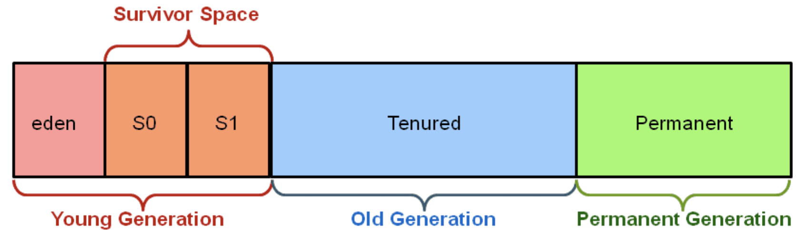
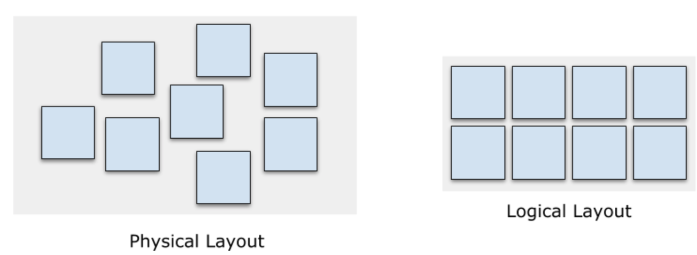
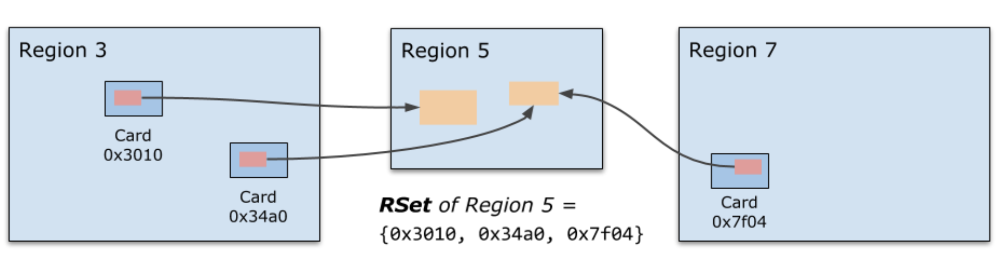
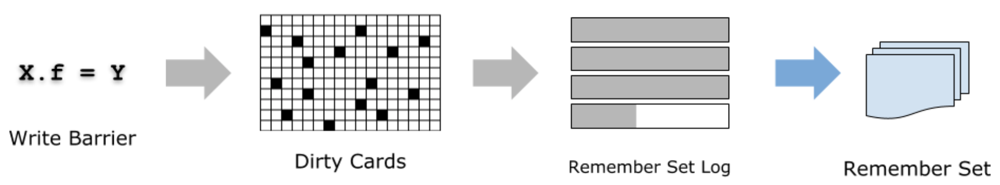
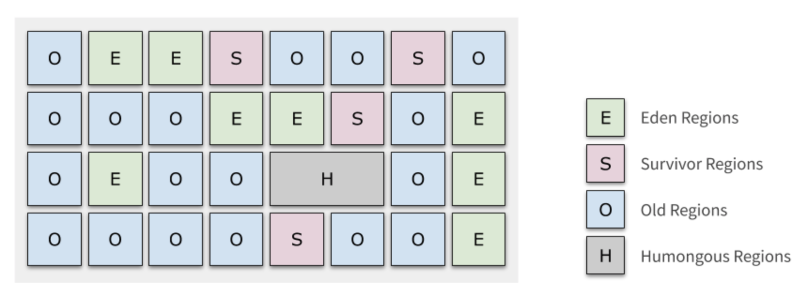
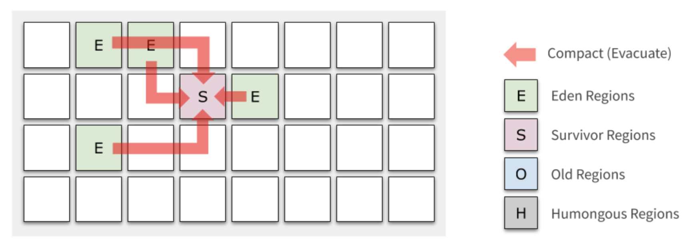
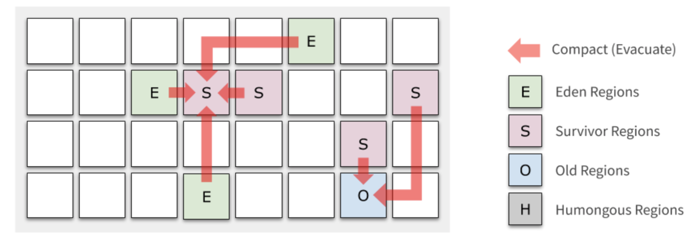
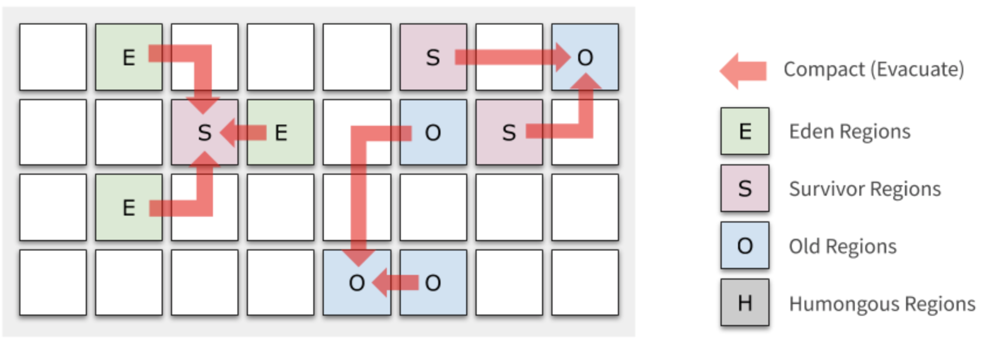
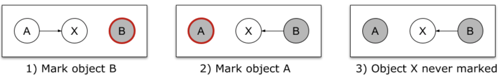
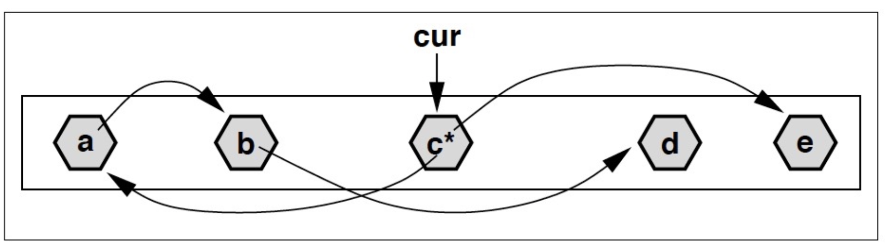

## G1 垃圾收集器

在过去很长一段时间内，HotSpot JVM 的首选垃圾收集器都是 ParNew + CMS 组合。直到 JDK7 中 Hotspot 团队首次公布了 G1（Garbage-First），并在 JDK9 中用 G1 作为默认的垃圾收集器。我们团队最近也将用了很多年的 CMS 换成了 G1 垃圾收集器。

本文主要从 G1 的论文 [Garbage-First Garbage Collection](http://citeseerx.ist.psu.edu/viewdoc/download?doi=10.1.1.63.6386&rep=rep1&type=pdf) 出发，结合其他较新的白皮书等，讲解 G1 垃圾收集器的工作原理。


## 设计动机

关于为什么要重新设计一个 G1 垃圾收集器，论文中给出的理由相当简单：现有的垃圾收集器无法满足**软实时（Soft Real-time）**特性：即让 GC 停顿能大致控制在某个阈值以内，但是又不必像实时系统那样非常严格。这也是很多业务系统都有的诉求。

在过去的 JVM 设计中，如下图所示，堆内存被分割成几个区域 —— Eden、Survivor、Old 的大小都是预先划分好的。对于总内存 64GB 的机器，可能 Old 区大小就有 32GB，即使用并行的方式收集一次仍然需要数秒。近十年，随着内存越来越大，这一问题也变得更为严重。

Hotspot JVM 经典内存布局



为了达到软实时的目标，同时也是为了更好地应对大内存，G1 将中不再使用上述的内存布局。


## 数据结构

首先，我们介绍 G1 种最核心的两个概念：Region 和 Remember Set。


### Heap Regions

如下图所示，G1 垃圾收集器将堆内存空间分成等分的 Regions，物理上不一定连续，逻辑上构成连续的堆地址空间。各个 Mutator 线程（即用户应用的线程）拥有各自的 Thread-Local Allocation Buffer (TLAB），用于降低各个线程分配内存的冲突。

G1 内存布局：Heap Regions



要特别注意的是，**巨型对象（Humongous Object）**，即大小超过 2/4 的 Region 大小的对象会作特殊处理，分配到由一个或多个连续 Region 构成的区域。巨型对象会引起其他一些问题，总之记得尽量别用就好了。

默认配置下，在满足 Region Size 是 2 的整数幂的前提下，G1 将总内存尽量划分成大约 2048 个 Region。


### Remember Set (RSet)

为什么要把堆空间分成 Region 呢？**其主要目的是让各个 Region 相对独立，可以分别进行 GC**，而不是一次性地把所有垃圾收集掉。我们知道现代 GC 算法都是基于可达性标记，而这个过程必须遍历所有 Live Objects 才能完成。那问题来了，如果为了收集一个 Region 的垃圾，却完整的遍历所有 Live Objects，这也太浪费了！

所以，我们需要一个机制来让各个 Region 能独立地进行垃圾收集，这也就是 Remember Set 存在的意义。每个 Region 会有一个对应的 Remember Set，它记录了**哪些内存区域中存在对当前 Region 中对象的引用。**（*all locations that might contain pointers to (live) objects within the region*）



Remember Set 记录引用当前 Region 中对象的 Cards

注意 Remember Set 不是直接记录对象地址，而是记录了那些对象所在的 Card 编号。所谓 Card 就是表示一小块（512 bytes）的内存空间，这里面很可能存在不止一个对象。但是这已经足够了：当我们需要确定当前 Region 有哪些对象存在外部引用时（这些对象是可达的，不能被回收），只要扫描一下这块 Card 中的所有对象即可，这比扫描所有 live objects 要容易的多。

实现上，Remember Set 的实现就是一个 Card 的 Hash Set，并且为每个 GC 线程都有一个本地的 Hash Set，最后的 Remember Set 实际上是这些 Hash Set 的并集。当 Card 数量特别多的时候会退化到 Region 粒度，这时候就要扫描更多的区域来寻找引用，时间换空间。

### Remember Set 的维护

维护上面所说的 Remember Set 势必需要记录对象的引用，通常的做法是在 set 一个引用的时候插入一段代码，这称为 Write Barrier。为了尽可能降低对 Mutator （用户线程）的影响，Write Barrier 的代码应当尽可能简化。G1 的 Write Barrier 实际上只是一个“通知”：将当前 set 引用的事件放到 Remember Set Log 队列中，交给后台专门的 GC 线程处理。



RememberSet 的维护

Write Barrier 具体实现如下。当发生 `X.f = Y` 时，假设 `rX` 为 X 对象的地址，`rY` 为 Y 对象的地址，则 Write 的同时还会执行以下逻辑：

```
t = (rX XOR rY) >> LogOfRegionSize  // 对 X, Y 地址右移得到 Region 编号，并将二者做个 XOR
if (rY == NULL ? 0 : t)  // 忽略两种情况： X.f 被赋值为 NULL，或 X 和 Y 位于同一个 Region 内
   rs_enqueue(rX)        // 如果 Card(X) 还不是 dirty 的，将 X 的地址放进 Log，并把该 card 置为 dirty
```

这里 Dirty Bit 的作用是去除重复的 Cards，考虑到一个 Cards 内经常发生密集的引用赋值（比如对象初始化），去重一下能大幅减少冗余。

最后，后台的 GC 线程则负责从 Remember Set Log 不断取出这些引用赋值发生的 Cards，扫描上面所有的对象，然后更新相应 Region 的 Remember Set。在并发标记发生之前，G1 会确保 Remember Set Log 中的记录都处理完，从而保证并发标记算法一定能拿到最新的、正确的 Remember Set。

极端情况下，如果后台的 GC 进程追不上 Mutator 进程写入的速度，这时候 Mutator 线程会退化到自己处理更新，形成反压机制。


## Generational Garbage-First

G1 名字来自于 Garbage-First 这个理念，即，**以收集到尽可能多的垃圾为第一目标**。每次收集时 G1 会选出垃圾最多的几个 Region，进行一次 Stop-the-world 的收集过程。

有趣的是，另一方面 G1 又是一个 Generational （分代）的垃圾收集器，它会从逻辑上将 Region 分成 Young、Old 等不同的 Generation，然后针对它们各自特点应用不同的策略。

G1 论文中提到它有一个 Pure Garbage-First 的模式，但在现在的资料中已经很难看到它的踪影，我猜测实际使用中 Generational 模式要效果好的多。以下我们也会只讨论 Generational 模式的工作方式。

经典的内存布局中，各代的内存区域是完全分开的，而 G1 中的 Generation 只是 Region 的一个动态标志，下图是一个标记了 Generation 的例子。各个 Region 的 Generation 是随着 GC 的进行而不断变化的，甚至各个代有多少 Region 这个比例也是随时调整的。



## Evacuation

为了方便读者理解 G1 收集的过程，我们先看下 Evacuation 的过程，之后再看如何做 Marking。

**Generational 模式下 G1 的垃圾收集分为两种：Young GC 和 Mixed GC**。

Young GC 只会涉及到 Young Regions，它将 Eden Region 中存活的对象移动到一个或多个新分配的 Survivor Region，之前的 Eden Region 就被归还到 Free list，供以后的新对象分配使用。

**Young GC - 1**



当区域中对象的 Survive 次数超过阈值（`TenuringThreshold`）时，Survivor Regions 的对象被移动到 Old Regions；否则和 Eden 的对象一样，继续留在 Survivor Regions 里。

**Young GC - 2**



多次 Young GC 之后，Old Regions 慢慢累积，直到到达阈值（`InitiatingHeapOccupancyPercent`，简称 IHOP），我们不得不对 Old Regions 做收集。这个阈值在 G1 中是根据用户设定的 GC 停顿时间动态调整的，也可以人为干预。

对 Old Regions 的收集会同时涉及若干个 Young 和 Old Regions，因此被称为 **Mixed GC**。Mixed GC 很多地方都和 Young GC 类似，不同之处是：它还会选择若干最有潜力的 Old Regions（收集垃圾的效率最高的 Regions），这些选出来要被 Evacuate 的 Region 称为本次的 Collection Set (CSet)。

**Mixed GC**




Mixed GC 的重要性不言而喻：Old Regions 的垃圾就是在这个阶段被收集掉的，也正是因为这样，Mixed GC 是工作量最为繁重的一个环节，如果不加以控制，就会像 CMS 一样发生长时间的 Full GC 停顿。这时候 Region 的设计就发挥出优越性了：只要把每次的 Collection Set 规模控制在一定范围，就能把每次收集的停顿时间软性地控制在 `MaxGCPauseMillis` 以内。起初这个控制可能不太精准，随着 JVM 的运行估算会越来越准确。

那来不及收集的那些 Region 呢？多来几次就可以了。所以你在 GC 日志中会看到 `continue mixed GCs` 的字样，代表分批进行的各次收集。这个过程会多次重复，直到垃圾的百分比降到 `G1HeapWastePercent` 以内，或者到达 `G1MixedGCCountTarget` 上限。

对于 Young Regions，我们对它有以下特殊优化：

1. Evacuation 的时候，Young Regions 一定会被放到待收集的 Regions 集合（Collection Set）中，原因很简单，绝大多数对象寿命都很短，在 Young Regions 做收集往往绝大部分都是垃圾。
2. 由于 Young Regions 一定会被收集，我们获得了一个可观的收益：Remember Set 的维护工作不需要考虑 Young 内的引用修改（换句话说 RSet 只关心 old-to-young 和 old-to-old 的引用），当 Young Region 上发生 Evacuation 时我们再去扫描并构建出它的 RSet 即可。


## Concurrent Marking

在 Evacuation 之前，我们要通过并发标记来确定哪些对象是垃圾、哪些还活着。G1 中的 Concurrent Marking 是以 Region 为单位的，为了保证结果的正确性，这里用到了 Snapshot-at-the-beginning（SATB）算法。

SATB 算法顾名思义是对 Marking 开始时的一个（逻辑上的）Snapshot 进行标记。为什么要用 Snapshot 呢？

下面就是一个直接标记导致问题的例子：对象 X 由于没有被标记到而被标记为垃圾，导致 B 引用失效。



如果只是对现场情况做标记，可能会漏掉某些对象

SATB 算法为了解决这一问题，在修改引用 `X.f = B` 之前插入了一个 Write Barrier，记录下被覆写之前的引用地址。这些地址最终也会被 Marking 线程处理，从而确保了所有在 Marking 开始时的引用一定会被标记到。这个 Write Barrier 伪代码如下：

```
t = the previous referenced address  // 记录原本的引用地址
if (t has been marked && t != NULL)  // 如果地址 t 还没来的及标记，且 t 不为 NULL
    satb_enqueue(t) // 放到 SATB 的待处理队列中，之后会去扫描这个引用
```

通过以上措施，SATB 确保 Marking 开始时存活的对象一定会被标记到。

标记的过程和 CMS 中是类似的，可以看作一个优化版的 DFS：记当前已经标记到的 offset 为 `cur`，随着标记的进行 cur 不断向后推进。每当访问到地址 < cur 的对象，就对它做深度扫描，递归标记所有应用；反之，对于地址 > cur 的对象，只标记不扫描，等到 cur 推进到那边的时候再去做扫描。


**基于 cur 指针实现 Concurrent Marking**



上图中，假设当前 cur 指向对象 c，c有两个引用：a 和 e，其中 a 的地址小于 cur，因而做了扫描；而 e 则仅仅是标记。扫描 a 的过程中又发现了对象 b，b 同样被标记并继续扫描。但是 b 引用的 d 在 cur 之后，所以 d 仅仅是被标记，不再继续扫描。

最后一个问题是：如何处理 Concurrent Marking 中新产生的对象？因为 SATB 算法只保证能标记到开始时 snapshot 的对象，对于新出现的那些对象，我们可以简单地认为它们全都是存活的，毕竟数量不是很多。