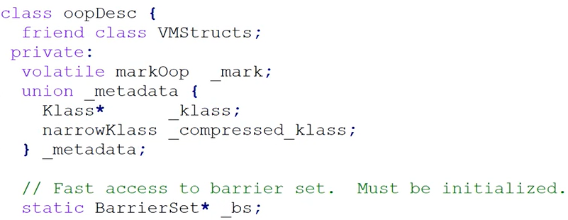
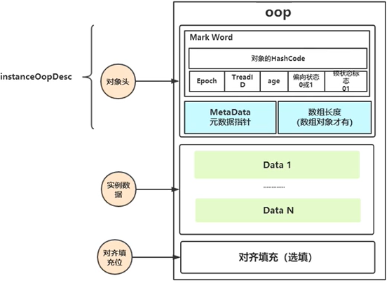
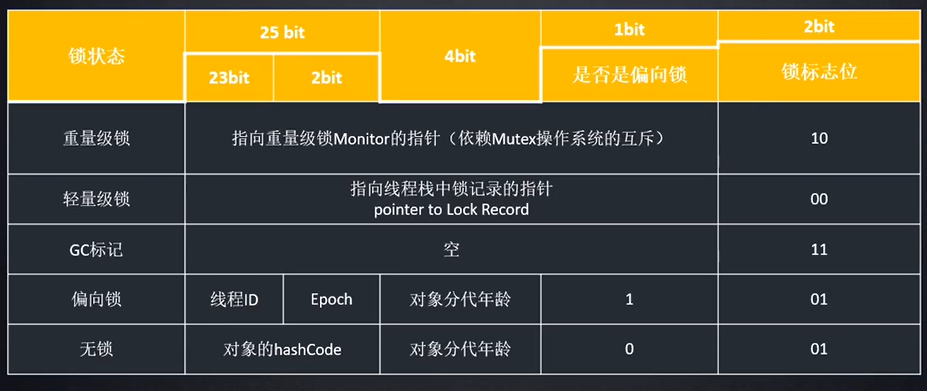
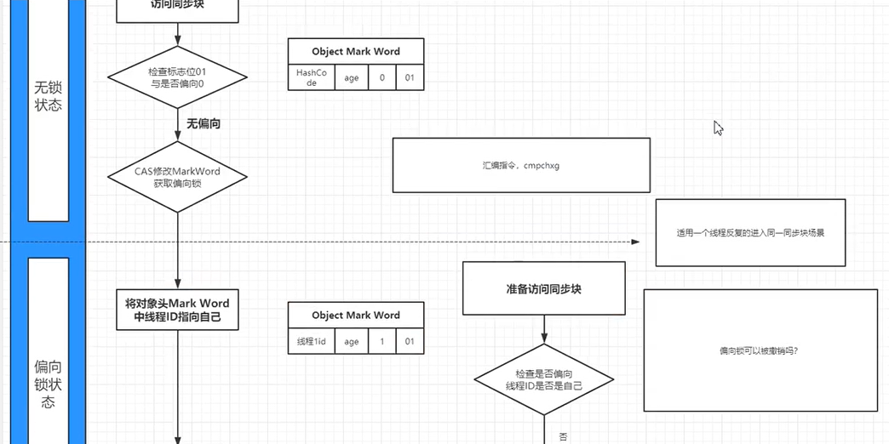

### oop.hpp

oop.hpp， java 对象的底层 c++ 描述

由对象头 VMStructs，元数据指针 \_mark，和一些其他的结构 \_bs 组成。

### 对象在 jvm 中的内存结构

在对一个对象加锁时。对象的锁状态，会记录在对象的对象头的 Mark Word 中。

以 Mark Word 在 32 位 jvm 中的存储内容为例：不同的锁状态对应不同的存储内容。

### jvm 锁升级过程

无锁 -> 偏向锁 -> 轻量级锁 -> 重量级锁

其中在锁的升级过程中会有改变线程 id，锁标志位的数据情况，此时用到 CAS 修改 Mark Work 的操作。操作系统底层使用的是汇编指令：cmpchxg 来保证这一步的原子操作。

**无锁状态升级到偏向锁状态的部分流程图**

偏向锁：适用于一个线程反复的进入同一同步块的场景

