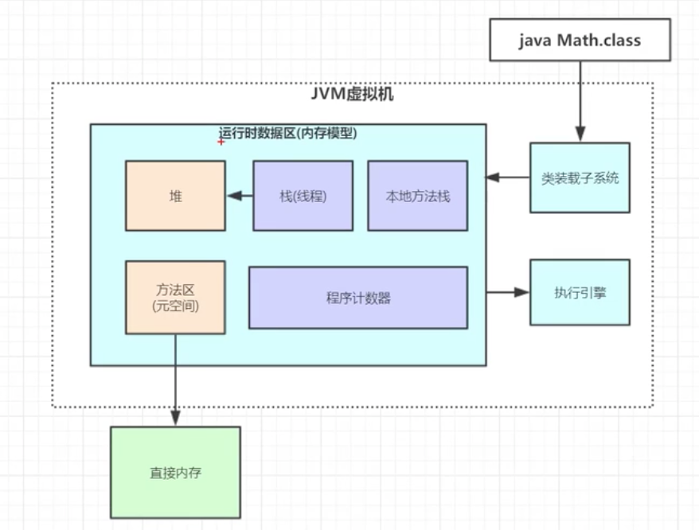
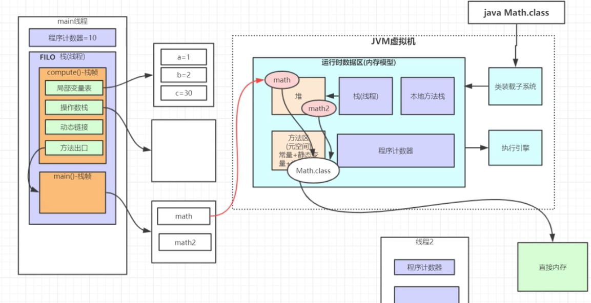
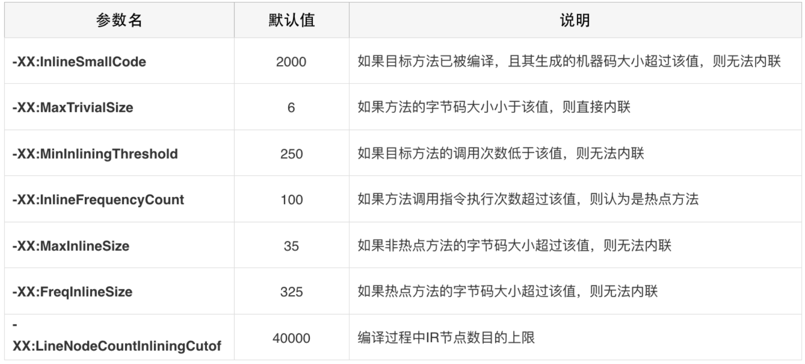

### 一、Java内存区域

<div align=middle></div>

**方法区（公有）**：

jvm 规范只是规定了方法区的这个概念和它的作用，并没有规定如何去实现它。

java 7及之前使用 永久代（PemGen）来实现方法区，相当于 jvm 中堆内存的一部分。java 8 及以后使用元空间（MetaSpace）实现方法区，使用的是本地内存。

<font color=green>用户存储已被虚拟机加载的类元信息，常量，静态变量（对实例对象的引用），即时编译器编译后的代码等数据。</font>

注：java 1.8之后 方法区变成了元空间，由原先的存储在jvm里变成 存储在机器的直接内存中。


**堆（公有）**：是JVM所管理的内存中最大的一块。唯一目的就是存放实例对象，几乎所有的对象实例都在这里分配。Java堆是垃圾收集器管理的主要区域，因此很多时候也被称为“GC堆”。异常状态 OutOfMemoryError


**虚拟机栈（线程私有）**：描述的是java方法执行的内存模型：每个方法在执行时都会创建一个栈帧，用户存储局部变量表，操作数栈，动态连接，方法出口等信息。每一个方法从调用直至完成的过程，就对应着一个栈帧在虚拟机栈中入栈到出栈的过程。 对这个区域定义了两种异常状态 OutOfMemoryError StackOverflowError


**本地方法栈（线程私有）**:与虚拟机栈所发挥的作用相似。它们之间的区别不过是虚拟机栈为虚拟机执行java方法，而本地方法栈为虚拟机使用到的Native方法服务。


**程序计数器（线程私有）**：一块较小的内存，当前线程所执行的字节码的行号指示器。字节码解释器工作时，就是通过改变这个计数器的值来选取下一条需要执行的字节码指令。字节码：java代码首先会由javac编译成 java.class 作为虚拟机运行时的字节码文件。

程序计数器主要有下⾯两个作⽤： 

1. 字节码解释器通过改变程序计数器来依次读取指令，从⽽实现代码的流程控制，如：顺序执⾏、 选择、循环、异常处理。 
2. 在多线程的情况下，程序计数器⽤于记录当前线程执⾏的位置，从⽽当线程被切换回来的时候能 够知道该线程上次运⾏到哪⼉了。

需要注意的是，如果执⾏的是 native ⽅法，那么程序计数器记录的是 undefined 地址，只有执⾏的 是 Java 代码时程序计数器记录的才是下⼀条指令的地址。 


### 二、Java 运行时内存模型

<div align=middle></div>


动态链接：放的是操作的方法对应的 jvm 指令码的地址

jvm 在运行时会给每个线程开辟一块内存，用来存放线程单独的信息。每个方法在内存中就是一个栈帧，其中局部变量表（本地变量表）中存放的是方法中声明的 基本变量 或者是 引用变量。引用变量实际上是一个内存地址，占用的空间叫引用空间，指向堆区域的对象数据空间。

堆里的 java 对象里的头指针（对象头） 会存放其对应的方法区中的 class 元信息指针和分代年龄（gc的年龄增加就是这个）。


### 三、方法内联

方法内联，是指在编译过程中遇到方法调用时，将目标方法的方法体纳入编译范围之中，并取代原方法调用的优化手段。JIT大部分的优化都是在内联的基础上进行的，方法内联是即时编译器中非常重要的一环。

Java服务中存在大量getter/setter方法，如果没有方法内联，在调用getter/setter时，程序执行时需要保存当前方法的执行位置，创建并压入用于getter/setter的栈帧、访问字段、弹出栈帧，最后再恢复当前方法的执行。内联了对 getter/setter的方法调用后，上述操作仅剩字段访问。在C2编译器 中，方法内联在解析字节码的过程中完成。当遇到方法调用字节码时，编译器将根据一些阈值参数决定是否需要内联当前方法的调用。

**方法内联的条件**

编译器的大部分优化都是在方法内联的基础上。所以一般来说，内联的方法越多，生成代码的执行效率越高。但是对于即时编译器来说，内联的方法越多，编译时间也就越长，程序达到峰值性能的时刻也就比较晚。

可以通过虚拟机参数-XX:MaxInlineLevel调整内联的层数，以及1层的直接递归调用（可以通过虚拟机参数-XX:MaxRecursiveInlineLevel调整）。一些常见的内联相关的参数如下表所示：

<div align=middle></div>


**虚函数内联**

内联是 JIT 提升性能的主要手段，但是虚函数使得内联是很难的，因为在内联阶段并不知道他们会调用哪个方法。

例如，我们有一个数据处理的接口，这个接口中的一个方法有三种实现add、sub和multi，JVM是通过保存虚函数表Virtual Method Table（以下称为VMT）存储class对象中所有的虚函数，class的实例对象保存着一个VMT的指针，程序运行时首先加载实例对象，然后通过实例对象找到VMT，通过VMT找到对应方法的地址，所以虚函数的调用比直接指向方法地址的classic call性能上会差一些。

很不幸的是，Java中所有非私有的成员函数的调用都是虚调用，C2编译器已经足够智能，能够检测这种情况并会对虚调用进行优化。

C2编译器的能力有限，对于一个实现方法的虚调用可以进行优化，但是对于多个实现方法的虚调用就“无能为力”了。

**多实现的虚调用：**

```java
public class SimpleInliningTest
{
    public static void main(String[] args) throws InterruptedException {
        VirtualInvokeTest obj = new VirtualInvokeTest();
        VirtualInvoke1 obj1 = new VirtualInvoke1();
        VirtualInvoke2 obj2 = new VirtualInvoke2();
        for (int i = 0; i < 100000; i++) {
            invokeMethod(obj);
            invokeMethod(obj1);
        invokeMethod(obj2);
        }
        Thread.sleep(1000);
    }

    public static void invokeMethod(VirtualInvokeTest obj) {
        obj.methodCall();
    }

    private static class VirtualInvokeTest {
        public void methodCall() {
            System.out.println("virtual call");
        }
    }

    private static class VirtualInvoke1 extends VirtualInvokeTest {
        @Override
        public void methodCall() {
            super.methodCall();
        }
    }
    private static class VirtualInvoke2 extends VirtualInvokeTest {
        @Override
        public void methodCall() {
            super.methodCall();
        }
    }
}
```


### 四、JIT 逃逸分析

**jdk 1.7 默认开启**

**Java编译器经过解释执行，其执行速度必然会比直接执行可执行的二进制字节码慢很多。为了解决这种效率问题，引入了 JIT（Just In Time ，即时编译） 技术。**

有了JIT技术之后，Java程序还是通过解释器进行解释执行，当JVM发现某个方法或代码块运行特别频繁的时候，就会认为这是“热点代码”（Hot Spot Code)。然后JIT会把部分“热点代码”翻译成本地机器相关的机器码，并进行优化，然后再把翻译后的机器码缓存起来，以备下次使用。

JIT在做了热点检测识别出热点代码后，除了会对其字节码进行缓存，还会对代码做各种优化。这些优化中，比较重要的几个有：逃逸分析、 锁消除、 锁膨胀、 方法内联、 空值检查消除、 类型检测消除、 公共子表达式消除等。


#### 逃逸分析：

通过逃逸分析，Hotspot编译器能够分析出一个新的对象的引用的使用范围从而决定是否要将这个对象分配到堆上。

<font color=green>方法逃逸：</font>StringBuffer sb是一个方法内部变量，在代码中直接将sb返回，这样这个StringBuffer有可能被其他方法所改变，这样它的作用域就不只是在方法内部，虽然它是一个局部变量，称其逃逸到了方法外部。

<font color=green>线程逃逸：</font>甚至还有可能被外部线程访问到，譬如赋值给类变量或可以在其他线程中访问的实例变量，称为线程逃逸。


比如：

``` java
public static String craeteStringBuffer(String s1, String s2) {
    StringBuffer sb = new StringBuffer();
    sb.append(s1);
    sb.append(s2);
    return sb.toString();
}
```

sb是一个方法内部变量，上述代码中并没有将他直接返回，这样这个StringBuffer有不会被其他方法所改变，这样它的作用域就只是在方法内部。我们就可以说这个变量并没有逃逸到方法外部。

有了逃逸分析，我们可以判断出一个方法中的变量是否有可能被其他线程所访问或者改变，那么基于这个特性，JIT就可以做一些优化：

- 同步省略
- 标量替换
- 栈上分配


**同步省略：**

与 jvm 锁消除技术有关。线程同步本身比较耗时，如果确定一个对象不会逃逸出线程，无法被其它线程访问到，那该对象的读写就不会存在竞争，对这个变量的同步措施就可以消除掉。单线程中是没有锁竞争。（锁和锁块内的对象不会逃逸出线程就可以把这个同步块取消）


**标量替换：**

标量（Scalar）是指一个无法再分解成更小的数据的数据。Java中的原始数据类型就是标量。相对的，那些还可以分解的数据叫做聚合量（Aggregate），Java中的对象就是聚合量，因为他可以分解成其他聚合量和标量。

在JIT阶段，如果经过逃逸分析，发现一个对象不会被外界访问的话，那么经过JIT优化，就会把这个对象拆解成若干个其中包含的若干个成员变量来代替。这个过程就是标量替换。

```
public static void main(String[] args) {
   alloc();
}

private static void alloc() {
   Point point = new Point（1,2）;
   System.out.println("point.x="+point.x+"; point.y="+point.y);
}
class Point{
    private int x;
    private int y;
}

// 上面代码中 point 没有逃出 alloc 方法，所以经过逃逸分析后，会将 point 对象（聚合量）替换成标量
private static void alloc() {
   int x = 1;
   int y = 2;
   System.out.println("point.x="+x+"; point.y="+y);
}
```


**栈上分配**

通过标量替换，原本的一个对象，被替换成了多个成员变量。而原本需要在堆上分配的内存，也就不再需要了，完全可以在虚拟机栈中完成对成员变量的内存分配。

通过 -XX:+DoEscapeAnalysis 可以手动开启逃逸分析。


**部分逃逸分析**

部分逃逸分析也是Graal对于概率预测的应用。通常来说，如果发现一个对象逃逸出了方法或者线程，JVM就不会去进行优化。

但是Graal编译器依然会去分析当前程序的执行路径，它会在逃逸分析基础上收集、判断哪些路径上对象会逃逸，哪些不会。然后根据这些信息，在不会逃逸的路径上进行锁消除、标量替换、栈上分配这些优化手段。


