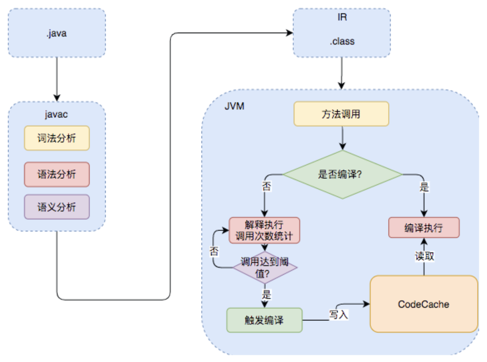
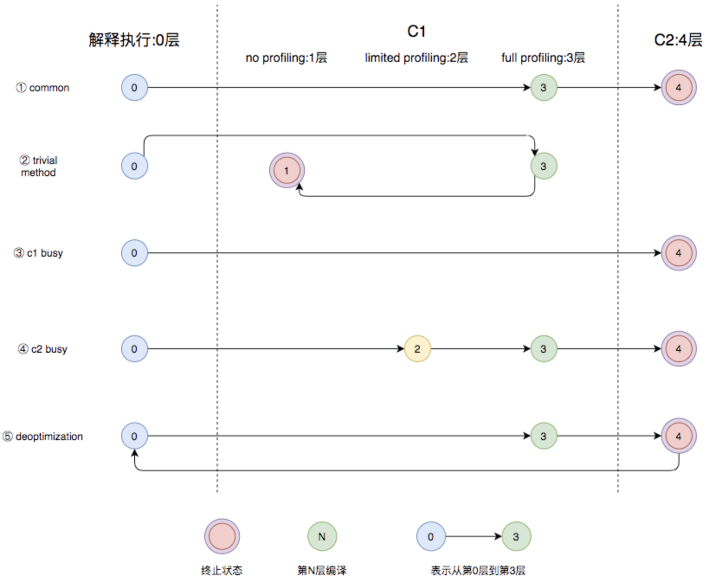
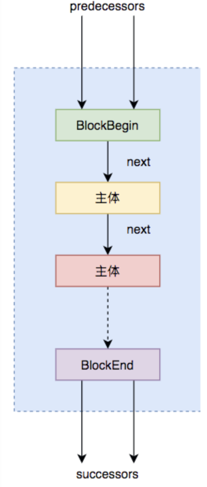

### 一、java 的执行过程

Java的执行过程整体可以分为两个部分，第一步由javac将源码编译成字节码，在这个过程中会进行词法分析、语法分析、语义分析，编译原理中这部分的编译称为前端编译。接下来无需编译直接逐条将字节码解释执行，在解释执行的过程中，虚拟机同时对程序运行的信息进行收集，在这些信息的基础上，编译器会逐渐发挥作用，它会进行后端编译——把字节码编译成机器码，但不是所有的代码都会被编译，只有被JVM认定为的热点代码，才可能被编译。

怎么样才会被认为是热点代码呢？JVM中会设置一个阈值，当方法或者代码块的在一定时间内的调用次数超过这个阈值时就会被编译，存入codeCache中。当下次执行时，再遇到这段代码，就会从codeCache中读取机器码，直接执行，以此来提升程序运行的性能。整体的执行过程大致如下图所示：IR（中间表示）

<div align=middle></div>


### 二、jvm 中的编译器

#### Client Compiler （C1）

Client Compiler注重启动速度和局部的优化。性能不如 server complier ，但是编译器启动速度较快。

**C1编译器：**

- 局部简单可靠的优化，比如字节码上进行的一些基础优化，方法内联、常量传播等，放弃许多耗时较长的全局优化。
- 将字节码构造成高级中间表示（High-level Intermediate Representation，以下称为HIR），HIR与平台无关，通常采用图结构，更适合JVM对程序进行优化。
- 最后将HIR转换成低级中间表示（Low-level Intermediate Representation，以下称为LIR），在LIR的基础上会进行<font color = green> 寄存器分配、窥孔优化</font>等操作，最终生成机器码。


#### Server Compiler（C2 / Graal Compiler）

Server Compiler更加关注全局的优化。性能好于 Client Compiler，但是编译器启动速度较慢。

**C2：**

先生成 Ideal Graph，再生成 MachNode Graph（也是一种 IR）

C2编译器在进行编译优化时，会使用一种控制流与数据流结合的图数据结构，称为Ideal Graph。

Ideal Graph的构建是在解析字节码的时候，根据字节码中的指令向一个空的Graph中添加节点，Graph中的节点通常对应一个指令块，每个指令块包含多条相关联的指令，JVM会利用一些优化技术对这些指令进行优化，比如Global Value Numbering、常量折叠等。

无论是否进行全局优化，Ideal Graph都会被转化为一种更接近机器层面的MachNode Graph，最后编译的机器码就是从MachNode Graph中得的，生成机器码前还会有一些包括 <font color = green> 循环转换、寄存器分配、窥孔优化</font>等操作：

**Graal Compiler：**

从JDK 9开始，Hotspot VM中集成了一种新的Server Compiler，Graal编译器。相比C2编译器，Graal有这样几种关键特性：

- 前文有提到，JVM会在解释执行的时候收集程序运行的各种信息，然后编译器会根据这些信息进行一些基于预测的激进优化，比如分支预测，根据程序不同分支的运行概率，选择性地编译一些概率较大的分支。Graal比C2更加青睐这种优化，所以Graal的峰值性能通常要比C2更好。
- 使用Java编写，对于Java语言，尤其是新特性，比如Lambda、Stream等更加友好。
- 更深层次的优化，比如虚函数的内联、部分逃逸分析等。

Graal编译器可以通过Java虚拟机参数-XX:+UnlockExperimentalVMOptions -XX:+UseJVMCICompiler启用。当启用时，它将替换掉HotSpot中的C2编译器，并响应原本由C2负责的编译请求。


### 三、分层编译

在Java 7以前，需要研发人员根据服务的性质去选择编译器。对于需要快速启动的，或者一些不会长期运行的服务，可以采用编译效率较高的C1，对应参数-client。长期运行的服务，或者对峰值性能有要求的后台服务，可以采用峰值性能更好的C2，对应参数-server。Java 7开始引入了分层编译的概念，它结合了C1和C2的优势，追求启动速度和峰值性能的一个平衡。分层编译将JVM的执行状态分为了五个层次：

1. 解释执行。
2. 执行不带profiling的C1代码。
3. 执行仅带方法调用次数以及循环回边执行次数profiling的C1代码。
4. 执行带所有profiling的C1代码。
5. 执行C2代码。

profiling就是收集能够反映程序执行状态的数据。其中最基本的统计数据就是方法的调用次数，以及循环回边的执行次数。

通常情况下，C2代码的执行效率要比C1代码的高出30%以上。C1层执行的代码，按执行效率排序从高至低则是1层>2层>3层。

几种常见的编译路径：

<div align=middle></div>


- 图中第①条路径，代表编译的一般情况，热点方法从解释执行到被3层的C1编译，最后被4层的C2编译。
- 如果方法比较小（比如Java服务中常见的getter/setter方法），3层的profiling没有收集到有价值的数据，JVM就会断定该方法对于C1代码和C2代码的执行效率相同，就会执行图中第②条路径。在这种情况下，JVM会在3层编译之后，放弃进入C2编译，直接选择用1层的C1编译运行。
- 在C1忙碌的情况下，执行图中第③条路径，在解释执行过程中对程序进行profiling ，根据信息直接由第4层的C2编译。
- 前文提到C1中的执行效率是1层>2层>3层，第3层一般要比第2层慢35%以上，所以在C2忙碌的情况下，执行图中第④条路径。这时方法会被2层的C1编译，然后再被3层的C1编译，以减少方法在3层的执行时间。
- 如果编译器做了一些比较激进的优化，比如分支预测，在实际运行时发现预测出错，这时就会进行反优化，重新进入解释执行，图中第⑤条执行路径代表的就是反优化。

总的来说，C1的编译速度更快，C2的编译质量更高，分层编译的不同编译路径，也就是JVM根据当前服务的运行情况来寻找当前服务的最佳平衡点的一个过程。从JDK 8开始，JVM默认开启分层编译。


### 四、即时编译的触发

Java虚拟机根据方法的调用次数以及循环回边的执行次数来触发即时编译。

当方法的调用次数和循环回边的次数的和，超过由参数-XX:CompileThreshold指定的阈值时（使用C1时，默认值为1500；使用C2时，默认值为10000），就会触发即时编译。

开启分层编译的情况下，-XX:CompileThreshold参数设置的阈值将会失效，触发编译会由以下的条件来判断：

- 方法调用次数大于由参数-XX:TierXInvocationThreshold指定的阈值乘以系数。
- 方法调用次数大于由参数-XX:TierXMINInvocationThreshold指定的阈值乘以系数，并且方法调用次数和循环回边次数之和大于由参数-XX:TierXCompileThreshold指定的阈值乘以系数时。


### 五、编译优化

#### 1、中间表达形式 （Intermediate Representation）

在编译原理中，通常把编译器分为前端和后端，前端编译经过词法分析、语法分析、语义分析生成中间表达形式（Intermediate Representation，以下称为IR），后端会对IR进行优化，生成目标代码。

Java字节码就是一种IR，但是字节码的结构复杂，字节码这样代码形式的IR也不适合做全局的分析优化。现代编译器一般采用图结构的IR，静态单赋值（Static Single Assignment，SSA）IR是目前比较常用的一种。


**C1中的中间表达形式**

前文提及C1编译器内部使用高级中间表达形式HIR，低级中间表达形式LIR来进行各种优化，这两种IR都是SSA形式的。

HIR是由很多基本块（Basic Block）组成的控制流图结构，每个块包含很多SSA形式的指令。

<div align=middle></div>

C1编译器优化大部分都是在HIR之上完成的。当优化完成之后它会将HIR转化为LIR，LIR和HIR类似，也是一种编译器内部用到的IR，HIR通过优化消除一些中间节点就可以生成LIR，形式上更加简化。


**C2中的中间表达形式 （Sea-of-Nodes IR）SSA 形式** 

C2编译器中的Ideal Graph采用的是一种名为Sea-of-Nodes中间表达形式，同样也是SSA形式的。它最大特点是去除了变量的概念，直接采用值来进行运算。为了方便理解，可以利用IR可视化工具Ideal Graph Visualizer（IGV），来展示具体的IR图。


**Global Value Numbering**

Global Value Numbering（GVN） 是一种因为Sea-of-Nodes变得非常容易的优化技术 。

GVN是指为每一个计算得到的值分配一个独一无二的编号，然后遍历指令寻找优化的机会，它可以发现并消除等价计算的优化技术。如果一段程序中出现了多次操作数相同的乘法，那么即时编译器可以将这些乘法合并为一个，从而降低输出机器码的大小。如果这些乘法出现在同一执行路径上，那么GVN还将省下冗余的乘法操作。在Sea-of-Nodes中，由于只存在值的概念，因此GVN算法将非常简单：即时编译器只需判断该浮动节点是否与已存在的浮动节点的编号相同，所输入的IR节点是否一致，便可以将这两个浮动节点归并成一个。比如下面这段代码：

GVN

```
a = 1;
b = 2;
c = a + b;
d = a + b;
e = d;
```

GVN会利用Hash算法编号，计算a = 1时，得到编号1，计算b = 2时得到编号2，计算c = a + b时得到编号3，这些编号都会放入Hash表中保存，在计算d = a + b时，会发现a + b已经存在Hash表中，就不会再进行计算，直接从Hash表中取出计算过的值。最后的e = d也可以由Hash表中查到而进行复用。

可以将GVN理解为在IR图上的公共子表达式消除（Common Subexpression Elimination，CSE）。两者区别在于，GVN直接比较值的相同与否，而CSE是借助词法分析器来判断两个表达式相同与否。


#### 2、方法内联


#### 3、逃逸分析


#### 4、 Loop Transformations（循环转换）

C2编译器在构建Ideal Graph后会进行很多的全局优化，其中就包括对循环的转换，最重要的两种转换就是循环展开和循环分离。

**循环展开**

循环展开是一种循环转换技术，它试图以牺牲程序二进制码大小为代价来优化程序的执行速度，是一种用空间换时间的优化手段。

循环展开通过减少或消除控制程序循环的指令，来减少计算开销，这种开销包括增加指向数组中下一个索引或者指令的指针算数等。

```java
// 原代码
public void loopRolling(){
  for(int i = 0;i<200;i++){
    delete(i);  
  }
}

// 上面的代码需要循环删除200次，通过循环展开可以得到下面这段代码，循环展开：
public void loopRolling(){
  for(int i = 0;i<200;i+=5){
    delete(i);
    delete(i+1);
    delete(i+2);
    delete(i+3);
    delete(i+4);
  }
}
```

这样展开就可以减少循环的次数，每次循环内的计算也可以利用CPU的流水线提升效率。当然这只是一个示例，实际进行展开时，JVM会去评估展开带来的收益，再决定是否进行展开。


**循环分离**

循环分离也是循环转换的一种手段。它把循环中一次或多次的特殊迭代分离出来，在循环外执行。举个例子，下面这段代码：

循环分离

```java
int a = 10;
for(int i = 0;i<10;i++){
  b[i] = x[i] + x[a];
  a = i;
}
```

可以看出这段代码除了第一次循环a = 10以外，其他的情况a都等于i-1。所以可以把特殊情况分离出去，变成下面这段代码：

循环分离

```java
b[0] = x[0] + 10;
for(int i = 1;i<10;i++){
  b[i] = x[i] + x[i-1];
}
```

这种等效的转换消除了在循环中对a变量的需求，从而减少了开销。


#### 5、窥孔优化与寄存器分配

**窥孔优化：**

是优化的最后一步，这之后程序就会转换成机器码，窥孔优化就是将编译器所生成的中间代码（或目标代码）中相邻指令，将其中的某些组合替换为效率更高的指令组，常见的比如强度削减、常数合并等，看下面这个例子就是一个强度削减的例子：

强度削减

```java
y1=x1*3  经过强度削减后得到  y1=(x1<<1)+x1
```

编译器使用移位和加法削减乘法的强度，使用更高效率的指令组。

**寄存器分配：**

也是一种编译的优化手段，在C2编译器中普遍的使用。它是通过把频繁使用的变量保存在寄存器中，CPU访问寄存器的速度比内存快得多，可以提升程序的运行速度。

寄存器分配和窥孔优化是程序优化的最后一步。经过寄存器分配和窥孔优化之后，程序就会被转换成机器码保存在codeCache中。