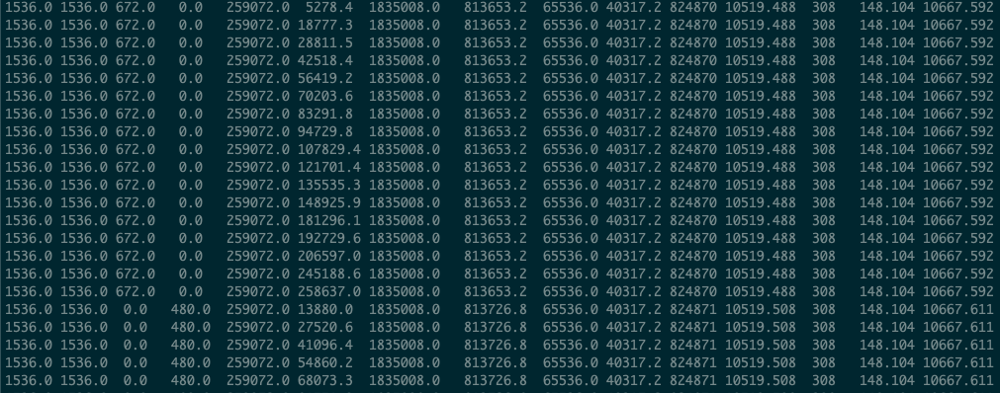
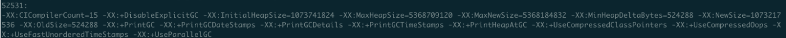
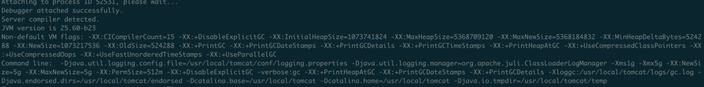
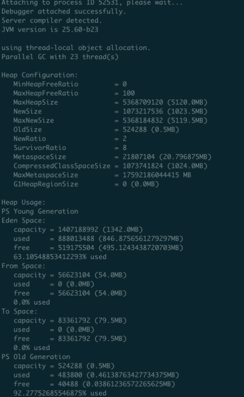
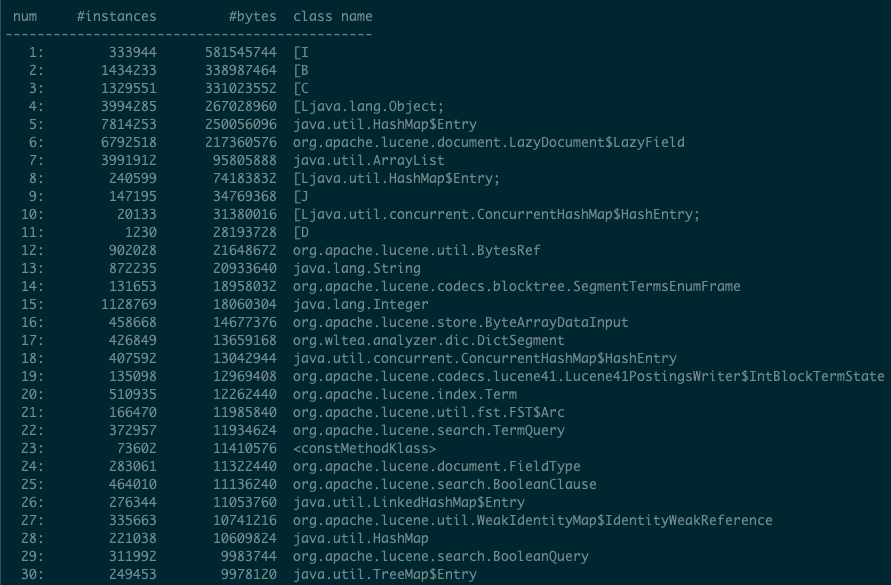
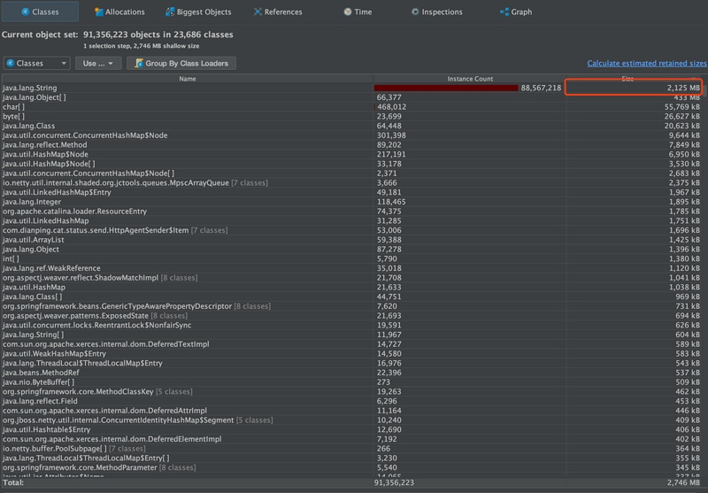
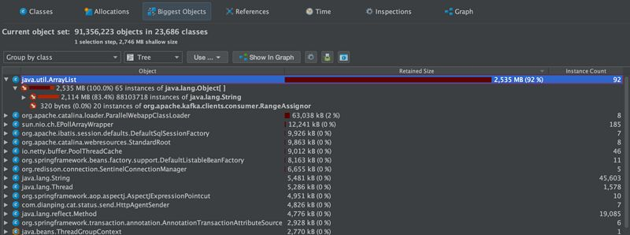
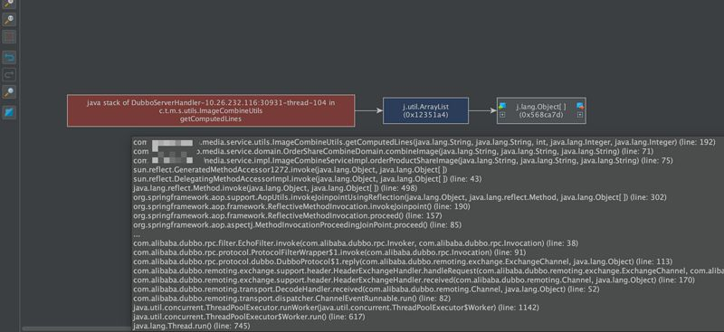

### 参数分析

[在线 GC 分析报告 测试环境dataEngine 项目](https://gceasy.io/my-gc-report.jsp?p=c2hhcmVkLzIwMjAvMDcvMzAvLS1nYy5sb2ctLTQtNDEtMg==&channel=WEB)

#### jstat -gc 13419 2000

13419：java 进程 id

2000：每隔 2 秒打印一次 gc 日志



<font color=green>参数含义</font>

```
S0C：年轻代中第一个survivor（幸存区）的容量 (Kb)
S1C：年轻代中第二个survivor（幸存区）的容量 (Kb)
S0U：年轻代中第一个survivor（幸存区）目前已使用空间 (Kb)
S1U：年轻代中第二个survivor（幸存区）目前已使用空间 (Kb)
EC：年轻代中Eden（伊甸园）的容量 (Kb)
EU：年轻代中Eden（伊甸园）目前已使用空间 (Kb)
OC：Old代的容量 (Kb)
OU：Old代目前已使用空间 (Kb)
PC：Perm(持久代)的容量 (Kb)
PU：Perm(持久代)目前已使用空间 (Kb)
YGC：从应用程序启动到采样时年轻代中gc次数
YGCT：从应用程序启动到采样时年轻代中gc所用时间(s)
FGC：从应用程序启动到采样时old代(全gc)gc次数
FGCT：从应用程序启动到采样时old代(全gc)gc所用时间(s)
GCT：从应用程序启动到采样时gc用的总时间(s)
NGCMN：年轻代(young)中初始化(最小)的大小 (Kb)
NGCMX：年轻代(young)的最大容量 (Kb)
NGC：年轻代(young)中当前的容量 (Kb)
OGCMN：old代中初始化(最小)的大小 (Kb)
OGCMX：old代的最大容量 (Kb)
OGC：old代当前新生成的容量 (Kb)
PGCMN：perm代中初始化(最小)的大小 (Kb)
PGCMX：perm代的最大容量 (Kb)  
PGC：perm代当前新生成的容量 (Kb)
S0：年轻代中第一个survivor（幸存区）已使用的占当前容量百分比
S1：年轻代中第二个survivor（幸存区）已使用的占当前容量百分比
E：年轻代中Eden（伊甸园）已使用的占当前容量百分比
O：old代已使用的占当前容量百分比
P：perm代已使用的占当前容量百分比
S0CMX：年轻代中第一个survivor（幸存区）的最大容量 (Kb)
S1CMX ：年轻代中第二个survivor（幸存区）的最大容量 (Kb)
ECMX：年轻代中Eden（伊甸园）的最大容量 (Kb)
DSS：当前需要survivor（幸存区）的容量 (Kb)（Eden区已满）
TT： 持有次数限制
MTT ： 最大持有次数限制
```

经过分析可知：因为每隔2秒打印一次，当打印 15 行的时候，发现进行了 gc。此时发现，YGC 数值加 1，FGC 不变。所以，young gc 大概每隔 30 秒进行一次。

当一次 YGC 过后，会发现 EU 的值，瞬间会减少很多，说明新产生的对象在 YGC 的过程中被收集了。同时，OU 的值会增大，说明有一些存活时间比较久的对象被移到了老年代。

这样一次 YGC 过后，S0U 和 S1U 互换了角色。EU 继续持续增大，当增大到接近 EC 的容量时，再一次触发 young gc。


### 常用的 jvm 分析命令

jdk 1.7 开始提供

**jcmd 52531 VM.flags （查看）jvm 启动参数**

****


**jinfo -flags 52531 （查看 jvm 启动参数和启动命令行）**




**jmap -heap 52531（查看 jvm 堆内存分配信息）**




**jvm 堆内存分配参数含义**

```
using thread-local object allocation.  
 
Parallel GC   ##同步并行垃圾回收
 
  
Heap Configuration:  ##堆配置情况，也就是JVM参数配置的结果[平常说的tomcat配置JVM参数，就是在配置这些]
 
   MinHeapFreeRatio = 40 ##最小堆使用比例
 
   MaxHeapFreeRatio = 70 ##最大堆可用比例
 
   MaxHeapSize      = 2147483648 (2048.0MB) ##最大堆空间大小
 
   NewSize          = 268435456 (256.0MB) ##新生代分配大小
 
   MaxNewSize       = 268435456 (256.0MB) ##最大可新生代分配大小
 
   OldSize          = 5439488 (5.1875MB) ##老年代大小
 
   NewRatio         = 2  ##新生代比例
 
   SurvivorRatio    = 8 ##新生代与suvivor的比例
 
   PermSize         = 134217728 (128.0MB) ##perm区 永久代大小
 
   MaxPermSize      = 134217728 (128.0MB) ##最大可分配perm区 也就是永久代大小
 
  
 
Heap Usage: ##堆使用情况【堆内存实际的使用情况】
 
New Generation (Eden + 1 Survivor Space):  ##新生代（伊甸区Eden区 + 幸存区survior(1+2)空间）
 
   capacity = 241631232 (230.4375MB)  ##伊甸区容量
 
   used     = 77776272 (74.17323303222656MB) ##已经使用大小
 
   free     = 163854960 (156.26426696777344MB) ##剩余容量
 
   32.188004570534986% used ##使用比例
 
Eden Space:  ##伊甸区
 
   capacity = 214827008 (204.875MB) ##伊甸区容量
 
   used     = 74442288 (70.99369812011719MB) ##伊甸区使用
 
   free     = 140384720 (133.8813018798828MB) ##伊甸区当前剩余容量
 
   34.65220164496263% used ##伊甸区使用情况
 
From Space: ##survior1区
 
   capacity = 26804224 (25.5625MB) ##survior1区容量
 
   used     = 3333984 (3.179534912109375MB) ##surviror1区已使用情况
 
   free     = 23470240 (22.382965087890625MB) ##surviror1区剩余容量
 
   12.43827838477995% used ##survior1区使用比例
 
To Space: ##survior2 区
 
   capacity = 26804224 (25.5625MB) ##survior2区容量
 
   used     = 0 (0.0MB) ##survior2区已使用情况
 
   free     = 26804224 (25.5625MB) ##survior2区剩余容量
 
   0.0% used ## survior2区使用比例
 
PS Old  Generation: ##老年代使用情况
 
   capacity = 1879048192 (1792.0MB) ##老年代容量
 
   used     = 30847928 (29.41887664794922MB) ##老年代已使用容量
 
   free     = 1848200264 (1762.5811233520508MB) ##老年代剩余容量
 
   1.6416783843721663% used ##老年代使用比例
 
Perm Generation: ##永久代使用情况
 
   capacity = 134217728 (128.0MB) ##perm区容量
 
   used     = 47303016 (45.111671447753906MB) ##perm区已使用容量
 
   free     = 86914712 (82.8883285522461MB) ##perm区剩余容量
 
   35.24349331855774% used ##perm区使用比例
```


**jmap -histo pid 分析某个 java 进程产生的对象**




**jmap -dump pid**

可生成 java 进程的一个堆快照文件dump.hprof，压缩成 tar.gz 格式。

**例：**堆分析工具JProfile，装载这个dump.hprof文件

堆当时的所有类占比大小的信息：



发现导致堆溢出，就是这个String对象，和之前Jmap得出的结果一样，超过了2个G，并且无法被回收。

看大对象视图，发现这些个String对象都是被java.util.ArrayList引用着的，也就是有一个ArrayList里，引用了超过2G的对象。



最后查看引用的关系图，往上溯源，源头终于显形：
