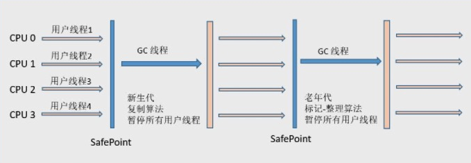

# jvm 分析工具

# 收集器组合

**-XX:+UseSerialGC**

Serial (DefNew) + Serial Old（Serial Mark Sweep Compact）

### **-XX:+UseParNewGC**

Parallel (ParNew) + Serial Old（Serial Mark Sweep Compact）

### **-XX:+UseParallelGC**

Parallel Scavenge (PSYoungGen) + Serial Old（Serial Mark Sweep Compact (PSOldGen)）

### -XX:+UseParallelOldGC

Parallel Scavenge (PSYoungGen) + Parallel Mark Sweep Compact (ParOldGen)

### **-XX:-UseParNewGC -XX:+UseConcMarkSweepGC**

Serial (DefNew) + CMS（Concurrent Mark Sweep）

### **-XX:+UseParNewGC -XX:+UseConcMarkSweepGC**

Parallel (ParNew) + CMS（Concurrent Mark Sweep） + Serial Old（Serial Mark Sweep Compact）

### -XX:+UseG1GC

# 垃圾收集器

**G1 之前的内存布局：**

**如果说收集算法是内存回收的方法论，那么垃圾收集器就是内存回收的具体实现**

Hotspot实现了如此多的收集器，正是因为目前并无完美的收集器出现，只是选择对具体应用最适合的收集器。

## 新生代收集器

### Serial 收集器

serial 收集器是最基本、发展历史最悠久的收集器，它是采用 **复制算法** 的 **新生代收集器**，曾经（JDK 1.3.1之前）是虚拟机 **新生代** 收集的唯一选择。它是一个单线程收集器，只会使用一个CPU或一条收集线程去完成垃圾收集工作，更重要的是 **它在进行垃圾收集时，必须暂停其他所有的工作线程，直至Serial收集器收集结束为止（“Stop The World”）。**

下图展示了Serial 收集器（老年代采用Serial Old收集器）的运行过程：

标记整理算法：先标记移动后，再清除没有引用的对象

它依然是HotSpot虚拟机运行在Client模式下的默认的新生代收集器。它也有着优于其他收集器的地方：简单而高效（与其他收集器的单线程相比），对于限定单个CPU的环境来说，Serial收集器由于没有线程交互的开销，专心做垃圾收集自然可以获得更高的单线程收集效率。

### ParNew 收集器

**ParNew**收集器就是Serial收集器的多线程版本，它也是一个**新生代收集器**。除了使用多线程进行垃圾收集外，其余行为包括Serial收集器可用的所有控制参数、收集算法（复制算法）、Stop The World、对象分配规则、回收策略等与Serial收集器完全相同，两者共用了相当多的代码。

ParNew收集器的工作过程如下图（老年代采用Serial Old收集器）：

ParNew收集器除了使用多线程收集外，其他与Serial收集器相比并无太多创新之处，但它却是许多运行在Server模式下的虚拟机中首选的新生代收集器，其中有一个与性能无关的重要原因是，

**除了Serial收集器外，目前只有它能和CMS收集器（Concurrent Mark Sweep）配合工作。**

ParNew 收集器在**单CPU的环境**中绝对不会有比Serial收集器有更好的效果。

#### 

### Parallel Scavenge 收集器

**Parallel Scavenge**收集器也是一个**并行**的**多线程新生代**收集器，它也使用**复制算法**。Parallel Scavenge收集器的特点是它的关注点与其他收集器不同，CMS等收集器的关注点是尽可能缩短垃圾收集时用户线程的停顿时间，而Parallel Scavenge收集器的目标是**达到一个可控制的吞吐量（Throughput）**。

**停顿时间越短就越适合需要与用户交互的程序**，良好的响应速度能提升用户体验。而**高吞吐量**则可以高效率地利用CPU时间，尽快完成程序的运算任务，主要适合**在后台运算而不需要太多交互的任务**。

Parallel Scavenge收集器除了会显而易见地提供可以精确控制吞吐量的参数，还提供了一个参数**-XX:+UseAdaptiveSizePolicy**，这是一个开关参数，打开参数后，就不需要手工指定新生代的大小（-Xmn）、Eden和Survivor区的比例（-XX:SurvivorRatio）、晋升老年代对象年龄（-XX:PretenureSizeThreshold）等细节参数了，虚拟机会根据当前系统的运行情况收集性能监控信息，动态调整这些参数以提供最合适的停顿时间或者最大的吞吐量，这种方式称为**GC自适应的调节策略（GC Ergonomics）**。自适应调节策略也是Parallel Scavenge收集器与ParNew收集器的一个重要区别。

另外值得注意的一点是，Parallel Scavenge收集器无法与CMS收集器配合使用，所以在JDK 1.6推出Parallel Old之前，如果新生代选择Parallel Scavenge收集器，老年代只有Serial Old收集器能与之配合使用。

## 老年代收集器

### Serial Old 收集器

Serial Old 是 Serial收集器的老年代版本，它同样是一个**单线程收集器**，使用**“标记-整理”（Mark-Compact）**算法。

- 在JDK1.5 以及之前版本（Parallel Old诞生以前）中与Parallel Scavenge收集器搭配使用。
- 作为CMS收集器的后备预案，在并发收集发生**Concurrent Mode Failure**时使用。

### Paraller Old 收集器

Parallel Old收集器是Parallel Scavenge收集器的老年代版本，使用**多线程**和**“标记-整理”**算法。在**注重吞吐量**以及**CPU资源敏感**的场合，都可以优先考虑Parallel Scavenge加Parallel Old收集器。Parallel Old收集器的工作流程与Parallel Scavenge相同。

### CMS 收集器

**CMS（Concurrent Mark Sweep）（使用 标记-清除算法）**

收集器是一种以 **获取最短回收停顿时间** 为目标的收集器，它非常符合那些集中在互联网站或者B/S系统的服务端上的Java应用，这些应用都非常重视服务的响应速度。

CMS收集器工作的整个流程分为以下4个步骤：

- **初始标记（CMS initial mark）**：仅仅只是标记一下GC Roots能直接关联到的对象，速度很快，需要“Stop The World”。
- **并发标记（CMS concurrent mark）**：进行**GC Roots Tracing**的过程，在整个过程中耗时最长。
- **重新标记（CMS remark）**：为了修正并发标记期间因用户程序继续运作而导致标记产生变动的那一部分对象的标记记录，这个阶段的停顿时间一般会比初始标记阶段稍长一些，但远比并发标记的时间短。此阶段也需要“Stop The World”。
- **并发清除（CMS concurrent sweep）**

整个过程中耗时最长的并发标记和并发清除过程收集器线程都可以与用户线程一起工作，所以，从总体上来说，CMS收集器的内存回收过程是与用户线程一起并发执行的。

**优点**

CMS是一款优秀的收集器，它的主要**优点**在名字上已经体现出来了：**并发收集**、**低停顿**，因此CMS收集器也被称为**并发低停顿收集器**

**缺点**

- ***\*对CPU资源非常敏感\**** 其实，面向并发设计的程序都对CPU资源比较敏感。在并发阶段，它虽然不会导致用户线程停顿，但会因为占用了一部分线程（或者说CPU资源）而导致应用程序变慢总吞吐量会降低。

- ***\*无法处理浮动垃圾（Floating Garbage）\**** 可能出现“Concurrent Mode Failure”失败而导致另一次Full GC的产生。***\*由于CMS并发清理阶段用户线程还在运行着，伴随程序运行自然就还会有新的垃圾不断产生。\****这一部分垃圾出现在标记过程之后，CMS无法再当次收集中处理掉它们，只好留待下一次GC时再清理掉。这一部分垃圾就被称为***\*“浮动垃圾”\****。也是由于在垃圾收集阶段用户线程还需要运行，那也就还需要预留有足够的内存空间给用户线程使用，因此CMS收集器不能像其他收集器那样等到老年代几乎完全被填满了再进行收集，需要预留一部分空间提供并发收集时的程序运作使用。
- ***\*标记-清除算法导致的空间碎片\**** CMS是一款基于“标记-清除”算法实现的收集器，这意味着收集结束时会有大量空间碎片产生。空间碎片过多时，将会给大对象分配带来很大麻烦，往往出现老年代空间剩余，但无法找到足够大连续空间来分配当前对象。

## G1 收集器

**G1（Garbage-First）**

收集器是当今收集器技术发展最前沿的成果之一，它是一款***\*面向服务端应用\****的垃圾收集器，HotSpot开发团队赋予它的使命是（在比较长期的）未来可以替换掉JDK 1.5中发布的CMS收集器。与其他GC收集器相比，G1具备如下特点：

- ***\*并行与并发\**** G1 能充分利用多CPU、多核环境下的硬件优势，使用多个CPU来缩短“Stop The World”停顿时间，部分其他收集器原本需要停顿Java线程执行的GC动作，G1收集器仍然可以通过并发的方式让Java程序继续执行。
- ***\*分代收集\**** 与其他收集器一样，分代概念在G1中依然得以保留。虽然G1可以不需要其他收集器配合就能独立管理整个GC堆，但它能够采用不同方式去处理新创建的对象和已存活一段时间、熬过多次GC的旧对象来获取更好的收集效果。
- ***\*空间整合\**** G1从整体来看是基于***\*“标记-整理”\****算法实现的收集器，从局部（两个Region之间）上来看是基于***\*“复制”\****算法实现的。这意味着G1运行期间不会产生内存空间碎片，收集后能提供规整的可用内存。此特性有利于程序长时间运行，分配大对象时不会因为无法找到连续内存空间而提前触发下一次GC。
- ***\*可预测的停顿\**** 这是G1相对CMS的一大优势，降低停顿时间是G1和CMS共同的关注点，但G1除了降低停顿外，还能建立可预测的停顿时间模型，能让使用者明确指定在一个长度为M毫秒的时间片段内，消耗在GC上的时间不得超过N毫秒，这几乎已经是实时Java（RTSJ）的垃圾收集器的特征了。

G1 (Garbage-First)是一款面向服务器的垃圾收集器，主要针对配备多颗处理器及大容量内存的机器，以极高概率满足GC停顿时间要求的同时,还具备高吞吐量性能特征。普通的收集器当内存分配达到 10 多个 g 时，在 gc 时需要清理的对象也就越多，时间消耗随着堆内存的增长而不可避免的

增加。但 G1 可以做到限制时间来收集。

G1 模型图：

G1垃圾回收器，会把你的堆内存分为 大小相等 的独立区域（Region），JVM最多可以分配2048个Region，一般Region大小等于堆大小除以2048，比如堆大小为4096M，则Region大小为2M，当然也可以 用参数"-XX:G1HeapRegionSize"手动指定Region大小。

每个Region的状态不确定，可能是Eden区域，也可能是Old区域，不需要原有的联系设置。

经典的内存布局中，各代的内存区域是完全分开的，而 G1 中的 Generation 只是 Region 的一个动态标志，下图是一个标记了 Generation 的例子。各个 Region 的 Generation 是随着 GC 的进行而不断变化的，甚至各个代有多少 Region 这个比例也是随时调整的。

Humongous区域，用来存储大对象，判定规则就是一个大对象超过了一个Region大小的50%，比如按照上面算的，每个Region是2M，只要一个大对象超过了1M，就会被放入Humongous中视对象大小而定格子的连续数目。

**横跨整个堆内存**

在G1之前的其他收集器进行收集的范围都是整个新生代或者老生代，而G1不再是这样。G1在使用时，Java堆的内存布局与其他收集器有很大区别，它 **将整个Java堆划分为多个大小相等的独立区域（Region）**，虽然还保留新生代和老年代的概念，但***\*新生代和老年代不再是物理隔离的了，而都是一部分Region（不需要连续）的集合\****。

**建立可预测的时间模型**

G1收集器之所以能建立可预测的停顿时间模型，是因为它可以***\*有计划地避免在整个Java堆中进行全区域的垃圾收集\****。G1跟踪各个Region里面的垃圾堆积的价值大小（回收所获得的空间大小以及回收所需时间的经验值），***\*在后台维护一个优先列表\****，每次根据允许的收集时间，***\*优先回收价值最大的Region（这也就是Garbage-First名称的来由）\****。这种使用Region划分内存空间以及有优先级的区域回收方式，保证了G1收集器在有限的时间内可以获取尽可能高的收集效率。

**避免全堆扫描——Remembered Set**

G1把Java堆分为多个Region，就是“化整为零”。但是Region不可能是孤立的，一个对象分配在某个Region中，可以与整个Java堆任意的对象发生引用关系。在做可达性分析确定对象是否存活的时候，需要扫描整个Java堆才能保证准确性，这显然是对GC效率的极大伤害。

为了避免全堆扫描的发生，虚拟机***\*为G1中每个Region维护了一个与之对应的Remembered Set\****。

G1收集器的运作大致可划分为以下几个步骤：

- **初始标记（Initial Marking）** 仅仅只是标记一下GC Roots 能直接关联到的对象，此阶段需要**停顿线程**，但耗时很短。
- **并发标记（Concurrent Marking）** 从GC Root 开始对堆中对象进行**可达性分析**，找到存活对象，此阶段耗时较长，但**可与用户程序并发执行**。
- **最终标记（Final Marking）** 为了修正在并发标记期间因用户程序继续运作而导致标记产生变动的那一部分标记记录，虚拟机将这段时间对象变化记录在**线程的Remembered Set Logs**里面，最终标记阶段需要**把Remembered Set Logs的数据合并到Remembered Set中**，这阶段需要**停顿线程**，但是**可并行执行**。
- **筛选回收（Live Data Counting and Evacuation）** 首先对各个Region中的回收价值和成本进行排序，根据用户所期望的GC 停顿时间来制定回收计划。此阶段其实也可以做到与用户程序一起并发执行，但是因为只回收一部分Region，时间是用户可控制的，而且停顿用户线程将大幅度提高收集效率。

# 相关参数

## 通用参数

| **参数**                   | **描述**                                                     |
| :------------------------- | :----------------------------------------------------------- |
| -Xmx5g                     |                                                              |
| -Xms5g                     | 设置最大GC 暂停时间。这是一个大概值，JVM 会尽可能的满足此值  |
| -Xmn2g                     | 设置触发标记周期的 Java 堆占用率阈值。默认占用率是整个 Java 堆的 45%。默认值 45. |
| -Xss128k                   | 设置每个线程的堆栈大小，操作系统对一个进程内的线程数还是有限制的，不能无限生成，通常在在3000~5000左右。 此值需要根据系统的要求设置，如果太小的话，虚拟机会创建失败。 |
| -XX:NewRatio=n             | old/new 的大小比例. 默认值 2.                                |
| -XX:SurvivorRatio=n        | eden/survivor 空间的大小比例. 默认值 8.                      |
| -XX:MaxPermSize=16m        | 设置持久代大小为16m                                          |
| -XX:MaxTenuringThreshold=0 | 设置垃圾最大年龄。如果设置为0的话，则年轻代对象不经过Survivor区，直接进入年老代。 |

## G1 参数

| **参数**                             | **描述**                                                     |
| :----------------------------------- | :----------------------------------------------------------- |
| -XX:+UseG1GC                         | 采用 Garbage First (G1) 收集器                               |
| -XX:MaxGCPauseMillis=n               | 设置最大GC 暂停时间。这是一个大概值，JVM 会尽可能的满足此值  |
| -XX:InitiatingHeapOccupancyPercent=n | 设置触发标记周期的 Java 堆占用率阈值。默认占用率是整个 Java 堆的 45%。默认值 45. |
| -XX:NewRatio=n                       | old/new 的大小比例. 默认值 2.                                |
| -XX:SurvivorRatio=n                  | eden/survivor 空间的大小比例. 默认值 8.                      |
| -XX:MaxTenuringThreshold=n           | 对象晋升年代的最大阀值。默认值 15.这个参数需要注意的是：最大值是15，因为：JVM内部使用 4 bit （1111）来表示这个数。 |
| -XX:ParallelGCThreads=n              | 设置在垃圾回收器的并行阶段使用的线程数。默认值因与 JVM 运行的平台而不同。 |
| -XX:ConcGCThreads=n                  | 并发垃圾收集器使用的线程数。默认值因与 JVM 运行的平台而不同。 |
| -XX:G1ReservePercent=n               | 设置作为空闲空间的预留内存百分比以降低晋升失败的可能性。默认值10 |
| -XX:G1HeapRegionSize=n               | 使用G1，Java堆被划分为大小均匀的区域。这个参数配置各个子区域的大小。此参数的默认值根据堆大小的人工进行确定。最小值为 1Mb 且最大值为 32Mb。 |
| -XX:G1PrintRegionLivenessInfo        | 默认值false, 在情理阶段的并发标记环节,输出堆中的所有 regions 的活跃度信息 |
| -XX:G1PrintHeapRegions               | 默认值false, G1 将输出那些 regions 被分配和回收的信息        |
| -XX:+PrintSafepointStatistics        | 输出具体的停顿原因                                           |
| -XX: PrintSafepointStatisticsCount=1 | 输出具体的停顿原因                                           |
| -XX:+PrintGCApplicationStoppedTime   | 停顿时间输出到GC日志中                                       |
| -XX:-UseBiasedLocking                | 取消偏向锁                                                   |
| -XX:+UseGCLogFileRotation            | 开启滚动日志输出，避免内存被浪费                             |
| -XX:+PerfDisableSharedMem            | 关闭 jstat 性能统计输出特性，使用 jmx 代替                   |