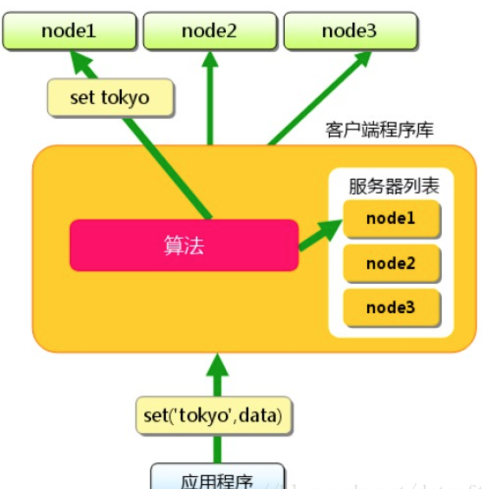
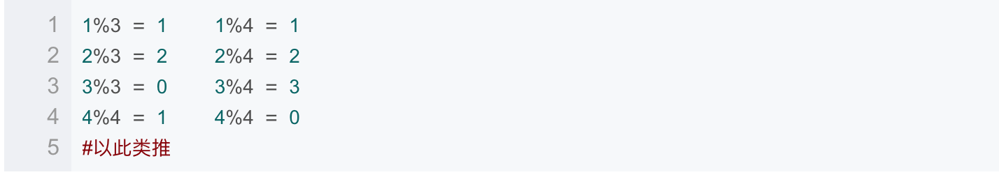
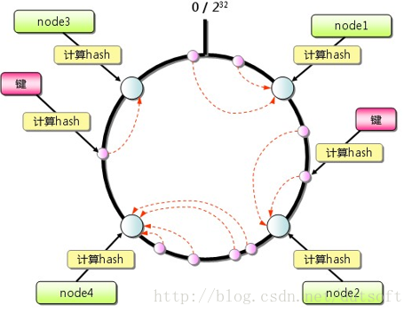

## memcached 结构

### 前言

许多Web应用都将数据保存到MySQL这样的关系型数据库管理系统中，应用服务器从中读取数据并在浏览器中显示。 但随着数据量的增大、访问的集中，就会出现数据库的负担加重、数据库响应恶化、 网站显示延迟等不良影响。分布式缓存是优化网站性能的重要手段，大量站点都通过可伸缩的服务器集群提供大规模热点数据缓存服务。通过缓存数据库查询结果，减少数据库访问次数，可以显著提高动态Web应用的速度和可扩展性。业界常用的有redis、memcached等，今天要讲的就是在python项目中如何使用memcached缓存服务。

memcached是一款开源、高性能、分布式内存对象缓存系统，可应用各种需要缓存的场景，其主要目的是通过降低对Database的访问来加速web应用程序。

memcached本身其实不提供分布式解决方案。在服务端，memcached集群环境实际就是一个个memcached服务器的堆积，环境搭建较为简单；cache的分布式主要是在客户端实现，通过客户端的路由处理来达到分布式解决方案的目的。客户端做路由的原理非常简单，应用服务器在每次存取某key的value时，通过路由算法把key映射到某台memcached服务器nodeA上，因此这个key所有操作都在nodeA上进行。只要服务器还缓存着该数据，就能保证缓存命中。

### 路由算法

#### 简单路由算法

简单路由算法，使用余数Hash：用缓存数据key的hash值，除以服务器的数目，余数为服务器列表的下表编号。这个算法可以让缓存数据在整个memcached集群中均匀的分布，也能满足大多数的缓存路由需求。

但是，当memcached集群要扩容的时候，就会引发问题。例如：网站需要将3台缓存服务器扩容成4台。在更改服务器列表后，若仍使用余数hash，很容易就计算出，50%的请求不能命中缓存。随着服务器集群规模增大，不能命中的比率就越高。

这样扩容操作风险极大，可能给数据库带来很大的瞬时压力，甚至可能导致数据库崩溃。解决这个问题有2个方法：1、在访问低谷进行扩容，在扩容后预热数据；2、使用更优的路由算法。目前使用较多的是一致性Hash算法。

#### 一致性哈希

memcached客户端可采用一致性hash算法作为路由策略，如图，相对于一般hash（如简单取模）的算法，一致性hash算法除了计算key的hash值外，还会计算每个server对应的hash值，然后将这些hash值映射到一个有限的值域上（比如0~2^32）。通过寻找hash值大于hash(key)的最小server作为存储该key数据的目标server。如果找不到，则直接把具有最小hash值的server作为目标server。同时，一定程度上，解决了扩容问题，增加或删除单个节点，对于整个集群来说，不会有大的影响。

虚拟层

一致性hash也不是完美的，在扩容时可能导致负载不均衡的问题。最近版本，增加了虚拟节点的设计，进一步提升了可用性。在扩容时，较为均匀的影响集群中已经存在的服务器，均匀的分摊负载。此处不再详述。

### 内存管理

#### 存储方式

为了提高性能，memcached中保存的数据都存储在memcached内置的内存存储空间中。由于数据仅存在于内存中，因此重启memcached、重启操作系统会导致全部数据消失。另外，缓存的内容容量达到指定值之后，就基于LRU(Least Recently Used)算法自动删除不使用的缓存。memcached本身是为缓存而设计的服务，因此并没有过多考虑数据的永久性问题。

#### 内存结构

memcached仅支持基础的key-value键值对类型数据存储。在memcached内存结构中有两个非常重要的概念：slab和chunk。

slab是一个内存块，它是memcached一次申请内存的最小单位。在启动memcached的时候一般会使用参数-m指定其可用内存，但是并不是在启动的那一刻所有的内存就全部分配出去了，只有在需要的时候才会去申请，而且每次申请一定是一个slab。Slab的大小固定为1M（1048576 Byte），一个slab由若干个大小相等的chunk组成。每个chunk中都保存了一个item结构体、一对key和value。

虽然在同一个slab中chunk的大小相等的，但是在不同的slab中chunk的大小并不一定相等，在memcached中按照chunk的大小不同，可以把slab分为很多种类（class），默认情况下memcached把slab分为40类（class1～class40），在class 1中，chunk的大小为80字节，由于一个slab的大小是固定的1048576字节（1M），因此在class1中最多可以有13107个chunk（也就是这个slab能存最多13107个小于80字节的key-value数据）。

memcached内存管理采取预分配、分组管理的方式，分组管理就是我们上面提到的slab class，按照chunk的大小slab被分为很多种类。内存预分配过程是怎样的呢？向memcached添加一个item时候，memcached首先会根据item的大小，来选择最合适的slab class：

例如item的大小为190字节，默认情况下class 4的chunk大小为160字节显然不合适，class 5的chunk大小为200字节，大于190字节，因此该item将放在class 5中（显然这里会有10字节的浪费是不可避免的），计算好所要放入的chunk之后，memcached会去检查该类大小的chunk还有没有空闲的，如果没有，将会申请1M（1个slab）的空间并划分为该种类chunk。

例如我们第一次向memcached中放入一个190字节的item时，memcached会产生一个slab class 2（也叫一个page），并会用去一个chunk，剩余5241个chunk供下次有适合大小item时使用，当我们用完这所有的5242个chunk之后，下次再有一个在160～200字节之间的item添加进来时，memcached会再次产生一个class 5的slab（这样就存在了2个pages）。