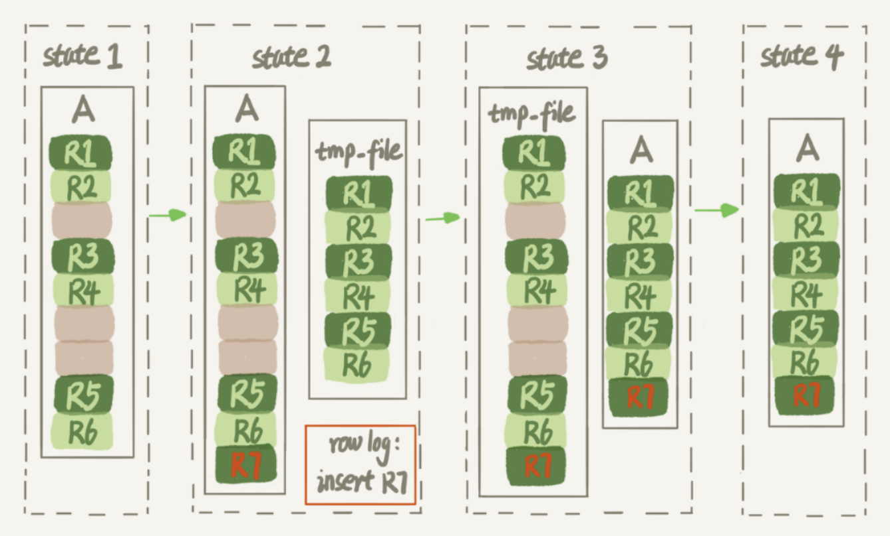
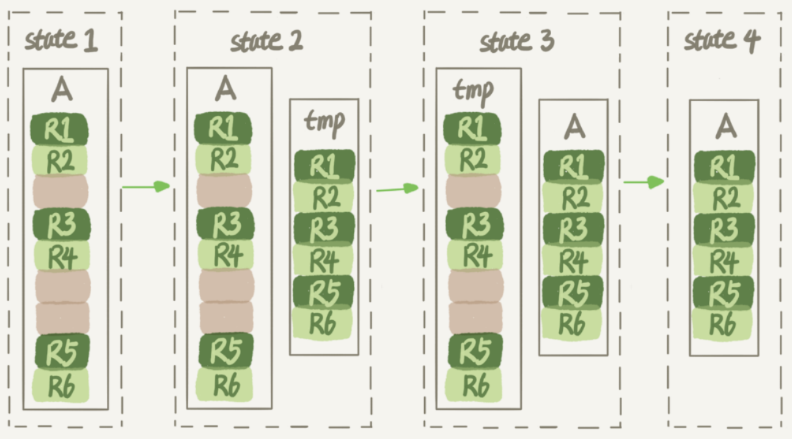

## mysql 索引

### 1. 数据结构

B Tree 指的是 Balance Tree，也就是平衡树。平衡树是一颗查找树，并且所有叶子节点位于同一层。

B+ Tree 是基于 B Tree 和叶子节点顺序访问指针进行实现，它具有 B Tree 的平衡性，并且通过顺序访问指针来提高区间查询的性能。

在 B+ Tree 中，一个节点中的 key 从左到右非递减排列，如果某个指针的左右相邻 key 分别是 keyi 和 keyi+1，且不为 null，则该指针指向节点的所有 key 大于等于 keyi 且小于等于 keyi+1。

### 2. 操作

进行查找操作时，首先在根节点进行二分查找，找到一个 key 所在的指针，然后递归地在指针所指向的节点进行查找。直到查找到叶子节点，然后在叶子节点上进行二分查找，找出 key 所对应的 data。

插入删除操作会破坏平衡树的平衡性，因此在进行插入删除操作之后，需要对树进行分裂、合并、旋转等操作来维护平衡性。

### 3. 与红黑树的比较

红黑树等平衡树也可以用来实现索引，但是文件系统及数据库系统普遍采用 B+ Tree 作为索引结构，这是因为使用 B+ 树访问磁盘数据有更高的性能。

（一）B+ 树有更低的树高

平衡树的树高 O(h)=O(logdN)，其中 d 为每个节点的出度。红黑树的出度为 2，而 B+ Tree 的出度一般都非常大，所以红黑树的树高 h 很明显比 B+ Tree 大非常多。

（二）磁盘访问原理

操作系统一般将内存和磁盘分割成固定大小的块，每一块称为一页，内存与磁盘以页为单位交换数据。数据库系统将索引的一个节点的大小设置为页的大小，使得一次 I/O 就能完全载入一个节点。

如果数据不在同一个磁盘块上，那么通常需要移动制动手臂进行寻道，而制动手臂因为其物理结构导致了移动效率低下，从而增加磁盘数据读取时间。B+ 树相对于红黑树有更低的树高，进行寻道的次数与树高成正比，在同一个磁盘块上进行访问只需要很短的磁盘旋转时间，所以 B+ 树更适合磁盘数据的读取。

（三）磁盘预读特性

为了减少磁盘 I/O 操作，磁盘往往不是严格按需读取，而是每次都会预读。预读过程中，磁盘进行顺序读取，顺序读取不需要进行磁盘寻道，并且只需要很短的磁盘旋转时间，速度会非常快。并且可以利用预读特性，相邻的节点也能够被预先载入。

### 4. 优化器的逻辑

优化器会根据扫描行数，是否使用临时 表、是否排序等因素来选择索引。

**扫描行数的判断：**

索引的“区分度”：一个索引上不同的值越多，这 个索引的区分度就越好。而一个索引上不同的值的个数，我们称之为“基 数” cardinality 来判断。通过 show index 方法，看到一个索引的基数。

**如何得到索引的基数：**（采样统计）

采样统计的时候，InnoDB 默认会选择 N 个数据页，统计这些页面上的不 同值，得到一个平均值，然后乘以这个索引的页面数，就得到了这个索引 的基数。 而数据表是会持续更新的，索引统计信息也不会固定不变。所以，当变更 的数据行数超过 1/M 的时候，会自动触发重新做一次索引统计。

如果 cardinality 不对的话，可以通过执行 analyze table t 命令，可以用来重新统 计索引信息。

#### 几种选择错误的场景：

1、认为扫描全表要比扫描特定的行数好，原因如果是二级索引的话，还需要回主键索引再查询一次。

2、order by b 排序时，会首先选择被排序的字段 b 作为索引，但其实并不是最好的。可能使用 a 索引更好。

### 5、索引文件空洞

在对表进行删除，更新操作的时候，会导致记录所在的表空间不能够被回收，但是可以被复用。这些不能回收但是可以复用的表空间就是“空洞”，同时可能会伴随数据页的分裂。

通过 alter table A engine=InnoDB 命令来重建表解决。

示意图：
这条命令的意思就是：alter table t engine=innodb,ALGORITHM=inplace;（在线的拷贝表，不阻塞增删改）

1. 建立一个临时文件，扫描表 A 主键的所有数据页；
2. 用数据页中表 A 的记录生成 B+ 树，存储到临时文件中； 
3. 生成临时文件的过程中，将所有对 A 的操作记录在一个日志文件（row log）中，对应的是图中 state2 的状态； 
4. 临时文件生成后，将日志文件中的操作应用到临时文件，得到一个逻辑 数据上与表 A 相同的数据文件，对应的就是图中 state3 的状态； 
5. 用临时文件替换表 A 的数据文件。

alter table t engine=innodb,ALGORITHM=copy; （强制拷贝，离线拷贝，阻塞增删改）

这个命令的执行流程跟我们前面描述的差不多，区 别只是这个临时表 B 不需要你自己创建，MySQL 会自动完成转存数据、 交换表名、删除旧表的操作。

## 数据类型

### 时间和日期

MySQL 提供了两种相似的日期时间类型：DATETIME 和 TIMESTAMP。

#### 1、DATETIME

能够保存从 1000 年到 9999 年的日期和时间，精度为秒，使用 8 字节的存储空间。

它与时区无关。

默认情况下，MySQL 以一种可排序的、无歧义的格式显示 DATETIME 值，例如“2008-01-16 22:37:08”，这是 ANSI 标准定义的日期和时间表示方法。

#### 2、TIMESTAMP

和 UNIX 时间戳相同，保存从 1970 年 1 月 1 日午夜（格林威治时间）以来的秒数，使用 4 个字节，只能表示从 1970 年到 2038 年。

它和时区有关，也就是说一个时间戳在不同的时区所代表的具体时间是不同的。

MySQL 提供了 FROM_UNIXTIME() 函数把 UNIX 时间戳转换为日期，并提供了 UNIX_TIMESTAMP() 函数把日期转换为 UNIX 时间戳。

默认情况下，如果插入时没有指定 TIMESTAMP 列的值，会将这个值设置为当前时间。

应该尽量使用 TIMESTAMP，因为它比 DATETIME 空间效率更高。

