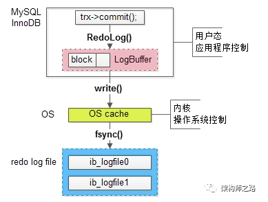
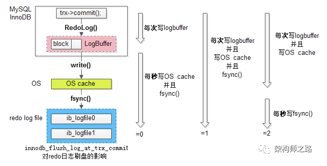
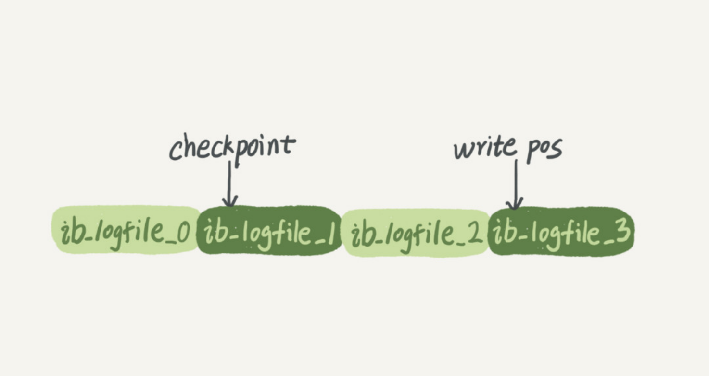
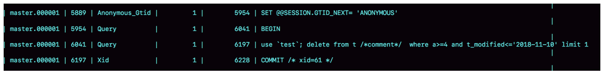
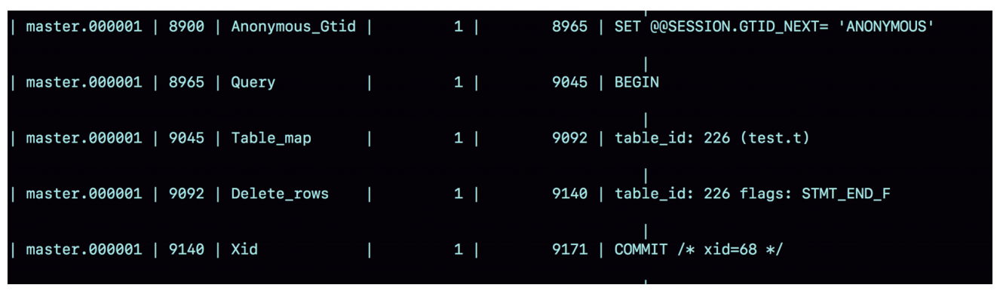
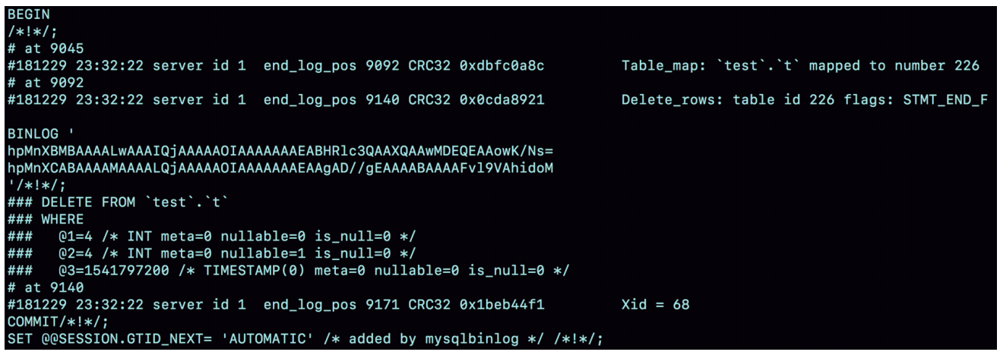

### 日志文件写入流程

写入顺序：
	undo（回滚） -> redo（重放，数据恢复） -> 数据写入磁盘 -> binlog 


redo ：logbuffer（mysql缓存），oscache（操作系统），redolog file（磁盘）

​	**两阶段提交：**

​	prepare：成功写入redolog （涉及到 redolog 崩溃）
​	commit：说明 binlog 已经写入成功



MySQL 有一个参数：innodb_flush_log_at_trx_commit 能够控制事务提交时，刷 redo log 的策略。

 目前有**三种策略**：




binlog：binlogCache
	binlog 写入成功之后，将 redolog 状态置为 commit


### redolog

InnoDB 的 redo log 是固定大小的，比如可以配置为一组 4 个文件，每个文件 的大小是 1GB，那么这块“粉板”总共就可以记录 4GB 的操作。从头开始写，写到末尾就 又回到开头循环写，WAL 技术，WAL 的全称 是 Write-Ahead Logging 先写到内存 redolog 中

如下面这个图所示：



redolog 文件中有两个指针：checkpoint 和 write pos

write pos 和 checkpoint 之间的是“粉板”上还空着的部分，可以用来记录新的操作。如果 write pos 追上 checkpoint，表示“粉板”满了，这时候不能再执行新的更新，得停下来先 擦掉一些记录，把 checkpoint 推进一下。


### binlog

mysql 自带的日志，不能实现 crash-safe 能力。

1. redo log 是 InnoDB 引擎特有的；binlog 是 MySQL 的 Server 层实现的，所有引擎都 可以使用。 
2. redo log 是物理日志，记录的是“在某个数据页上做了什么修改”；binlog 是逻辑日志， 记录的是这个语句的原始逻辑，比如“给 ID=2 这一行的 c 字段加 1 ”。 
3. redo log 是循环写的，空间固定会用完；binlog 是可以追加写入的。“追加写”是指 binlog 文件写到一定大小后会切换到下一个，并不会覆盖以前的日志。


更新时，先更新 redolog（prepare），然后再更新 binlog，最后执行器调用引擎的提交事务接口，引擎把刚刚写入的 redo log 改成提交（commit）状态，更新完成。

更新时两阶段提交：prepare 和 commit。

```bash
## 时间点1: 此时 redolog 和 binlog都没写日志，所以不会出现问题
1、先进入commit prepare 阶段，这个阶段事务中新生成的redo log 会被刷到磁盘，并将回滚段置为prepared状态。

## 时间点2: 此时虽然 redolog 有日志，但处于prepare阶段，但在服务器故障恢复时会判断 binlog 的完整性。因为binlog没有，所以回滚。
2、commit阶段：innodb释放锁，释放回滚段，设置redo log提交状态，binlog持久化到磁盘，然后存储引擎层提交。

## 时间点3: 此时 redolog 和 binlog都已经刷入磁盘

```


#### binlog格式

**statement：**

这种格式会带来一些问题：

1. 如果 delete 语句使用的是索引 a，那么会根据索引 a 找到第一个满足 条件的行，也就是说删除的是 a=4 这一行； 

2. 但如果使用的是索引 t_modified，那么删除的就是 t_modified='2018- 11-09’也就是 a=5 这一行。 

3. 由于 statement 格式下，记录到 binlog 里的是语句原文，因此可能会出 现这样一种情况：在主库执行这条 SQL 语句的时候，用的是索引 a，在备库用的索引是 t_modified，因此， MySQL 认为这样写是有风险的。

   

```bash
## 查看binlog 文件里的内容
mysql> show binlog events in 'master.000001';
```




**row：**（多用于恢复数据的场景，也是经常被使用的格式）

row 格式的 binlog 里没有了 SQL 语句的原 文，而是替换成了两个 event：Table_map 和 Delete_rows。

1. Table_map event，用于说明接下来要操作的表是 test 库的表 t; 
2. Delete_rows event，用于定义删除的行为。

当 binlog_format 使用 row 格式的时候，binlog 里面记录了 真实删除行的主键 id，这样 binlog 传到备库去的时候，就肯定会删除 id=4 的行，不会有主备删除不同行的问题。



使用 mysqlbinlog 工具查看详细信息：

```bash
mysqlbinlog  ‑vv data/master.000001 ‑‑start‑position=8900;
```




**mixed：**前两种格式的混合。

为什么会有这种格式：
因为有些 statement 格式的 binlog 可能会导致主备不一致，所以要使 用 row 格式。 

但 row 格式的缺点是，很占空间。比如你用一个 delete 语句删掉 10 万 行数据，用 statement 的话就是一个 SQL 语句被记录到 binlog 中，占 用几十个字节的空间。但如果用 row 格式的 binlog，就要把这 10 万条 记录都写到 binlog 中。这样做，不仅会占用更大的空间，同时写 binlog 也要耗费 IO 资源，影响执行速度。 

所以，MySQL 就取了个折中方案，也就是有了 mixed 格式的 binlog。 mixed 格式的意思是，MySQL 自己会判断这条 SQL 语句是否可能引起 主备不一致，如果有可能，就用 row 格式，否则就用 statement 格式。


**双主架构（双M）的循环复制问题**

双M：两台mysql服务互为主备。

MySQL 在 binlog 中记录了这个命令第一次执 行时所在实例的 server id。因此，我们可以用下面的逻辑，来解决两个节 点间的循环复制的问题： 

1. 规定两个库的 server id 必须不同，如果相同，则它们之间不能设定为 主备关系；
2. 一个备库接到 binlog 并在重放的过程中，生成与原 binlog 的 server id 相同的新的 binlog； 
3. 每个库在收到从自己的主库发过来的日志后，先判断 server id，如果跟 自己的相同，表示这个日志是自己生成的，就直接丢弃这个日志。


**如果没有两阶段提交导致的问题**

1. 先写 redo log 后写 binlog。假设在 redo log 写完，binlog 还没有写完的时候， MySQL 进程异常重启。由于我们前面说过的，redo log 写完之后，系统即使崩溃，仍 然能够把数据恢复回来，所以恢复后这一行 c 的值是 1。 但是由于 binlog 没写完就 crash 了，这时候 binlog 里面就没有记录这个语句。因此， 首先，找到最近的一次全量备份，如果你运气好，可能就是昨天晚上的一个备份，从这 个备份恢复到临时库； 然后，从备份的时间点开始，将备份的 binlog 依次取出来，重放到中午误删表之前的那 个时刻。 之后备份日志的时候，存起来的 binlog 里面就没有这条语句。 然后你会发现，如果需要用这个 binlog 来恢复临时库的话，由于这个语句的 binlog 丢 失，这个临时库就会少了这一次更新，恢复出来的这一行 c 的值就是 0，与原库的值不 同。
2. 先写 binlog 后写 redo log。如果在 binlog 写完之后 crash，由于 redo log 还没写， 崩溃恢复以后这个事务无效，所以这一行 c 的值是 0。但是 binlog 里面已经记录了“把 c 从 0 改成 1”这个日志。所以，在之后用 binlog 来恢复的时候就多了一个事务出来， 恢复出来的这一行 c 的值就是 1，与原库的值不同。

