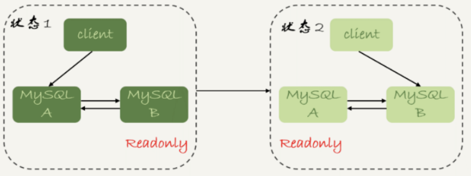
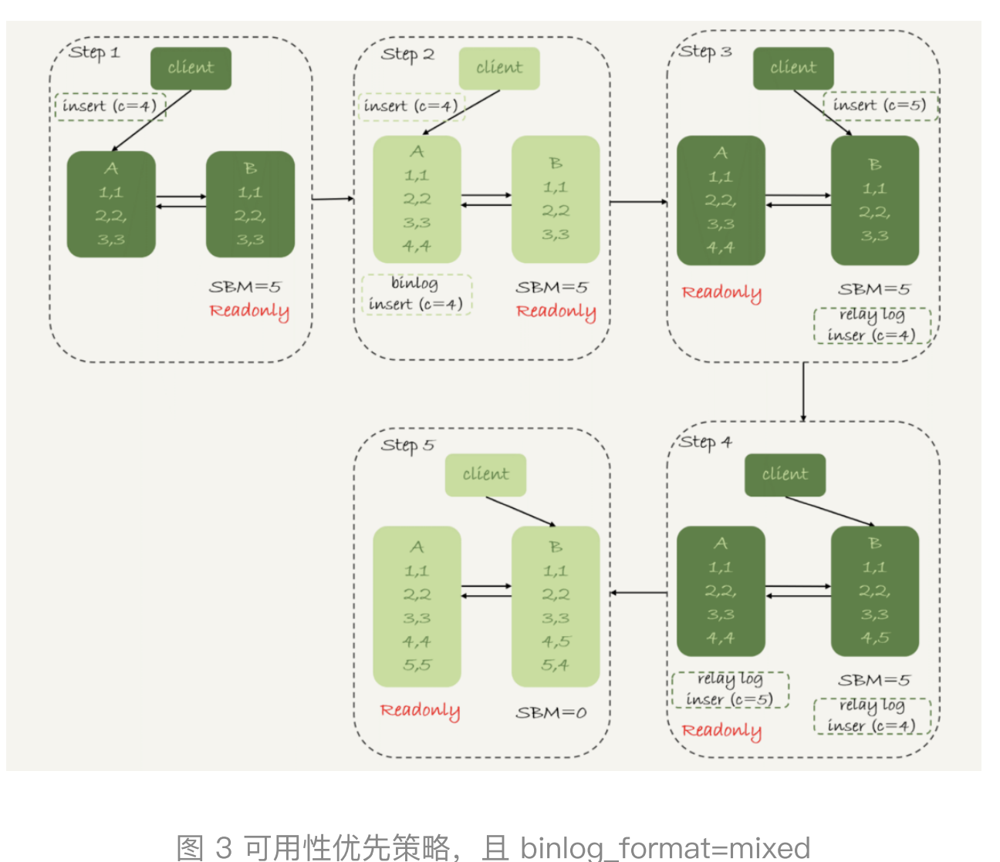
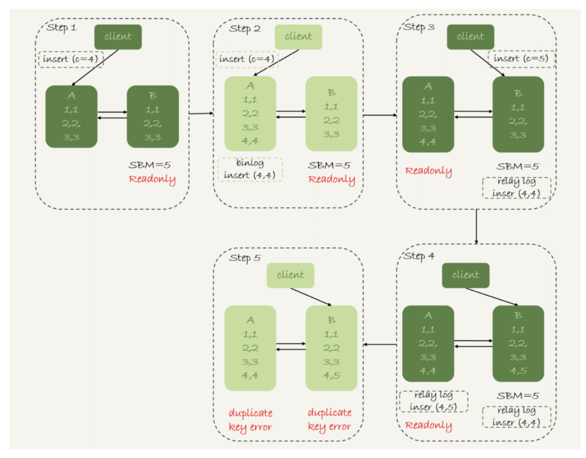

### mysql架构

#### mysql高可用架构：

#### 1、主从，M-S 架构

例：主从，双M架构，会带来主备延迟问题

#### 2、MHA 架构

是 MySQL 高可用环境下故障切换和主从提升的高可用方案。

由两部分构成：

MHA Manager : 可部署在单独的服务器，也可部署在 slave 节点上。会定时监测集群中的 master 节点，当 master 几点出现故障时，会自动的将最新数据的 slave 节点提升为 master。

MHA Node：运行在每台MySQL 服务器。

#### 3、MMM 架构

MMM即Master-Master Replication Manager for MySQL（mysql主主复制管理器）。

MMM不仅能提供浮动IP的功能，更可贵的是如果当前的主服务器挂掉后，会将你后端的从服务器自动转向新的主服务器进行同步复制，不用手工更改同步配置。这个方案是目前比较成熟的解决方案。

#### 主备延迟

主备切换可能是一个主动运维动作，比如软件升级、主库所在机器按计划 下线等，也可能是被动操作，比如主库所在机器掉电。

show slave status 命令，它的返回结果里面会显示 seconds_behind_master，用于表示当前备库延迟了多少秒。

#### 主备延迟的来源有哪些？

1. 首先，有些部署条件下，备库所在机器的性能要比主库所在的机器性能差。

2. 备库的压力大

3. 大事务
4. 大表 DDL

#### 如何解决主备延迟？

**1、可靠性优先策略**

在图 1 的双 M 结构下，从状态 1 到状态 2 切换的详细过程是这样的： 

1. 判断备库 B 现在的 seconds_behind_master，如果小于某个值（比如 5 秒）继续下一步，否则持续重试这一步； 
2. 把主库 A 改成只读状态，即把 readonly 设置为 true； 
3. 判断备库 B 的 seconds_behind_master 的值，直到这个值变成 0 为 止； 
4. 把备库 B 改成可读写状态，也就是把 readonly 设置为 false； 
5. 把业务请求切到备库 B。

其中第2步到第5步存在不可用到空白期。

**2、可用性优先策略**

不等主备数据同 步，直接把连接切到备库 B，并且让备库 B 可以读写，那么系统几乎就没 有不可用时间了。

下图是可用性优先策略，且 binlog_format=mixed时的切换流程和数据结果：
前提：已经插入了，1、2、3三条数据，准备插入 4、5两条

1. 步骤 2 中，主库 A 执行完 insert 语句，插入了一行数据（4,4），之后 开始进行主备切换。 
2. 步骤 3 中，由于主备之间有 5 秒的延迟，所以备库 B 还没来得及应 用“插入 c=4”这个中转日志，就开始接收客户端“插入 c=5”的命令。 
3. 步骤 4 中，备库 B 插入了一行数据（4,5），并且把这个 binlog 发给主 库 A。 
4. 步骤 5 中，备库 B 执行“插入 c=4”这个中转日志，插入了一行数据 （5,4）。而直接在备库 B 执行的“插入 c=5”这个语句，传到主库 A， 就插入了一行新数据（5,5）。 最后的结果就是，主库 A 和备库 B 上出现了两行不一致的数据。可以看 到，这个数据不一致，是由可用性优先流程导致的。

binlog_format=row时的切换：

因为 row 格式在记录 binlog 的时候，会记录新插入的行的所有字段值， 所以最后只会有一行不一致。而且，两边的主备同步的应用线程会报错 duplicate key error 并停止。也就是说，这种情况下，备库 B 的 (5,4) 和 主库 A 的 (5,5) 这两行数据，都不会被对方执行。

