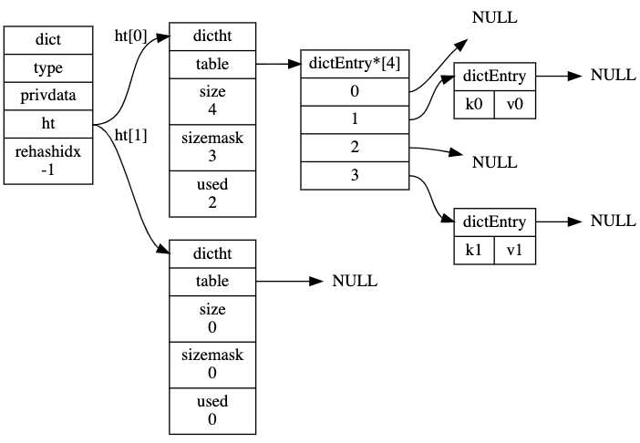
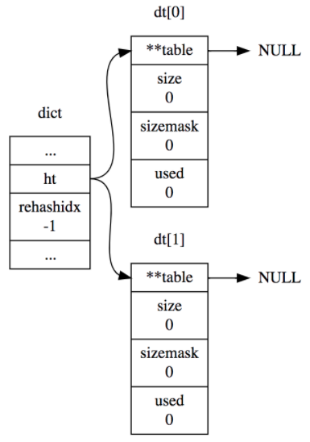

# dict的实现原理

### 目录

- [什么是dict](#什么是dict)
- [dict结构](#dict结构)
- [rehash执行流程是怎样的](#rehash执行流程是怎样的)
- [创建](#创建)
- [查找](#查找)
- [添加](#添加)
- [扩容](#扩容)
- [什么是渐进式rehash](#什么是渐进式rehash)
- [总结](#总结)
- [参考](#参考)

### 什么是dict

dict，即字典，是一个用于维护 key 和 value 映射关系的数据结构。redis 中一个 database 中所有 key 到 value 的映射，使用的就是 dict 数据结构。  

redis 的 字典（dict）使用哈希表（hashtable）作为其底层实现。  

redis5 源码传送门：[dict.c](https://github.com/redis/redis/blob/5.0/src/dict.c)、[dict.h](https://github.com/redis/redis/blob/5.0/src/dict.h)

### dict结构

整个 dict 的结构示意图如下：  

  

dict 的结构定义如下（dict.h）：  

```c
typedef struct dict {
    dictType *type;
    void *privdata;
    dictht ht[2];
    long rehashidx; /* rehashing not in progress if rehashidx == -1 */
    unsigned long iterators; /* number of iterators currently running */
} dict;
```

一个 dict 的组成如下：  

- type 是一个指向 dictType 结构的指针，每个 dictType 保存了一组用于操作特定类型键值对的函数，比如指定 dict 计算 key 的哈希值的 hashFunction 函数。
- privdata 保存了需要传给那些类型特定函数的可选参数
- ht 是一个包含了两个 dictht 结构的数组，一般情况下，字典只会用到 ht[0] 哈希表，只有在对 ht[0] 哈希表进行 rehash 时才会用到 ht[1] 哈希表。
- rehashidx 记录了当前 rehash 的进度，-1 表示当前没有进行 rehash
- iterator 是当前正在进行遍历的 iterator 的个数，非本文讨论重点，暂时忽略  

dictType 的结构定义如下（dict.h）：  

```c
typedef struct dictType {
    uint64_t (*hashFunction)(const void *key);
    void *(*keyDup)(void *privdata, const void *key);
    void *(*valDup)(void *privdata, const void *obj);
    int (*keyCompare)(void *privdata, const void *key1, const void *key2);
    void (*keyDestructor)(void *privdata, void *key);
    void (*valDestructor)(void *privdata, void *obj);
} dictType;
```

dictType 包含若干函数指针，用于 dict 的调用者对涉及到 key 和 value 的各种操作进行自定义，这些操作包括：  

- hashFunction：对 key 进行哈希值计算的哈希函数
- keyDup、valDup：分别定义 key 和 value 的拷贝函数
- keyCompare：定义两个 key 的比较操作，在根据 key 进行查找时会用到
- keyDestructor、valDestructor：分别定义 key 和 value 的析构函数  

dictht 的结构定义如下（dict.h）：  

```c
/* This is our hash table structure. Every dictionary has two of this as we
 * implement incremental rehashing, for the old to the new table. */
typedef struct dictht {
    dictEntry **table;
    unsigned long size;
    unsigned long sizemask;
    unsigned long used;
} dictht;
```

dictht 结构体定义了哈希表的结构：  

- table 是一个指向指针数组的指针，数组中的每个元素都是一个指向 dictEntry 结构的指针。
- size 记录了哈希表的大小，也就是 table 数组的长度
- sizemask 的值总是等于 size - 1，用哈希值 & sizemask得到 key 在 table 上的位置，相当于计算取余（哈希值 % size）
- used 记录 dict 中现有的节点（键值对）的数量，它与 size 的比值就是装载因子（load factor），这个比值越大，哈希冲突概率越高。  

哈希表节点使用 dictEntry 结构表示，每个 dictEntry 结构都保存着一个键值对：  

dictEntry 的结构定义如下（dict.h）：  

```c
typedef struct dictEntry {
    void *key;
    union {
        void *val;
        uint64_t u64;
        int64_t s64;
        double d;
    } v;
    struct dictEntry *next;
} dictEntry;
```

 - key 是一个指针，表示键值对中的键
 - v 可以是一个指针、uint64_t 或 int64_t 整数、浮点数，表示键值对中的值
 - next 指针指向下一个键值对（dictEntry），用来解决哈希冲突（链地址法）  


 ### 为什么需要两个哈希表呢

 redis 的字典中有两个哈希表结构：  

 ```c
 typedef struct dict {
     ...
     dictht ht[2];
     long rehashidx; /* rehashing not in progress if rehashidx == -1 */
     ...
 } dict;
 ```

 **通常情况下只有哈希表 ht[0] 有值，那为什么需要两个哈希表呢？**  


我们知道哈希函数不可避免地会产生哈希冲突，冲突会影响查询效率，产生冲突的多少和以下因素有关：  

- 哈希函数
- 解决冲突的方法
- 哈希表的负载因子（哈希表键值对个数 / 哈希表大小）  


在哈希函数（hashFunction）和解决冲突的方法（链地址法）确定的情况下，为了让哈希表的负载因子（load factor）维持在一个合理的范围之内，当 ht[0] 保存的键值对数量太多或太少时，就需要借助哈希表 ht[1] 对哈希表 ht[0] 进行相应地扩容或缩容，把哈希表 ht[0] 的键值对迁移到哈希表 ht[1] 上，然后用哈希表 ht[1] 替换哈希表 ht[0]。  

迁移过程是通过执行 rehash 操作来完成，rehashidx 属性记录 rehash 操作的进度，-1 表示当前没有进行 rehash。  

```c
#define dictIsRehashing(d) ((d)->rehashidx != -1)
```


### rehash执行流程是怎样的

[dict.c](https://github.com/redis/redis/blob/5.0/src/dict.c)

```c
int dictRehash(dict *d, int n) {
    // 最大访问空桶的数量
    int empty_visits = n*10; /* Max number of empty buckets to visit. */
    // dict 没有正在进行 rehash 时，直接返回
    if (!dictIsRehashing(d)) return 0;

    // n 为最多迁移的元素数量
    while(n-- && d->ht[0].used != 0) {
        dictEntry *de, *nextde;

        /* Note that rehashidx can't overflow as we are sure there are more
         * elements because ht[0].used != 0 */
        // 防止 rehashidx 越界，下面不成立的话将不会继续往下执行
        assert(d->ht[0].size > (unsigned long)d->rehashidx);

        // rehashidx 位置的桶为空，继续往下遍历，直到桶不为空或者达到最大访问空桶的数量
        while(d->ht[0].table[d->rehashidx] == NULL) {
            d->rehashidx++;

            // 最大访问空桶的数量--
            if (--empty_visits == 0) return 1;
        }

        // 当前桶中的元素（dictEntry 指针）
        de = d->ht[0].table[d->rehashidx];
        /* Move all the keys in this bucket from the old to the new hash HT */
        // 遍历桶中元素（链表），
        while(de) {
            uint64_t h;

            nextde = de->next;
            /* Get the index in the new hash table */
            // 获取 key 在 ht[1] 哈希表中的索引
            h = dictHashKey(d, de->key) & d->ht[1].sizemask;
            // 每次都往 ht[1] 的链表表头插入
            de->next = d->ht[1].table[h];
            d->ht[1].table[h] = de;
            d->ht[0].used--;
            d->ht[1].used++;
            de = nextde;
        }

        // ht[0] 对应桶置为空
        d->ht[0].table[d->rehashidx] = NULL;
        d->rehashidx++;
    }

    /* Check if we already rehashed the whole table... */
    if (d->ht[0].used == 0) {
        zfree(d->ht[0].table);
        d->ht[0] = d->ht[1];
        _dictReset(&d->ht[1]);
        d->rehashidx = -1;
        return 0;
    }

    /* More to rehash... */
    return 1;
}
```

rehash 的过程如下：  

如果 rehashidx 指向的桶中为空，那么这个桶中就没有可迁移的数据，尝试在 ht[0].table 数组中不断往后遍历，直到找到一个存有数据的桶。如果一直找不到，最多尝试 n*10 次，本次 rehash 结束。  

最后，如果 ht[0] 中的数据都迁移到了 ht[1] 上，即 d->ht[0].used == 0，那么整个 rehash 结束，ht[0] 变成 ht[1]，ht[1]重置为空，rehashidx 置为 -1。  

### 创建

```c
/* Reset a hash table already initialized with ht_init().
 * NOTE: This function should only be called by ht_destroy(). */
static void _dictReset(dictht *ht)
{
    ht->table = NULL;
    ht->size = 0;
    ht->sizemask = 0;
    ht->used = 0;
}

/* Create a new hash table */
dict *dictCreate(dictType *type,
        void *privDataPtr)
{
    dict *d = zmalloc(sizeof(*d));

    _dictInit(d,type,privDataPtr);
    return d;
}

/* Initialize the hash table */
int _dictInit(dict *d, dictType *type,
        void *privDataPtr)
{
    _dictReset(&d->ht[0]);
    _dictReset(&d->ht[1]);
    d->type = type;
    d->privdata = privDataPtr;
    d->rehashidx = -1;
    d->iterators = 0;
    return DICT_OK;
}
```

dictCreate 函数会创建包含两个空哈希表的字典：  

  

### 查找

```c
dictEntry *dictFind(dict *d, const void *key)
{
    dictEntry *he;
    uint64_t h, idx, table;

    // dict 为空，直接返回
    if (d->ht[0].used + d->ht[1].used == 0) return NULL; /* dict is empty */

    // 如果正在 rehash，调用 _dictRehashStep，往前推进重哈希过程
    if (dictIsRehashing(d)) _dictRehashStep(d);

    // 计算哈希值
    h = dictHashKey(d, key);

    // 先在第一个哈希表 ht[0]中查找，如果正在重哈希，再在 ht[1] 中查找
    for (table = 0; table <= 1; table++) {

        // 计算索引
        idx = h & d->ht[table].sizemask;
        he = d->ht[table].table[idx];

        // 遍历查找 key
        while(he) {
            if (key==he->key || dictCompareKeys(d, key, he->key))
                return he;
            he = he->next;
        }

        // 如果没有重哈希，直接返回，否则继续去 ht[1] 中查找
        if (!dictIsRehashing(d)) return NULL;
    }
    return NULL;
}

static void _dictRehashStep(dict *d) {
    if (d->iterators == 0) dictRehash(d,1);
}
```

查找依次作了这么几件事：  

- 如果正在重哈希，那么将重哈希过程往前推进一步。实际上，除了查找，插入和删除也都会触发这一动作，这样就将重哈希过程分散到各个查找、插入和删除操作中去了，而不是一次性，集中式地完成。
- 计算 key 的哈希值
- 现在第一个哈希表 ht[0] 上查找，在 table 数组中定位到哈希值对应的位置（哈希值 & sizemask），然后在对应的 dictEntry 链表上查找，查找的时候需要对 key 进行比较，它里面的实现就会调用到前面提到的 keyCompare。
- 判断当前是否正在重哈希，如果没有，那么在 ht[0] 上的查找结果就是最终结果，否则，去 ht[1] 上查找。  

### 添加

```c
/* Add an element to the target hash table */
// 添加元素
int dictAdd(dict *d, void *key, void *val)
{
    dictEntry *entry = dictAddRaw(d,key,NULL);

    if (!entry) return DICT_ERR;
    dictSetVal(d, entry, val);
    return DICT_OK;
}

dictEntry *dictAddRaw(dict *d, void *key, dictEntry **existing)
{
    long index;
    dictEntry *entry;
    dictht *ht;

    if (dictIsRehashing(d)) _dictRehashStep(d);

    /* Get the index of the new element, or -1 if
     * the element already exists. */
    if ((index = _dictKeyIndex(d, key, dictHashKey(d,key), existing)) == -1)
        return NULL;

    /* Allocate the memory and store the new entry.
     * Insert the element in top, with the assumption that in a database
     * system it is more likely that recently added entries are accessed
     * more frequently. */
    // 在头部插入
    ht = dictIsRehashing(d) ? &d->ht[1] : &d->ht[0];
    entry = zmalloc(sizeof(*entry));
    entry->next = ht->table[index];
    ht->table[index] = entry;
    ht->used++;

    /* Set the hash entry fields. */
    dictSetKey(d, entry, key);
    return entry;
}

// 返回 key 在哈希表中的索引，如果 key 已存在，返回 -1
static long _dictKeyIndex(dict *d, const void *key, uint64_t hash, dictEntry **existing)
{
    unsigned long idx, table;
    dictEntry *he;
    if (existing) *existing = NULL;

    /* Expand the hash table if needed */
    if (_dictExpandIfNeeded(d) == DICT_ERR)
        return -1;
    for (table = 0; table <= 1; table++) {
        idx = hash & d->ht[table].sizemask;
        /* Search if this slot does not already contain the given key */
        he = d->ht[table].table[idx];
        while(he) {
            if (key==he->key || dictCompareKeys(d, key, he->key)) {
                if (existing) *existing = he;
                return -1;
            }
            he = he->next;
        }
        if (!dictIsRehashing(d)) break;
    }
    return idx;
}
```

上面是 dictAdd 的关键代码实现，我们需要注意：  

- 它会向前推进重哈希
- 如果正在重哈希，它会把数据插入到 ht[1]，否则插入到 ht[0]
- 在对应的 bucket 中插入数据的时候，总是插入到 dictEntry 的头部（头插法），因为新数据接下来被访问的概率比较高，这样再次查找它时遍历的次数就少
- _dictKeyIndex 函数会检查哈希表是否需要扩容  

### 扩容

```c
static int dict_can_resize = 1;
static unsigned int dict_force_resize_ratio = 5;
#define DICT_HT_INITIAL_SIZE     4

/* Expand the hash table if needed */
static int _dictExpandIfNeeded(dict *d)
{
    /* Incremental rehashing already in progress. Return. */
    if (dictIsRehashing(d)) return DICT_OK;

    /* If the hash table is empty expand it to the initial size. */
    if (d->ht[0].size == 0) return dictExpand(d, DICT_HT_INITIAL_SIZE);

    /* If we reached the 1:1 ratio, and we are allowed to resize the hash
     * table (global setting) or we should avoid it but the ratio between
     * elements/buckets is over the "safe" threshold, we resize doubling
     * the number of buckets. */
    if (d->ht[0].used >= d->ht[0].size &&
        (dict_can_resize ||
         d->ht[0].used/d->ht[0].size > dict_force_resize_ratio))
    {
        return dictExpand(d, d->ht[0].used*2);
    }
    return DICT_OK;
}
```

**哈希表什么时候进行扩容？**  

- 正在 rehash 不会进行扩容
- 哈希表的大小为 0，扩容到初始大小 DICT_HT_INITIAL_SIZE
- 正常情况下 dict_can_resize 为 1，哈希表中键值对个数大于等于哈希表大小，就会扩容到键值对个数的两倍
- 有些情况下 dict_can_resize 为 0，redis 就会避免扩容，但是如果哈希表已经很满（负载因子大于 5），这时候会强制扩容


### 渐进式rehash

对于大字典的 rehash 是比较耗时的，所以 redis 中采用了渐进式 rehash，将整个 rehash 过程所需的计算工作均摊到对字典的每个增删改查操作上。  

在进行渐进式 rehash 的过程中，字典会同时使用 ht[0] 和 ht[1] 两个哈希表，所以在渐进式 rehash 进行期间，字典的删除、查找、更新等操作会在两个哈希表上进行。新添加到字典的键值对一律会被保存到 ht[1] 里面，而 ht[0] 则不再进行任何添加操作。  

除了增删改查的操作会推动 rehash，redis 还有定时任务定时对特殊的字典进行主动迁移，避免没有操作的情况下暂停 rehash。

### 总结

看了这么多，看看以下问题你能回答出来吗？  

- 字典的结构是怎样的？
- rehash 执行流程是怎样的？
- 什么是渐进式 rehash？
- 哈希表什么时候进行扩容？
- 怎么解决哈希冲突？
- redis 会主动 rehash 吗？

### 参考
- [Redis中的dict实现](https://github.com/Junnplus/blog/issues/35)
- [Redis内部数据结构详解(1)——dict](http://zhangtielei.com/posts/blog-redis-dict.html)
