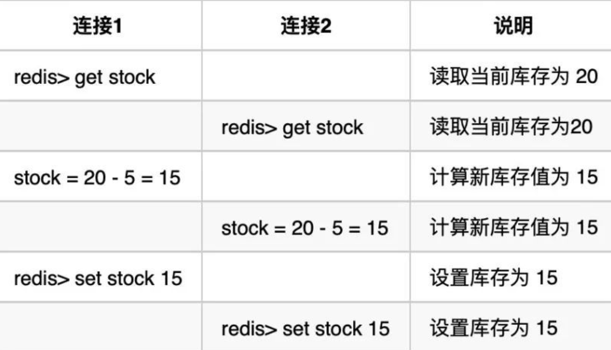

## 一、数据类型

| 数据类型 | 可以存储的值           | 操作                                                         |
| -------- | ---------------------- | :----------------------------------------------------------- |
| STRING   | 字符串、整数或者浮点数 | 对整个字符串或者字符串的其中一部分执行操作 对整数和浮点数执行自增或者自减操作 |
| LIST     | 列表                   | 从两端压入或者弹出元素 对单个或者多个元素进行修剪， 只保留一个范围内的元素 |
| SET      | 无序集合               | 添加、获取、移除单个元素 检查一个元素是否存在于集合中 计算交集、并集、差集 从集合里面随机获取元素 |
| HASH     | 包含键值对的无序散列表 | 添加、获取、移除单个键值对 获取所有键值对 检查某个键是否存在 |
| ZSET     | 有序集合               | 添加、获取、删除元素 根据分值范围或者成员来获取元素 计算一个键的排名 |


#### 一、STRING

```bash
> set hello world
OK
> get hello
"world"
> del hello
(integer) 1
> get hello
(nil)
```


#### 二、LIST

List 是一个双向链表，可以通过 lpush 和 rpop 写入和读取消息

```bash
> rpush list-key item
(integer) 1
> rpush list-key item2
(integer) 2
> rpush list-key item
(integer) 3

> lrange list-key 0 -1
1) "item"
2) "item2"
3) "item"

> lindex list-key 1
"item2"

> lpop list-key
"item"

> lrange list-key 0 -1
1) "item2"
2) "item"
```


#### 三、SET

```bash
> sadd set-key item
(integer) 1
> sadd set-key item2
(integer) 1
> sadd set-key item3
(integer) 1
> sadd set-key item
(integer) 0

> smembers set-key
1) "item"
2) "item2"
3) "item3"

> sismember set-key item4
(integer) 0
> sismember set-key item
(integer) 1

> srem set-key item2
(integer) 1
> srem set-key item2
(integer) 0

> smembers set-key
1) "item"
2) "item3"
```


#### 四、HASH

```bash
> hset hash-key sub-key1 value1
(integer) 1
> hset hash-key sub-key2 value2
(integer) 1
> hset hash-key sub-key1 value1
(integer) 0

> hgetall hash-key
1) "sub-key1"
2) "value1"
3) "sub-key2"
4) "value2"

> hdel hash-key sub-key2
(integer) 1
> hdel hash-key sub-key2
(integer) 0

> hget hash-key sub-key1
"value1"

> hgetall hash-key
1) "sub-key1"
2) "value1"
```


#### 五、ZSET

```bash
> zadd zset-key 728 member1
(integer) 1
> zadd zset-key 982 member0
(integer) 1
> zadd zset-key 982 member0
(integer) 0

> zrange zset-key 0 -1 withscores
1) "member1"
2) "728"
3) "member0"
4) "982"

> zrangebyscore zset-key 0 800 withscores
1) "member1"
2) "728"

> zrem zset-key member1
(integer) 1
> zrem zset-key member1
(integer) 0

> zrange zset-key 0 -1 withscores
1) "member0"
2) "982"
```


## 二、redis 与 memcache

两者都是非关系型内存键值数据库，主要有以下不同：

#### 数据类型

Memcached 仅支持字符串类型，而 Redis 支持五种不同的数据类型，可以更灵活地解决问题。

#### 数据持久化

Redis 支持两种持久化策略：RDB 快照和 AOF 日志，而 Memcached 不支持持久化。

#### 分布式

Memcached 不支持分布式，只能通过在客户端使用一致性哈希来实现分布式存储，这种方式在存储和查询时都需要先在客户端计算一次数据所在的节点。

Redis Cluster 实现了分布式的支持。

#### 内存管理机制

- 在 Redis 中，并不是所有数据都一直存储在内存中，可以将一些很久没用的 value 交换到磁盘，而 Memcached 的数据则会一直在内存中。
- Memcached 将内存分割成特定长度的块来存储数据，以完全解决内存碎片的问题。但是这种方式会使得内存的利用率不高，例如块的大小为 128 bytes，只存储 100 bytes 的数据，那么剩下的 28 bytes 就浪费掉了。


## 三、内存淘汰策略

可以设置内存最大使用量，当内存使用量超出时，会施行数据淘汰策略。

Redis 具体有 6 种淘汰策略：

| 策略            | 描述                                                 |
| --------------- | ---------------------------------------------------- |
| volatile-lru    | 从已设置过期时间的数据集中挑选最近最少使用的数据淘汰 |
| volatile-ttl    | 从已设置过期时间的数据集中挑选将要过期的数据淘汰     |
| volatile-random | 从已设置过期时间的数据集中任意选择数据淘汰           |
| allkeys-lru     | 从所有数据集中挑选最近最少使用的数据淘汰             |
| allkeys-random  | 从所有数据集中任意选择数据进行淘汰                   |
| noeviction      | 禁止驱逐数据                                         |

作为内存数据库，出于对性能和内存消耗的考虑，Redis 的淘汰算法实际实现上并非针对所有 key，而是抽样一小部分并且从中选出被淘汰的 key。

使用 Redis 缓存数据时，为了提高缓存命中率，需要保证缓存数据都是热点数据。可以将内存最大使用量设置为热点数据占用的内存量，然后启用 allkeys-lru 淘汰策略，将最近最少使用的数据淘汰。

Redis 4.0 引入了 volatile-lfu 和 allkeys-lfu 淘汰策略，LFU 策略通过统计访问频率，将访问频率最少的键值对淘汰。


## 四、持久化

#### RDB

将某个时间点的所有数据都存放到硬盘上。

如果数据量很大，保存快照的时间会很长。

```
save 900 1 #在900秒(15分钟)之后，如果⾄少有1个key发⽣变化，Redis就会⾃动触发BGSAVE命
```


#### AOF

将写命令添加到 AOF 文件（Append Only File）的末尾。

使用 AOF 持久化需要设置同步选项，从而确保写命令同步到磁盘文件上的时机。这是因为对文件进行写入并不会马上将内容同步到磁盘上，而是先存储到缓冲区，然后由操作系统决定什么时候同步到磁盘。有以下同步选项：

| 选项     | 同步频率                 |
| -------- | ------------------------ |
| always   | 每个写命令都同步         |
| everysec | 每秒同步一次             |
| no       | 让操作系统来决定何时同步 |

- always 选项会严重减低服务器的性能。
- everysec 选项比较合适，可以保证系统崩溃时只会丢失一秒左右的数据，并且 Redis 每秒执行一次同步对服务器性能几乎没有任何影响。
- no 选项并不能给服务器性能带来多大的提升，而且也会增加系统崩溃时数据丢失的数量。


#### Redis 4.0 开始⽀持 RDB 和 AOF 的混合持久化

如果把混合持久化打开，AOF 重写的时候就直接把 RDB 的内容写到 AOF ⽂件开头。这样做的好处是可 以结合 RDB 和 AOF 的优点, 快速加载同时避免丢失过多的数据。当然缺点也是有的， AOF ⾥⾯的 RDB 部分是压缩格式不再是 AOF 格式，可读性差。


## 五、事务

Redis 最简单的事务实现方式是使用 MULTI 和 EXEC 命令将事务操作包围起来。

在 Redis 中，事务 总是具有原⼦性（Atomicity）、⼀致性（Consistency）和隔离性（Isolation），并且当 Redis 运⾏ 在某种特定的持久化模式下时，事务也具有持久性（Durability）。

* 事务队列中存在命令性错误（类似于java编译性错误），则执行EXEC命令时，所有命令都不会执行。
* 事务队列中存在语法性错误（类似于java的1/0的运行时异常），则执行EXEC命令时，其他正确命令会被执行，错误命令抛出异常。


## 六、事件

Redis 服务器是一个事件驱动程序。

#### 文件事件

服务器通过套接字与客户端或者其它服务器进行通信，文件事件就是对套接字操作的抽象。

Redis 基于 Reactor 模式开发了自己的网络事件处理器，使用 I/O 多路复用程序来同时监听多个套接字，并将到达的事件传送给文件事件分派器，分派器会根据套接字产生的事件类型调用相应的事件处理器。

<div align=middle></div>


#### 时间事件

务器有一些操作需要在给定的时间点执行，时间事件是对这类定时操作的抽象。

时间事件又分为：

- 定时事件：是让一段程序在指定的时间之内执行一次；
- 周期性事件：是让一段程序每隔指定时间就执行一次。

Redis 将所有时间事件都放在一个无序链表中，通过遍历整个链表查找出已到达的时间事件，并调用相应的事件处理器。


事件调度与执行由 aeProcessEvents 函数负责，伪代码如下：

```python
def aeProcessEvents():
    # 获取到达时间离当前时间最接近的时间事件
    time_event = aeSearchNearestTimer()
    # 计算最接近的时间事件距离到达还有多少毫秒
    remaind_ms = time_event.when - unix_ts_now()
    # 如果事件已到达，那么 remaind_ms 的值可能为负数，将它设为 0
    if remaind_ms < 0:
        remaind_ms = 0
    # 根据 remaind_ms 的值，创建 timeval
    timeval = create_timeval_with_ms(remaind_ms)
    # 阻塞并等待文件事件产生，最大阻塞时间由传入的 timeval 决定
    aeApiPoll(timeval)
    # 处理所有已产生的文件事件
    procesFileEvents()
    # 处理所有已到达的时间事件
    processTimeEvents()
```

将 aeProcessEvents 函数置于一个循环里面，加上初始化和清理函数，就构成了 Redis 服务器的主函数，伪代码如下：

```python
def main():
    # 初始化服务器
    init_server()
    # 一直处理事件，直到服务器关闭为止
    while server_is_not_shutdown():
        aeProcessEvents()
    # 服务器关闭，执行清理操作
    clean_server()
```


## 七、搭建方式

* 主从
* sentinel（哨兵模式）
* redis cluster


## 八、redis 几种常见的问题

#### 缓存雪崩

某个时刻，大量的 key 失效。比如服务器宕机、大面积 key 过期

解决方案：

* 事前：合理设置不同类型 key 的过期时间，避免同一时刻大面积 key 失效
* 事中：本地ehcache缓存 + hystrix限流&降级，避免MySQL崩掉 


#### 缓存穿透

缓存穿透说简单点就是⼤量请求的 key 根本不存在于缓存中，导致请求直接到了数据库上，根本没有 经过缓存这⼀层。

解决方案：

* 做好参数校验
* 布隆过滤器


#### 缓存击穿

某个时刻热点 key 失效，导致大量请求突然请求到数据库上 。

解决方案：

* 设置热点数据永远不过期。
* 加互斥锁（给热点 key 加上互斥锁，当 get(key)  为空的时候，先获取此 key 的锁，然后再访问数据库，设置数据到 redis 中。防止同时过多访问请求）。


#### Redis 并发竞争 key 问题

**情景一：**

多个请求一起去对某个商品减库存，通常操作流程是：

- 取出当前库存值
- 计算新库存值
- 写入新库存值

假设当前库存值为 `20`，现在有2个连接都要减 `5`，结果库存值应该是 `10` 才对，但存在下面这种情况：



**情景二：**

比如有3个请求有序的修改某个key，按正常顺序的话，数据版本应该是 `1->2->3`，最后应该是 `3`。

但如果第二个请求由于网络原因迟到了，数据版本就变为了 `1->3->2`，最后值为 `2`


解决方案：

1、乐观锁：redis 的 watch 命令

命令会监视给定的每一个key，当 `exec` 时如果监视的任一个key自从调用watch后发生过变化，则整个事务会回滚，不执行任何动作。


2、分布式锁

适合分布式环境，不用关心 redis 是否为分片集群模式。

在业务层进行控制，操作 redis 之前，先去申请一个分布式锁，拿到锁的才能操作。

分布式锁的实现方式很多，比如 ZooKeeper、Redis 等。


3、**时间戳**

适合有序需求场景，例如 `A` 需要把 key 设置为 `a`，然后 `B` 设置为 `b`，`C` 再设置为 `c`，最后的值应该是 `c`。

这时就可以考虑使用时间戳的方式：

> A => set key1 {a 11:01} 
>
> B => set key1 {b 11:02} 
>
> C => set key1 {c 11:03}

就是在写入时保存一个时间戳，写入前先比较自己的时间戳是不是早于现有记录的时间戳，如果早于，就不写入了。


4、消息队列

在并发量很大的情况下，可以通过消息队列进行串行化处理。这在高并发场景中是一种很常见的解决方案。


#### 数据库与缓存双写一致性问题

一般都是在查询的时候，发现缓存不存在才更新缓存。

1. 先更新数据库，再更新缓存
2. 先删除缓存，再更新数据库
3. 先更新数据库，再删除缓存

没有先更新缓存，再更新数据库这种策略，一般都不会先更新缓存，再更新数据库。


1、先更新数据库，再更新缓存

这套方案，大家是普遍反对的。为什么呢？有如下两点原因。
**原因一（线程安全角度）**
同时有请求A和请求B进行更新操作，那么会出现
（1）线程A更新了数据库
（2）线程B更新了数据库
（3）线程B更新了缓存
（4）线程A更新了缓存
这就出现请求A更新缓存应该比请求B更新缓存早才对，但是因为网络等原因，B却比A更早更新了缓存。这就导致了脏数据，因此不考虑。
**原因二（业务场景角度）**
有如下两点：
（1）如果你是一个写数据库场景比较多，而读数据场景比较少的业务需求，采用这种方案就会导致，数据压根还没读到，缓存就被频繁的更新，浪费性能。
（2）如果你写入数据库的值，并不是直接写入缓存的，而是要经过一系列复杂的计算再写入缓存。那么，每次写入数据库后，都再次计算写入缓存的值，无疑是浪费性能的。显然，删除缓存更为适合。


2、先删除缓存，再更新数据库

该方案会导致不一致的原因是。同时有一个请求A进行更新操作，另一个请求B进行查询操作。那么会出现如下情形:
（1）请求A进行写操作，删除缓存
（2）请求B查询发现缓存不存在
（3）请求B去数据库查询得到旧值
（4）请求B将旧值写入缓存
（5）请求A将新值写入数据库
上述情况就会导致不一致的情形出现。而且，如果不采用给缓存设置过期时间策略，该数据永远都是脏数据。
那么，**如何解决呢？采用延时双删策略**

* 先淘汰缓存
* 再写数据库（这两步和原来一样）
* 休眠1秒，再次淘汰缓存

这么做，可以将1秒内所造成的缓存脏数据，再次删除。
**那么，这个1秒怎么确定的，具体该休眠多久呢？**
针对上面的情形，读者应该自行评估自己的项目的读数据业务逻辑的耗时。然后写数据的休眠时间则在读数据业务逻辑的耗时基础上，加几百ms即可。这么做的目的，就是确保读请求结束，写请求可以删除读请求造成的缓存脏数据。


3、先更新数据库，再删缓存

**这种情况不存在并发问题么？**
假设这会有两个请求，一个请求A做查询操作，一个请求B做更新操作，那么会有如下情形产生
（1）缓存刚好失效
（2）请求A查询数据库，得一个旧值
（3）请求B将新值写入数据库
（4）请求B删除缓存
（5）请求A将查到的旧值写入缓存
ok，如果发生上述情况，确实是会发生脏数据。但是概率很小

保证缓存必须要删除成功。


