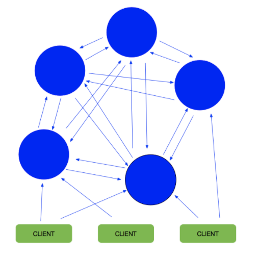
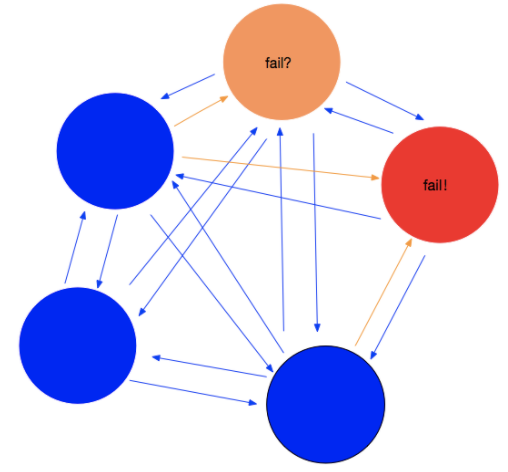
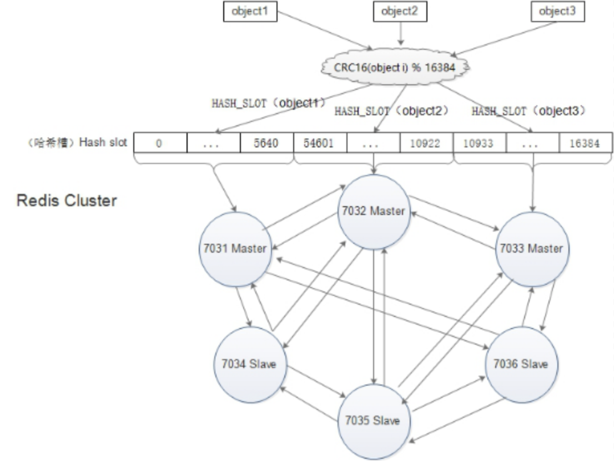

## 一、写在最前

#### 1.为什么使用redis？

redis是一种典型的no-sql 即非关系数据库，像python的字典一样，存储key-value键值对，工作在memory中。所以很适合用来充当整个互联网架构中各级之间的cache，比如lvs的4层转发层，nginx的7层代理层。尤其是lnmp架构应用层如php-fpm或者是Tomcat到mysql之间，做一个cache以减轻db的压力。因为有相当一部分的数据 只是简单的key-value对应关系，而且在实际的业务中常常在短时间内迅速变动 。

如果用关系数据库mysql之类存储会大大增加对db的访问，导致db的负担很重，因为所有的require中的大部分最后都要汇聚到db。所以如果想要业务稳定，那么解决db的压力就是关键，所以现在大部分的解决方案就是在db层之上的各级使用多级的no-sql ，像memcache redis 等来为db提供缓冲。


#### 2.为什么使用redis-cluster？

为了在大流量访问下提供稳定的业务，集群化是存储的必然形态，未来的发展趋势肯定是云计算和大数据的紧密结合，只有分布式架构能满足要求，如果没有集群化，何来的分布式？


#### 3.顺带总结一波redis原理之数据持久化

虽然redis这种no-sql一般都是作为cache来服务，但是如果完全没有数据可持久化的方法那么显得有些单薄。就像memcache 由于这种no-sql是工作在memory的 那么由于memory的实体是ram，所以如果重启或者宕机memory中的数据就全没了，数据的一致性的不到保障 ，但是redis不同，redis有相对的数据持久化的方案由两种方式构成aof & rdb。

* aof就像关系数据库中的binlog一样 把每一次写操作以追加的形式记录在其中以文件的形式刷到磁盘里 ，并且可以使用不同的fsync策略，无fsync,每秒fsync,每次写的时候fsync。使用默认的每秒fsync策略,Redis的性能依然很好(fsync是由后台线程进行处理的,主线程会尽力处理客户端请求)，一旦出现故障，最多丢失1秒的数据，但是缺点也随之而来 那就是aof文件的大小会随着时间线性增长，一段时间之后，就会变得很大 ，如果要在一端以AOF的形式来恢复数据，那么由于AOF文件的巨大体积，可能会让进程如同假死一样十分的慢。

* rdb则是一种快照机制，redis工作在内存中，rdb就是每隔一段时间，对内存中的数据做一次快照保存在rdb文件中， 而且redis的主从同步可以实现异步，也是由于rdb的机制，他在做快照时会fork出一个子进程，由子进程来做快照，父进程完全处理请求，毫不影响，很适合数据的备份。 但是问题是，如果数据量很大的话，rdb它要保存一个完整的数据集是一个大的工作，如果时间间隔设置的太短，那么严重影响redis的性能，但是按照常规设置的话 如5分钟一次，那么如果宕机或者重启，就会基于上次做rdb的时间从而丢失分钟级的数据。

point：在redis4.0的新特性中，采用了aof-rdb的混合方案来保障数据的持久性，但是官方的说法是还不成熟，是一个长期的工作，所以有待观察吧 。


#### 4.redis集群实现方案 

 **4.1 关于redis的集群化方案，目前有三种：**

（1）Twitter开发的twemproxy

优点：- 开发简单，对应用几乎透明- 历史悠久，方案成熟 缺点：- 代理影响性能- lvs和twemproxy会有节点性能瓶颈- redis扩容非常麻烦- twitter内部已放弃使用该方案，新使用的架构未开源

 

（2）豌豆荚开发的codis

优点：- 开发简单，对应用几乎透明- 性能比Twemproxy好- 有图形化界面，扩容容易，运维方便缺点：- 代理依旧影响性能- 组件过多，需要很多机器资源- 修改了redis代码，导致和官方无法同步，新特性跟进缓慢- 开发团队准备主推基于redis改造的reborndb

 

（3）redis官方的redis-cluster

优点：- 组件all-in-box，部署简单，节约机器资源- 性能比proxy模式好- 自动故障转移、Slot迁移中数据可用- 官方原生集群方案，更新与支持有保障缺点：- 架构比较新，最佳实践较少- 多键操作支持有限（驱动可以曲线救国）- 为了性能提升，客户端需要缓存路由表信息- 节点发现、reshard操作不够自动化

 

 **4.2 简介：**

* twemproxy架构简单，就是用proxy对后端redis-server进行代理，但是由于代理层的消耗性能很低，而且通常涉及多个key的操作都是不支持的，而且本身不支持动态扩容和透明的数据迁移，而且也失去维护，Twitter内部已经不使用了。

* codis使用的也是proxy思路，但是做的比较好，是这两种之间的一个中间级，而且支持redis命令是最多的，有图形化GUI管理和监控工具，运维友好。

* redis-cluster是三个里性能最强大的，因为他使用去中心化的思想，使用hash slot方式将16348个hash slot覆盖到所有节点上，对于存储的每个key值使用CRC16(KEY)&16348=slot得到他对应的hash slot，并在访问key时就去找他的hash slot在哪一个节点上，然后由当前访问节点从实际被分配了这个hash slot的节点去取数据，节点之间使用轻量协议通信，减少带宽占用、性能很高，自动实现负载均衡与高可用，自动实现failover ，并且支持动态扩展。官方已经玩到可以1000个节点，实现的复杂度低，因为他的去中心化思想免去了proxy的消耗，是全新的思路。

  但是它也有一些不足，例如官方没有提供图形化管理工具、运维体验差、全手工数据迁移，并且自己对自己本身的redis命令支持也不完全等。但是这些问题，我觉得不能掩盖他关键的新思想所带来的的优势，随着官方的推进，这些问题应该都能在一定时间内得到解决，那么这时候去中心化思想带来的高性能就会表现出他巨大的优势 。

  

## 二、Redis集群原理

#### 1、基本介绍

Redis集群是一个可以在多个Redis节点之间进行数据共享的设施installation。

Redis 集群不支持那些需要同时处理多个键的 Redis 命令，因为执行这些命令需要在多个 Redis 节点之间移动数据，并且在高负载的情况下，这些命令将降低Redis集群的性能，并导致不可预测的行为。

Redis 集群通过分区partition来提供一定程度的可用性availability：即使集群中有一部分节点失效或者无法进行通讯，集群也可以继续处理命令请求。

Redis集群提供了以下两个好处：

（1）将数据自动切分split到多个节点的能力。

（2）当集群中的一部分节点失效或者无法进行通讯时，仍然可以继续处理命令请求的能力。


#### 2、redis-cluster架构图



  （1）所有的redis节点彼此互联(PING-PONG机制),内部使用二进制协议优化传输速度和带宽。

  （2）节点的fail是通过集群中超过半数的节点检测失效时才生效。

  （3）客户端与redis节点直连,不需要中间proxy层.客户端不需要连接集群所有节点,连接集群中任何一个可用节点即可。

  （4）redis-cluster把所有的物理节点映射到[0-16383]slot上,cluster 负责维护node<->slot<->value

  （5）Redis集群中内置了16384个哈希槽，当需要在 Redis 集群中放置一个 key-value 时，redis 先对key 使用 crc16 算法算出一个结	果，然后把结果对 16384 求余数，这样每个 key 都会对应一个编号在 0-16383 之间的哈希槽，redis 会根据节点数量大致均等的将哈希槽映射到不同的节点。

  （6）集群中至少应该有奇数个节点，所以至少有三个节点，官方推荐三主三从的配置方式。


#### 3、redis-cluster投票:容错



（1）投票过程是集群中所有master参与,如果半数以上master节点与master节点通信超时(cluster-node-timeout),认为当前master节点挂掉。

（2）什么时候整个集群不可用(cluster_state:fail)?

* 如果集群任意master挂掉,且当前master没有slave.集群进入fail状态,也可以理解成集群的slot映射[0-16383]不完整时进入fail状态。（redis-3.0.0.rc1加入cluster-require-full-coverage参数，默认关闭,打开集群兼容部分失败。）
* 如果集群超过半数以上master挂掉，无论是否有slave，集群进入fail状态。


#### 4、Redis集群的数据分片

Redis 集群没有使用一致性hash，而是引入了哈希槽的概念。Redis 集群有16384个哈希槽（slot），当需要在 Redis 集群中放置一个 key-value 时，每个key通过CRC16校验后对16384取模来决定放置哪个槽，集群的每个节点负责一部分hash槽。

```java
比如当前集群有3个节点，那么：  
a.节点 A 包含 0 到 5500号哈希槽  
b.节点 B 包含5501 到 11000 号哈希槽  
c.节点 C 包含11001 到 16383号哈希槽。
```

这种结构很容易添加或者删除节点。比如如果我想新添加个节点D, 我需要从节点 A, B, C中分部分槽到D上。如果我想移除节点A，需要将A中得槽移到B和C节点上，然后将没有任何槽的A节点从集群中移除即可。

由于从一个节点将哈希槽移动到另一个节点并不会停止服务，所以无论添加删除或者改变某个节点的哈希槽的数量都不会造成集群不可用的状态。


#### 5、Redis只会为主节点分配哈希槽

集群分区，最主要的目的是在移除、添加一个节点时对已经存在的缓存数据的定位影响尽可能的降到最小。

和memcached一样，Redis也采用一定的算法进行键-槽（key->slot）之间的映射。memcached采用一致性哈希（consistency hashing）算法进行键-节点（key-node）之间的映射，而redis集群使用集群公式来计算键 key 属于哪个槽： 

**HASH_SLOT（key）= CRC16(key) % 16384**

其中 CRC16(key) 语句用于计算键 key 的 CRC16 校验和 。key经过公式计算后得到所对应的哈希槽，而哈希槽被某个主节点管理，从而确定key在哪个主节点上存取，这也是redis将数据均匀分布到各个节点上的基础。

<div align=middle></div>

#### 6、Redis集群的主从复制模型

为了使在部分节点失败或者大部分节点无法通信的情况下集群仍然可用，所以集群使用了主从复制模型，每个节点都会有N-1个复制品。

在我们的例子中具有A，B，C三个节点的集群，在没有复制模型的情况下，如果节点B失败了，那么整个集群就会以为缺少5501-11000这个范围的槽而不可用。

然而如果在集群创建的时候（或者过一段时间），我们为每个节点添加一个从节点A1，B1，C1,那么整个集群便有三个master节点和三个slave节点组成，这样在节点B失败后，集群便会选举B1为新的主节点继续服务，整个集群便不会因为槽找不到而不可用了。不过当B和B1 都失败后，集群是不可用的。

什么时候整个集群不可用(cluster_state:fail)?

如果集群任意master挂掉，且当前master没有slave，集群进入fail状态。也可以理解成集群的slot映射[0-16383]不完成时进入fail状态；

如果集群超过半数以上master挂掉，无论是否有slave集群进入fail状态。

ps：当集群不可用时，所有对集群的操作做都不可用，收到((error) CLUSTERDOWN The cluster is down)错误。

 

#### 7、数据一致性保证

Redis集群尽可能保证数据的强一致性，但在特定条件下会丢失数据，原因有两点：异步replication机制以及network partition。

* Master以及对应的Slaves之间使用异步的机制，在节点failover后，新的Master将会最终替代其他的replicas：

  write命令提交到Master，Master执行完毕后向Client返回“OK”，但由于一部分replication，此时数据还没传播给Slave；如果此时Master不可达的时间超过阀值，此时集群将触发对应的slave选举为新的Master，此时没有replication同步到slave的数据将丢失。

 

* 在network partition时，总有一个窗口期（node timeout）可能会导致数据丢失：

  由于网络分区，此时master不可达，且Client与Master处于一个分区，且此时集群处于“OK”。此时Failover机制，将其中一个Slave提升为新的Master，等待网络分区消除后，老的Master再次可达，此时节点被切换为Slave，而在这段期间，处于网络分区期间，Client仍然将write提交到老的Master，因为该Master被认为是仍然有效的。当老的Master再次加入集群，被切换成Slave后，这些数据将永远丢失。

 

#### 8、集群的可用性

当NODE_TIMEOUT时，触发failover，此时集群仍然可用的前提是：“大分区”（相对发生网络分区的Client-Master小分区端而言）端必须持有大部份Masters，且每个不可达的Master至少有一个Slave也在“大分区”端，且集群在小部分Nodes失效后仍然可以恢复有效性。

为了避免上述情况发生，Redis Cluster提供了“replicas migration”机制，当Master节点发生failover后，集群会动态重新分配、平衡Slaves的分布，有效地提高了集群的可用性。

#### 9、ASK重定向

ASK重定向与MOVED重定向非常相似，两者最大的区别在于在resharding期间，当前的Client发送的命令暂时与指定的Node交互，在迁移期间，slot原来的keys仍有可能在原来的节点上，所以Client的命令仍然先经过原来的节点，对于不存的节点，再到新的节点进行尝试获取，一旦完成slot的迁移，原来slot接收到Client命令请求，则节点向客户端返回MOVED转向。对比ASK重定向，MOVED重定向指hash slots已经永久地被另一个node接管，后续Client的命令都是与该Node交互。ASK是Redis集群非阻塞的表现，即Redis集群不会因slot resharding而导致整个集群不可用。

#### 10、容错

**10.1 节点失效检测**

跟大部份分布式框架一样，Redis Cluster节点间通过持续的心跳来保持信息同步，不过Redis Cluster节点信息同步是内部实现的，不依赖第三方组件，如zk。集群中的nodes持续交换ping、pong数据，消息协议使用Gossip，这两种packet数据结构一样，它们之间通过type字段区分。

节点定时向其他节点发送ping命令，它会随机选择存储的其他集群节点的其中三个进行信息“广播”，例如广播的信息包含一项是节点是否被标记为PFAIL/FAIL。PFAIL表示“可能已失效”，是尚未完全确认的失效状态（即可能是某个节点或少数Master认为其不可达）；FAIL表示Node被集群大多数的Masters认定为失效（即大多数Master已认定为不可达，且不可达的时间已经超过配置的NODE_TIMEOUT）。 

当节点收到其他节点广播的信息，它会记录被其他节点标记为失效的节点。举个例子，如果节点被某个节点标记为PFAIL，集群中大部份其他主节点也认为该节点进入了失效状态，那么该节点的状态会被标志为FAIL。当节点被标志为FAIL，这个节点已失效的信息会被广播至整个集群，所有集群中的节点都会将失效的节点标志为FAIL。

**10.2 集群失效检测**

当某个Master或者Slave不能被大多数Nodes可达时，用于故障迁移并将合适Slave提升为Master。当Slave提升未能成功，集群不能正常工作。即集群不能处理Client的命令的请求，当Client发出命令请求时，集群节点都将返回错误内容的respone。

集群正常工作时，负责处理16384个slots的节点中，全部节点均正常。反之，若集群中有一部分hash slot不能正常使用，集群亦将停止工作，即集群进入了FAIL状态。对于集群进入FAIL状态，会有以下两种情况：

  （1）至少有一个hash slot不可用。

  （2）集群中大部份Master都进入了PFAIL状态。

#### 11、总结

Redis集群为了解决什么问题而存在的？ 解决线性可扩展性。

Redis集群诞生以前怎么解决这个问题？ 客户端分片、代理协助分片(Twemproxy)、查询路由、预分片、一致性哈希、客户端代理/转发等。

Redis集群采用什么方式保证线性可扩展性、可用性、数据一致性？ Hash槽、查询路由、节点互联的混合模式。

Redis集群化面临的问题是什么？ Redis集群本身要解决的是可伸缩问题，同时数据一致、集群可用等一系列问题。前者涉及到了节点的哈希槽的分配(含重分配)，节点的增删，主从关系指定与变更(含自动迁移)这些具体的交互过程；后者则是故障发现，故障转移，选举过程等详细的过程。

Redis集群实现的核心思想和思路是什么？ 通过消息的交互（Gossip）实现去中心化(指的是集群自身的实现，不是指数据)，通过Hash槽分配，实现集群线性可拓展。