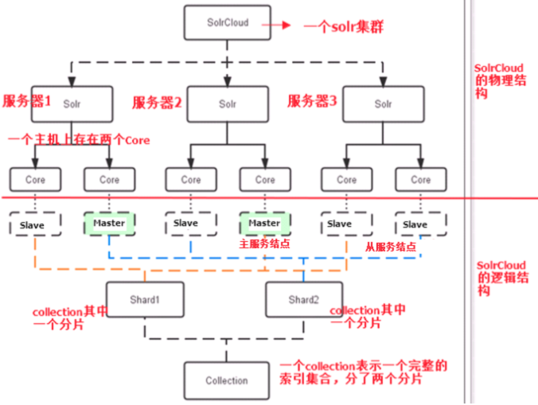

## Solr

Solr 是Apache下的一个顶级开源项目，采用Java开发，它是基于Lucene的全文搜索服务器。Solr提供了比Lucene更为丰富的查询语言，同时实现了可配置、可扩展，并对索引、搜索性能进行了优化。

Solr可以独立运行，运行在Jetty、Tomcat等这些Servlet容器中，Solr 索引的实现方法很简单，用 POST 方法向 Solr 服务器发送一个描述 Field 及其内容的 XML 文档，Solr根据xml文档添加、删除、更新索引 。Solr 搜索只需要发送 HTTP GET 请求，然后对 Solr 返回Xml、json等格式的查询结果进行解析，组织页面布局。

## Lucene

Lucene作为一个全文检索引擎，其具有如下突出的优点：

（1）索引文件格式独立于应用平台。Lucene定义了一套以8位字节为基础的索引文件格式，使得兼容系统或者不同平台的应用能够共享建立的索引文件。

（2）在传统全文检索引擎的倒排索引的基础上，实现了分块索引，能够针对新的文件建立小文件索引，提升索引速度。然后通过与原有索引的合并，达到优化的目的。

（3）优秀的面向对象的系统架构，使得对于Lucene扩展的学习难度降低，方便扩充新功能。

（4）设计了独立于语言和文件格式的文本分析接口，索引器通过接受Token流完成索引文件的创立，用户扩展新的语言和文件格式，只需要实现文本分析的接口。

（5）已经默认实现了一套强大的查询引擎，用户无需自己编写代码即使系统可获得强大的查询能力，Lucene的查询实现中默认实现了布尔操作、模糊查询（Fuzzy Search）、分组查询等等。

## 一、solr两种部署模式介绍

Standalone Server 独立服务器模式：适用于数据规模不大的场景

SolrCloud 分布式集群模式：适用于数据规模大，高可靠、高可用、高并发的场景

## 二、独立服务器模式

也是现在我们在用的部署模式。一主两从：主只负责写，从负责数据读取

说明：

1、solr主目录中存放不同的 Core，每个 Core是 solr的的可管理和可配置的索引。比如 UserCore、OrderCore。

里面存储的是 用户，订单的数据。

2、一个solr服务器实例中可有多个Core。

solrconfig.xml：core 实例配置文件。主从节点的信息，请求的处理，过滤，权重排序。

schema.xml：配置 core 存储数据的字段和类型

## 三、SolrCloud分布式集群模式

### 1. 为什么需要分布式集群模式？

**索引将被如何存储？**

分割成多个片存储到集群的不同节点上，每个分片有备份，存储在集群的不同节点上。

 **独立服务器上索引叫内核，那集群上索引叫什么？**

 solrCloud中以 collection（集合）来称呼索引，内核存储的是集合分片（shard）的备份（replication）

### 2、SolrCloud的基本概念

**注意区分：物理结构和逻辑结构**

SolrCloud包括的核心概念有：Cluster、Node、Collection、Shard、Core等。

**1、Cluster集群（物理结构）**

从逻辑上讲，一个Cluster包括一个或者多个Solr Collection；从物理上讲，一个Cluster由一个或者多个Solr Nodes。整个集群必须使用同一套schema和SolrCongfig。

**2、Node节点（物理结构）**

运行Solr的JVM实例，其中包括了一个或者多个Core。

**3、Collection（逻辑结构）**

从逻辑上讲，Collection是一个完整的索引，它被划分成一个或者多个Shard。如果Shard数量是一个以上的话，那么使用的索引方案则是分布式索引。这些Shard使用同一个configset。使用SolrCloud方式部署时，客户端发送请求时，使用Collection名称进行操作。这样客户端在分布式检索时，不用关心相关的Shard参数。

**4、Shard分片（逻辑结构）**

Shard是Collection的逻辑分片。一个Shard包含了一个或者以上的Replica。

**5、Core（物理结构）**

在Solr中，一个Core就是一个完整的索引，可以独立的提供索引和检索功能，其配置文件在相应的Core文件夹配置目录中。在SolrCloud中，一个Core就是一个Replica，其使用的配置都在zookeeper中。

### 扩展词、停止词、同义词配置

扩展词：相当于是一个完整的 term，不再进行分词处理。在搜索引擎 Solr 里的 ext.dic 文件配置。（配置完需要重启 Solr）

停止词：排除这些词，直接忽略。在配置文件里的 schema.xml 文件配置。（不需要重启，到控制台 reload 一下每个对应 core 即可）

同义词：对这样的词进行分词会得到一个同义词词组里的所有词。在配置文件里的 schema.xml 文件配置。（不需要重启，到控制台 reload 一下每个对应 core 即可）

在 schema.xml 配置的时候可以指定 index 和 query 所用不同的配置文件。

这样在构建倒排索引和查询的时候，分词的逻辑就可以按照不同的配置文件来处理。