## 原因

通过日志观察，pandora 和 其它的一些服务调用 search /goods/sim 接口时，会出现 request_time 超过8，9秒的情况。

 

原因一：

search 项目本身的 jvm，gc 时间过长导致用户线程阻塞。

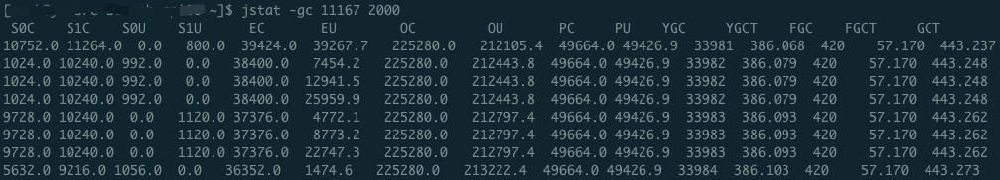

单次 yong gc 平均时间  YGCT / YGC = 386.068 / 33981 = 0.011(s)

单次 full gc 平均时间  FGCT / FGC = 57.170 / 420 = 0.136(s)

远远小于超时8，9秒的情况。

 

## **分析：**

一、在代码里打印日志：

```java
long start = System.currentTimeMillis();
ResponseModel responseModel = this.getSimResponseModel(param);
long time = System.currentTimeMillis() - start;
LoggerUtil.info(time, request, "/goods/sim");
 
 
StopWatch sw = new StopWatch();
sw.start();
QueryResponse qr = QueryExcutor.goodsQuery(sq);
sw.stop();
long num = 0;
if (qr != null && qr.getResults() != null) {
    num = qr.getResults().getNumFound();
}
LoggerUtil.info(sw.getLastTaskTimeMillis(), null, null, "SearchService:searchSimGoods:QueryExcutor.goodsQuery:num-" + num + ", qr- " + qr.toString(), "/goods/sim");
 
sw.start();
SimResponseModel model = SearchDTO.transferSimGoods(srm, qr, searchParam.getAccountId());
sw.stop();
LoggerUtil.info(sw.getLastTaskTimeMillis(), null, null, "SearchService:searchSimGoods:SearchDTO.transferSimGoods", "/goods/sim");
```


获取三个时间，一个是 this.getSimResponseModel(param)：此接口总的处理时间，QueryExcutor.goodsQuery(sq)：请求 solr 时间，SearchDTO.transferSimGoods()：数据计算，转化时间。

最终结果：观察日志，耗时来源是在请求 solr 的过程。

 

**nginx 日志**

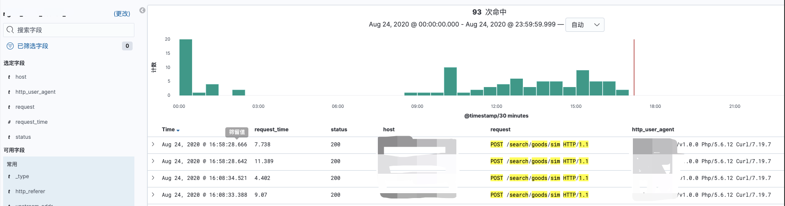

 

**search 业务日志**

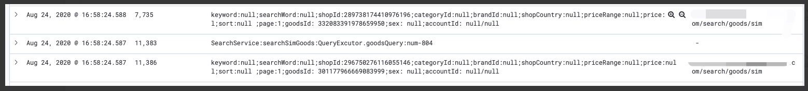

 

**一、首先想到可能是某些特定的查询条件会导致查询缓慢：**

通过 postman 模拟请求调用的过程中，基本都是几十毫秒内返回。

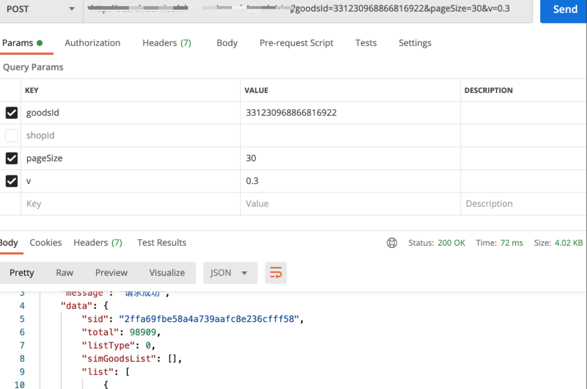

 

**二、 solr 运行的 jvm gc 时间过长导致了用户线程一直阻塞** 

solr jvm 运行信息

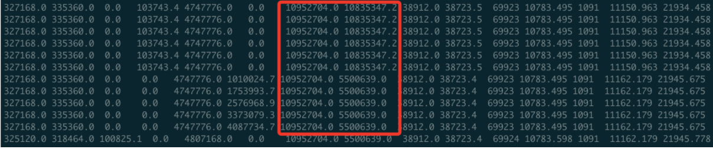

红框左边的一部分是 老年代区全部可用空间，右边是已经使用的时间，当右边使用完时，发生 full gc。此时计算上下两次的时间间隔，11162.179 - 11150.963 = 11.216(s)，此时 gc 的时间是 16:58，查看 kibana 日志。

nginx 在 16:58 打印出了两条日志，pandora 调用搜索服务两次，其中就有一次时间在 11 秒以上。同时在 search 的项目本身日志也打印出来两条日志，host 是搜索服务的域名 ，并且一条请求时间也是在 11 秒以上。

所以 solr 本身的 jvm gc 是导致请求时间过长的根本原因。

 

## 优化：

查看当前使用的 gc 收集器：jmap -heap 7732

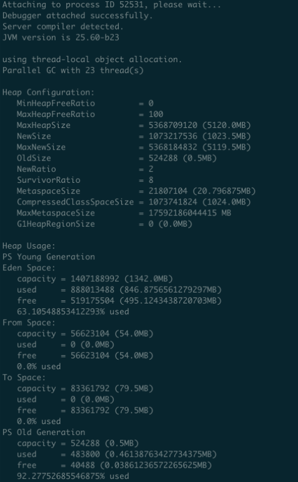

 

可以看到使用的是 Parallel GC with 23，代表的意思是新生代使用 Parallel Scavenge，老年代使用 Serial Old 

而 Serial Old 是单线程的收集器，单线程当然会慢。

 

### 一、ParNewGC 和 CMS 组合

ParNewGC：新生代的多线程收集器，采用复制算法。

CMS： 老年代收集器，多线程，采用 标记-清除算法。

 

CMS收集器工作的整个流程分为以下4个步骤：

- **初始标记（CMS initial mark）**：仅仅只是标记一下GC Roots能直接关联到的对象，速度很快，需要“Stop The World”。
- **并发标记（CMS concurrent mark）**：进行**GC Roots Tracing**的过程，在整个过程中耗时最长。
- **重新标记（CMS remark）**：为了修正并发标记期间因用户程序继续运作而导致标记产生变动的那一部分对象的标记记录，这个阶段的停顿时间一般会比初始标记阶段稍长一些，但远比并发标记的时间短。此阶段也需要“Stop The World”。
- **并发清除（CMS concurrent sweep）**

整个过程中耗时最长的并发标记和并发清除过程收集器线程都可以与用户线程一起工作，所以，从总体上来说，CMS收集器的内存回收过程是与用户线程一起并发执行的。 

 

**缺点**：因为基于“标记-清除”算法实现的收集器，这意味着收集结束时会有大量空间碎片产生。

 

jvm 启动参数设置：在 catalina.sh 中设置

```shell
JAVA_OPTS="-server -Xms10g -Xmx10g -XX:MaxNewSize=6g -XX:+UseParNewGC -XX:+UseConcMarkSweepGC -XX:+UseCMSCompactAtFullCollection -XX:CMSFullGCsBeforeCompaction=5 -XX:SurvivorRatio=8 -XX:ParallelGCThreads=20 -XX:MaxTenuringThreshold=6"
```

-XX:+UseCMSCompactAtFullCollection -XX:CMSFullGCsBeforeCompaction=5。这两个参数用来解决空间碎片问题，

在 -XX:+UseCMSCompactAtFullCollection 开启的情况下，设置 -XX:CMSFullGCsBeforeCompaction=5 表示当发生 5 次 full gc 后，会进行一次内存空间的压缩、整理工作。

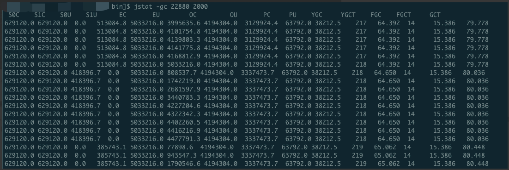

时间稳定优化在1秒以内。


### 二、G1 收集器

G1 (Garbage-First)是一款面向服务器的垃圾收集器，主要针对配备多颗处理器及大容量内存的机器，以极高概率满足GC停顿时间要求的同时,还具备高吞吐量性能特征。普通的收集器当内存分配达到 10 多个 g 时，在 gc 时需要清理的对象也就越多，时间消耗随着堆内存的增长而不可避免的

增加。但 G1 可以做到限制时间来收集。

G1 模型图：

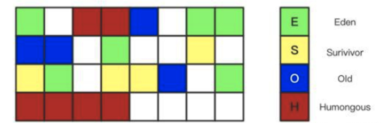

 

G1垃圾回收器，会把你的堆内存分为 大小相等 的独立区域（Region），JVM最多可以分配2048个Region，一般Region大小等于堆大小除以2048，比如堆大小为4096M，则Region大小为2M，当然也可以 用参数"-XX:G1HeapRegionSize"手动指定Region大小。 

每个Region的状态不确定，可能是Eden区域，也可能是Old区域，不需要原有的联系设置。

Humongous区域，用来存储大对象，判定规则就是一个大对象超过了一个Region大小的50%，比如按照上面算的，每个Region是2M，只要一个大对象超过了1M，就会被放入Humongous中视对象大小而定格子的连续数目。

 

G1收集器的运作大致可划分为以下几个步骤：

- **初始标记（Initial Marking）** 仅仅只是标记一下GC Roots 能直接关联到的对象，此阶段需要**停顿线程**，但耗时很短。
- **并发标记（Concurrent Marking）** 从GC Root 开始对堆中对象进行**可达性分析**，找到存活对象，此阶段耗时较长，但**可与用户程序并发执行**。
- **最终标记（Final Marking）** 为了修正在并发标记期间因用户程序继续运作而导致标记产生变动的那一部分标记记录，虚拟机将这段时间对象变化记录在**线程的Remembered Set Logs**里面，最终标记阶段需要**把Remembered Set Logs的数据合并到Remembered Set中**，这阶段需要**停顿线程**，但是**可并行执行**。
- **筛选回收（Live Data Counting and Evacuation）** 首先对各个Region中的回收价值和成本进行排序，根据用户所期望的GC 停顿时间来制定回收计划。此阶段也可以做到与用户程序一起并发执行，但是因为只回收一部分Region，时间是用户可控制的，而且停顿用户线程将大幅度提高收集效率。 

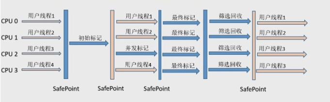

 

查看 linux cpu 和核数

```shell
# 查看物理CPU个数
cat /proc/cpuinfo| grep "physical id"| sort| uniq| wc -l
 
# 查看每个物理CPU中core的个数(即核数)
cat /proc/cpuinfo| grep "cpu cores"| uniq
 
# 查看逻辑CPU的个数
cat /proc/cpuinfo| grep "processor"| wc -l
```

 

jvm 启动参数设置：在 catalina.sh 中设置

```shell
JAVA_OPTS="-server -Xms5g -Xmx5g -XX:+UseG1GC -XX:MaxTenuringThreshold=10 -XX:ParallelGCThreads=20 -XX:ConcGCThreads=20 -XX:G1HeapRegionSize=4 -XX:NewRatio=2 -XX:SurvivorRatio=8 -XX:MaxGCPauseMillis=100"
```

 

重启 tomcat，查看 jvm 堆信息

jmap -heap 7732

已经是 G1 收集器了

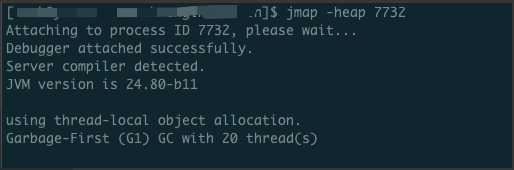

 

gc 时间控制在 100 毫秒左右。

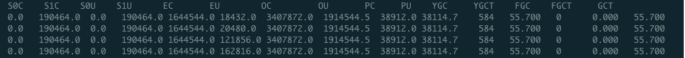

 

kibana 查看实际请求时间：已经被优化在 1 秒左右。

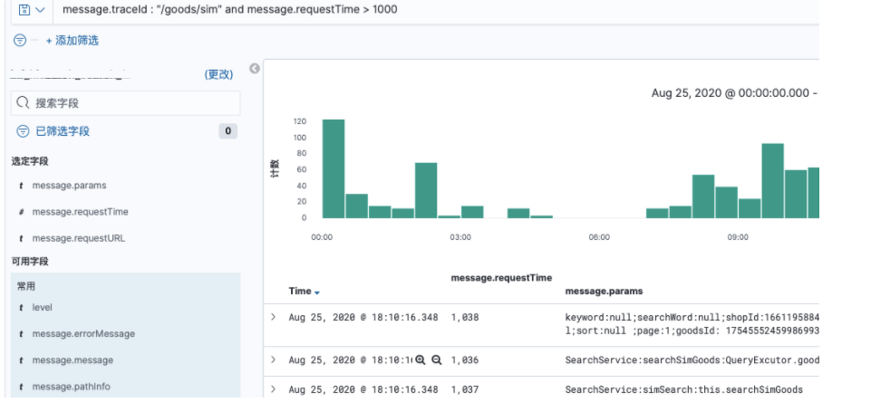