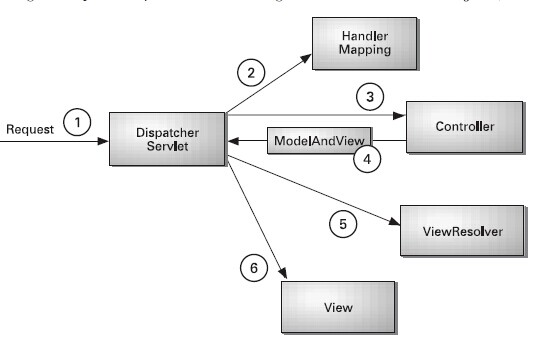

### Spring MVC 处理流程图



①：DispatcherServlet是SpringMVC中的前端控制器(front controller)，负责接收request并将request转发给对应的处理组件。

url找到对应controller中处理请求的方法DispatcherServlet的核心方法为doService()，doService()中的核心逻辑由doDispatch()实现。

```java
/** 中央控制器,控制请求的转发 **/
protected void doDispatch(HttpServletRequest request, HttpServletResponse response) throws Exception {
        HttpServletRequest processedRequest = request;
        HandlerExecutionChain mappedHandler = null;
        int interceptorIndex = -1;
 
        try {
            ModelAndView mv;
            boolean errorView = false;
            try {
　　　　　　　　　// 1.检查是否是文件上传的请求
                processedRequest = checkMultipart(request);
 
                // 2.取得处理当前请求的controller,这里也称为handler,处理器,第一个步骤的意义就在这里体现了.这里并不是直接返回controller,而是返回的HandlerExecutionChain请求处理器链对象,该对象封装了handler和interceptors.
                mappedHandler = getHandler(processedRequest, false);
　　　　　　　　　// 如果handler为空,则返回404
                if (mappedHandler == null || mappedHandler.getHandler() == null) {
                    noHandlerFound(processedRequest, response);
                    return;
                }
                
                // 省略
                .....
                
                // 4.拦截器的预处理方法
                HandlerInterceptor[] interceptors = mappedHandler.getInterceptors();
                
                // 省略
                .....
 
                // 5.实际的处理器处理请求,返回结果视图对象
                mv = ha.handle(processedRequest, response, mappedHandler.getHandler());
 
                // 结果视图对象的处理 
                .....
 
                // 6.拦截器的后处理方法 
                .....
 
            // 请求成功响应之后的方法
            triggerAfterCompletion(mappedHandler, interceptorIndex, processedRequest, response, null);
        }
```

上面的方法中：

第2步其实就是从第一个步骤中的Map<urls,beanName>中取得Controller，然后经过拦截器的预处理方法，到最核心的部分--第5步调用controller的方法处理请求。在第2步中我们可以知道处理request的Controller。

第5步就是要根据url确定Controller中处理请求的方法，然后通过反射获取该方法上的注解和参数，解析方法和参数上的注解，最后反射调用方法获取ModelAndView结果视图。因为上面采用注解url形式说明的，所以我们这里继续以注解处理器适配器来说明。

第5步调用的就是AnnotationMethodHandlerAdapter的handle().handle()中的核心逻辑由invokeHandlerMethod(request, response, handler)实现。

```java
/** 获取处理请求的方法,执行并返回结果视图 **/
protected ModelAndView invokeHandlerMethod(HttpServletRequest request, HttpServletResponse response, Object handler)
            throws Exception {
　　　　 // 1.获取方法解析器
        ServletHandlerMethodResolver methodResolver = getMethodResolver(handler);
　　　　 // 2.解析request中的url,获取处理request的方法 
  		  // 根据 request 找controller的处理方法，是通过controller 的 url和 方法上的 url来和request 的url比较，选择出方法。
        Method handlerMethod = methodResolver.resolveHandlerMethod(request);
　　　　 // 3.方法调用器
        ServletHandlerMethodInvoker methodInvoker = new ServletHandlerMethodInvoker(methodResolver);
        ServletWebRequest webRequest = new ServletWebRequest(request, response);
        ExtendedModelMap implicitModel = new BindingAwareModelMap();
　　　　 // 4.执行方法
        Object result = methodInvoker.invokeHandlerMethod(handlerMethod, handler, webRequest, implicitModel);
　　　　 // 5.封装结果视图
        ModelAndView mav =
                methodInvoker.getModelAndView(handlerMethod, handler.getClass(), result, implicitModel, webRequest);
        methodInvoker.updateModelAttributes(handler, (mav != null ? mav.getModel() : null), implicitModel, webRequest);
        return mav;
    }
```

在第四步中，会调用 invokeHandlerMethod 方法，在此方法中，会调用 resolveHandlerArguments 方法，完成 request的参数和方法参数的绑定。

* 通过注解进行绑定 @RequestParam
* 通过参数名称进行绑定 （asm 字节码）

```java
private Object[] resolveHandlerArguments(Method handlerMethod, Object handler,
            NativeWebRequest webRequest, ExtendedModelMap implicitModel) throws Exception {
  // 从request中取值,并进行赋值操作
  if (paramName != null) {
　// 根据paramName从request中取值,如果没有通过RequestParam注解指定paramName,则使用asm读取class文件来获取paramName
  args[i] = resolveRequestParam(paramName, required, defaultValue, methodParam, webRequest, handler);
   }
}
```

​		

②：HanlerMapping是SpringMVC中完成url到Controller映射的组件。DispatcherServlet接收request,然后从HandlerMapping查找处理request的controller。		

来建立Map<url,controller>关系。入口类为ApplicationObjectSupport的setApplicationContext方法。setApplicationContext方法中核心部分就是初始化容器initApplicationContext(context)，子类AbstractDetectingUrlHandlerMapping实现了该方法。

```java

public void initApplicationContext() throws ApplicationContextException {
        super.initApplicationContext();
        detectHandlers();
    }
    /**
　　  * 建立当前ApplicationContext中的所有controller和url的对应关系
　　　 */
    protected void detectHandlers() throws BeansException {
        if (logger.isDebugEnabled()) {
            logger.debug("Looking for URL mappings in application context: " + getApplicationContext());
        }
　　　　 // 获取ApplicationContext容器中所有bean的Name
        String[] beanNames = (this.detectHandlersInAncestorContexts ?
                BeanFactoryUtils.beanNamesForTypeIncludingAncestors(getApplicationContext(), Object.class) :
                getApplicationContext().getBeanNamesForType(Object.class));
 
        // 遍历beanNames,并找到这些bean对应的url
        for (String beanName : beanNames) {
　　　　　　 // 找bean上的所有url(controller上的url+方法上的url),该方法由对应的子类实现
            String[] urls = determineUrlsForHandler(beanName);
            if (!ObjectUtils.isEmpty(urls)) {
                // 保存urls和beanName的对应关系,put it to Map<urls,beanName>,该方法在父类AbstractUrlHandlerMapping中									实现
                registerHandler(urls, beanName);
            }
            else {
                if (logger.isDebugEnabled()) {
                    logger.debug("Rejected bean name '" + beanName + "': no URL paths identified");
                }
            }
        }
    }
    /** 获取controller中所有方法的url,由子类实现,典型的模板模式 **/
　　protected abstract String[] determineUrlsForHandler(String beanName);
```


③：Cntroller处理request，并返回ModelAndView对象，Controller是SpringMVC中负责处理request的组件(类似于struts2中的Action)，ModelAndView是封装结果视图的组件。

④ ⑤ ⑥：视图解析器解析ModelAndView对象并返回对应的视图给客户端。


### SpringMVC的工作机制

在容器初始化时：ApplicationObjectSupport的setApplicationContext方法，核心方法 initApplicationContext(context) 。会建立所有url和controller的对应关系，保存到Map<url,controller>中。这样就可以根据request快速定位到Controller，因为最终处理request的是Controller中的方法，Map中只保留了url和Controller中的对应关系，所以要根据request的url进一步确认Controller中的method。

通过 invokeHandlerMethod 方法，确定处理请求的method后，接下来的任务就是参数绑定，把request中参数绑定到方法的形式参数上，这一步是整个请求处理过程中最复杂的一个步骤。SpringMVC提供了两种request参数与方法形参的绑定方法：

① 通过注解进行绑定 @RequestParam

② 通过参数名称进行绑定。

使用注解进行绑定，我们只要在方法参数前面声明@RequestParam("a")，就可以将request中参数a的值绑定到方法的该参数上。

使用参数名称进行绑定的前提是必须要获取方法中参数的名称，Java反射只提供了获取方法的参数的类型，并没有提供获取参数名称的方法。SpringMVC解决这个问题的方法是用asm框架读取字节码文件，来获取方法的参数名称。

建议，使用注解来完成参数绑定，这样就可以省去asm框架的读取字节码的操作。


### SpringMVC的优化

　　1、Controller如果能保持单例，尽量使用单例,这样可以减少创建对象和回收对象的开销。

　　2、处理request的方法中的形参务必加上@RequestParam注解，这样可以避免SpringMVC使用asm框架读取class文件获取方法参数名的过程。即便SpringMVC对读取出的方法参数名进行了缓存，如果不要读取class文件当然是更加好。

　　3、阅读源码的过程中,发现SpringMVC并没有对处理url的方法进行缓存，也就是说每次都要根据请求url去匹配Controller中的方法url，如果把url和method的关系缓存起来，会不会带来性能上的提升呢？有点恶心的是，负责解析url和method对应关系的ServletHandlerMethodResolver是一个private的内部类，不能直接继承该类增强代码，必须要该代码后重新编译。当然，如果缓存起来，必须要考虑缓存的线程安全问题。


