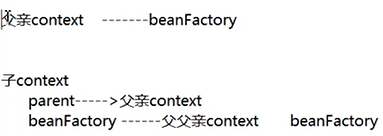

### spi 介绍

### Spring IOC

1、父容器（扫描 service，repository 等组件）

ContextLoadListener 注册到 ServletContext 

其中 contextInitialzed() 会实例化 IOC 父容器。

2、子容器 (web 容器 )，至扫描 controller 等 spring mvc 组件

 DispatecherServlet 注册到 ServletContext  

spring 父子容器关系图：

### spring  启动时源码分析

