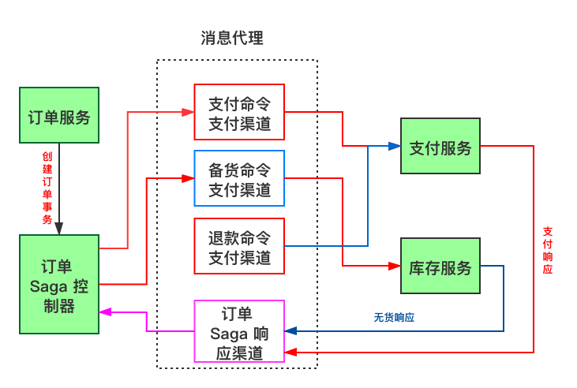

- 前言
- 事务
- 分布式事务
  - 分布式事务产生原因
  - 分布式事务使用场景
    - 银行转账
    - 下单扣库存
    - 同步超时
  - 分布式事务难点
    - 事务原子性
    - 事务一致性
    - 事务的隔离性
- 基本概念
  - SOA
  - CAP 定理
  - 数据一致性
    - 强一致性
    - 弱一致性
    - 最终一致性
  - BASE
    - 基本可用
    - 软状态
    - 最终一致性
  - 柔性事务
    - 可见性（对外可查询）
    - 操作幂等性
  - 刚性事务和柔性事务
  - XA 协议
- 分布式事务解决方案
  - 强一致性方案
    - 两阶段提交/XA
      - 优点
      - 缺点
      - 无法解决的问题
      - 实际应用场景
    - 三阶段提交（3PC）
      - 过程
        - CanCommit 阶段
        - PreCommit 阶段
        - DoCommit 阶段
      - 状态描述
      - 优点
      - 缺点
    - TCC
      - 过程
      - 示例说明
      - 实现关键要素
      - 适用场景
      - 解决的问题
      - 缺点
    - 总结
      - 2PC 和 3PC
      - 2PC 和 TCC
  - 最终一致性方案
    - 最大努力通知
      - 优点
      - 缺点
      - 实际应用场景
    - 本地消息表
      - 处理流程
      - 实现条件
      - 容错机制
      - 优点
      - 缺点
      - 实际应用场景
        - 跨行转账
        - 小米商城
    - 用 MQ 代替本地消息表
      - 执行流程
      - 与本地消息表方案的区别
      - 实现条件与容错
      - 实际应用场景
        - RocketMQ
          - 处理流程
    - Saga 事务
      - 产生原因
      - 方案详情
      - 实现方式
        - 事件/编排（Choreography）
          - 优点
          - 缺点
        - 命令/协调（Orchestration）
          - 优点
          - 缺点
      - 优点
      - 缺点
      - 使用场景
- 总结
- 参考文档

# 前言

一直以来分布式事务都是一个高大上的东西，每每谈到分布式事务总是充斥着 “2PC”，“3PC”，“base 理论”，“TCC” 等高端概念。

今天我想通过一篇文章，帮大家真正搞懂分布式事务。当我们再谈起分布式事务时，不再只有 “2PC”，“3PC”，“base 理论”，“TCC” 等这些知识碎片，而是能够将知识连成一片，形成知识体系。

# 事务

在介绍分布式事务之前，我们需要了解一下什么是事务。

事务（Transaction）是并发控制的单位。是由应用程序中的一个个严密操作组成的操作序列。事务遵循 “All or Nothing” 机制，即要么全做，要么全部都不做。只有当事务中的每个操作都正常执行，事务才会提交，否则事务便会回滚。事务应该具有 4 个属性：原子性、一致性、隔离性、永久性。这四个属性通常称为 ACID 特性。

# 分布式事务

> 分布式事务就是指事务的参与者、支持事务的服务器、资源服务器、以及事务管理器分别位于不同的分布式系统的不同节点之上。
>
> [百度百科](https://baike.baidu.com/item/分布式事务)

理解起来就是一个事务中的不同的小操作分布在不同的服务器上，且属于不同的应用。这些操作，要么全部成功执行，要么全部不执行。本质上来说，分布式事务就是为了保证数据库的数据一致性。

## 分布式事务产生原因

那么为什么会有分布式事务的概念呢，借用 [Dubbo 官方文档](https://dubbo.apache.org/zh-cn/docs/user/preface/background.html) 一段背景介绍，帮助我们来理解分布式事务的由来。

> 随着互联网的发展，网站应用的规模不断扩大，常规的垂直应用架构已无法应对，分布式服务架构以及流动计算架构势在必行，亟需一个治理系统确保架构有条不紊的演进。
>
> **单一应用架构**
>
> 当网站流量很小时，只需一个应用，将所有功能都部署在一起，以减少部署节点和成本。此时，用于简化增删改查工作量的数据访问框架（ORM）是关键。
>
> **垂直应用架构**
>
> 当访问量逐渐增大，单一应用增加机器带来的加速度越来越小，提升效率的方法之一是将应用拆成互不相干的几个应用，以提升效率。此时，用于加速前端页面开发的 Web 框架（MVC）是关键。
>
> **分布式服务架构**
>
> 当垂直应用越来越多，应用之间交互不可避免，将核心业务抽取出来，作为独立的服务，逐渐形成稳定的服务中心，使前端应用能更快速的响应多变的市场需求。此时，用于提高业务复用及整合的分布式服务框架（RPC）是关键。
>
> **流动计算架构**
>
> 当服务越来越多，容量的评估，小服务资源的浪费等问题逐渐显现，此时需增加一个调度中心基于访问压力实时管理集群容量，提高集群利用率。此时，用于提高机器利用率的资源调度和治理中心（SOA）是关键。
>
> [Dubbo 官方文档](https://dubbo.apache.org/zh-cn/docs/user/preface/background.html)

当架构从单体向多服务演进时，整个系统的可靠性就变得难以控制。

在单体服务中，一个请求的整个周期，从请求到响应结果，都是在一台服务器上，本地事务就可以保证一组数据操作的一致性。

在微服务中，从请求到响应，中间可能跨越多台服务器，多个数据库。

在分布式系统中，各个节点之间在物理上相互独立，通过网络进行沟通和协调。由于存在事务机制，可以保证每个独立节点上的数据操作可以满足 ACID，但是相互独立的节点之间无法准确的知道其它节点中的事务执行情况。

我们想让分布式系统中的多台机器保持一致性，保证所有节点的数据写操作，要么全部执行，要么全部不执行。因此便引入了 **分布式事务** 的概念。

## 分布式事务使用场景

为了说明分布式事务就在我们的身边真实存在着，我们先来看几个例子。

下面示例引用 [分布式事务，这一篇就够了](https://xiaomi-info.github.io/2020/01/02/distributed-transaction/) 文章内容。

### 银行转账

转账是最经典的分布式事务场景。假设用户 A 使用银行 APP 发起一笔跨行转账给用户 B，银行系统首先扣掉用户 A 的钱，然后增加用户 B 账户中的余额。此时就会出现两种异常情况：

1. 用户 A 账户扣款成功，用户 B 账户余额增加失败；
2. 用户 A 账户扣款失败，用户 B 账户余额增加成功；

对于银行系统来说，以上两种情况都是不允许发生的，此时就需要分布式事务来保证转账操作的成功。

### 下单扣库存

在电商系统中，下单是用户最常见的操作。在下单接口中必定会涉及生成订单 ID，扣减库存等操作，对于微服务架构系统，订单 ID 与库存服务一般都是独立的服务，此时就需要分布式事务来保证整个下单接口的成功。

### 同步超时

继续以电商系统为例，在微服务体系架构下，我们的支付与订单都是作为单独的系统存在。订单的支付状态依赖支付系统的通知。假设一个场景：我们的支付系统收到来自第三方支付的通知，告知某个订单支付成功，接收通知接口需要同步订单服务变更订单状态接口，更新订单状态为成功。流程图如下，从图中可以看出有两次调用，第三方支付调用支付服务，以及支付服务调用订单服务，这两步调用都有可能出现调用超时的情况，此处如果没有分布式事务的保证，就会出现用户订单实际支付情况与最终用户看到的订单支付情况不一致的情况。

## 分布式事务难点

我们前面提到了分布式事务就是要保证数据一致性。这个概念仍然有一些抽象，我们用事务的 ACID 属性来解释一下分布式事务在保证数据一致性中有什么难点。

### 事务原子性

事务操作跨不同节点，当多个节点某一节点操作失败时，需要保证多节点操作要么都做，要么什么都不做。

### 事务一致性

当发生网络传输故障或者节点故障，节点间数据复制通道中断，在进行事务操作时需要保证数据一致性，保证事务的任何操作都不会使得数据违反数据库定义的约束、触发器等规则。

### 事务的隔离性

事务隔离性的本质就是如何正确处理多个并发事务的读写冲突和写写冲突，因为在分布式事务控制中，可能会出现提交不同步的现象，这个时候就有可能出现 “部分已提交” 的事务。

此时并发应用访问数据如果没有加以控制，有可能出现“脏读”问题。

# 基本概念

接下来我们将要介绍的是如何实现分布式事务，在介绍如何实现分布式事务之前，我们先来介绍一些基本概念，有助于我们后面的学习理解。

## SOA

> SOA （Service-Oriented Architecture，面向服务架构）是一种设计方法，其中包含多个服务，而服务之间通过配合最终会提供一系列功能。一个服务通常以独立的形式存在于操作系统进程中。服务之间通过网络调用，而非采用进程内调用的方法进行通信。
>
> 《微服务设计》

## CAP 定理

CAP 定理指在分布式系统中，一致性（consistency）、可用性（availability）和分区容忍性（partition tolerance）三者无法兼得，最多只能保证三个中的两个。

一致性是当访问多个节点时能得到同样的值。可用性意味着每个请求都能获得相应。分区容忍性是指集群中的某些节点在无法联系后，集群整体还能继续进行服务的能力。

CA 系统是不存在的。这是为什么呢？CA 系统意味着我们要牺牲分区容忍性，如果系统没有分区容忍性，就不能跨网络运行。换句话说，需要在本地运行一个单独的进程。所以，CA 系统在分布式系统中是根本不存在的。

对于 CP 系统，我们放弃的的是可用性，追求的是一致性和分区容忍性，常见的场景比如 zookeeper。

对于 AP 系统，我们放弃的是一致性，追求的是可用性和分区容忍性。这是大多数分布式系统设计时的选择。

至于选择 CP 还是 AP，则需要根据我们具体情况而定。

## 数据一致性

我们之前有说过，分布式事务就是为了保证数据一致性。数据一致性对于分布式系统来说非常重要。而 **复制** 是导致出现 **数据一致性** 问题的唯一原因。

如果只用一台数据库来处理所有的写入和读取请求，就一定不存在数据一致性的问题。但在中大型项目中，我们却经常需要将一份数据存储在超过一台数据库中（即复制），原因有三：

1. 即使一部分数据库出现故障，系统也能正常工作（高可用）
2. 使数据与用户在地理上接近（降低延迟）
3. 扩展可以处理读请求的机器数量（可扩展性、提高吞吐量）

### 强一致性

系统中的某个数据被成功更新后，后续任何对该数据的读取操作都将得到更新后的值；
也称为：原子一致性（Atomic Consistency）或 线性一致性（Linerizable Consistency）。

有两个要求：

- 任何一次读都能读到某个数据的最近一次写的数据。
- 系统中的所有进程，看到的操作顺序，都和全局时钟下的顺序一致。

简言之，在任意时刻，所有节点中的数据都是一样的。

例如，对于关系型数据库，要求更新过的数据能让后续的访问都能看到，这是强一致性。

如果一个分布式系统保证了强一致性，这就要求系统中内某一台服务器的数据发生了改变，那么就需要等待其他所有服务器数据同步完成后，才能正常的对外提供服务。因此，如果保证了强一致性，势必会牺牲可用性。

### 弱一致性

系统中的某个数据被更新后，后续对该数据的读取操作可能得到更新后的值，也可能是更新前的值。

但即使过了 “不一致时间窗口” 这段时间后，后续对该数据的读取结果也不一定是最新的值。

所以可以理解为，在数据更新后，如果能容忍后续的访问只能访问部分或者全部访问不到，则是弱一致性。

### 最终一致性

最终一致性是弱一致性的特殊形式，存储系统保证在没有新的更新的条件下，最终所有的访问都是最后更新的值。

不保证在任意时刻任意节点上的同一份数据都是相同的，但是随着时间的迁移，不同节点上的同一份数据总是在向趋同的方式变化。

简单来说，就是在一段时间后，节点间的数据会最终达到一致状态。

我们日常中购买火车票就是最终一致性的体现。在购票页面我们明明看到了还有一张票，但是在付钱的时候，系统却提示没票了。这就是保证了最终的数据是一致的，允许中间有一段时间的数据不一致。

## BASE

以大多数分布式系统为例，分区容忍性是最基本的要求，否则就失去了价值，因此只能在一致性和可用性之间取一个平衡。其实对于大多数 web 系统来说，并不需要强一致性，因此牺牲一致性，换取高可用性是现在多数分布式系统的方向。这就是 BASE 理论的来源。

BASE 是 Basically Available（基本可用）、Soft state（软状态）和 Eventually consistent（最终一致性）三个短语的缩写。BASE 理论是对 CAP 中一致性和可用性权衡的结果，其来源于对大规模互联网系统分布式实践的总结，是基于 CAP 定理逐步演化而来的。BASE 理论的核心思想是：**即时无法做到强一致性，但每个应用都可以根据自身业务特点，采用适当的方式来使系统达到最终一致性。**

**BASE 理论本质上是对 CAP 的延伸和补充，更具体地说，是对 CAP 中 AP 方案的一个补充： CAP 理论是忽略延时的，而实际应用中延时是无法避免的。**

接下来看一下 BASE 中的三要素。

### 基本可用

基本可用是指分布式系统在出现不可预知故障的时候，允许损失部分可用性——注意，这绝不等价于系统不可用。比如：

- **响应时间上的损失**。正常情况下，一个在线搜索引擎需要在 0.5 秒之内返回给用户响应的查询结果，但由于出现故障，查询结果的响应时间增加了 1-2 秒
- **系统功能上的损失**。正常情况下，在一个电子商务网站上进行购物的时候，消费者几乎能够顺利完成每一笔订单，但是在一些节日大促购物高峰的时候，由于消费者的购物行为激增，为了保护购物系统的稳定性，部分消费者可能会被引导到一个降级页面。

### 软状态

软状态指允许系统中的数据存在中间状态，并认为该中间状态的存在不会影响系统的整体可用性，即允许系统在不同节点的数据副本之间进行数据同步的过程存在延时。

### 最终一致性

最终一致性强调的是所有的数据副本，在经过一段时间的同步之后，最终都能达到一个一致的状态。因此，最终一致性的本质是需要系统保证最终数据能够达到一致，而不需要实时保证系统数据的强一致性。

如订单的 “支付中” 状态，最终会变为 “支付成功” 或者 “支付失败”，使订单状态与实际交易结果达成一致，但需要一定时间的延迟、等待。

## 柔性事务

在电商等互联网场景下，传统的事务在数据库性能和处理能力上都暴露出了瓶颈。在分布式领域基于 CAP 理论以及 BASE 理论，有人就提出了柔性事务的概念。

基于 BASE 理论的设计思想，柔性事务下，在不影响系统整体可用性的情况下（Basically Available 基本可用），允许系统存在数据不一致的中间状态（Soft State 软状态），在经过数据同步的延时之后，最终数据能够达到一致。

这并不是完全放弃了 ACID，而是通过放宽一致性要求，借助本地事务来实现最终分布式事务一致性的同时也保证系统的吞吐。

下面介绍实现柔性事务的一些常见特性，这些特性在具体的方案中不一定都要满足，因为不同的方案要求不一样。

### 可见性（对外可查询）

在分布式事务执行过程中，如果某一个步骤执行出错，就需要明确的知道其他几个操作的处理情况，这就需要其他的业务都能够提供查询接口，保证可以通过查询来判断操作的处理情况。

为了保证操作的可查询，需要对于每一个服务的每一次调用都有一个全局唯一的标识，可以是业务单据号（如订单号）、也可以是系统分配的操作流水号（如支付记录流水号）。除此之外，操作的时间信息也要有完整的记录。

### 操作幂等性

幂等性，其实是一个数学概念。幂等函数，或幂等方法，是指可以使用相同参数重复执行，并能获得相同结果的函数。

幂等操作的特点是其任意多次执行所产生的影响均与一次执行的影响相同。也就是说，同一个方法，使用同样的参数，调用多次产生的业务结果与调用一次产生的业务结果相同。

之所以需要操作幂等性，是因为为了保证数据的最终一致性，很多事物协议都会有很多重试的操作，如果一个方法不保证幂等，那么将无法被重试。

幂等操作的实现方式有多重，如在系统中缓存所有的请求与处理结果、检测到重复操作后直接返回上一次的处理结果等。

## 刚性事务和柔性事务

一般而言，满足 ACID 的事务的为钢性事务，满足 BASE 理论的为柔性事务。其中，柔性事务大致可以分为以下四种：

- 两阶段型
- 补偿型
- 异步确保型
- 最大努力通知型

## XA 协议

XA 是一个分布式事务协议，由 Tuxedo 提出。XA 中大致分为两部分：事务管理器和本地资源管理器。其中本地资源管理器往往由数据库实现。比如 Oracle、DB2 这些商业数据库都实现了 XA 接口。而事务管理器作为全局的调度者，负责各个本地资源的提交和回滚。XA 实现分布式事务的原理如下：

# 分布式事务解决方案

常见的分布式解决方案可以分为两大类：强一致性和最终一致性。

我们熟知的强一致性方案主要是 **两阶段提交（2PC, Two-phase Commit）** 方案。

最终一致性方案主要有以下几种：

1. TCC 补偿模式方案（也可以算强一致性方案，可以看做是 2PC/XA 的一种变种，但是不会长时间持有资源锁）
2. 最大努力通知型方案
3. 结合 MQ 实现的可靠消息最终一致性方案

接下来我们按照这个顺序来聊一聊分布式解决方案。

## 强一致性方案

### 两阶段提交/XA

两阶段提交利用了上面说的 XA 协议，即：

- 第一阶段：事务管理器询问各个本地资源管理器是否就绪，所有的资源管理器都要将自身服务器的事务能够执行成功的信息反馈给事务管理器；
- 第二阶段：事务管理器根据所有本地资源管理器的反馈，如果所有的反馈都是 yes，则通知所有的本地资源管理器，提交事务，如果其中任意一个资源管理器回复 no，则回滚事务。

#### 优点

- **简单**：该方案实现简单易懂。
- **（尽量）强一致性**：因为一阶段预留了资源，所以只要节点或者网络最终恢复正常，协议就能保证二阶段执行成功；
- **业界标准支持**：二阶段协议在业界有标准规范——XA 规范，许多数据库和框架都有针对 XA 规范的分布式事务实现。MYSQL 在 5.5 就开始支持了。

#### 缺点

- **单点问题**：事务管理器在整个流程中扮演的非常重要的角色。一旦事务管理器发生故障，整个系统将不可用。比如在第一阶段已经完成，在第二阶段正准备提交的时候事务管理器宕机，资源管理器就会一直阻塞，导致数据库无法使用。
- **同步阻塞**：在准备就绪之后，资源管理器中的资源一直处于阻塞，直到提交完成，释放资源。这也导致了两阶段提交方案不能支持高并发。
- **数据不一致**：两阶段提交协议虽然为分布式数据强一致性所设计，但仍然存在数据不一致性的可能。比如在第二阶段中，假设协调者发出了事务 commit 的通知，此时网络异常，那么只有部分参与者所收到并执行了 commit 操作，其余的参与者则因为没有收到通知一直处于阻塞状态，这时候就产生了数据的不一致性。

#### 无法解决的问题

协调者（事务管理器）在发出 commit 消息之后宕机，而唯一接收到这条消息的参与者同时也宕机了，那么及时协调者通过选举协议产生了新的协调者，这条事务的状态也是不确定的，没有人知道事务是否已经被提交了。

#### 实际应用场景

目前支付宝使用两阶段提交思想实现了分布式事务服务 (Distributed Transaction Service, DTS) ，它是一个分布式事务框架，用来保障在大规模分布式环境下事务的最终一致性。具体可参考支付宝官方文档：[分布式事务服务 DTS](https://tech.antfin.com/docs/2/46887)

### 三阶段提交（3PC）

两阶段协议虽然是分布式数据强一致性所设计，但仍然存在数据不一致的可能性。针对上面提到的数据不一致的问题，引入 **超时机制** 和 **互询机制** 在很大程度上可以解决。这就是三阶段提交（3PC）。

三阶段提交（3PC）相比于两阶段提交（2PC）主要有如下改进：

- **引入超时机制**：在协调者和参与者中引入超时机制
- **阶段细分**：把两阶段提交中的第一阶段细分为询问阶段和预备阶段。

#### 过程

三阶段提交（3PC）过程如下。

##### CanCommit 阶段

- **事务询问**：事务管理器向本地资源管理器发送 CanCommit 请求，询问是否可以执行事务提交操作，然后开始等待本地资源管理器的响应；
- **响应反馈**：本地资源管理器接收到 CanCommit 请求后，正常情况下，如果其自身认为可以顺利执行事务，则返回 yes 响应，并进入预备状态，否则返回 false；

##### PreCommit 阶段

事务管理器根据资源管理器的反馈来决定是否进行事务的 PreCommit 操作。

如果反馈全为 yes，则执行事务的预提交操作：

- **发送预提交请求**：事务管理器向资源管理器发送 PreCommit 请求，并进入Prepared 阶段；
- **事务预提交**：资源管理器接收到 PreCommit 请求后，会执行事务操作，并将 undo 和 redo 信息记录到事务日志中；
- **响应反馈**：如果资源管理器成功的执行了事务操作，则返回 ack 响应，同时开始等待最终指令。

假如其中有任何一个资源管理器向事务管理器发送 no 响应，或者是事务管理器等待超时之后，就执行事务中断：

- **发送中断请求**：事务管理器向资源管理器发送 abort 请求；
- **中断事务**：资源管理器收到来自事务管理器的 abort 请求后（或超时之后，仍为收到事务管理器的请求），执行事务的中断；

##### DoCommit 阶段

该阶段执行真正的事务提交，有如下两种情况：

如果事务管理器接收到所有资源管理器发送的 ack 响应，则执行提交：

- **发送提交请求**：事务管理器接收到资源管理器发送的 ack 响应，那么它将从预提交状态进入到提交状态，并向所有资源管理器发送 DoCommit 请求；
- **事务提交**：资源管理器接收到 DoCommit 请求之后，执行正式的事务提交，并在完成事务提交之后释放所有事务资源；
- **响应反馈**：事务提交完之后，向事务管理器发送 ack 响应；
- **完成事务**：事务管理器接收到所有资源管理器的 ack 响应后完成事务。

如果事务管理器没有接收到资源管理器发送的 ack 响应，则中断事务：

- **发送中断请求**：事务管理器向所有资源管理器发送 abort 请求；
- **事务回滚**：资源管理器接收到 abort 请求之后，利用其在阶段二记录的 undo 信息来执行事务的回滚操作，并在完成回滚之后释放所有的事务资源；
- **反馈结果**：资源管理器完成事务回滚操作之后，向事务管理器发送 ack 消息；
- **中断事务**：事务管理器接收到资源管理器反馈的 ack 消息后，执行事务的中断。

#### 状态描述

三阶段协议涉及的状态比较多，为了便于理解，我将上述内容整理成一个表格和流程图，方便大家理解。

| 阶段   | 关键点   | 协调者                                                       | 参与者                                                       |
| ------ | -------- | ------------------------------------------------------------ | ------------------------------------------------------------ |
| 阶段一 | 作用     | 检测与各参与者通信，验证事务是否有成功提交的可能性           | 检测与协调者通信，进行事务自检，判断是否可以顺利执行事务     |
|        | 条件动作 | 发送 CanCommit 请求                                          | 1. 认为可以执行事务发送 yes 响应；2. 认为不可以执行事务发送 no 响应； |
|        | 状态变化 | 发送请求后等待响应                                           | 如果响应为 yes，则进入预备状态                               |
| 阶段二 | 作用     | 进行事务预提交                                               | 接收请求，对事务进行预处理或中断；                           |
|        | 条件动作 | 1. 如果阶段一中所有响应都是 yes，则发送 PreCommit 请求；2. 如果阶段一中收到 no 响应或者等待超时，发送事务中断； | 1. 如果收到 PreCommit 请求，执行事务操作，如果执行成功反馈 ack；2. 如果收到 abort 请求或者等待协调者超时，执行中断事务操作； |
|        | 状态变化 | 如果发送 PreCommit，进入 Prepared 状态；                     | 如果响应 ack，进入等待最终指令状态；                         |
| 阶段三 | 作用     | 最终提交事务或中断；                                         |                                                              |
|        | 条件动作 | 1. 如果接收到了所有的 ack 响应，发送 commit 请求；如果接收到任意 no 响应或等待超时，则发送 abort 请求；3. 在阶段三种，接收到所有 ack 后，完成提交或回滚； | 1. 接收到 commit 请求后执行提交，成功则响应 ack；2. 接收到 abort 请求后执行回滚，成功则响应 ack；3. 如果在等待接收 commit/abort 时超时，则提交事务； |
|        | 状态变化 | 发送 commit 请求后，进入提交状态；                           |                                                              |

#### 优点

- **解决单点故障**：一旦参与者无法及时收到来自协调者的信息，它会默认执行 commit；
- **减少阻塞**：同样一旦参与者无法及时收到来自协调者的信息，它会默认执行 commit，不会一直有事务资源并处于阻塞状态。

#### 缺点

- **数据不一致**：在阶段二中，如果参与者接收到了 PreCommit 消息后，出现了不能与协调者正常通信的问题，在这种情况下，如果参与者依然会进行事务的提交，这就出现了数据的不一致性。
- **通信时间长**：三阶段提交涉及多次节点间的网络通信，通信时间长。
- **设计复杂**：三阶段提交相比于两阶段提交，设计过于复杂，在解决 2PC 问题的同时也引入了新的问题。

### TCC

关于 TCC（Try-Confirm-Cancel）的概念，最早是由 Pat Helland 于 2007 年发表的一篇名为《Life beyond Distributed Transactions:an Apostate’s Opinion》的论文提出。

TCC 事务机制相对于传统事务机制（X/Open XA Two-Phase-Commit），其特征在于它不依赖资源管理器（RM）对 XA 的支持，而是通过对（由业务系统提供的）业务逻辑的调度来实现分布式事务。

本质上 TCC 是一种采用 **补偿机制** 的 **服务化** 的 **二阶段编程模型**。

对于通过业务逻辑调度来实现分布式事务的理解，可以看一下 [拜托，面试请不要再问我TCC分布式事务的实现原理！](https://juejin.im/post/6844903716089233416) 文章，这篇文章中通俗易懂的介绍了如何通过业务逻辑实现分布式事务。

#### 过程

TCC 事务分为三个阶段，分别为 Try、Confirm 和 Cancel。

**Try：尝试执行业务**

- 完成所有业务检查（一致性）
- 预留必须业务资源（准隔离性）

**Confirm：确认执行业务**

- 真正执行业务
- 不做任何业务检查
- 只使用 Try 阶段预留的业务资源
- Confirm 操作要满足幂等性

**Cancel：取消执行业务**

- 释放 Try 阶段预留的业务资源
- Cancel 操作要满足幂等性

#### 示例说明

还是以 [拜托，面试请不要再问我TCC分布式事务的实现原理！](https://juejin.im/post/6844903716089233416) 文章为例（PS：我觉得讲的还是蛮有意思的，大家可以看一下，加深一下理解），比如说我们下单之后，需要修改订单状态，商品需要扣库存，基于 TCC 方案，我们就需要对 TCC 方案中的三部分全部实现，

- Try：将订单更新未 updating，然后删减库存，并设置一个新的字段，用于存储冻结库存；
- Confirm：将订单更新为 updated，然后将冻结库存改为 0；
- Cancel：将订单改为上一个状态，并将冻结库存改为 0，并加到实际库存上。

#### 实现关键要素

1. 服务调用链必须被记录下来。
2. 每个服务提供者都需要提供一组业务逻辑相反的操作，互为补偿，同时回滚操作要保证幂等。
3. 必须按失败原因执行不同的回滚策略。

#### 适用场景

TCC 适用于对一致性、实时性要求较高的业务场景。

#### 解决的问题

TCC 事务机制相比于上面介绍的二阶段提交，解决了如下几个问题：

- **协调者单点**：由于 TCC 事务是由主业务方发起并完成整个业务活动，因此解决了协调者单点问题。
- **同步阻塞**：引入了超时机制，超时后会进行补偿，并且只会锁住所需要的资源，并不会锁住整个资源，同时将资源转换为业务逻辑形式，粒度变小。
- **数据一致性**：有了补偿机制之后，由业务活动管理器控制一致性。

#### 缺点

- 该模式对代码的嵌入性非常高，要求每个业务需要写三种步骤的操作。
- TCC 的事务管理器要记录事务日志，也会损耗一定的性能。
- 数据一致性控制几乎完全由开发者控制，对业务开发难度要求高。因此如果你想使用 TCC 分布式事务，你就必须引入一款 TCC 分布式事务框架，比如国内开源的 ByteTCC、himly、tcc-transaction。否则的话，感知各个阶段的执行情况以及推进执行下一个阶段的这些事情，不太可能自己手写实现，太复杂了。

### 总结

#### 2PC 和 3PC

虽然 2PC 和 3PC 都是强一致性的分布式事务解决方案，但是他们都没有彻底解决分布式事务的一致性问题。Google Chubby 的作者 Mike Burrows 曾说过， 「there is only one consensus protocol, and that’s Paxos” – all other approaches are just broken versions of Paxos.」 意即 **世上只有一种一致性算法，那就是 [Paxos](https://zh.wikipedia.org/wiki/Paxos算法)**，所有其他一致性算法都是 Paxos 算法的不完整版。感兴趣的可以下去研究一下。

#### 2PC 和 TCC

- 2PC/XA 是数据库或者存储资源层面的事务，实现的是强一致性，在两阶段提交的整个过程中，一直会持有数据库的锁。
- TCC 关注业务层的正确提交和回滚，在 Try 阶段不涉及加锁，是业务层的分布式事务，关注最终一致性，不会一直持有各个业务资源的锁。

## 最终一致性方案

强一致性方案并没有解决数据的一致性问题，基于 base 理论，既然我们无法做到强一致性，那么每个应用就应该根据自身的业务特点，采用适当的方式来使系统达到最终一致性。

我们来看几个最终一致性的分布式事务方案。

### 最大努力通知

尽最大努力通知是最简单的一种柔性事务，适用于一些最终一致性时间敏感度低的业务，且被动方处理结果不影响主动方的处理结果。

该方案思想为：

1. 系统 A 执行完本地事务后，发送消息到 MQ；
2. 一个服务来消费 MQ，并调用系统 B 的接口；
3. 系统 B 利用该消息执行接口，有两种情况：
   1. 系统 B 执行成功；
   2. 系统 B执行失败，那么就尽最大努力通知服务定时重新调用系统 B，反复执行 N 次，最终还是不行就放弃。

#### 优点

- 方案非常简单，容易实现。

#### 缺点

- 只适用一些对于一致性时间敏感低的业务。

#### 实际应用场景

最大努力通知最常见的场景就是支付回调，支付服务收到第三方服务支付成功通知后，先更新自己库中订单支付状态，然后同步通知订单服务支付成功。如果此次同步通知失败，会通过异步脚步不断重试地调用订单服务的接口。

### 本地消息表

相比于上面说的「最大努力通知」，本地消息表方案同样依赖于 MQ，但是被动方的执行结果会影响主动方的执行结果。

本地消息表方案属于一种 **可靠消息最终一致性** 方案。可靠消息最终一致性就是保证消息从生产方经过消息中间件传递到消费方的一致性。

本地消息表这个方案最早见于 ebay 架构师 Dan Pritchett 在 2008 年发表给 ACM 的文章，该方案的核心思路是将分布式事务拆分成本地事务进行处理。

方案通过在事务主动发起方额外新建事务消息表，事务发起方处理业务和记录事务消息在本地事务中完成，轮询事务消息表的数据发送事务消息，事务被动方基于消息中间件消费事务消息表中的事务。

这样设计可以避免 “业务处理成功 + 事务消息发送失败” 或 “业务处理失败 + 事务消息发送成功” 的棘手情况出现。

#### 处理流程

假设系统 A 是事务发起方，系统 B 是事务被动方，其处理流程如下：

1. 当系统 A 被其它系统调用发生数据库表更新操作，首先会更新数据库的业务表，其次会往相同数据库的消息表中插入一条数据，两个操作发生在同一个事务中；
2. 系统 A 的脚本定期轮询本地消息表，并向 MQ 中写入一条消息，如果消息发送失败则进行重试；
3. 系统 B 消费 MQ 中的消息，并处理业务逻辑。如果本地事务执行失败，则会继续消费 MQ 中的消息进行重试，如果业务执行失败，可以通知系统 A 执行回滚操作。

#### 实现条件

1. 事务发起方和事务被动方的接口都需要支持幂等；
2. 事务发起方需要额外创建消息表；
3. 需要提供补偿逻辑，如果事务被动方业务执行失败，需要事务发起方支持回滚操作；

#### 容错机制

1. 步骤 1 失败时，事务直接回滚；
2. 步骤 2、3 写 MQ 和消费 MQ 失败会进行重试；
3. 步骤 3 业务系统失败时系统 B 会向系统 A 发起事务回滚操作；

#### 优点

- 从应用设计开发的角度实现了消息数据的可靠性，消息数据的可靠性不依赖于消息中间件，弱化了对 MQ 中间件特性的依赖；
- 方案轻量，容易实现；

#### 缺点

- 与具体的业务场景绑定，耦合性强，不可公用；
- 消息数据与业务数据同库，占用业务系统资源；
- 业务系统在使用关系型数据库的情况下，消息服务性能会收到关系型数据库并发性能的局限。

#### 实际应用场景

##### 跨行转账

用户 A 向用户 B 发起转账，首先系统会扣掉用户 A 账户中的金额，将该转账消息写入消息表中，如果事务执行失败则转账失败，如果执行成功，系统中会有定时任务轮询消息表，向 MQ 中写入转账 消息，失败重试。MQ 消息会被实时消费并往用户 B 中账户增加转账金额，执行失败会不断重试。

##### 小米商城

小米海外商城用户订单数据状态变更，会将变更记录在消息表中，脚本将订单状态消息写入 MQ，最终消费 MQ 给用户发送邮件、短信、push 等。

### 用 MQ 代替本地消息表

另外一种方式可以实现可靠消息最终一致性，就是完全利用 MQ 代替本地消息表。

我们用 A 系统表示事务发起方，用 B 系统表示事务被动方。执行流程如下：

#### 执行流程

1. A 系统现象 MQ 中发送一条 prepare 消息，如果 prepare 消息发送失败，则直接取消操作；
2. 如果消息发送成功，则执行本地事务；
3. 如果本地事务执行成功，则向 MQ 发送一条 confirm 消息，如果本地事务执行失败，则发送回滚消息（confirm 消息发送失败，MQ 会定时轮询 prepared 消息，并告知系统 A，系统 A 再决定是重发 confirm 消息还是回滚事务）；
4. B 系统定期消费 MQ 中的 confirm 消息，执行本地事务，并发送 ack 消息。如果 B 系统中的本地事务失败，会一直不断重试，如果是业务失败，会向 A 系统发起回滚请求；
5. MQ 会定期轮询所有 prepared 消息调用系统 A 提供的接口查询消息的处理情况，如果该 prepare 消息本地事务处理成功，则重新发送 confirm 消息，否则直接回滚该消息；

#### 与本地消息表方案的区别

- **去掉本地消息表**：该方案与本地消息表最大的不同就是去掉了本地消息表。
- **替代轮询消息表方案**：其次本地消息表方案依赖消息表重试写入 MQ 这一步由本方案中的轮询 prepare 消息状态来重试或者回滚消息替代。

#### 实现条件与容错

与本地消息表方案基本一致。

#### 实际应用场景

刚方案的应用场景比较多，比如用户注册成功后发送邮件，电商系统给用户发送优惠券等需要保证最终一致性的场景。

目前市场上支持该方案的 MQ 只有阿里的 RocketMQ。我们来看一下。

##### RocketMQ

RocketMQ 是一个来自阿里巴巴的分布式消息中间件，于 2012 年开源，并在 2017 年正式成为 Apache 顶级项目。据了解，包括阿里云上的消息产品以及收购的子公司在内，阿里集团的消息产品全线都运行在 RocketMQ 之上，并在最近几年的双十一大促中，RocketMQ 都有抢眼表现。Apache RocketMQ 4.3 之后的版本正式支持事务消息，为分布式事务实现提供了便利性支持。

RocketMQ 事务消息设计则主要是为了解决 Producer 端的消息发送与本地事务执行原子性问题。
RocketMQ 的设计中 broker 与 producer 端的双向通信能力，使得 broker 天生可以作为一个事务协调者存在；而 RocketMQ 本身提供的存储机制为事务消息提供了持久化能力；RocketMQ 的高可用机制以及可靠消息设计则为事务消息在系统发生异常时依然能够保证达成事务的最终一致性。

在 RocketMQ 4.3 后实现了完整的事务消息，实际上其实是对本地消息表的一个封装，将本地消息表移动到 MQ 内部，解决了 Producer 端的消息发送与本地事务执行的原子性问题。

在RocketMQ 4.3后实现了完整的事务消息，实际上其实是对本地消息表的一个封装，将本地消息表移动到了MQ内部，解决 Producer 端的消息发送与本地事务执行的原子性问题。

通过冯嘉发布的 [《RocketMQ 4.3正式发布，支持分布式事务》](https://www.infoq.cn/article/2018/08/rocketmq-4.3-release) 一文中可以看到 RocketMQ 采用了 2PC 方案来提交事务消息，同时增加一个补偿逻辑来处理二阶段超时或者失败的消息。

###### 处理流程

事务消息作为一种异步确保型事务，将两个事务通过 MQ 进行异步解耦，RocketMQ，整体交互流程图如下：

1. 事务发起方首先发送 prepare 消息到 MQ，如果 prepare 消息发送失败，则直接取消操作；
2. 如果 prepare 消息发送成功，则执行本地事务；
3. 如果本地事务执行成功，则向 MQ 中返回 commit 信息，否则返回 rollback 信息。
4. 如果消息是 rollback，MQ 会删除该 prepare 消息，不进行下发。如果消息是 commit，MQ 会把这个消息发送给 consumer 端。
5. 如果执行本地事务过程中，执行端挂掉，或者超时，MQ 将会不停的询问其同组的其它 producer 来获取状态。
6. Consumer 端的消费成功机制由 MQ 保证。（消费成功则向 MQ 回应 ack，否则将重复接收消息。这里 ack 默认自动回应，即程序执行正常则自动回应 ack。）

### Saga 事务

Saga 并不是一个新概念，在 1987 年普林斯顿大学的 Hector Garcia-Molina 和 Kenneth Salem 发表了一篇论文 Sagas，讲的是如何处理 long lived transaction（长活事务）。Saga 是一个长活事务可被分解成可以交错运行的子事务集合。其中每个子事务都是一个保持数据库一致性的真实事务。
Saga 算法是一种异步的分布式事务解决方案，其理论基础在于，**其假设所有事件按照顺序推进，总能达到系统的最终一致性。** 因此 Saga 需要服务分别定义提交接口以及补偿接口，当某个事务分支失败时，调用其他的分支的补偿接口来进行回滚。

#### 产生原因

Saga 的提出，最早是为了解决可能会长时间运行的分布式事务（long-running process）的问题。所谓 long-running 的分布式事务，是指那些企业业务流程，需要跨应用、跨企业来完成某个事务，甚至在事务流程中还需要有手工操作的参与，这类事务的完成时间可能以分计、以小时计、甚至可能以天计。这类事务如果按照事务的 ACID 的要求去设计，势必造成系统的可用性大大的降低。试想一个由两台服务器一起参与的事务，服务器 A 发起事务，服务器 B 参与事务需要人工参与，所以处理时间可能很长。如果按照 ACID 的原则，要保证事务的隔离性、一致性，服务器 A 中发起的事务中使用的事务资源将会被锁定，不允许其他应用访问到事务过程中的中间结果，知道整个事务被提交或者回滚。这就造成事务 A 中的资源被长时间锁定，系统的可用性将不可接受。

#### 方案详情

每个 Saga 由一系列 sub-transaction Ti 组成。
每个 Ti 都有对应的补偿动作 Ci，补偿动作用于撤销 Ti 造成的结果,这里的每个 T，都是一个本地事务。
可以看到，和 TCC 相比，Saga 没有 “预留 try” 动作，它的 Ti 就是直接提交到库。

Saga 的执行顺序有两种：

- T1, T2, T3, ..., Tn
- T1, T2, ..., Tj, Cj,..., C2, C1，其中 0 < j < n

Saga 定义了两种恢复策略：

- **向后恢复**：即上面提到的第二种执行顺序，其中j是发生错误的 sub-transaction，这种做法的效果是撤销掉之前所有成功的 sub-transation，使得整个 Saga 的执行结果撤销。
- **向前恢复**：适用于必须要成功的场景，执行顺序是类似于这样的：T1, T2, ..., Tj（失败）, Tj（重试）,..., Tn，其中 j 是发生错误的 sub-transaction。该情况下不需要 Ci。

这里要注意的是，在saga模式中不能保证隔离性，因为没有锁住资源，其他事务依然可以覆盖或者影响当前事务。

#### 实现方式

现在有两种不同的方式来实现 Saga 事务，最流行的两种方式是：

1. 事件/编排（Choreography）：没有中央协调器（没有单点风险）时，每个服务产生并聆听其他服务的事件，并决定是否应采取行动。
2. 命令/协调（orchestrator）：中央协调器负责集中处理事件的决策和业务逻辑排序。

##### 事件/编排（Choreography）

在 Events/Choreography 方法中，第一个服务执行一个事务，然后发布一个事件。该事件被一个或多个服务进行监听，这些服务再执行本地事务并发布（或不发布）新的事件。

当最后一个服务执行本地事务并且不发布任何事件时，意味着分布式事务结束，或者它发布的事件没有被任何 Saga 参与者听到都意味着事务结束。

以我们常见的下订单为例，事件/编排（Choreography）实现方式如下：

1. 订单服务保存新订单，将状态设置为 pengding 挂起状态，并发布名为 ”创建订单“ 事件。
   2.支付服务监听 “创建订单“ 事件，并公布事件 “支付订单”。
   3.库存服务监听 ”支付订单“ 事件，更新库存，并发布 ”订单备货“ 事件。
   4.派送服务监听 ”订单备货“ 事件，然后交付产品。最后，它发布 ”订单发货“ 事件。
   5.最后，订单服务侦听 ”订单发货“ 事件并设置订单的状态为完成。

在上面的情况下，如果需要跟踪订单的状态，订单服务可以简单地监听所有事件并更新其状态。在这个示例中，除了订单服务以外的其他服务都是订单服务的子服务，也就是说，为完成一个订单服务，需要经过这些步骤，订单服务与这些服务是包含与被包含关系，因此，订单服务在业务上天然是一个协调器。

该分布式事务的回滚并不是无偿的。通常情况下，我们必须做一些额外操作才能弥补以前所做的工作。假设库存服务在事务过程中失败了。让我们看看回滚是什么样子的：

1. 库存服务产生 ”库存不足“ 事件。
2. 订购服务和支付服务会监听到上面库存服务的这一事件；
   1. 支付服务会退款给客户。
   2. 订单服务将订单状态设置为失败。

注意：为每个事务定义一个公共 ID 非常重要，当每当抛出一个事件时，所有监听器都可以立即知道它引用的是哪个事务。

###### 优点

- 实现简单，容易理解，不需要太多的努力来构建；
- 所有参与者都是松耦合的，因为他们彼此之间没有直接的耦合；
- 如果你的事务涉及 2 到 4 个步骤，则可能是非常合适的。

###### 缺点

- 如果我们在事务中不断添加额外步骤，则此方法可能会很快的变得混乱，因为很难跟踪哪些服务监听了哪些事件；
- 测试非常棘手，为了模拟交易行为，我们需要运行所有服务。

##### 命令/协调（Orchestration）

命令/协调（Orchestration）是有协调器的一种实现方式，这里我们定义了一项新服务，全权负责告诉每个参与者该做什么以及什么时候该做什么，即 Saga 协调器。Saga 协调器以 命令/回复 的方式与每项服务进行通信，告诉他们应该执行哪些操作。具体流程如下图所示：

1. 订单服务保存 pending 状态，并要求订单 Saga 协调器（简称 OSO）开始启动订单事务。
2. OSO 向支付服务发送执行收款命令，收款服务回复支付成功消息
3. OSO 向库存服务发送订单备货命令，库存服务将回复订单备货成功消息
4. OSO向货运服务发送订单发货命令，派送服务将回复订单派送成功消息。

###### 优点

该中心节点，即协调器知道整个事务的分布状态，相比于无中心节点方式，该方式有着许多优点：

- 能够避免事务之间的循环依赖关系。
- 参与者只需要执行命令 / 回复 (其实回复消息也是一种事件消息)，降低参与者的复杂性。
- 开发测试门槛低。
- 在添加新步骤时，事务复杂性保持线性，回滚更容易管理。因此大多数 Saga 模型实现均采用了这种思路。

###### 缺点

- 协调器中逻辑过多；
- 单点风险，协调器一旦出问题，全局受影响；
- 相比于无协调器模式，更加复杂；

#### 优点

- 一阶段提交本地数据库事务，无锁，高性能；
- 参与者可以采用事务驱动异步执行，高吞吐；
- 补偿服务即正向服务的“反向”，易于理解，易于实现；
- 降低了事务粒度，使得事务扩展更加容易；

#### 缺点

- 很多时候很难定义补偿接口，回滚代价高；
- 由于一阶段已经提交本地数据库事务，且没有进行“预留”动作，所以不能保证隔离性；

#### 使用场景

- 业务流程长，业务流程多；
- 参与者包含其他公司或遗留系统服务，无法提供 TCC 模式要求的三个接口；
- 典型业务系统：如金融网络（与外部金融机构对接）、互联网微贷、渠道整合、分布式架构服务集成等业务系统；
- 银行业金融机构使用广泛；

# 总结

这篇文章我们我们学习了分布式事务。

首先我们提到了事务的概念，说到事务需要满足 ACID 特性。

然后谈到了分布式事务产生的原因是因为各个本地事务无法知道其它节点事务执行情况，所以产生了分布式事务的概念。

接着我们列举了一些常见的分布式事务场景，帮助大家对分布式事务有一个初步的概念。

为了后续内容，我们要介绍了一些概念。

- CAP 无法同时满足，最多只能保证三个中的两个；
- BASE 理论是 CAP 定理的延伸，其核心思想为：既然无法做到强一致性，应该采用适当的方式使系统达到最终一致性；
- 数据一致性：强一致性、弱一致性、最终一致性；
- 以及刚性事务和柔性事务；

接下来我们就讲了一些常见的分布式事务解决方案，并列举了他们的优缺点，以及适用场景，实现方案等：

- 强一致性：
  - 2PC：基于 XA 协议；
  - 3PC：2PC 基础上的优化，引入了超时机制和阶段分解；
  - TCC：是一个采用补偿机制的服务化的二阶段编程模型；
- 最终一致性
  - 尽最大努力通知：最简单的一种方案，被动方处理结果不影响主动方处理结果；
  - 本地消息表：被动方处理结果影响主动方处理结果，使用 MQ 实现可靠消息最终一致性；
  - MQ 代替本地消息表：使用 MQ 代替本地消息表，目前市场上实现该事务的只有阿里的 RocketMQ；
  - Saga：为了解决长时间运行的分布式事务，有两种模式：
    - Choreography：无协调器，简单易实现；
    - orchestrator：有协调器，事务由协调器控制；

希望对大家有所帮助。

# 参考文档

- [分布式事务，这一篇就够了](https://xiaomi-info.github.io/2020/01/02/distributed-transaction/)
- [再有人问你分布式事务，把这篇扔给他](https://juejin.im/post/6844903647197806605)
- [聊聊分布式事务，再说说解决方案](https://www.cnblogs.com/savorboard/p/distributed-system-transaction-consistency.html)
- [分布式事务-01:分布式事务产生原因及相关概念](https://cloud.tencent.com/developer/article/1446247)
- [通俗易懂 强一致性、弱一致性、最终一致性、读写一致性、单调读、因果一致性 的区别与联系](https://zhuanlan.zhihu.com/p/67949045)
- [还不理解“分布式事务”？这篇给你讲清楚！](https://developer.51cto.com/art/201812/588511.htm)
- [分布式事务 三阶段提交 (3PC)](https://juejin.im/post/6844903960432623623)
- [TCC型分布式事务原理和实现之：原理介绍](https://my.oschina.net/fileoptions/blog/899991)
- [分布式服务化系统一致性的“最佳实干”](https://www.jianshu.com/p/1156151e20c8)
- [《RocketMQ 4.3正式发布，支持分布式事务》](https://www.infoq.cn/article/2018/08/rocketmq-4.3-release)