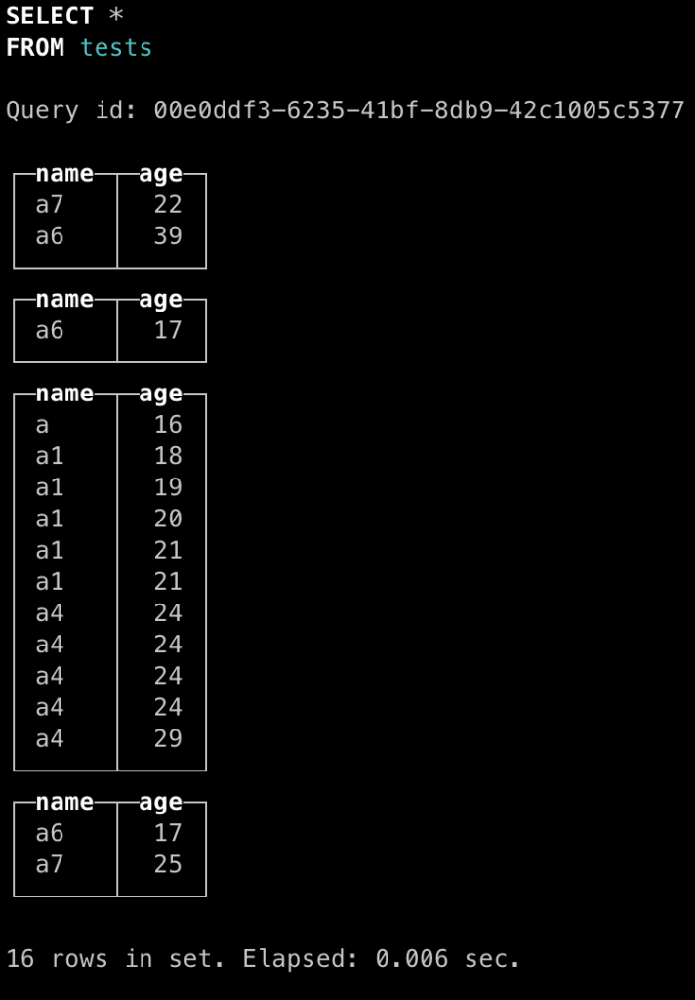

# clickhosue的LSM算法

### LSM算法的几个核心步骤

- 在于数据写入存储系统前首先记录日志，防止系统崩溃
- 记录完日志后在内存中以供使用，当内存达到极限后写入磁盘，记录合并次数Level为0(L=0)。已经写入磁盘的文件不可变。
- 每过一段时间将磁盘上L和L+1的文件合并。


**示例：**

```java
T=0时刻，数据库为空。

T=1时刻，clickhouse收到一条500条insert的插入请求，这500条数据时乱序的。此时，clickhouse开始插入操作。首先将500条插入请求一次性写入日志。接着在内存中进行排序，排序完成后将有序的结果写入磁盘，此时L=0；

T=2时刻，clickhouse收到一条800条insert的插入请求，这800条数据时乱序的。此时，clickhouse开始插入操作。首先将800条插入请求一次性写入日志。接着在内存中进行排序，排序完成后将有序的结果写入磁盘，此时L=0；

T=3时刻，clickhouse开始合并，此时此刻，磁盘上存在两个L=0的文件。这两个文件每个文件内部有序，但可能存在重合。（例如第一批500条的范围是300-400，第二批800条数据的范围是350-700）。因此需要合并。clickhouse在后台完成合并后，产生了一个新的L=1的文件。将两个L=0的文件标记为删除。

T=4时刻，clickhouse开始清理，将两个被标记为删除的文件真正地物理删除。

T=5时刻，clickhouse收到一条100条insert的插入请求，这100条数据时乱序的。此时，clickhouse开始插入操作。首先将100条插入请求一次性写入日志。接着在内存中进行排序，排序完成后将有序的结果写入磁盘，此时L=0；

T=6时刻，clickhouse开始合并，此时此刻，磁盘上存在1个L=0的文件和1个L=1的文件。这两个文件每个文件内部有序，但不存在重合。（例如L0文件的范围是100-200，L1文件的范围是300-700）。因此不需要合并。clickhouse在后台将L=0的文件升级成L=1，此时数据库内存在两个L=1的互不重合的文件。
```


……

以上就是LSM算法在clickhouse上的应用，总结一下，clickhouse使用LSM算法将乱序的数据在内存中排序为有序的数据，然后写入磁盘保存，并且定期合并有重合的磁盘文件。


### 问题

clickhouse会在多次insert请求时创建独立的数据文件。虽然clickhouse会在合适时间进行合并，但如果查询发生在合并前，就有可能数据分布在两个数据文件内。此时clickhouse默认会返回两个列表，这两个列表内部有序，但相互之间却会有重合。



此时clickhouse未合并时查询结果分成了4个独立的结果，每个结果内部有序，但相互之间存在重合，也就说对于这种情况需要用户自行合并。

待clickhosue合并后再次查询，结果如下：


### clickhouse 和 levelDB 对LSM的使用

leveldb是一个允许修改的数据库，因此其对于LSM的使用和clickhouse类似，主要的不同在于写入日志后的操作不同。

clickhouse在记录日志后，会直接在内存中进行排序，从而写入磁盘。此时如果clickhouse又接到一条写入情况，会重新开启一个新的进程。

而leveldb在记录日志后，会将数据首先缓存在内存中，等待后续操作继续操作这块内存，直到这块内存被填满，才会一次性将数据写入磁盘。

这个差异主要时两个数据库面向的场景不同，clickhouse主要面向读多写少的分析场景，强调大批量一次性写入增加吞吐量。而leveldb主要面向写多读少的业务场景，强调低延时。