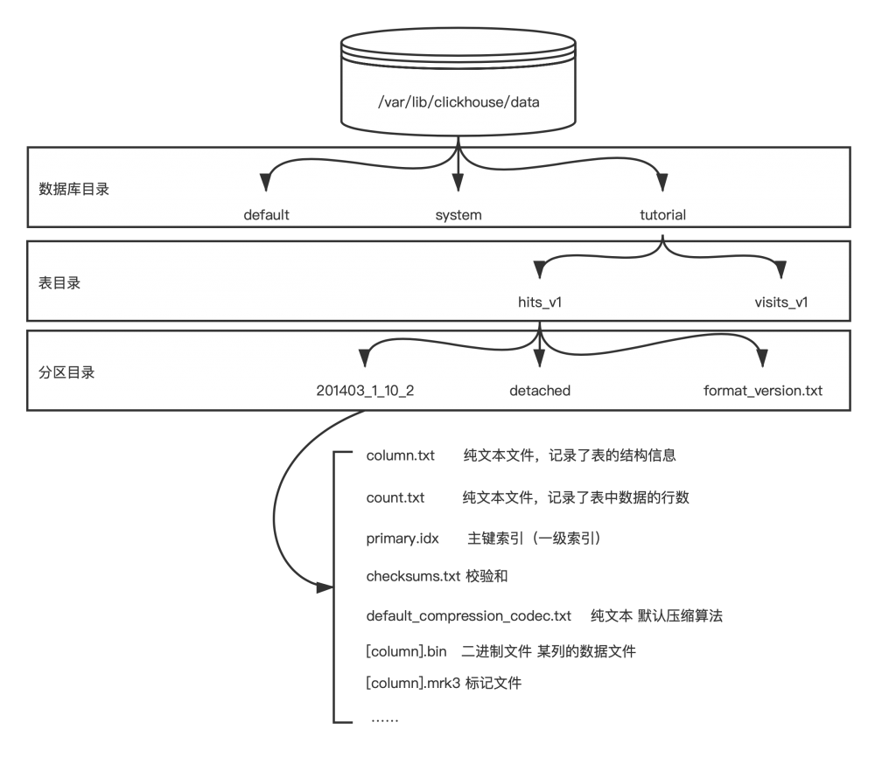
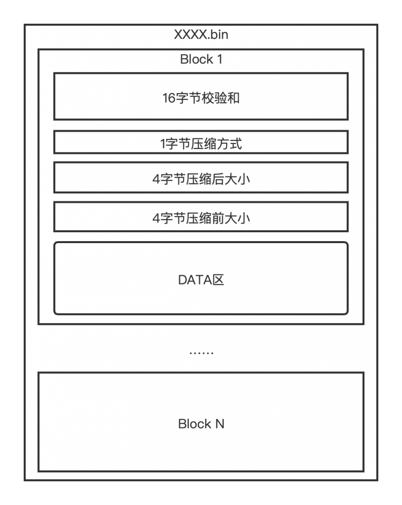

### 文件组织

clickhouse默认数据目录在/var/lib/clickhouse/data目录中。所有的数据库都会在该目录中创建一个子文件夹。下图展示了clickhouse对数据文件的组织。

每一个数据库都会在clickhouse的data目录中创建一个子目录，clickhouse默认携带default和system两个数据库。default顾名思义就是默认数据库，system是存储clickhouse服务器相关信息的数据库，例如连接数、资源占用等。

### 分区目录

分区目录下的子目录和文件的含义如下：

| 目录名             | 类型     | 说明                                    |
| ------------------ | -------- | --------------------------------------- |
| 201403_1_10_2      | 目录     | 分区目录 一个或多个，由于分区+LSM生成的 |
| detached           | 目录     | 通过DETACH语句卸载后的表分区存放位置    |
| format_version.txt | 文本文件 | 纯文本，记录存储的格式                  |

分区目录的构成，按照 分区ID_最小数据块编号_最大数据块编号_层级构成。在本例中，分区ID是201403,最小数据块编号是1，最大数据库编号是10，层级是2。数据块编号从1开始自增，新创建的数据库最大和最小编号相同，当发生合并时会将其修改为合并的数据块编号。同时每次合并都会将层级增加1。关于合并的详情可以查看本系列的番外篇——LSM。

分区ID由用户在创建表时制定，允许用户创建多个分区键，每个分区键之间用‘-’相连。在本例中只使用了一个分区键，即时间字段，按照年月分区。分区的好处在于提高并发度和加速部分查询。

### 数据组织

### 数据文件结构

上图展示了一个bin文件的结构。bin文件使用小端字节序存储。bin文件中按block为单位排列数据，每个block文件有16字节校验和，1字节压缩方式，4字节压缩后大小和4字节的压缩前大小组成。每个block起始地址由如下公式确定：

1. offset(n)=offset(n-1)+25+压缩后大小 （n>=2)
2. offset(1)=0