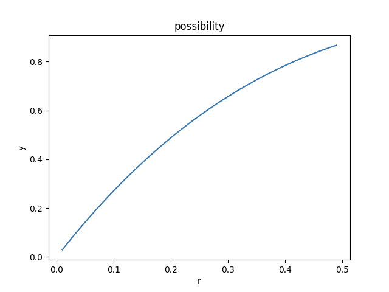

### clickhouse 表引擎优化

https://www.codeleading.com/article/78752240193/


#### 连接文档

https://www.cnblogs.com/DBArtist/p/clickhouse_operation.html


##### 连接 clickhouse

./clickhouse client --host 11.11.11.11 --port 3306 --database datahouse_name --user user --password "password"

连接clickhouse：clickhouse-client 


### clickhouse  简介

#### 引擎

1、存储引擎

2、向量化计算引擎


#### 分布式

clickhouse在设计时突出了单机的处理能力，并没有使用太多的分布式技巧，这可能是开源版本没有将这一块开源出来。但根据现有的源码来看，clickhouse使用mpp架构。


### clickhouse 优化

#### Block + LSM

clickhouse通过block的设计来实现批处理，通过lsm算法来实现预排序。

例子：

```sql
SELECT avg(price) FROM orders where age between 20 and 30;
```

计算订单中年龄在20到30岁用户的平均订单金额。假设数仓内有1亿条记录，每条数据约1k，其中20-30岁之间的用户订单大约有10%。

在数据按照age有序存储的情况下，读取的数据量为1亿*10%*1KB≈10G。

若数据未按照age有序存储，这种情况下，读取的数据量为1亿*10%*4K*(1-27.1%)≈29.2G。两者相差接近3倍。


clickhouse能处理的最小单位是block，block就是一群行的集合，默认最大8192行组成一个block。

block的数据压缩比约为6.2倍。

**什么是LSM**

LSM: Log Structured-Merge Tree(日志结构合并树)，是一种先于BigTable出现的文件组织方式，最早可以追溯到1996年 Patrick O'Neil等人的论文。在BigTable出现之后开始被重视被广泛应用，比较有名的产品就是Hbase、Cassandra、Leveldb等。

- 用一句话先简单概括其原理

把一颗大树拆分成N棵小树，数据先写入内存中，随着小树越来越大，内存的小树会flush到磁盘中。 磁盘中的树定期做合并操作，合并成一棵大树，以优化读性能。


#### clickhouse 缺点

1. 适合数据的大批量写入，如果写入频繁，会影响写入性能
2. 如果范围查询的数据量大，那么性能提升会低。因此数据量太小时无法发挥最大优势。
3. 由于按照block作为最小处理单位，因此删除单条数据性能不高。
4. 修改的性能很差，尤其是修改了用于排序的列。因此不适合做事务型数据库。


#### 命中率和数据占比关系

为什么无序存储要乘以4K。这个原因是因为操作系统在读取磁盘时，依据数据局部性原理，会按照页为单位读取，每页的大小默认是4k。在unistd.h头文件中的getpagesize()可以获取本机的页面大小，这里按照默认大小进行计算。

式子中的27.1%是指的缓存命中率，命中率由需要查询的数据占所有数据的百分比r决定。在本例中按照4k的页面大小和1k的记录大小，命中率和数据占比之间的关系如下图所示：


根据例子：10的数据，r=0.1 y=0.27



