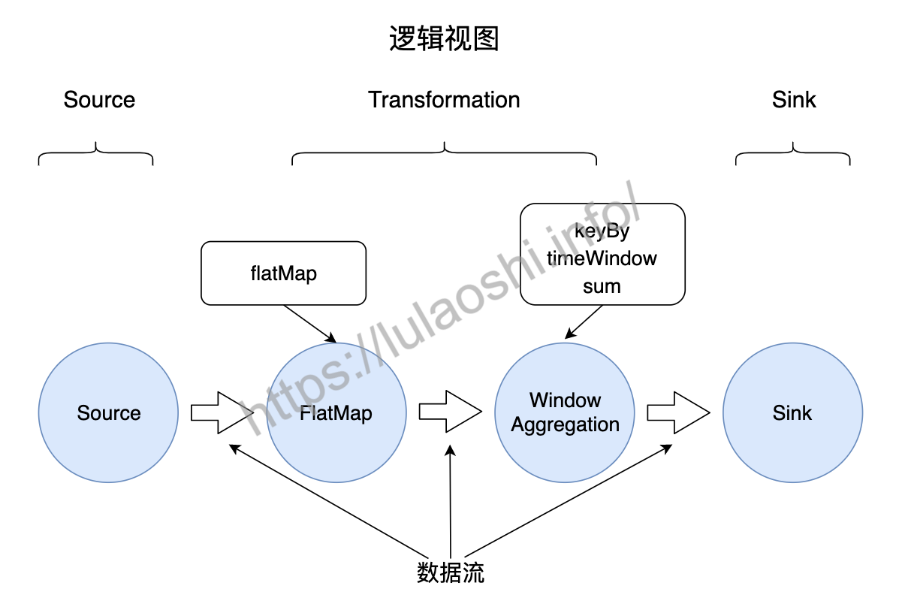
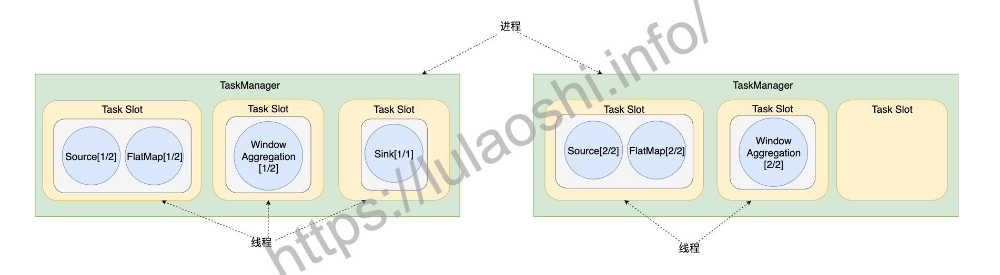
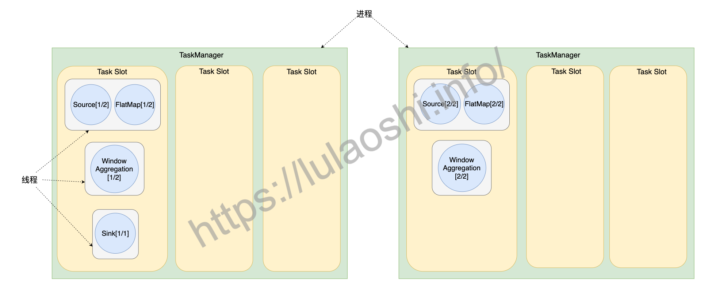

### 数据流图

#### 算子

- flatMap

`flatMap()`对输入进行处理，生成零到多个输出。本例中它执行一个简单的分词过程，对一行字符串按照空格切分，生成一个(word, 1)的二元组。

- keyBy

`keyBy()`根据某个Key对数据重新分组。本例中是将二元组(word, 1)中第一项作为Key进行分组，相同的单词会被分到同一组。

- timeWindow

`timeWindow()`是时间窗口函数，用来界定对多长时间之内的数据做统计。

### flink 作业提交

Flink为适应不同的基础环境（Standalone集群、YARN、Kubernetes），在不断的迭代开发过程中已经逐渐形成了一个兼容性很强的架构。

#### Flink作业提交流程

1. 用户编写应用程序代码，并通过Flink客户端（Client）提交作业。程序一般为Java或Scala语言，调用Flink API，构建逻辑视角数据流图。代码和相关配置文件被编译打包，被提交到Master的Dispatcher，形成一个应用作业（Application）。
2. Dispatcher接收到这个作业，启动JobManager，这个JobManager会负责本次作业的各项协调工作。
3. JobManager向ResourceManager申请本次作业所需资源。
4. 由于在第0步中TaskManager已经向ResourceManager中注册了资源，这时闲置的TaskManager会被反馈给JobManager。
5. JobManager将用户作业中的逻辑视图转化为图所示的并行化的物理执行图，将计算任务分发部署到多个TaskManager上。至此，一个Flink作业就开始执行了。

TaskManager在执行计算任务过程中可能会与其他TaskManager交换数据，会使用图中的一些数据交换策略。同时，TaskManager也会将一些任务状态信息会反馈给JobManager，这些信息包括任务启动、运行或终止的状态，快照的元数据等。

#### flink 核心组件

##### Client

用户一般使用客户端（Client）提交作业。Client提交作业时需要配置一些必要的参数，比如使用Standalone集群还是YARN集群等。整个作业被打成了Jar包，DataStream API被转换成了`JobGraph`，`JobGraph`是一种类似逻辑视图。

##### Dispatcher

Dispatcher可以接收多个作业，每接收一个作业，Dispatcher都会为这个作业分配一个JobManager。Dispatcher对外提供一个REST式的接口，以HTTP的形式来对外提供服务。

##### JobManager

JobManager是单个Flink作业的协调者，一个作业会有一个JobManager来负责。JobManager会将Client提交的JobGraph转化为ExceutionGraph，ExecutionGraph是类似并行的物理执行图。JobManager会向ResourceManager申请必要的资源，当获取足够的资源后，JobManager将ExecutionGraph以及具体的计算任务分发部署到多个TaskManager上。同时，JobManager还负责管理多个TaskManager，这包括：收集作业的状态信息，生成检查点，必要时进行故障恢复等问题。 一些Flink文档也可能使用JobMaster的概念，读者可以将JobMaster等同于JobManager看待。

##### ResourceManager

如前文所说，Flink现在可以部署在Standalone、YARN或Kubernetes等环境上，不同环境中对计算资源的管理模式略有不同，Flink使用一个名为ResourceManager的模块来统一处理资源分配上的问题。在Flink中，计算资源的基本单位是TaskManager上的任务槽位（Task Slot，简称槽位Slot）。当JobManager有计算需求时，将空闲的Slot分配给JobManager。当计算任务结束时，ResourceManager还会重新收回这些Slot。

##### TaskManager

TaskManager是实际负责执行计算的节点。一般地，一个Flink作业是分布在多个TaskManager上执行的，单个TaskManager上提供一定量的Slot。一个TaskManager启动后，相关Slot信息会被注册到ResourceManager中。当某个Flink作业提交后，ResourceManager会将空闲的Slot提供给JobManager。JobManager获取到空闲Slot信息后会将具体的计算任务部署到该Slot之上，任务开始在这些Slot上执行。TaskManager负责具体计算任务的执行，启动时它会将Slot资源向ResourceManager注册。

### flink 组件栈

#### api 层

DataStream API针对有界和无界数据流，DataSet API针对有界数据集。

### 逻辑视图和物理执行图

- `StreamGraph`：根据用户编写的代码生成的最初的图，用来表示一个Flink流处理作业的拓扑结构。在`StreamGraph`中，节点`StreamNode`就是算子。
- `JobGraph`：`JobGraph`是提交给 JobManager 的数据结构。`StreamGraph`经过优化后生成了`JobGraph`，主要的优化为，将多个符合条件的节点链接在一起作为一个`JobVertex`节点，这样可以减少数据交换所需要的传输开销。这个链接的过程叫做算子链（Operator Chain），我们会在下一小节继续介绍算子链。`JobVertex`经过算子链后，会包含一到多个算子，它的输出是`IntermediateDataSet`，这是经过算子处理产生的数据集。
- `ExecutionGraph`：JobManager将`JobGraph`转化为`ExecutionGraph`。`ExecutionGraph`是`JobGraph`的并行化版本：假如某个`JobVertex`的并行度是2，那么它将被划分为2个`ExecutionVertex`，`ExecutionVertex`表示一个算子子任务，它监控着单个子任务的执行情况。每个`ExecutionVertex`会输出一个`IntermediateResultPartition`，这是单个子任务的输出，再经过`ExecutionEdge`输出到下游节点。`ExecutionJobVertex`是这些并行子任务的合集，它监控着整个算子的运行情况。`ExecutionGraph`是调度层非常核心的数据结构。
- 物理执行图：JobManager根据`ExecutionGraph`对作业进行调度后，在各个TaskManager上部署具体的任务，物理执行图并不是一个具体的数据结构。

Flink采用主从架构，Master起着管理协调作用，TaskManager负责物理执行，在执行过程中会发生一些数据交换、生命周期管理等事情。

用户调用Flink API，构造逻辑视图，Flink会对逻辑视图优化，并转化为并行化的物理执行图，最后被执行的是物理执行图。

#### 槽位分配

一般单个线程运行的单个算子（也叫做单个task）会被分配到一个slot里

如果每个TaskManager只包含一个槽位，那么运行在该槽位内的任务将独享JVM。如果TaskManager包含多个槽位，那么多个槽位内的任务可以共享JVM资源，比如共享TCP连接、心跳信息、部分数据结构等。官方建议将槽位数目设置为TaskManager下可用的CPU核心数，那么平均下来，每个槽位都能平均获得1个CPU核心。

#### 槽位共享

开启槽位共享后，Flink允许多个Task共享一个槽位。如上图中最左侧的数据流，一个作业从Source到Sink的所有子任务都可以放置在一个槽位中，这样数据交换成本更低。

用户使用Flink提供的API算子可以构建一个逻辑视图，需要将任务并行才能被物理执行。一个算子将被切分为多个子任务，每个子任务处理整个作业输入数据的一部分。如果输入数据过大，增大并行度可以让算子切分为更多的子任务，加快数据处理速度

