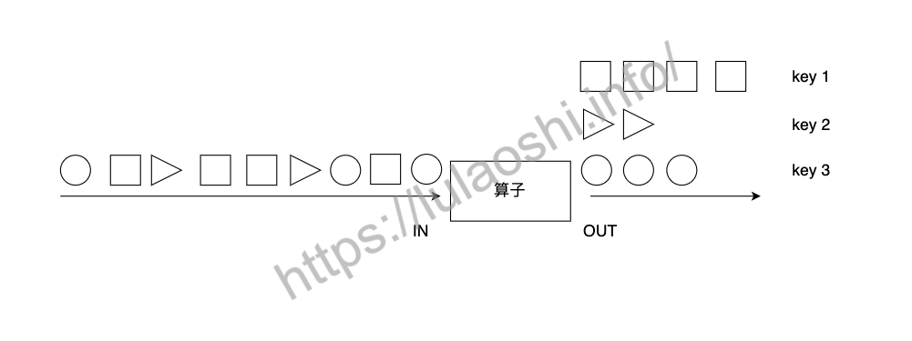

### 运行逻辑

1. 初始化运行环境。
2. 读取一到多个数据源Source。
3. 根据业务逻辑对数据流进行Transformation转换。
4. 将结果输出到Sink。
5. 调用作业执行函数。


### Transformations

Flink的Transformation转换主要包括四种：单数据流基本转换、基于Key的分组转换、多数据流转换和数据重分布转换。

#### 单数据流转换

##### map

map`算子对一个`DataStream`中的每个元素使用用户自定义的Mapper函数进行处理，每个输入元素对应一个输出元素，最终整个数据流被转换成一个新的`DataStream。

##### filter

##### flatmap

`flatMap`算子和`map`有些相似，输入都是数据流中的每个元素，与之不同的是，`flatMap`的输出可以是零个、一个或多个元素，当输出元素是一个列表时，`flatMap`会将列表展平。


例：

{苹果，梨，香蕉}.map(去皮) => {去皮苹果, 去皮梨，去皮香蕉}

`flatMap`先对每个元素进行相应的操作，生成一个相应的集合，再将集合展平：

{苹果，梨，香蕉}.flMap(切碎)  =>  {[苹果碎片1, 苹果碎片2], [梨碎片1，梨碎片2, 梨碎片3]，[香蕉碎片1]} 

=> {苹果碎片1, 苹果碎片2, 梨碎片1，梨碎片2, 梨碎片3，香蕉碎片1}。


#### key分组转换

`keyBy`算子将`DataStream`转换成一个`KeyedStream`。`KeyedStream`是一种特殊的`DataStream`，事实上，`KeyedStream`继承了`DataStream`，`DataStream`的各元素随机分布在各算子实例中，`KeyedStream`的各元素按照Key分组，相同Key的数据会被分配到同一算子实例中。



**使用数字位置来指定Key**

```java
DataStream<Tuple2<Integer, Double>> dataStream = senv.fromElements(
                Tuple2.of(1, 1.0), Tuple2.of(2, 3.2), Tuple2.of(1, 5.5),
                Tuple2.of(3, 10.0), Tuple2.of(3, 12.5));

// 使用数字位置定义Key 按照第一个字段进行分组
DataStream<Tuple2<Integer, Double>> keyedStream = dataStream.keyBy(0).sum(1);
```


**POJO 类选择key**

```java
class word {
		public String word;
    public int count;
}
DataStream<Word> fieldNameStream = wordStream.keyBy("word").sum("count");
```


#### 多数据流转换

##### union  

合并数据类型一致

```java
DataStream<StockPrice> shenzhenStockStream = ...
DataStream<StockPrice> hongkongStockStream = ...
DataStream<StockPrice> shanghaiStockStream = ...
DataStream<StockPrice> unionStockStream = shenzhenStockStream.union(hongkongStockStream, shanghaiStockStream);
```

##### connect

合并数据类型可以不一致

```Java
DataStream<Integer> intStream  = senv.fromElements(1, 0, 9, 2, 3, 6);
DataStream<String> stringStream  = senv.fromElements("LOW", "HIGH", "LOW", "LOW");

ConnectedStreams<Integer, String> connectedStream = intStream.connect(stringStream);
DataStream<String> mapResult = connectedStream.map(new MyCoMapFunction());

// CoMapFunction三个泛型分别对应第一个流的输入、第二个流的输入，map之后的输出
public static class MyCoMapFunction implements CoMapFunction<Integer, String, String> {
    @Override
    public String map1(Integer input1) {
        return input1.toString();
    }

    @Override
    public String map2(String input2) {
        return input2;
    }
}
```


