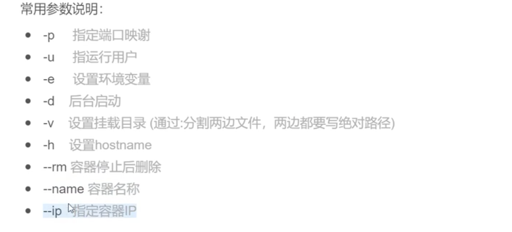
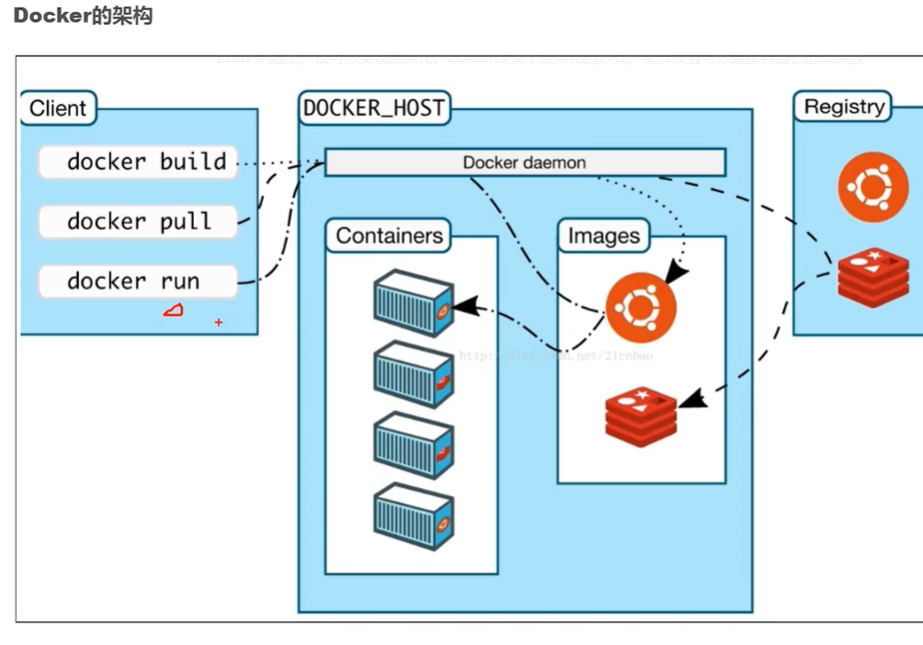

### docker常见命令：

  docker search java 从docker hub上搜索java的镜像

  docker pull chaimm/tomcat:1.1 从docker Hub上拉取所需的资源

  docker ps 查看正在运行的容器

  docker ps -a 查看所有已经创建的容器和镜像

  docker images hello-world 查看hello-world镜像的详细信息

### docker 停止

  docker stop webserver（优雅的停止）

  docker kill webserver（强制停止）

### docker 删除

  docker rm webserver(容器名)

  docker rmi 镜像 删除某个镜像

### docker 运行

  docker build -f Dockerfile -t http-server:v1.0.1 .  创建镜像到本地（最后面的 . 代表当前目录的Dockerfile文件）

  docker start 019481ef4a66 通过容器id启动容器

  docker run 4f7155a4da41(镜像id)(此时回为此镜像创建一个容器)

  docker run -d -p 8081:8080 -p 80:80 tomcat（-d 是后台运行，-p是指定宿主机端口和docker端口的对应）

  docker run --rm -e MYSQL_ROOT_PASSWORD=123 -p 3306:3306 mysql:5.6!B@iduV2X

  docker run -i -t -v /home/wangjie/tomcat8:/home/wangjie --name 89796a java:1.0 /bin/bash

- -i 表示以"交互模式"运行容器
- -t 表示容器启动后会进入其命令行
- -v 表示需要将本地哪个目录挂载到容器中，格式：-v <宿主机绝对目录>:<容器绝对目录>
- 89796a 即2中新容器的ID,也可以用"容器名:TAG"唯一即可
- /bin/bash 即进入容器后的bash shell命令行对应-t
- --name 表示容器名称，用一个你觉得有意义的名称命名即可

### docker 查看

  docker search mysq (查找有关mysql的所有docker 镜像)  

  docker exec -it 5bcc396453d1 bash 以bash命令的方式查看容器内部

  docker exec -it --user root <container id> /bin/bash 以root用户查看

  docker history 镜像 查看镜像的历史构建

  docker inspect 镜像id 查看镜像的内部结构

  docker logs -f MyNginx 查看MyNginx容器的日志

### docker 复制文件

  docker cp 本地文件路径 ID全称:容器路径

docker cp mycontainer:/opt/testnew/file.txt /opt/test/ (复制容器到宿主机)

### docker 打包

docker commit -a "author" -m "description" a404c6c174a2 mymysql:v1 将 a404c6c174a2 容器打包成 mymysql:v1 镜像

OPTIONS说明：

- -a :提交的镜像作者；
- -c :使用Dockerfile指令来创建镜像；
- -m :提交时的说明文字；
- -p :在commit时，将容器暂停。

**docker 登录**

docker login ip(域名):8443

**docker 打包镜像**

到 Dockerfile 需要的jar包路径下执行

docker build -f /Users/ytp/ideaProjects/baidu/adu/v2x-platform-server-micro/build/docker/cloud-perception/Dockerfile -t ip:8443/v2x/platform-cloud-perception:v2021050601 .

**docker push**

docker push ip:8443/v2x/platform-cloud-perception:v2021050601