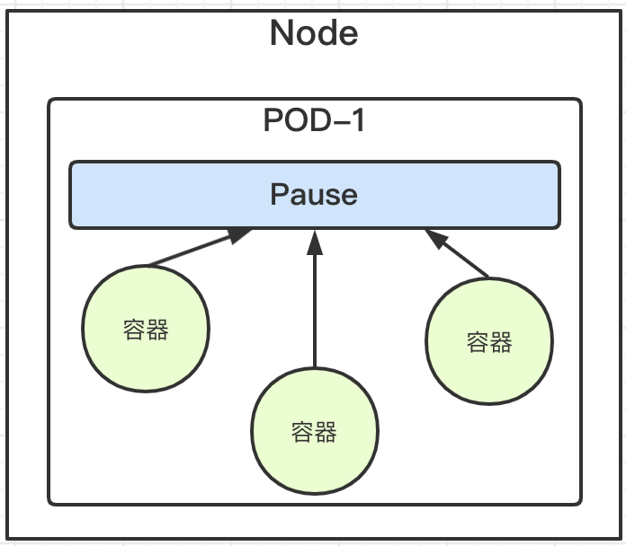
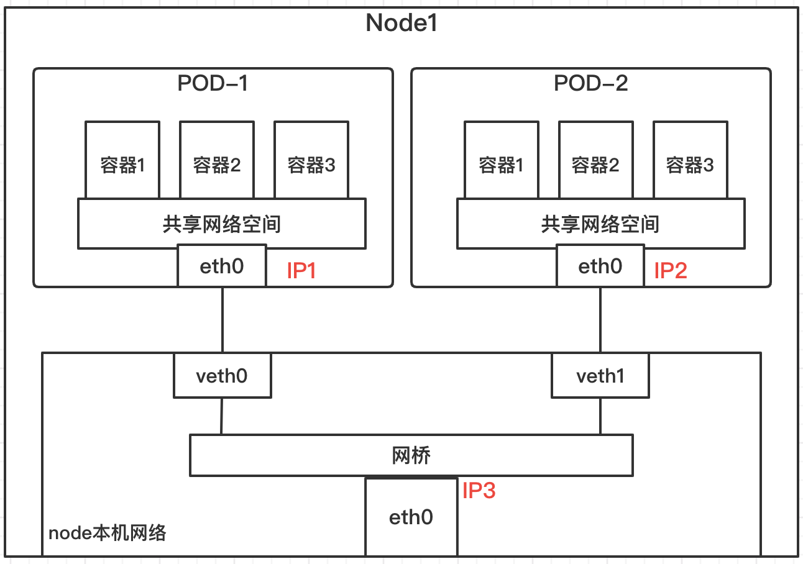
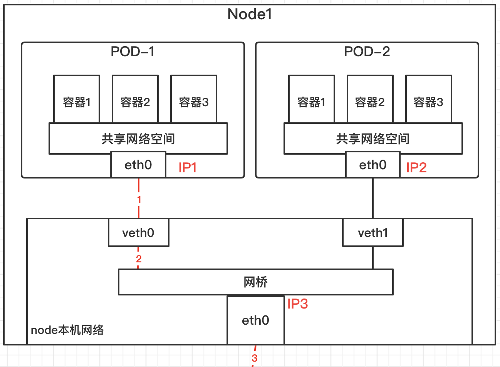
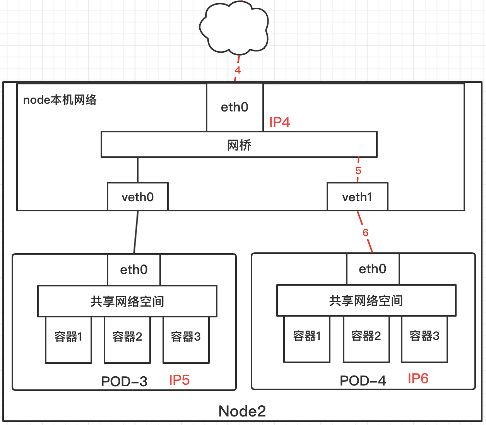

#### 同一个 POD 上 Container 通信

在 k8s 中每个 Pod 中管理着一组 Docker 容器，**这些 Docker 容器共享同一个网络命名空间**，Pod 中的**每个 Docker 容器拥有与 Pod 相同的 IP 和 port 地址空间**，并且由于他们在**同一个网络命名空间，他们之间可以通过 localhost 相互访问**。

什么机制让同一个 Pod 内的多个 docker 容器相互通信？就是**使用 Docker 的一种网络模型：–net=container**

> container 模式指定新创建的 Docker 容器和已经存在的一个容器共享一个网络命名空间，而不是和宿主机共享。

新创建的 Docker 容器不会创建自己的网卡，配置自己的 IP，而是和一个指定的容器共享 IP、端口范围等

在 k8s 中**每个 Pod 容器有一个 pause 容器有独立的网络命名空间**，在 Pod 内启动 Docker 容器时候使用 –net=container 就可以**让当前 Docker 容器加入到 Pod 容器拥有的网络命名空间（pause 容器）**

这里就是为什么 k8s 在调度 pod 时，**尽量把关系紧密的服务放到一个 pod 中**，这样网络的请求耗时就可以忽略，因为容器之间通信共享了网络空间，就像 local 本地通信一样。

# 同一个 Node，不同 Pod

上图就是同一个 node，不同 pod 之间的通信，就是**使用 linux 虚拟以太网设备**或者说是**由两个虚拟接口组成的 veth 对**使不同的网络命名空间链接起来，这些虚拟接口分布在多个网络命名空间上（这里是指多个 Pod 上）。

> 通过网桥把 veth0 和 veth1 组成为一个以太网，他们直接是可以直接通信的，另外这里通过 veth 对让 pod1 的 eth0 和 veth0、pod2 的 eth0 和 veth1 关联起来，从而让 pod1 和 pod2 相互通信。

# 不同 Node，不同 Pod

上图就是**不同 node 之间的 pod 通信**，**Node1 中的 Pod1 如何和 Node2 的 Pod4 进行通信**的，我们来看看具体流程：

1）首先 pod1 通过自己的**以太网设备 eth0 把数据包发送到关联到** root 命名空间的 veth0 上

2）然后数据包被 Node1 上的网桥设备接受到，**网桥查找转发表发现找不到 pod4 的 Mac 地址**，则会把包转发到默认路由（root 命名空间的 eth0 设备）

3）然后**数据包经过 eth0 就离开了 Node1，被发送到网络**。

4）数据包到达 Node2 后，首先会被 root 命名空间的 eth0 设备

5）然后通过网桥把数据路由到虚拟设备 veth1,**最终数据表会被流转到与 veth1 配对的另外一端（pod4 的 eth0）**

> 每个 Node 都知道如何把数据包转发到其内部运行的 Pod，当一个数据包到达 Node 后，其内部数据流就和 Node 内 Pod 之间的流转类似了补充说明：对于如何来配置网络，k8s 在网络这块自身并没有实现网络规划的具体逻辑，而是制定了一套 CNI（Container Network Interface）接口规范，开放给社区来实现。Flannel 就是 k8s 中比较出名的一个。

# flannel

flannel 组建一个大二层扁平网络，**pod 的 ip 分配由 flannel 统一分配，通讯过程也是走 flannel 的网桥**。

每个 node 上面都会**创建一个 flannel0 虚拟网卡，用于跨 node 之间通讯**。所以容器直接可以直接使用 pod id 进行通讯。

跨节点通讯时，发送端数据会从 docker0 路由到 flannel0 虚拟网卡，接收端数据会从 flannel0 路由到 docker0。