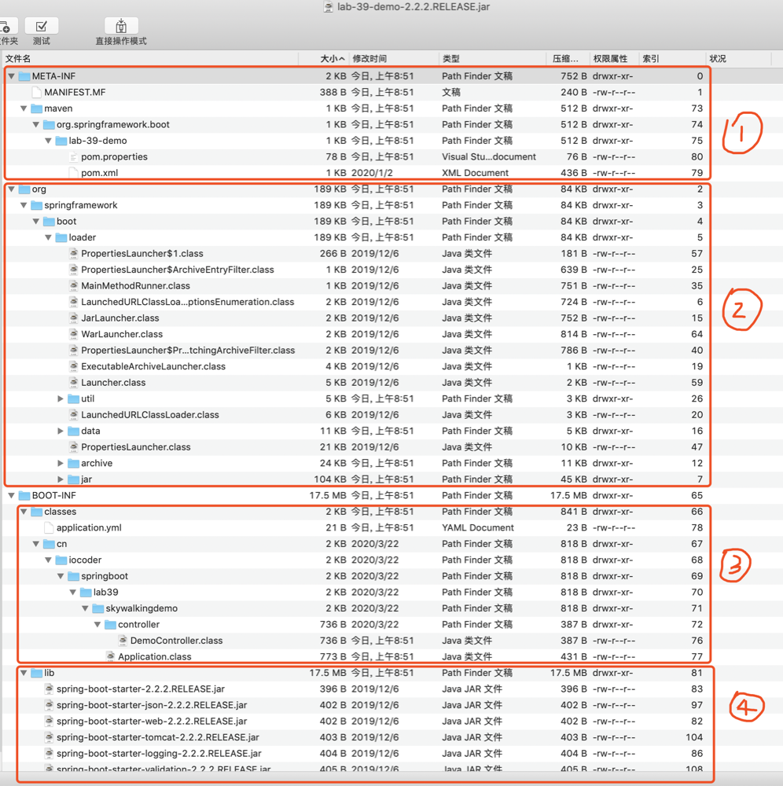

### SpringBoot jar 包目录




- ① `META-INF` 目录：通过 `MANIFEST.MF` 文件提供 `jar` 包的**元数据**，声明了 `jar` 的启动类。
- ② `org` 目录：为 Spring Boot 提供的 [`spring-boot-loader`](https://github.com/spring-projects/spring-boot/blob/master/spring-boot-project/spring-boot-tools/spring-boot-loader/) 项目，它是 `java -jar` 启动 Spring Boot 项目的秘密所在，也是稍后我们将深入了解的部分。
- ③ `BOOT-INF/lib` 目录：我们 Spring Boot 项目中引入的**依赖**的 `jar` 包们。`spring-boot-loader` 项目很大的一个作用，就是**解决 `jar` 包里嵌套 `jar` 的情况**，如何加载到其中的类。
- ④ `BOOT-INF/classes` 目录：我们在 Spring Boot 项目中 Java 类所编译的 `.class`、配置文件等等。


`spring-boot-loader` 解决的两个问题：

- 第一，引导执行我们创建的 Spring Boot 应用的启动类，例如上述图中的 Application 类。
- 第二，加载 `BOOT-INF/class` 目录下的类，以及 `BOOT-INF/lib` 目录下内嵌的 `jar` 包中的类。


### MANIFEST.MF

META-INF/MANIFEST.MF 文件：

```
Manifest-Version: 1.0
Implementation-Title: lab-39-demo
Implementation-Version: 2.2.2.RELEASE
Start-Class: cn.iocoder.springboot.lab39.skywalkingdemo.Application
Spring-Boot-Classes: BOOT-INF/classes/
Spring-Boot-Lib: BOOT-INF/lib/
Build-Jdk-Spec: 1.8
Spring-Boot-Version: 2.2.2.RELEASE
Created-By: Maven Archiver 3.4.0
Main-Class: org.springframework.boot.loader.JarLauncher
```


如果直接运行项目的 Application 启动类，会直接提示 找不到或无法加载主类  XXX.XXX..Application。

因为它在 `BOOT-INF/classes` 目录下，不符合 Java 默认的 `jar` 包的加载规则。因此，需要通过 JarLauncher 启动加载。

当然实际还有一个更重要的原因，Java 规定可执行器的 `jar` 包禁止嵌套其它 `jar` 包。但是我们可以看到 `BOOT-INF/lib` 目录下，实际有 Spring Boot 应用依赖的所有 `jar` 包。

因此，`spring-boot-loader` 项目自定义实现了 ClassLoader 实现类 [LaunchedURLClassLoader](https://github.com/spring-projects/spring-boot/blob/master/spring-boot-project/spring-boot-tools/spring-boot-loader/src/main/java/org/springframework/boot/loader/LaunchedURLClassLoader.java)，支持加载 `BOOT-INF/classes` 目录下的 `.class` 文件，以及 `BOOT-INF/lib` 目录下的 `jar` 包。


### 总结

**红色**部分，解决 `jar` 包中的**类加载**问题：

- 通过 [Archive](https://github.com/spring-projects/spring-boot/blob/master/spring-boot-project/spring-boot-tools/spring-boot-loader/src/main/java/org/springframework/boot/loader/archive/Archive.java)，实现 `jar` 包的**遍历**，将 `META-INF/classes` 目录和 `META-INF/lib` 的每一个内嵌的 `jar` 解析成一个 Archive 对象。
- 通过 [Handler](https://github.com/spring-projects/spring-boot/blob/master/spring-boot-project/spring-boot-tools/spring-boot-loader/src/main/java/org/springframework/boot/loader/jar/Handler.java)，处理 `jar:` 协议的 URL 的资源**读取**，也就是读取了每个 Archive 里的内容。
- 通过 [LaunchedURLClassLoader](https://github.com/spring-projects/spring-boot/blob/master/spring-boot-project/spring-boot-tools/spring-boot-loader/src/main/java/org/springframework/boot/loader/LaunchedURLClassLoader.java)，实现 `META-INF/classes` 目录下的类和 `META-INF/classes` 目录下内嵌的 `jar` 包中的类的加载。具体的 URL 来源，是通过 Archive 提供；具体 URL 的读取，是通过 Handler 提供。

**橘色**部分，解决 Spring Boot 应用的**启动**问题：

- 通过 [MainMethodRunner](https://github.com/spring-projects/spring-boot/blob/master/spring-boot-project/spring-boot-tools/spring-boot-loader/src/main/java/org/springframework/boot/loader/MainMethodRunner.java) ，实现 Spring Boot 应用的启动类的执行。

当然，上述的一切都是通过 [Launcher](https://github.com/spring-projects/spring-boot/blob/master/spring-boot-project/spring-boot-tools/spring-boot-loader/src/main/java/org/springframework/boot/loader/Launcher.java) 来完成引导和启动，通过 `MANIFEST.MF` 进行具体配置。


