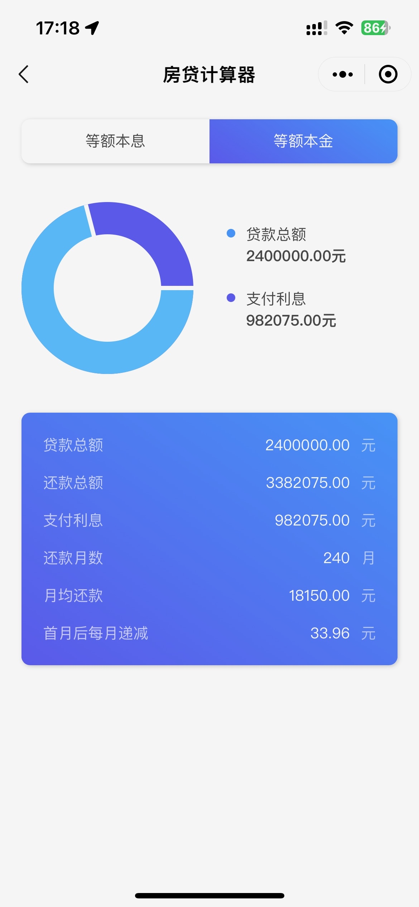

### 基准

**中国人民银行2022年公布的基准利率**

首套个人住房公积金贷款利率五年期以下（含五年）年利率为2.6%，五年期以上年利率为3.1%。

第二套个人住房公积金贷款利率五年期以下（含五年）年利率不低于3.025%，五年期以上年利率不低于3.575%

银行执行的基准利率为：**贷款一年以下（含一年）利率为4.35％；一年至五年（含五年）利率为4.75％；五年以上为4.90％**。 目前贷款期限5年以上商业贷款基准利率是4.90％，受限购限贷政策的影响，各地银行对首套房二套房贷款利率普遍上浮10％－30％

**贷款额度**

实行按人、按户限额制度的。职工个人最高可贷额度为50万。

职工及其配偶均缴存住房公积金的，具体可贷额度按人分别计算，且合计最高可贷额度为100万元

在首次购买普通自住住房时申请住房公积金贷款的，家庭最高贷款限额标准上浮20%。职工单人缴存住房公积金的最高额度从50万元提高到60万元，夫妻双方缴存住房公积金的最高额度从100万元提高到120万元。

公积金：120 、商贷 120

