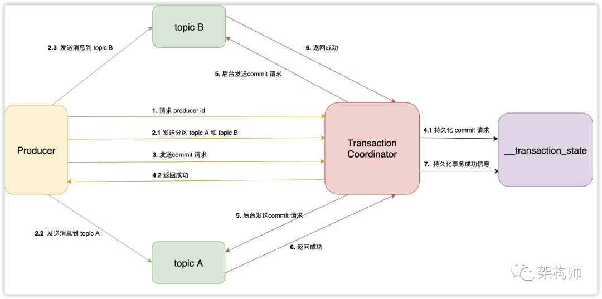

### Kafka 事务实现原理

https://blog.csdn.net/weixin_29960041/article/details/113039519

Kafka 事务在流处理中应用很广泛，比如原子性的读取消息，立即处理和发送，如果中途出现错误，支持回滚操作

### 事务流程

上图中的 Transaction Coordinator 运行在 Kafka 服务端，下面简称 TC 服务。

__transaction_state 是 TC 服务持久化事务信息的 topic 名称，下面简称事务 topic。

Producer 向 TC 服务发送的 commit 消息，下面简称事务提交消息。

TC 服务向分区发送的消息，下面简称事务结果消息。

#### 寻找 TC 服务地址

Producer 会首先从 Kafka 集群中选择任意一台机器，然后向其发送请求，获取 TC 服务的地址。Kafka 有个特殊的事务 topic，名称为__transaction_state ，负责持久化事务消息。这个 topic 有多个分区，默认有50个，每个分区负责一部分事务。事务划分是根据 transaction id， 计算出该事务属于哪个分区。这个分区的 leader 所在的机器，负责这个事务的TC 服务地址。

#### 事务初始化

Producer 在使用事务功能，必须先自定义一个唯一的 transaction id。有了 transaction id，即使客户端挂掉了，它重启后也能继续处理未完成的事务。

Kafka 实现事务需要依靠幂等性，而幂等性需要指定 producer id 。所以Producer在启动事务之前，需要向 TC 服务申请 producer id。TC 服务在分配 producer id 后，会将它持久化到事务 topic。

#### 发送消息

Producer 在接收到 producer id 后，就可以正常的发送消息了。不过发送消息之前，需要先将这些消息的分区地址，上传到 TC 服务。TC 服务会将这些分区地址持久化到事务 topic。然后 Producer 才会真正的发送消息，这些消息与普通消息不同，它们会有一个字段，表示自身是事务消息。

这里需要注意下一种特殊的请求，提交消费位置请求，用于原子性的从某个 topic 读取消息，并且发送消息到另外一个 topic。我们知道一般是消费者使用消费组订阅 topic，才会发送提交消费位置的请求，而这里是由 Producer 发送的。Producer 首先会发送一条请求，里面会包含这个消费组对应的分区（每个消费组的消费位置都保存在 __consumer_offset topic 的一个分区里），TC 服务会将分区持久化之后，发送响应。Producer 收到响应后，就会直接发送消费位置请求给 GroupCoordinator。

#### 发送提交请求

Producer 发送完消息后，如果认为该事务可以提交了，就会发送提交请求到 TC 服务。Producer 的工作至此就完成了，接下来它只需要等待响应。这里需要强调下，Producer 会在发送事务提交请求之前，会等待之前所有的请求都已经发送并且响应成功。

#### 提交请求持久化

TC 服务收到事务提交请求后，会先将提交信息先持久化到事务 topic 。持久化成功后，服务端就立即发送成功响应给 Producer。然后找到该事务涉及到的所有分区，为每 个分区生成提交请求，存到队列里等待发送。

读者可能有所疑问，在一般的二阶段提交中，协调者需要收到所有参与者的响应后，才能判断此事务是否成功，最后才将结果返回给客户。那如果 TC 服务在发送响应给 Producer 后，还没来及向分区发送请求就挂掉了，那么 Kafka 是如何保证事务完成。因为每次事务的信息都会持久化，所以 TC 服务挂掉重新启动后，会先从 事务 topic 加载事务信息，如果发现只有事务提交信息，却没有后来的事务完成信息，说明存在事务结果信息没有提交到分区。

#### 发送事务结果信息给分区

后台线程会不停的从队列里，拉取请求并且发送到分区。当一个分区收到事务结果消息后，会将结果保存到分区里，并且返回成功响应到 TC服务。当 TC 服务收到所有分区的成功响应后，会持久化一条事务完成的消息到事务 topic。至此，一个完整的事务流程就完成了。

### 常见问题

#### TC 服务的高可用？

事实上 Kafka 集群中运行着多个 TC 服务，每个TC 服务负责事务 topic 的一个分区读写，也就是这个分区的 leader。Producer 根据 transaction id 的哈希值，来决定该事务属于事务 topic 的哪个分区，最后找到这个分区的 leader 位置。

既然 TC 服务负责事务 topic 的一个分区 leader，我们知道当一个分区的 leader挂掉之后，Kafka 会保证这个的分区的 follower 会转换为 leader 角色，会继续对外提供服务。这么 TC 服务的高可用就达到了。

#### 事务消息持久化？

TC 服务为了支持重启后，也能恢复到之前的状态，所以它将每次重要的消息都会持久化起来，并且保存到事务 topic 的时候，指定 leader 分区和 follower 分区必须都存储成功。

这样每次 TC 服务启动的时候，都会从事务 topic 读取之前的状态，加载到缓存里。比如当TC 服务在响应客户端的事务提交请求后，还没来得及向各分区发送事务结果请求，就已经挂掉了。之后 TC 服务重启，会去事务 topic 加载数据，它发现事务的最后状态为 PrepareCommit，并且事务数据还包括了分区列表，这样 TC 服务会继续未完成的事务，会向列表中的各个分区发送事务结果请求。

#### 超时处理？

如果 Producer 发起了一个事务，但是由于网络问题，TC 服务迟迟没有接下来的请求，那么该事务就会被认为超时。

TC 服务会有个线程，会定期检查处理 Ongoing 状态的事务，如果该事务的开始时间和当前时间的差，超过了指定的超时时间（在发送申请producer id请求时可以指定），那么 TC 服务就会回滚该事务，更新和持久化事务的状态，并且发送事务回滚结果给分区。

