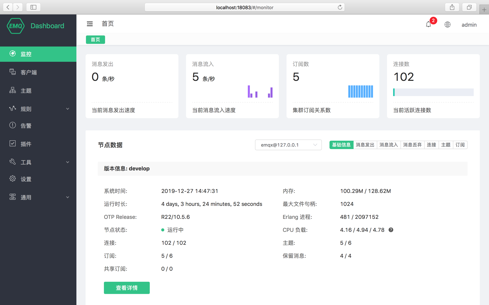

## 一、指标对比

**目前业内比较流行的 mqtt broker 的各项指标对比**

| 对比项目   | EMQ                                                          | HiveMQ                                                       | VerneMQ                                                      | ActiveMQ                                                     | Mosquitto                                          |
| :--------- | :----------------------------------------------------------- | :----------------------------------------------------------- | :----------------------------------------------------------- | :----------------------------------------------------------- | :------------------------------------------------- |
| License    | 开源+商业版                                                  | 开源+商业版                                                  | 开源+商业版                                                  | 开源                                                         | 开源                                               |
| 公司/社区  | EMQ                                                          | HiveMQ                                                       | VerenMQ                                                      | Apache 基金会                                                | Eclipse 基金会                                     |
| 开源协议   | Apache License 2.0                                           | Apache License 2.0                                           | Apache License 2.0                                           | Apache License 2.0                                           | EPL/EDL licensed                                   |
| 开发语言   | Erlang                                                       | Java                                                         | Erlang                                                       | Java                                                         | C                                                  |
| 集群架构   | 支持                                                         | 仅企业版                                                     | 支持                                                         | 支持                                                         | 不支持（有伪集群实现）                             |
| 系统部署   | 物理机、虚拟机、K8S                                          | 物理机、虚拟机、K8S                                          | 物理机、虚拟机、K8S                                          | 物理机、虚拟机、容器                                         | 物理机、虚拟机、容器                               |
| 支持协议   | MQTT、CoAP、MQTT-SN、WebSocket、TCP、UDP、LwM2M              | MQTT                                                         | MQTT                                                         | JMS、Openwire、Stomp、AMQP、MQTT、WebSocket XMPP             | MQTT、WebSocket                                    |
| 系统性能   | 单机性能较高，单机支持百万级并发，集群支持千万级并发         | 集群支持千万级并发                                           | 集群支持百万级并发                                           | 支持集群                                                     | 单机10W                                            |
| MQTT       | v3.1，v3.1.1，v5.0                                           | v3.1，v3.1.1，v5.0                                           | v3.1，v3.1.1，v5.0                                           | v3.1                                                         | v3.1，v3.1.1，v5.0                                 |
| 边缘计算   | EMQ X Edge 支持树莓派，ARM 等架构，支持数据同步到云服务 Azure IoT Hub AWS | 不支持                                                       | 不支持                                                       | 不支持                                                       | 支持（自身比较轻量）                               |
| 安全与认证 | TLS/DTLS、X.509证书、JWT、OAuth2.0、应用协议（ID/用户名/密码）、数据库与接口形式的认证与 ACL 功能（LDAP、DB、HTTP） | TLS/DTLS、X.509证书、JWT、OAuth2.0、应用协议（ID/用户名/密码）、配置文件形式的认证与 ACL 功能 | TLS/DTLS、X.509证书、配置文件形式的认证与 ACL 功能、数据库形式的认证与 ACL 功能，但支持数据库较少 | LDAP (JAAS)、Apache Shiro                                    | 等待                                               |
| 运行持久化 | 支持将消息数据持久化至外部数据库如 Redis、MySQL、PostgreSQL、MongoDB、Cassa、Dynamo 等，需企业版，开源版宕机则丢失 | 开源企业均支持本地持久化，采用磁盘系统，支持备份，导出备份   | 支持持久化至 Google LevelDB                                  | AMQ、KahaDB、JDBC、LevelDB                                   | 等待                                               |
| 扩展方式   | Webhook、Trigger、Plugin 等，支持 Erlang 与 Lua、Java、Python 扩展开发，支持 Webhook 开发，侵入性不强 | Trigger、Plugin 等，使用 Java 技术栈开发，提供方便开发的 SDK | Trigger、Plugin 等，支持 Erlang 与 Lua 扩展开发              | Java 扩展                                                    | 等待                                               |
| 数据存储   | 仅企业版适配数据库：Redis、Mysql、PostgreSQL、MongoDB、Cassandra、OpenTSDB、TimescaleDB、InfluxDB 适配消息队列：Kakfa、RabbitMQ、Pulsar 桥接模式：支持桥接至标准 MQTT 协议消息服务 开源版支持 HTTP 将数据同步、存储 | 适配数据库：无，提供 Java SDK 开发进行适配 消息队列：Kafka 桥接模式：支持桥接至标准 MQTT 协议消息服务 | 适配数据库：无，提供 Erlang 和 Lua 扩展开发 适配消息队列：无 桥接模式：支持桥接至标准 MQTT 协议消息服务 | 适配数据库：JDBC、KahaDB、LevelDB 适配消息队列：无 桥接模式：支持通过 JMS 桥接 | 等待                                               |
| 管理监控   | 支持可视化的 Dashboard，实现集群与节点的统一集中管理 支持第三方监控工具 Prometheus ，提供可视化 Grafana 界面模板 | 支持可视化的 HiveMQ Control Center，实现集群与节点统一管理 支持第三方监控工具 Prometheus ，可提供可视化 Grafana 界面 支持 InfluxDB 监控 | 内置简单状态管理可视化界面 支持第三方监控工具 Prometheus ，可提供可视化 Grafana 界面 | 支持可视化的监控界面 支持第三方监控工具 Prometheus ，可提供可视化 Grafana 界面 | 通过 MQTT 订阅系统主题                             |
| 规则引擎   | 支持规则引擎，基于 SQL 的规则引擎给予 Broker 超越一般消息中间件的能力。除了在接受转发消息之外，规则引擎还可以解析消息的格式（企业版）。 规则引擎由消息的订阅，发布，确认的事件触发，根据消息的负载来执行相应的动作，降低应用开发的复杂度。 | 不支持                                                       | 不支持                                                       | 不支持                                                       | 不支持                                             |
| 开发集成   | 支持通过 REST API 进行常用的业务管理操作如： 调整设置、获取 Broker 状态信息、进行消息发布、代理订阅与取消订阅、断开指定客户端、查看客户端列表、规则引擎管理、插件管理，提供 Java SDK、Python SDK 直接编码处理业务逻辑 | 无，提供 Java SDK 在应用系统在编码的层面操作进程，非常灵活但耦合性高 | 提供少量 REST API，用于监控与状态管理、客户端管理等。 缺乏代理订阅、业务管理等功能和 API | 提供少量队列管理 REST API                                    | 等待                                               |
| 适用场景   | 优势在于高并发连接与高吞吐消息的服务能力，以及物联网协议栈支持的完整性；扩展能力较强，无需过多开发 | 有一定高并发连接与高吞吐消息的服务能力，物联网协议栈的完整性较弱仅支持 MQTT 协议；缺乏开箱即用的功能插件，功能必须编码使用 | 基础的并发连接与高吞吐消息的服务能力，物联网协议栈的完整性较弱仅支持 MQTT 协议；扩展能力较差，基础的业务组件支持度不够，商业成熟度不足客户量较少，缺乏开箱即用的功能插件 | 核心是消息队列系统，主要用于支持异构应用之间的消息通信，比如用于企业消息总线等；后面支持了部分物联网协议。ActiveMQ 比较适合系统既要支持传统的异构应用之间需要通信，也需要支持小型物联网接入支持的用户。 | 轻量简便的 MQTT Broker，工控、网关或小规模接入项目 |


## 二、EMQ

中文文档：https://docs.emqx.cn/broker/v4.3/

### 部署

支持物理机、虚拟机、K8S部署方式，部署方式简单，单机性能也很高。

### 性能

```bash
MQTT 3.1 / 3.1.1 / 5.0（EMQ3.0）
单节点100万连接
```

消息吞吐量 ：10w/秒

毫秒级延迟

```bash
分布式集群或桥接（还支持mosquitto桥接、rsmb桥接）、脑裂自动愈合
```


### 持久化

收费版支持持久化，可以使用内置的插件将数据存储到 mysql、redis、mongoDB 中间件中。

免费版不支持持久化。但是可以使用EMQ自带的Hook函数，将数据发送到其它中间件中。


### 物联网协议栈支持

基本上支持所有的协议。


### 扩展情况

Webhook、Trigger、Plugin 等，支持 Erlang 与 Lua、Java、Python 扩展开发，支持 Webhook 开发。


### 可视化




### 对现有的逻辑影响

支持现有的 java-paho 客户端连接，操作。操作 api 和现有的一致，引入不会对现有的代码逻辑产生影响。

[操作示例](https://docs.emqx.cn/broker/v4.3/development/java.html#通过-maven-安装-paho-java)

