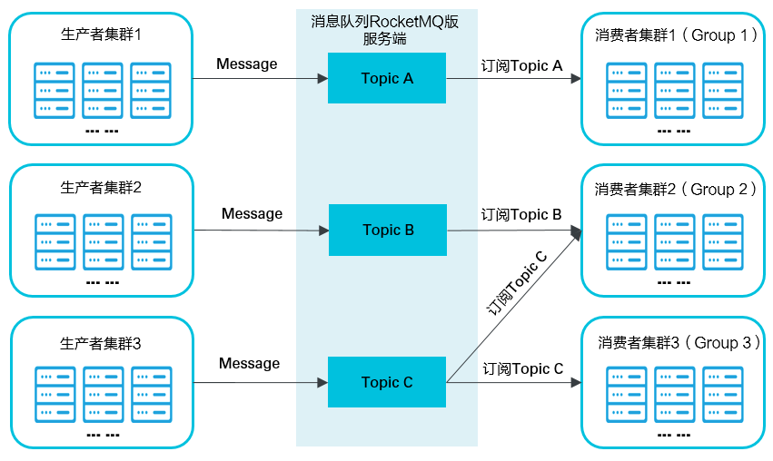

## RocketMQ 简介

参考文章：

1、原理实战（https://www.jianshu.com/p/2838890f3284）

2、https://juejin.cn/post/6844904008629354504

消息队列RocketMQ是Apache 的一款低延迟、高并发、高可用、高可靠的分布式消息中间件。既可为分布式应用系统提供异步解耦和削峰填谷的能力，同时也具备互联网应用所需的海量消息堆积、高吞吐、可靠重试等特性。

### 核心概念

- Topic：消息主题，一级消息类型，生产者向其发送消息。
- 生产者：也称为消息发布者，负责生产并发送消息至Topic。
- 消费者：也称为消息订阅者，负责从Topic接收并消费消息。
- 消息：生产者向Topic发送并最终传送给消费者的数据和（可选）属性的组合。
- 消息属性：生产者可以为消息定义的属性，包含Message Key和Tag。
- Group：一类生产者或消费者，这类生产者或消费者通常生产或消费同一类消息，且消息发布或订阅的逻辑一致。

### 消息收发模型

消息队列RocketMQ版支持发布和订阅模型，消息生产者应用创建Topic并将消息发送到Topic。消费者应用创建对Topic的订阅以便从其接收消息。通信可以是一对多（扇出）、多对一（扇入）和多对多。

具体通信如下图所示。

- 生产者集群：用来表示发送消息应用，一个生产者集群下包含多个生产者实例，可以是多台机器，也可以是一台机器的多个进程，或者一个进程的多个生产者对象。

  一个生产者集群可以发送多个Topic消息。发送分布式事务消息时，如果生产者中途意外宕机，消息队列RocketMQ版服务端会主动回调生产者集群的任意一台机器来确认事务状态。

- 消费者集群：用来表示消费消息应用，一个消费者集群下包含多个消费者实例，可以是多台机器，也可以是多个进程，或者是一个进程的多个消费者对象。

  一个消费者集群下的多个消费者以均摊方式消费消息。如果设置的是广播方式，那么这个消费者集群下的每个实例都消费全量数据。

  一个消费者集群对应一个Group ID，一个Group ID可以订阅多个Topic，如Group 2所示。Group和Topic的订阅关系可以通过直接在程序中设置即可。

### 应用场景

- 削峰填谷

  诸如秒杀、抢红包、企业开门红等大型活动时皆会带来较高的流量脉冲，或因没做相应的保护而导致系统超负荷甚至崩溃，或因限制太过导致请求大量失败而影响用户体验，消息队列RocketMQ版可提供削峰填谷的服务来解决该问题。

- 异步解耦

  交易系统作为淘宝和天猫主站最核心的系统，每笔交易订单数据的产生会引起几百个下游业务系统的关注，包括物流、购物车、积分、流计算分析等等，整体业务系统庞大而且复杂，RocketMQ 可实现异步通信和应用解耦，确保主站业务的连续性。

- 顺序收发

  细数日常中需要保证顺序的应用场景非常多，例如证券交易过程时间优先原则，交易系统中的订单创建、支付、退款等流程，航班中的旅客登机消息处理等等。与先进先出FIFO（First In First Out）原理类似，RocketMQ 提供的顺序消息即保证消息FIFO。

- 分布式事务一致性

  交易系统、支付红包等场景需要确保数据的最终一致性，大量引入消息队列 RocketMQ 的分布式事务，既可以实现系统之间的解耦，又可以保证最终的数据一致性。

- 大数据分析

  数据在“流动”中产生价值，传统数据分析大多是基于批量计算模型，而无法做到实时的数据分析，利用阿里云消息队列RocketMQ版与流式计算引擎相结合，可以很方便的实现业务数据的实时分析。

- 分布式缓存同步

  天猫双11大促，各个分会场琳琅满目的商品需要实时感知价格变化，大量并发访问数据库导致会场页面响应时间长，集中式缓存因带宽瓶颈，限制了商品变更的访问流量，通过 RocketMQ 构建分布式缓存，实时通知商品数据的变化。