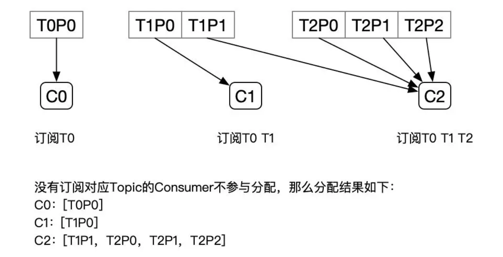
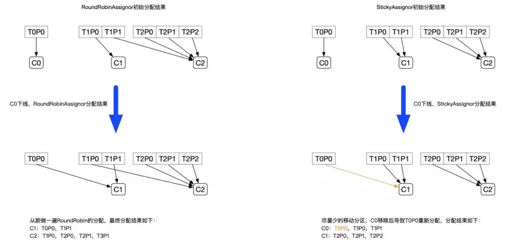

转自文章：https://juejin.cn/post/6844903495670169607#heading-13


### 什么是 Kafka

Kafka 是由 `Linkedin` 公司开发的，它是一个分布式的，支持多分区、多副本，基于 Zookeeper 的分布式消息流平台，它同时也是一款开源的 **基于发布订阅模式的消息引擎系统**。


### 消息队列的对比


### Kafka 的基本术语

消息：Kafka 中的数据单元被称为`消息`，也被称为记录，可以把它看作数据库表中某一行的记录。

批次：为了提高效率， 消息会`分批次`写入 Kafka，批次就代指的是一组消息。

主题：消息的种类称为 `主题`（Topic）,可以说一个主题代表了一类消息。相当于是对消息进行分类。主题就像是数据库中的表。

分区：主题可以被分为若干个分区（partition），同一个主题中的分区可以不在一个机器上，有可能会部署在多个机器上，由此来实现 kafka 的`伸缩性`，单一主题中的分区有序，但是无法保证主题中所有的分区有序


生产者： 向主题发布消息的客户端应用程序称为`生产者`（Producer），生产者用于持续不断的向某个主题发送消息。

消费者：订阅主题消息的客户端程序称为`消费者`（Consumer），消费者用于处理生产者产生的消息。

消费者群组：生产者与消费者的关系就如同餐厅中的厨师和顾客之间的关系一样，一个厨师对应多个顾客，也就是一个生产者对应多个消费者，`消费者群组`（Consumer Group）指的就是由一个或多个消费者组成的群体。


偏移量：`偏移量`（Consumer Offset）是一种元数据，它是一个不断递增的整数值，用来记录消费者发生重平衡时的位置，以便用来恢复数据。

broker: 一个独立的 Kafka 服务器就被称为 `broker`，broker 接收来自生产者的消息，为消息设置偏移量，并提交消息到磁盘保存。

broker 集群：broker 是`集群` 的组成部分，broker 集群由一个或多个 broker 组成，每个集群都有一个 broker 同时充当了`集群控制器`的角色（自动从集群的活跃成员中选举出来）。

副本：Kafka 中消息的备份又叫做 `副本`（Replica），副本的数量是可以配置的，Kafka 定义了两类副本：领导者副本（Leader Replica） 和 追随者副本（Follower Replica），前者对外提供服务，后者只是被动跟随。

重平衡：Rebalance。消费者组内某个消费者实例挂掉后，其他消费者实例自动重新分配订阅主题分区的过程。Rebalance 是 Kafka 消费者端实现高可用的重要手段。


### 核心 API

Kafka 有四个核心API，它们分别是

- Producer API，它允许应用程序向一个或多个 topics 上发送消息记录
- Consumer API，允许应用程序订阅一个或多个 topics 并处理为其生成的记录流
- Streams API，它允许应用程序作为流处理器，从一个或多个主题中消费输入流并为其生成输出流，有效的将输入流转换为输出流。
- Connector API，它允许构建和运行将 Kafka 主题连接到现有应用程序或数据系统的可. 用生产者和消费者。例如，关系数据库的连接器可能会捕获对表的所有更改


### Kafka Producer

**发送流程：**Producer 发送消息的过程如下图所示，需要经过`拦截器`，`序列化器`和`分区器`，最终由`累加器`批量发送至 Broker。


#### 创建 Kafka 生产者

要向 Kafka 写入消息，首先需要创建一个生产者对象，并设置一些属性。Kafka 生产者有3个必选的属性

```java
private Properties properties = new Properties();
// 一般指定 2 个及以上的 broker。
properties.put("bootstrap.servers","broker1:9092,broker2:9092");
properties.put("key.serializer","org.apache.kafka.common.serialization.StringSerializer");
properties.put("value.serializer","org.apache.kafka.common.serialization.StringSerializer");
KafkaProducer producer = new KafkaProducer<String,String>(properties);

```

来解释一下这段代码

- 首先创建了一个 Properties 对象

  

- 使用 `StringSerializer` 序列化器序列化 key / value 键值对

  实现了 Serializer 接口的类主要有 `ByteArraySerializer`、`StringSerializer`、`IntegerSerializer` ，其中 ByteArraySerialize 是 Kafka 默认使用的序列化器。

  

- 在这里我们创建了一个新的生产者对象，并为键值设置了恰当的类型，然后把 Properties 对象传递给他。

#### 消息发送

**简单发送**

```java
ProducerRecord<String,String> record =
                new ProducerRecord<String, String>("CustomerCountry","West","France");

producer.send(record);

// 调用的是下面的构造方法
public ProducerRecord(String topic, K key, V value) {}

```


**同步发送**

```java
ProducerRecord<String,String> record =
                new ProducerRecord<String, String>("CustomerCountry","West","France");

try{
  RecordMetadata recordMetadata = producer.send(record).get();
}catch(Exception e){
  e.printStackTrace()；
}

```

首先调用 send() 方法，然后再调用 get() 方法等待 Kafka 响应。如果服务器返回错误，get() 方法会抛出异常，如果没有发生错误，我们会得到 `RecordMetadata` 对象，可以用它来查看消息记录。

KafkaProducer 被配置为自动重试，如果多次重试后仍无法解决问题，则会抛出重试异常。


**异步发送** 

```java
ProducerRecord<String, String> producerRecord = new ProducerRecord<String, String>("CustomerCountry", "Huston", "America");
        producer.send(producerRecord,new DemoProducerCallBack());


class DemoProducerCallBack implements Callback {

  public void onCompletion(RecordMetadata metadata, Exception exception) {
    if(exception != null){
      exception.printStackTrace();;
    }
  }
}

```

首先实现回调需要定义一个实现了`org.apache.kafka.clients.producer.Callback`的类，这个接口只有一个 `onCompletion`方法。如果 kafka 返回一个错误，onCompletion 方法会抛出一个非空(non null)异常。


#### 生产者分区机制

* 顺序轮询

* 随机轮询

* 按照 key 进行消息保存

  这个策略也叫做 **key-ordering** 策略，Kafka 中每条消息都会有自己的key，一旦消息被定义了 Key，那么你就可以保证同一个 Key 的所有消息都进入到相同的分区里面，由于每个分区下的消息处理都是有顺序的，故这个策略被称为按消息键保序策略。

  

实现这个策略的 partition 方法：

```java
List<PartitionInfo> partitions = cluster.partitionsForTopic(topic);
return Math.abs(key.hashCode()) % partitions.size();
```


### Kafka Consumer

Kafka 消费者从属于`消费者群组`。一个群组中的消费者订阅的都是`相同`的主题，每个消费者接收主题一部分分区的消息。下面是一个 Kafka 分区消费示意图。


Kafka 一个很重要的特性就是，只需写入一次消息，可以支持任意多的应用读取这个消息。换句话说，每个应用都可以读到全量的消息。为了使得每个应用都能读到全量消息，应用需要有不同的消费组。对于上面的例子，假如我们新增了一个新的消费组 G2，而这个消费组有两个消费者，那么就演变为下图这样。


两种消费方式

- 一个消费者群组消费一个主题中的消息，这种消费模式又称为`点对点`的消费方式，点对点的消费方式又被称为消息队列
- 一个主题中的消息被多个消费者群组共同消费，这种消费模式又称为`发布-订阅`模式

#### 消费者重平衡

我们从上面的`消费者演变图`中可以知道这么一个过程：最初是一个消费者订阅一个主题并消费其全部分区的消息，后来有一个消费者加入群组，随后又有更多的消费者加入群组，而新加入的消费者实例`分摊`了最初消费者的部分消息，这种把分区的所有权通过一个消费者转到其他消费者的行为称为`重平衡`，英文名也叫做 `Rebalance`。


### 创建消费者

```java
Properties properties = new Properties();
        properties.put("bootstrap.server","192.168.1.9:9092");     properties.put("key.serializer","org.apache.kafka.common.serialization.StringSerializer");   properties.put("value.serializer","org.apache.kafka.common.serialization.StringSerializer");
KafkaConsumer<String,String> consumer = new KafkaConsumer<>(properties);

```

#### 主题订阅

创建好消费者之后，下一步就开始订阅主题了。`subscribe()` 方法接受一个主题列表作为参数，使用起来比较简单

```java
consumer.subscribe(Collections.singletonList("customerTopic"));

// 订阅所有与 test 相关的主题
consumer.subscribe("test.*");
```


KafkaConsumer 采用轮询的方式定期去 Kafka Broker 中进行数据的检索，如果有数据就用来消费，如果没有就再继续轮询等待。

```java
try {
  while (true) {
    ConsumerRecords<String, String> records = consumer.poll(Duration.ofSeconds(100));
    for (ConsumerRecord<String, String> record : records) {
      int updateCount = 1;
      if (map.containsKey(record.value())) {
        updateCount = (int) map.get(record.value() + 1);
      }
      map.put(record.value(), updateCount);
    }
  }
}finally {
  consumer.close();
}
```

* 这是一个无限循环。消费者实际上是一个长期运行的应用程序，它通过轮询的方式向 Kafka 请求数据。
* 第三行代码非常重要，Kafka 必须定期循环请求数据，否则就会认为该 Consumer 已经挂了，会触发重平衡，它的分区会移交给群组中的其它消费者。传给 `poll()` 方法的是一个超市时间，用 `java.time.Duration` 类来表示，如果该参数被设置为 0 ，poll() 方法会立刻返回，否则就会在指定的毫秒数内一直等待 broker 返回数据。
* 在退出应用程序之前使用 `close()` 方法关闭消费者。网络连接和 socket 也会随之关闭，并立即触发一次重平衡，而不是等待群组协调器发现它不再发送心跳并认定它已经死亡。


### 提交偏移量

消费者会向一个叫做 `_consumer_offset` 的特殊主题中发送消息，这个主题会保存每次所发送消息中的分区偏移量，这个主题的主要作用就是消费者触发重平衡后记录偏移使用的。


#### 自动提交

如果 `enable.auto.commit` 被设置为true，那么每过 5s，消费者会自动把从 poll() 方法轮询到的最大偏移量提交上去。提交时间间隔由 `auto.commit.interval.ms` 控制，默认是 5s。


#### 提交当前偏移量

把 `auto.commit.offset` 设置为 false，可以让应用程序决定何时提交偏移量。使用 `commitSync()` 提交偏移量。这个 API 会提交由 poll() 方法返回的最新偏移量，提交成功后马上返回，如果提交失败就抛出异常。

commitSync() 将会提交由 poll() 返回的最新偏移量，如果处理完所有记录后要确保调用了 commitSync()，否则还是会有丢失消息的风险，如果发生了在均衡，从最近一批消息到发生在均衡之间的所有消息都将被重复处理。


#### 异步提交

异步提交 `commitAsync()` 与同步提交 `commitSync()` 最大的区别在于异步提交不会进行重试，同步提交会一致进行重试。


#### 同步和异步组合提交

一般情况下，针对偶尔出现的提交失败，不进行重试不会有太大的问题，因为如果提交失败是因为临时问题导致的，那么后续的提交总会有成功的。但是如果在关闭消费者或再均衡前的最后一次提交，就要确保提交成功。

因此，**在消费者关闭之前一般会组合使用commitAsync和commitSync提交偏移量**。


#### 提交特定的偏移量

消费者API允许调用 commitSync() 和 commitAsync() 方法时传入希望提交的 partition 和 offset 的 map，即提交特定的偏移量。


#### 消费者如何进行组内分区分配？

Kafka 默认提供了三种分配策略：Range 和 Round-Robin，StickyAssignor。当然 Kafka 采用了可插拔式的分配策略，你可以创建自己的分配器以实现不同的分配策略。

**RangeAssignor**

Kafka默认采用RangeAssignor的分配算法。 

RangeAssignor对每个Topic进行独立的分区分配。对于每一个Topic，首先对分区按照分区ID进行排序，然后订阅这个Topic的消费组的消费者再进行排序，之后尽量均衡的将分区分配给消费者。


**RoundRobinAssignor**

RoundRobinAssignor的分配策略是将消费组内订阅的所有Topic的分区及所有消费者进行排序后尽量均衡的分配（RangeAssignor是针对单个Topic的分区进行排序分配的）。如果订阅的Topic列表是不同的，那么分配结果是不保证“尽量均衡”的，因为某些消费者不参与一些Topic的分配。

 

对于订阅组内消费者订阅Topic不一致的情况：假设有三个消费者分别为C0、C1、C2，有3个Topic T0、T1、T2，分别拥有1、2、3个分区，并且C0订阅T0，C1订阅T0和T1，C2订阅T0、T1、T0，那么RoundRobinAssignor的分配结果如下：



**StickyAssignor**

尽管RoundRobinAssignor已经在RangeAssignor上做了一些优化来更均衡的分配分区，但是在一些情况下依旧会产生严重的分配偏差，比如消费组中订阅的Topic列表不相同的情况下，这是因为无论是RangeAssignor，还是RoundRobinAssignor，当前的分区分配算法都没有考虑上一次的分配结果。

Sticky是“粘性的”，可以理解为分配结果是带“粘性的”——每一次分配变更相对上一次分配做最少的变动（上一次的结果是有粘性的），其目标有两点：

1. 分区的分配尽量的均衡

2. 每一次重分配的结果尽量与上一次分配结果保持一致



