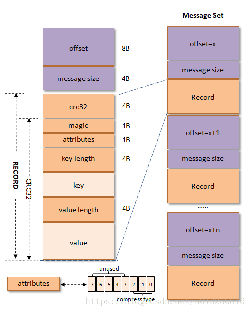
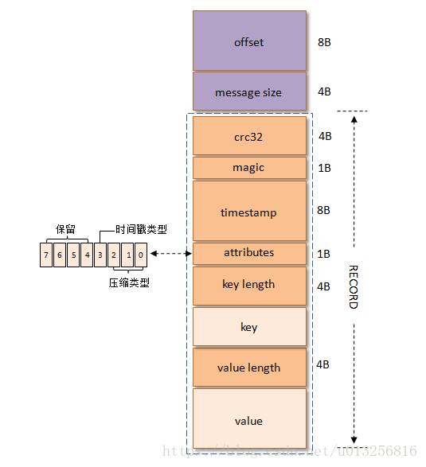
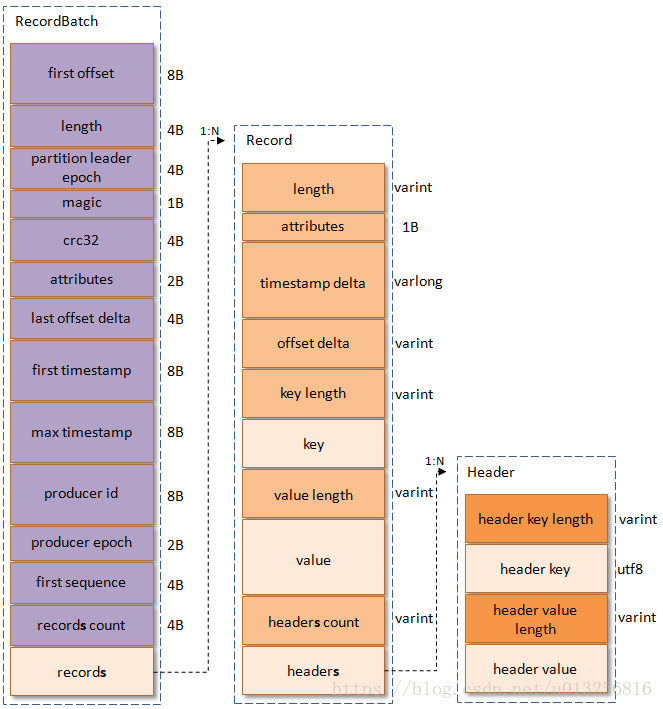
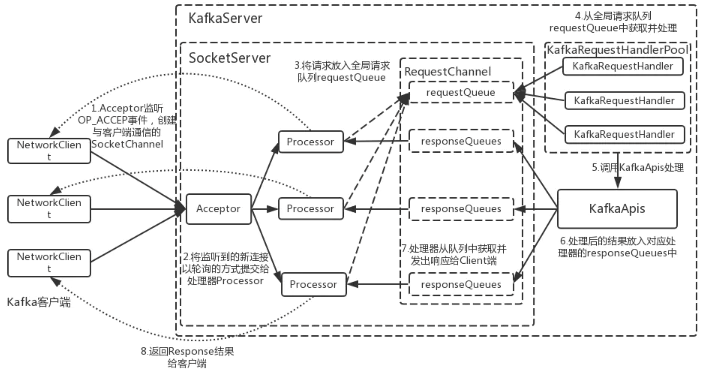
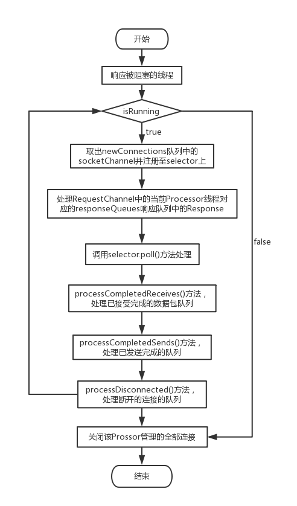
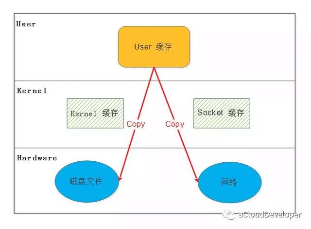
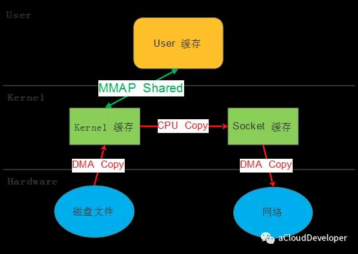
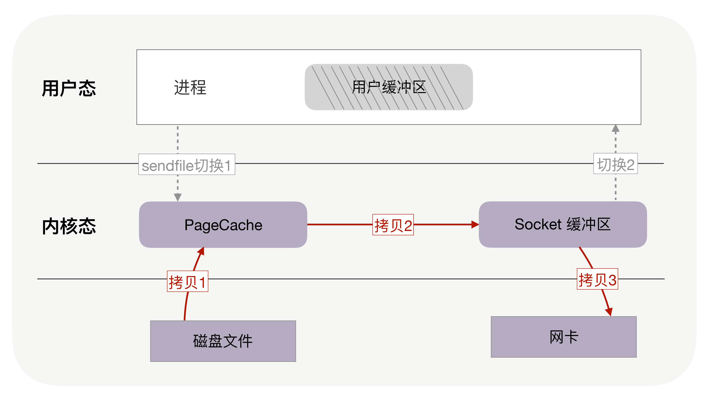
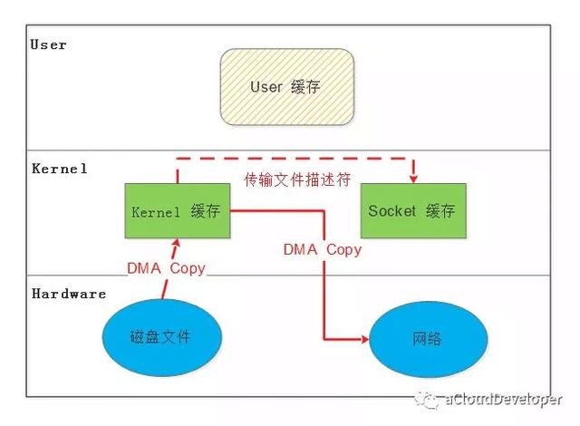

### 问题：

#### 1、kafka 怎么保证可靠性以及高可用性？

**高可用：**

1. 分布式 Partition 存储

2. 多副本冗余

   写数据时，先写 leader partition，然后 follow 向 leader 发送拉取数据请求，leader 再把数据同步过来。

3. ISR（In-Sync Replicas） 机制

   保持同步的副本。每个 Partition 都有一个 ISR，这里有 leader 和 保持数据同步 follow。

**kafka 保存消息的可靠性：**

1. 磁盘存储

2. Acks 参数

   三种常见的值可以设置，分别是：0、1 和 all。

   * Acks = 0，意思就是我的 Kafka Producer 在客户端，只要把消息发送出去，不管那条数据有没有在哪怕 Partition Leader 上落到磁盘，我就不管它了，直接就认为这个消息发送成功了。

   * Acks = 1，意思就是说只要 Partition Leader 接收到消息而且写入本地磁盘了，就认为成功了，不管它其他的 Follower 有没有同步过去这条消息了。

     如果 Partition Leader 刚刚接收到消息，Follower 还没来得及同步过去，结果 Leader 所在的 Broker 宕机了，此时也会导致这条消息丢失。

   * Acks = all，这个意思就是说，Partition Leader 接收到消息之后，还必须要求 ISR 列表里跟 Leader 保持同步的那些 Follower 都要把消息同步过去，才能认为这条消息是写入成功了。

     如果说 Partition Leader 刚接收到了消息，但是结果 Follower 没有收到消息，此时 Leader 宕机了，那么客户端会感知到这个消息没发送成功，他会重试再次发送消息过去。

     一般是 ISR 里有两个以上的副本才生效。
     
   * 设置 replication.factor >= 3 。这也是 Broker 端的参数。保存多份消息冗余，不多解释了。
   
   * 设置 min.insync.replicas > 1 。 Broker 端参数，控制消息至少要被写入到多少个副本才算是 “已提交”。设置成大于 1 可以提升消息持久性。在生产环境中不要使用默认值 1。确保 replication.factor > min.insync.replicas 。如果两者相等，那么只要有一个副本离线，整个分区就无法正常工作了。推荐设置成 replication.factor = min.insync.replicas + 1

#### 2、kafka 消息格式？

**消息格式**

1. V0 版本

   

   字段含义：

   1. crc32（4B）：crc32校验值。校验范围为magic至value之间。
   2. magic（1B）：消息格式版本号，此版本的magic值为0。
   3. attributes（1B）：消息的属性。总共占1个字节，低3位表示压缩类型：0表示NONE、1表示GZIP、2表示SNAPPY、3表示LZ4（LZ4自Kafka 0.9.x引入），其余位保留。
   4. key length（4B）：表示消息的key的长度。如果为-1，则表示没有设置key，即key=null。
   5. key：可选，如果没有key则无此字段。
   6. value length（4B）：实际消息体的长度。如果为-1，则表示消息为空。
   7. value：消息体。可以为空，比如tomnstone消息。

   在最初的Kafka消息版本中没有timestamp字段，对内部而言，其影响了日志保存、切分策略，对外部而言，其影响了消息审计、端到端延迟等功能的扩展，虽然可以在消息体内部添加一个时间戳，但是解析变长的消息体会带来额外的开销。

2. V2 版本

v1版本的magic字段值为1。v1版本的attributes字段中的低3位和v0版本的一样，还是表示压缩类型，而第4个bit也被利用了起来：0表示timestamp类型为CreateTime，而1表示tImestamp类型为LogAppendTime，其他位保留。

3. V3 版本

   

   1. length：消息总长度。

   2. attributes：弃用，但是还是在消息格式中占据1B的大小，以备未来的格式扩展。

   3. timestamp delta：时间戳增量。通常一个timestamp需要占用8个字节，如果像这里保存与RecordBatch的其实时间戳的差值的话可以进一步的节省占用的字节数。

   4. offset delta：位移增量。保存与RecordBatch起始位移的差值，可以节省占用的字节数。

   5. headers：这个字段用来支持应用级别的扩展，而不需要像v0和v1版本一样不得不将一些应用级别的属性值嵌入在消息体里面。Header的格式如上图最有，包含key和value，一个Record里面可以包含0至多个Header。

   6. first offset：表示当前RecordBatch的起始位移。

   7. length：计算partition leader epoch到headers之间的长度。

   8. partition leader epoch：用来确保数据可靠性。

   9. magic：消息格式的版本号，对于v2版本而言，magic等于2。

   10. attributes：消息属性，注意这里占用了两个字节。低3位表示压缩格式，可以参考v0和v1；第4位表示时间戳类型；第5位表示此RecordBatch是否处于事务中，0表示非事务，1表示事务。第6位表示是否是Control消息，0表示非Control消息，而1表示是Control消息，Control消息用来支持事务功能。

   11. last offset delta：RecordBatch中最后一个Record的offset与first offset的差值。主要被broker用来确认RecordBatch中Records的组装正确性。

   12. first timestamp：RecordBatch中第一条Record的时间戳。

   13. max timestamp：RecordBatch中最大的时间戳，一般情况下是指最后一个Record的时间戳，和last offset delta的作用一样，用来确保消息组装的正确性。

   14. producer id：用来支持幂等性。

   15. producer epoch：和producer id一样，用来支持幂等性。

   16. first sequence：和producer id、producer epoch一样，用来支持幂等性。

   17. records count：RecordBatch中Record的个数。

       

将多个消息（Record）打包存放到单个RecordBatch中，又通过Varints编码极大的节省了空间。提供了类似事务、幂等等更多的功能，还对空间占用提供了足够的优化。

#### 3、Kafka的NIO网络通信模型？（https://www.jianshu.com/p/a6b9e5342878）

Kafka的网络通信层模型，主要采用了**1（1个Acceptor线程）+N（N个Processor线程）+M（M个业务处理线程）**。

**1、SocketServer**

SocketServer是接收客户端Socket请求连接、处理请求并返回处理结果的核心类，Acceptor及Processor的初始化、处理逻辑都是在这里实现的。在KafkaServer实例启动时会调用其startup的初始化方法，会初始化1个 Acceptor和N个Processor线程（每个EndPoint都会初始化，一般来说一个Server只会设置一个端口）

**2、Acceptor**

Acceptor是一个继承自抽象类AbstractServerThread的线程类。Acceptor的主要任务是监听并且接收客户端的请求，同时建立数据传输通道—SocketChannel，然后以轮询的方式交给一个后端的Processor线程处理（具体的方式是添加socketChannel至并发队列并唤醒Processor线程处理）。

Acceptor线程启动后，首先会向用于监听端口的服务端套接字对象—ServerSocketChannel上注册OP_ACCEPT 事件。然后以轮询的方式等待所关注的事件发生。如果该事件发生，则调用accept()方法对OP_ACCEPT事件进行处理。这里，Processor是通过**round robin**方法选择的，这样可以保证后面多个Processor线程的负载基本均匀。

 Acceptor的accept()方法的作用主要如下：
 （1）与客户端建立连接。

 （2）调用connectionQuotas.inc()方法增加连接统计计数。

 （3）将socketChannel交给processor.accept()方法进行处理。这里主要是将socketChannel加入Processor处理器的并发队列newConnections队列中，然后唤醒Processor线程从队列中获取socketChannel并处理。其中newConnections会被Acceptor线程和Processor线程并发访问操作，所以newConnections是ConcurrentLinkedQueue队列（一个基于链表的无界线程安全队列）

**3、Processor**

Processor同Acceptor一样，也是一个线程类，继承了抽象类AbstractServerThread。其主要是从客户端的请求中读取数据和将KafkaRequestHandler处理完响应结果返回给客户端。在该线程类中主要关注以下几个重要的变量：
 （1）：**newConnections**：在上面的**Acceptor**一节中已经提到过，它是一种ConcurrentLinkedQueue[SocketChannel]类型的队列，用于保存新连接交由Processor处理的socketChannel；
 （2）：**inflightResponses**：是一个Map[String, RequestChannel.Response]类型的集合，用于记录尚未发送的响应；
 （3）：**selector**：是一个类型为KSelector变量，用于管理网络连接；

**4、RequestChannel**

在Kafka的网络通信层中，RequestChannel为Processor处理器线程与KafkaRequestHandler线程之间的数据交换提供了一个数据缓冲区，是通信过程中Request和Response缓存的地方。因此，其作用就是在通信中起到了一个数据缓冲队列的作用。Processor线程将读取到的请求添加至RequestChannel的全局请求队列—requestQueue中；KafkaRequestHandler线程从请求队列中获取并处理，处理完以后将Response添加至RequestChannel的响应队列—responseQueue中，并通过responseListeners唤醒对应的Processor线程，最后Processor线程从响应队列中取出后发送至客户端。

**5、KafkaRequestHandler**

KafkaRequestHandler也是一种线程类，在KafkaServer实例启动时候会实例化一个线程池—KafkaRequestHandlerPool对象（包含了若干个KafkaRequestHandler线程），这些线程以守护线程的方式在后台运行。在KafkaRequestHandler的run方法中会循环地从RequestChannel中阻塞式读取request，读取后再交由KafkaApis来具体处理。

**6、KafkaApis**

KafkaApis是用于处理对通信网络传输过来的业务消息请求的中心转发组件。该组件反映出Kafka Broker Server可以提供哪些服务。

#### 4、生产者如何保证消息一定发送到 kafka，消费者如何保证消费 kafka 不重复，不丢失？

**生产者端**

`Producer`端可能会丢失消息。目前`Kafka Producer`是异步发送消息的，也就是说如果你调用的是`producer.send(msg)`这个`API`，那么它通常会立即返回，但此时你不保证消息发送已成功完成。

可能会出现：网络抖动，导致消息压根就没有发送到`Broker`端；或者消息本身不合规导致`Broker`拒绝接收（比如消息太大了，超过了`Broker`的限制）。

实际上，使用`producer.send(msg, callback)`接口就能避免这个问题，根据回调，一旦出现消息提交失败的情况，就可以有针对性地进行处理。如果是因为那些瞬时错误，`Producer`重试就可以了；如果是消息不合规造成的，那么调整消息格式后再次发送。

**消费者端**

1. 确保消息消费完成再提交。`Consumer`端有个参数`enable.auto.commit`，最好设置成`false`，并自己来处理`offset`的提交更新。
2. 将消息的唯一标识保存到外部介质中，每次消费处理时判断是否处理过。

#### 5、Kafka 为什么这么快？

Kafka 实现了`零拷贝`原理来快速移动数据，避免了内核之间的切换。Kafka 可以将数据记录分批发送，从生产者到文件系统（Kafka 主题日志）到消费者，可以端到端的查看这些批次的数据。

批处理能够进行更有效的数据压缩并减少 I/O 延迟，Kafka 采取顺序写入磁盘的方式，避免了随机磁盘寻址时间的浪费。

总结一下其实就是四个要点：

- 顺序读写

- 零拷贝

  零拷贝本质上体现了一种优化的思想。

  直接 I/O，mmap，sendfile，DMA sendfile，splice，缓冲区共享，写时复制。

  **直接I/O：**

  

  **mmap**

  

  mmap 隐藏着一个陷阱，当 mmap 一个文件时，如果这个文件被另一个进程所截获，那么 write 系统调用会因为访问非法地址被 SIGBUS 信号终止，SIGBUS 默认会杀死进程并产生一个 coredump，如果服务器被这样终止了，那损失就可能不小了。

  解决方法：**租借锁**

  

  **sendFile：**

  

  数据只能从文件传输到套接字，反之则不行。sendfile 不存在像 mmap 时文件被截获的情况，它自带异常处理机制。

  

  **DMA 辅助的 sendfile**

  

  只适用于将数据从文件拷贝到套接字上。

- 消息压缩

  **压缩算法：**

   * RLE 算法：把相同的字符去重化。AABBCCCC -> A2B2C4
   * 哈夫曼：多次出现的数据用小于 8 位的字节数表示，不常用的数据则可以使用超过 8 位的字节数表示。
   * 摩尔斯编码：1 是短点，11 是长点。
   * gzip：kafka 默认采用此压缩算法

  ​	

- 分批发送

- java NIO 模型

- Partition 并发

- 一方面，由于不同 Partition 可位于不同机器，因此可以充分利用集群优势，实现机器间的并行处理。另一方面，由于 Partition 在物理上对应一个文件夹，即使多个 Partition 位于同一个节点，也可通过配置让同一节点上的不同 Partition 置于不同的 disk drive 上，从而实现磁盘间的并行处理，充分发挥多磁盘的优势。

#### 6、kafka 副本机制？

副本的基本内容，在kafka中，每个主题可以有多个分区，每个分区又可以有多个副本。这多个副本中，只有一个是 leader，而其他的都是 follower 副本。仅有 leader 副本可以对外提供服务。

多个 follower 副本通常存放在和 leader 副本不同的 broker 中。通过这样的机制实现了高可用，当某台机器挂掉后，其他 follower 副本也能迅速”转正“，开始对外提供服务。

**kafka 的副本都有哪些作用？**

在 kafka 中，实现副本的目的就是冗余备份，且仅仅是冗余备份，所有的读写请求都是由leader副本进行处理的。follower 副本仅有一个功能，那就是从 leader 副本拉取消息，尽量让自己跟 leader 副本的内容一致。

**follower 副本为什么不对外提供服务？**

这个问题本质上是对性能和一致性的取舍。试想一下，如果 follower 副本也对外提供服务那会怎么样呢？首先，性能是肯定会有所提升的。但同时，会出现一系列问题。类似数据库事务中的幻读，脏读。

比如你现在写入一条数据到kafka主题a，消费者b从主题a消费数据，却发现消费不到，因为消费者b去读取的那个分区副本中，最新消息还没写入。而这个时候，另一个消费者c却可以消费到最新那条数据，因为它消费了leader副本。

看吧，为了提高那么些性能而导致出现数据不一致问题，那显然是不值得的。

**leader副本挂掉后，如何选举新副本？**

如果你对zookeeper选举机制有所了解，就知道zookeeper每次leader节点挂掉时，都会通过内置id，来选举处理了最新事务的那个follower节点。

从结果上来说，kafka分区副本的选举也是类似的，都是选择最新的那个follower副本，但它是通过一个In-sync（ISR）副本集合实现。

kafka会将与leader副本保持同步的副本放到ISR副本集合中。当然，leader副本是一直存在于ISR副本集合中的，在某些特殊情况下，ISR副本中甚至只有leader一个副本。

当leader挂掉时，kakfa通过zookeeper感知到这一情况，在ISR副本中选取新的副本成为leader，对外提供服务。

但这样还有一个问题，前面提到过，有可能ISR副本集合中，只有leader，当leader副本挂掉后，ISR集合就为空，这时候怎么办呢？这时候如果设置unclean.leader.election.enable参数为true，那么kafka会在非同步，也就是不在ISR副本集合中的副本中，选取出副本成为leader，但这样意味这消息会丢失，这又是可用性和一致性的一个取舍了。

#### 7、consumer 是否是线程安全的？

Kafka 的 Consumer 客户端是线程不安全的。

#### 8、什么是 rebalance？

rebalance 本质上是一种协议，规定了一个 consumer group 下的所有 consumer 如何达成一致来分配订阅 topic 的每个分区。

#### 9、什么时候 rebalance？

这也是经常被提及的一个问题。rebalance 的触发条件有三种：

- 组成员发生变更（新 consumer 加入组、已有 consumer 主动离开组或已有 consumer 崩溃了——这两者的区别后面会谈到）
- 订阅主题数发生变更
- 订阅主题的分区数发生变更

#### 10、什么是 AR，ISR？

AR：Assigned Replicas。AR 是主题被创建后，分区创建时被分配的副本集合，副本个 数由副本因子决定。

ISR：In-Sync Replicas。Kafka 中特别重要的概念，指代的是 AR 中那些与 Leader 保 持同步的副本集合。在 AR 中的副本可能不在 ISR 中，但 Leader 副本天然就包含在 ISR 中。

关于 ISR，还有一个常见的面试题目是如何判断副本是否应该属于 ISR。目前的判断 依据是：Follower 副本的 LEO（partition 中当前将要写入数据的 位置/偏移量） 落后 Leader LEO 的时间，是否超过了 Broker 端参数 replica.lag.time.max.ms 值。如果超过了，副本就会被从 ISR 中移除。

#### 11、Kafka 中的 HW 代表什么？

高水位值 (High watermark)。这是控制消费者可读取消息范围的重要字段。一 个普通消费者只能“看到”Leader 副本上介于 Log Start Offset 和 HW（不含）之间的 所有消息。水位以上的消息是对消费者不可见的。