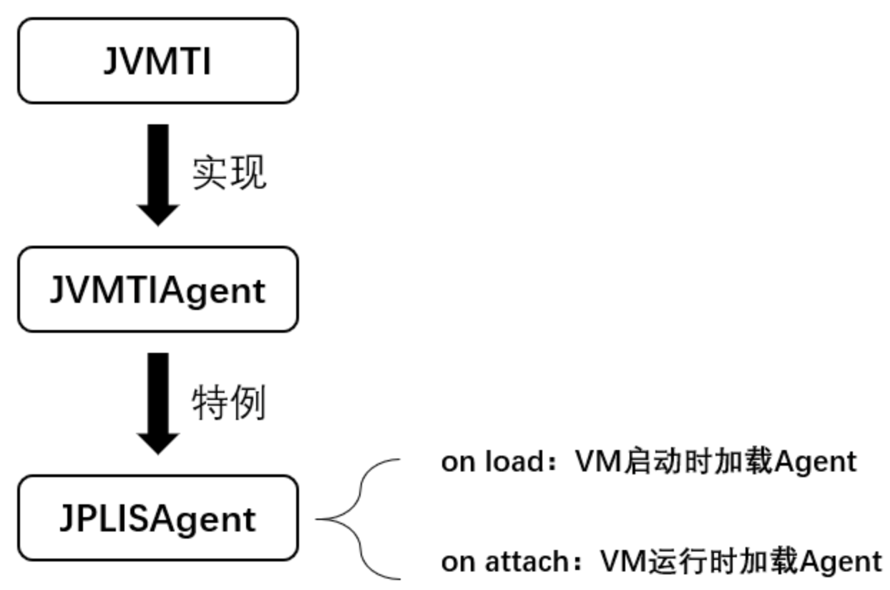

## java 代理代码实现


### 静态代理（编译时增强）

静态代理要求代理类和被代理类实现同一个接口，代理对象需要持有被代理的目标对象，在代理对象实现接口方法前后添加增强逻辑并调用目标对象方法。

**被代理类实现的接口**

```java
public interface HelloService {
    void hello();
}
```

**被代理类**

```java
public class HelloServiceImpl implements HelloService {
    public void hello() {
        System.out.println("你吃了嘛？");
    }
}
```

**代理类**

```java
public class HelloServiceStaticProxy implements HelloService {

    private HelloService helloService;

    public HelloServiceStaticProxy(HelloService helloService) {
        this.helloService = helloService;
    }

    public void hello() {
        System.out.println("你好，我是小王！");
        this.helloService.hello();
        System.out.println("好的，下次家里聊！");
    }
}
```

**测试**

```java
@Test
public void staticProxy() {
    HelloServiceStaticProxy helloServiceStaticProxy = new HelloServiceStaticProxy(new HelloServiceImpl());
    helloServiceStaticProxy.hello();
}
```


### jdk 动态代理（运行时增强）

通过jdk提供的工具方法Proxy.newProxyInstance动态构建全新的代理类(继承Proxy类，并持有InvocationHandler接口引用 )字节码文件并实例化对象返回，由java内部的反射机制来实例化代理对象，并代理的调用委托类方法。

**创建代理类，实现InvocationHandler接口**

```java
public class JdkDynamicProxy implements InvocationHandler {

    private Object target;

    public JdkDynamicProxy(Object target) {
        this.target = target;
    }

    public Object getTarget() {
        return target;
    }

    public void setTarget(Object target) {
        this.target = target;
    }

    @Override
    public Object invoke(Object proxy, Method method, Object[] args) throws Throwable {
        System.out.println("你好，我是小王！");
        Object result = method.invoke(target, args);
        System.out.println("好的，下次家里聊！");
        return result;
    }
}
```

**创建代理工厂类**

```java
public class JdkDynamicProxyFactory {

    private JdkDynamicProxy jdkDynamicProxy;

    public JdkDynamicProxyFactory(JdkDynamicProxy helloServiceJdkDynamicProxy) {
        this.jdkDynamicProxy = helloServiceJdkDynamicProxy;
    }

    public Object getProxy() {
        Object target = jdkDynamicProxy.getTarget();
        return Proxy.newProxyInstance(jdkDynamicProxy.getClass().getClassLoader(), target.getClass().getInterfaces(), jdkDynamicProxy);
    }
}
```

**测试**

```java
@Test
public void test() {
    JdkDynamicProxy jdkDynamicProxy = new JdkDynamicProxy(new HelloServiceImpl());
    JdkDynamicProxyFactory proxyFactory = new JdkDynamicProxyFactory(jdkDynamicProxy);
    HelloService proxy = (HelloService) proxyFactory.getProxy();
    proxy.hello();
}
```

最后看到的

JDK动态代理不足: 

JDK动态代理的代理类字节码在创建时，需要实现业务实现类所实现的接口作为参数。如果业务实现类是没有实现接口而是直接定义业务方法的话，就无法使用JDK动态代理了。(JDK动态代理重要特点是代理接口) 并且，如果业务实现类中新增了接口中没有的方法，这些方法是无法被代理的（因为无法被调用）。

动态代理只能对接口产生代理，不能对类产生代理。因为最终生成的代理类（如上：HelloService）会：extends Proxy implements Person，所以根据 java 的继承机制，不能够再继承其它的类。


### CGlib 动态代理（运行时增强）

CGlib 动态代理模式基于继承，被代理类生成代理子类，不用实现接口。只需要 被代理类 是非final 类即可。cglib 动态代理底层是借助asm 字节码技术实现。

因为是第三方的开源库，所以相比较 JDK 源码来说。JDK 源码无疑使用的人会更多范围也更广，会更佳稳定，而且还有可能在未来的JDK版本中不断优化性能。Cglib更新频率相对来说比较低，而且代码库已经渐趋稳定。

**创建代理类，实现MethodInterceptor接口**

```java
public class CglibDynamicProxy implements MethodInterceptor {

    private Object target;

    public CglibDynamicProxy(Object target) {
        this.target = target;
    }

    public Object getTarget() {
        return target;
    }

    public void setTarget(Object target) {
        this.target = target;
    }

    @Override
    public Object intercept(Object o, Method method, Object[] args, MethodProxy methodProxy) throws Throwable {
        System.out.println("你好，我是小王！");
        Object result = method.invoke(target, args);
        System.out.println("好的，下次家里聊！");
        return result;
    }
}
```

**创建代理工厂类**

```java
public class CglibDynamicProxyFactory {

    private CglibDynamicProxy cglibDynamicProxy;

    public CglibDynamicProxyFactory(CglibDynamicProxy cglibDynamicProxy) {
        this.cglibDynamicProxy = cglibDynamicProxy;
    }

    public Object getProxy() {
        Enhancer enhancer = new Enhancer();
        enhancer.setInterfaces(cglibDynamicProxy.getTarget().getClass().getInterfaces());
        enhancer.setCallback(cglibDynamicProxy);
        return enhancer.create();
    }
}
```

**测试**

```java
@Test
public void test() {
    CglibDynamicProxy cglibDynamicProxy = new CglibDynamicProxy(new HelloServiceImpl());
    CglibDynamicProxyFactory proxyFactory = new CglibDynamicProxyFactory(cglibDynamicProxy);
    HelloService proxy = (HelloService) proxyFactory.getProxy();
    proxy.hello();
}
```


**小结：**

cglib代理无需实现接口，通过生成类字节码实现代理，比反射稍快，不存在性能问题，但cglib会继承目标对象，需要重写方法，所以目标对象不能为final类


### Aspectj 代理（编译时增强）

**实际上是静态代理的一种实现框架**，把繁琐的对每一个方法编写代码的工作交给 Aspectj 框架来做。

修改目标类的字节，织入代理的字节，在程序编译的时候插入代理的字节码，不会生成全新的Class


### Instrumentation 代理

修改目标类的字节码、类装载的时候动态拦截去修改，基于javaagent，-javaagent:yourAgent.jar。

类装载的时候插入代理的字节码，不会生成全新的Class。

Instrument Agent可以理解为一类JVMTIAgent动态库，别名是JPLISAgent(Java Programming Language Instrumentation Services Agent)，是专门为java语言编写的插桩服务提供支持的代理。

#### instrument原理

`instrument`的底层实现依赖于`JVMTI`，也就是`JVM Tool Interface`，它是JVM暴露出来的一些供用户扩展的接口集合，JVMTI是基于事件驱动的，JVM每执行到一定的逻辑就会调用一些事件的回调接口（如果有的话），这些接口可以供开发者去扩展自己的逻辑。`JVMTIAgent`是一个利用`JVMTI`暴露出来的接口提供了代理启动时加载(agent on load)、代理通过attach形式加载(agent on attach)和代理卸载(agent on unload)功能的动态库。而`instrument agent`可以理解为一类`JVMTIAgent`动态库，别名是`JPLISAgent(Java Programming Language Instrumentation Services Agent)`，也就是专门为java语言编写的插桩服务提供支持的代理。

<div align=middle></div>

实际上，`premain`和`agentmain`两种方式最终的目的都是为了回调 ClassFileTransformer#transform 实现字节码修改，本质功能上没有很大区别。两者的非本质功能的区别如下：

- `premain`需要通过命令行使用外部代理jar包；而`agentmain`则可以通过`attach`机制直接附着到目标VM中加载代理，也就是使用`agentmain`方式下，操作`attach`的程序和被代理的程序可以是完全不同的两个程序。
- `agentmain`方式由于是采用`attach`机制，被代理的目标程序VM有可能很早之前已经启动，当然其所有类已经被加载完成，这个时候需要借助`Instrumentation#retransformClasses(Class<?>... classes)`让对应的类可以重新转换，从而激活重新转换的类执行`ClassFileTransformer`中的回调。
- `premain`方式是JDK1.5引入的，而`agentmain`方式是JDK1.6引入的，也就是JDK1.6之后可以自行选择使用`premain`或者`agentmain`。