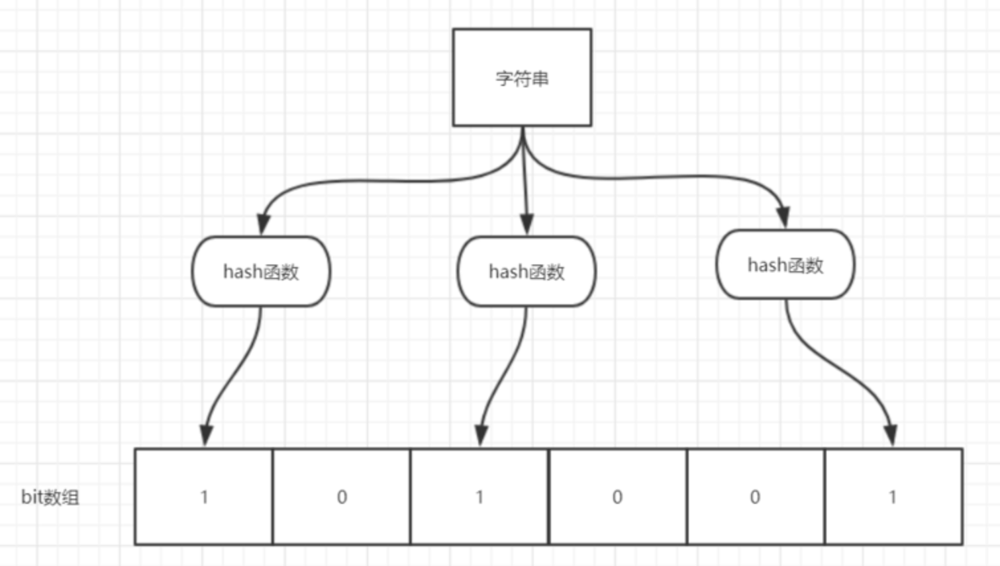

### 图解

位数组中的每个元素都只占用 1 bit ，并且每个元素只能是 0 或者 1。这样申请一个 100w 个元素的位数组只占用 1000000Bit / 8 = 125000 Byte = 125000/1024 kb ≈ 122kb 的空间。

### 特点

**不同的字符串可能哈希出来的位置相同，这种情况我们可以适当增加位数组大小或者调整我们的哈希函数。**

**综上，我们可以得出：布隆过滤器说某个元素存在，小概率会误判。布隆过滤器说某个元素不在，那么这个元素一定不在。**

### 场景

1. 判断给定数据是否存在：比如判断一个数字是否存在于包含大量数字的数字集中（数字集很大，5亿以上！）
2. 防止缓存穿透（判断请求的数据是否有效避免直接绕过缓存请求数据库）。
3. 邮箱的垃圾邮件过滤、黑名单功能。
4. 去重：比如爬给定网址的时候对已经爬取过的 URL 去重。