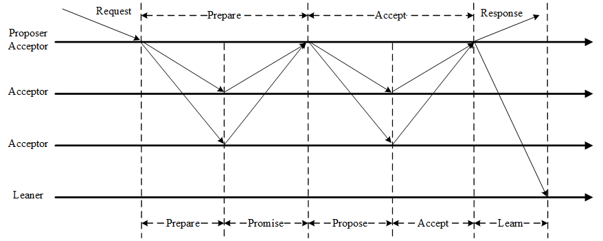
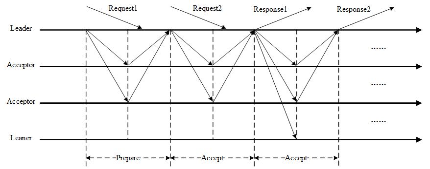

#### Paxos 算法

Paxos，它是一个基于消息传递的一致性算法，Leslie Lamport在1990年提出，近几年被广泛应用于分布式计算中，Google的Chubby，Apache的Zookeeper都是基于它的理论来实现的，Paxos还被认为是到目前为止唯一的分布式一致性算法，其它的算法都是Paxos的改进或简化。

#### Basic-Paxos

Paxos算法通过一个决议分为两个阶段（Learn阶段之前决议已经形成）：

1. 第一阶段：Prepare阶段。Proposer向Acceptors发出Prepare请求，Acceptors针对收到的Prepare请求进行Promise承诺。
2. 第二阶段：Accept阶段。Proposer收到多数Acceptors承诺的Promise后，向Acceptors发出Propose请求，Acceptors针对收到的Propose请求进行Accept处理。
3. 第三阶段：Learn阶段。Proposer在收到多数Acceptors的Accept之后，标志着本次Accept成功，决议形成，将形成的决议发送给所有Learners。

Paxos算法流程中的每条消息描述如下：

- **Prepare**: Proposer生成全局唯一且递增的Proposal ID (可使用时间戳加Server ID)，向所有Acceptors发送Prepare请求，这里无需携带提案内容，只携带Proposal ID即可。
- **Promise**: Acceptors收到Prepare请求后，做出“两个承诺，一个应答”。

两个承诺：

1. 不再接受Proposal ID小于等于（注意：这里是<= ）当前请求的Prepare请求。

2. 不再接受Proposal ID小于（注意：这里是< ）当前请求的Propose请求。

一个应答：

不违背以前作出的承诺下，回复已经Accept过的提案中Proposal ID最大的那个提案的Value和Proposal ID，没有则返回空值。

#### Multi-Paxos 

1. 针对每一个要确定的值，运行一次Paxos算法实例（Instance），形成决议。每一个Paxos实例使用唯一的Instance ID标识。
2. 在所有Proposers中选举一个Leader，由Leader唯一地提交Proposal给Acceptors进行表决。这样没有Proposer竞争，解决了活锁问题。在系统中仅有一个Leader进行Value提交的情况下，Prepare阶段就可以跳过，从而将两阶段变为一阶段，提高效率。

Multi-Paxos流程

Multi-Paxos首先需要选举Leader，Leader的确定也是一次决议的形成，所以可执行一次Basic Paxos实例来选举出一个Leader。选出Leader之后只能由Leader提交Proposal，在Leader宕机之后服务临时不可用，需要重新选举Leader继续服务。在系统中仅有一个Leader进行Proposal提交的情况下，Prepare阶段可以跳过。