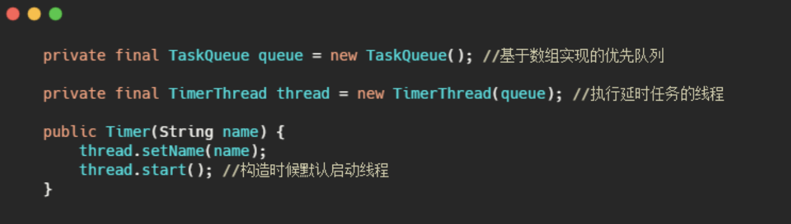
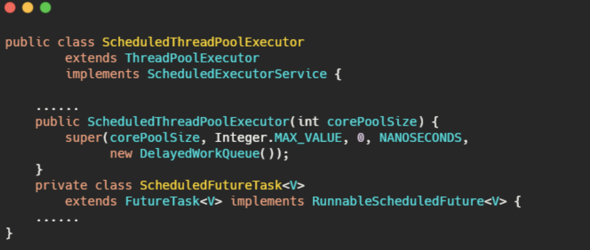
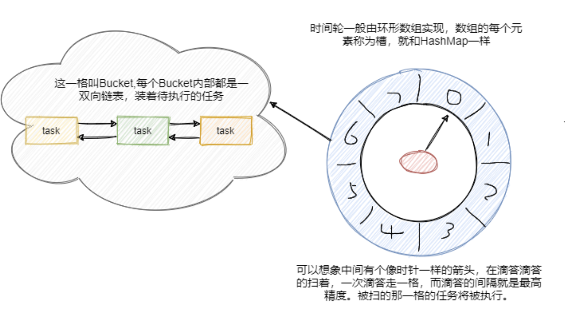
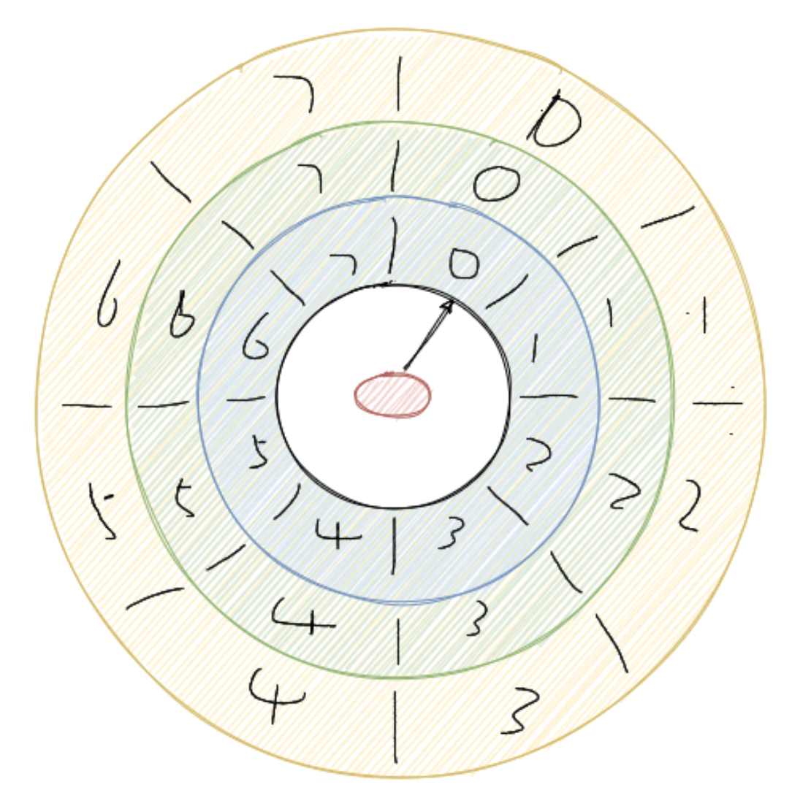

### Timer

Timer 可以实现延时任务，也可以实现周期性任务。我们先来看看 Timer 核心属性和构造器。

**核心就是一个优先队列和封装的执行任务的线程，从这我们也可以看到一个 Timer 只有一个线程执行任务。**

再来看看如何实现延时和周期性任务的。我先**简单的概括一下**，首先维持一个小顶堆，即最快需要执行的任务排在优先队列的第一个，根据堆的特性我们知道插入和删除的时间复杂度都是 O(logn)。

然后 TimerThread 不断地拿排着的第一个任务的执行时间和当前时间做对比。如果时间到了先看看这个任务是不是周期性执行的任务，如果是则修改当前任务时间为下次执行的时间，如果不是周期性任务则将任务从优先队列中移除。最后执行任务。如果时间还未到则调用 `wait()` 等待。

首先**优先队列的插入和删除的时间复杂度是O(logn)**，当数据量大的时候，频繁的入堆出堆性能有待考虑。

并且是**单线程执行**，那么如果一个任务执行的时间过久则会影响下一个任务的执行时间(当然你任务的run要是异步执行也行)。

并且从代码可以看到**对异常没有做什么处理**，那么一个任务出错的时候会导致之后的任务都无法执行。

### ScheduledThreadPoolExecutor

1.5 引入了 ScheduledThreadPoolExecutor，它是一个具有更多功能的 Timer 的替代品，**允许多个服务线程**。如果设置一个服务线程和 Timer 没啥差别。

从注释看出相对于 Timer ，可能就是单线程跑任务和多线程跑任务的区别。

继承了 ThreadPoolExecutor，实现了 ScheduledExecutorService。可以定性操作就是正常线程池差不多了。区别就在于两点，一个是 ScheduledFutureTask ，一个是 DelayedWorkQueue。

其实 DelayedWorkQueue 就是优先队列，也是利用数组实现的小顶堆。而 ScheduledFutureTask 继承自 FutureTask 重写了 run 方法，实现了周期性任务的需求。

### 时间轮算法

时间轮用环形数组实现，数组的每个元素可以称为槽，和 HashMap一样称呼。

槽的内部用双向链表存着待执行的任务，添加和删除的链表操作时间复杂度都是 O(1)，槽位本身也指代时间精度，比如一秒扫一个槽，那么这个时间轮的最高精度就是 1 秒。

也就是说延迟 1.2 秒的任务和 1.5 秒的任务会被加入到同一个槽中，然后在 1 秒的时候遍历这个槽中的链表执行任务。

从图中可以看到此时指针指向的是第一个槽，一共有八个槽0~7，假设槽的时间单位为 1 秒，现在要加入一个延时 5 秒的任务，计算方式就是 5 % 8 + 1 = 6，即放在槽位为 6，下标为 5 的那个槽中。更具体的就是拼到槽的双向链表的尾部。

然后每秒指针顺时针移动一格，这样就扫到了下一格，遍历这格中的双向链表执行任务。然后再循环继续。

可以看到插入任务从计算槽位到插入链表，时间复杂度都是O(1)。那假设现在要加入一个50秒后执行的任务怎么办？这槽好像不够啊？难道要加槽嘛？和HashMap一样扩容？

不是的，常见有两种方式，**一种是通过增加轮次的概念**。50 % 8 + 1 = 3，即应该放在槽位是 3，下标是 2 的位置。然后 (50 - 1) / 8 = 6，即轮数记为 6。也就是说当循环 6 轮之后扫到下标的 2 的这个槽位会触发这个任务。Netty 中的 HashedWheelTimer 使用的就是这种方式。

**还有一种是通过多层次的时间轮**，这个和我们的手表就更像了，像我们秒针走一圈，分针走一格，分针走一圈，时针走一格。

多层次时间轮就是这样实现的。假设上图就是第一层，那么第一层走了一圈，第二层就走一格。

可以得知第二层的一格就是8秒，假设第二层也是 8 个槽，那么第二层走一圈，第三层走一格，可以得知第三层一格就是 64 秒。

那么一格三层，每层8个槽，一共 24 个槽时间轮就可以处理最多延迟 512 秒的任务。

而多层次时间轮还会有降级的操作，假设一个任务延迟 500 秒执行，那么刚开始加进来肯定是放在第三层的，当时间过了 436 秒后，此时还需要 64 秒就会触发任务的执行，而此时相对而言它就是个延迟 64 秒后的任务，因此它会被降低放在第二层中，第一层还放不下它。

再过个 56 秒，相对而言它就是个延迟 8 秒后执行的任务，因此它会再被降级放在第一层中，等待执行。

**降级是为了保证时间精度一致性**。Kafka内部用的就是多层次的时间轮算法。

Netty 的实现时间轮通过轮数的实现。

Kafka 中的时间轮是多层次时间轮实现。

Kafka 用了多层次时间轮来实现，并且是按需创建时间轮，采用任务的绝对时间来判断延期，并且对于每个槽(槽内存放的也是任务的双向链表)都会维护一个过期时间，利用 DelayQueue 来对每个槽的过期时间排序，来进行时间的推进，防止空推进的存在。

每次推进都会更新 currentTime 为当前时间戳，当然做了点微调使得 currentTime 是 tickMs 的整数倍。并且每次推进都会把能降级的任务重新插入降级。

可以看到这里的 DelayQueue 的元素是每个槽，而不是任务，因此数量就少很多了，这应该是权衡了对于槽操作的延时队列的时间复杂度与空推进的影响。